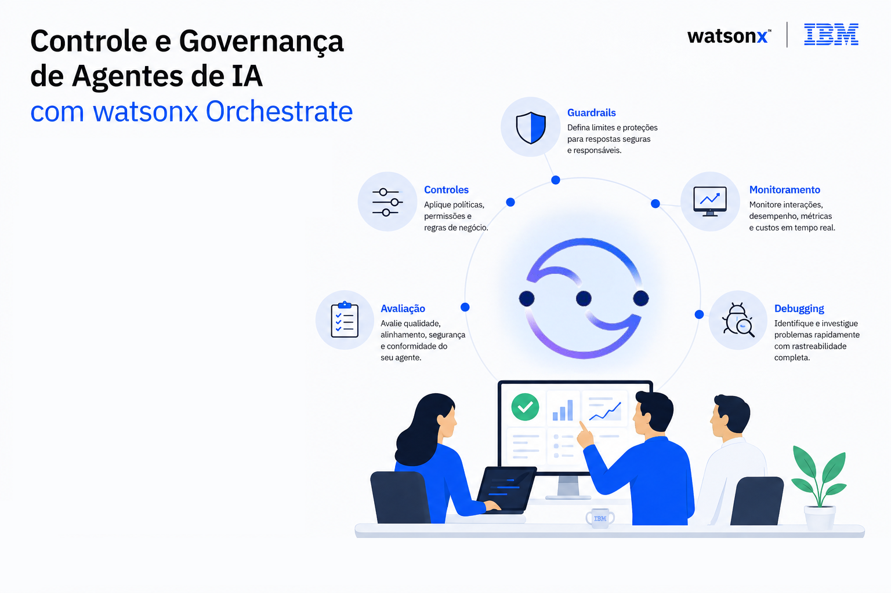
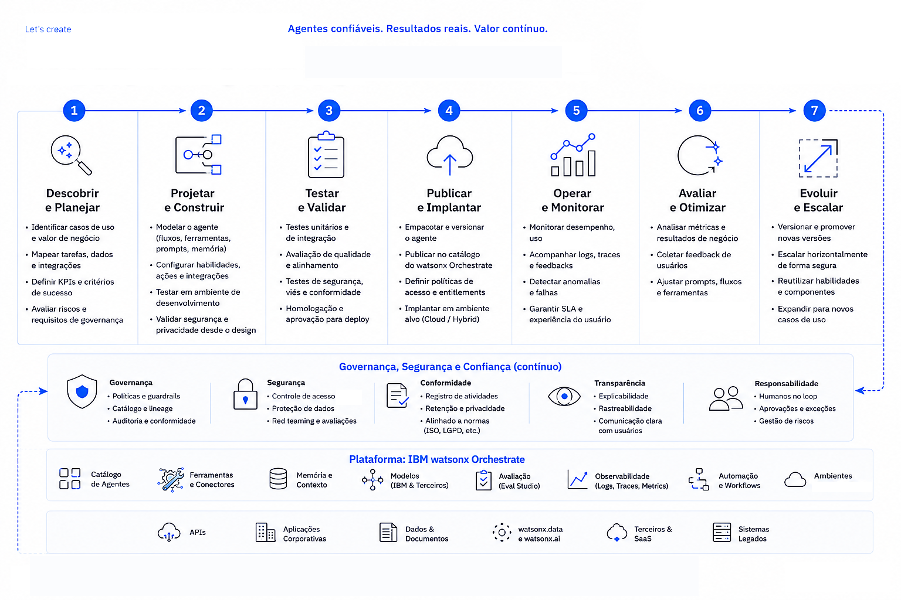

# Laboratório de watsonx Orchestrate - Segundo Semestre de 2026

> **Última atualização:** 25 de Agosto de 2026
>
> O watsonx Orchestrate é uma plataforma em constante evolução e recebe atualizações frequentes com novos recursos, melhorias e alterações na experiência de criação de agentes e workflows.
>
> Caso esteja acessando este material muito tempo após a data de atualização de referência, algumas etapas, telas ou funcionalidades poderão ser diferentes das apresentadas neste laboratório.
>
> Se você recebeu este conteúdo por meio de um instrutor ou programa de treinamento, não se preocupe: o material foi revisado e atualizado para refletir a experiência mais recente disponível.

<h2> As instruções para iniciar o laboratório estão no final deste arquivo.</h2>
<h3> Antes de começar, reserve alguns minutos para ler todo o conteúdo com atenção. O Time técnico elaborou esse material com muito carinho, e cada seção foi preparada para fornecer contexto, conceitos importantes e dicas que ajudarão você a aproveitar melhor a experiência e a entender o propósito de cada etapa do laboratório. </h3>

----

## Conteúdo

- [Laboratório de watsonx Orchestrate - Segundo Semestre de 2026](#laboratório-de-watsonx-orchestrate---segundo-semestre-de-2026)
  - [Conteúdo](#conteúdo)
  - [Controle e Governança de Agentes de IA com watsonx Orchestrate](#controle-e-governança-de-agentes-de-ia-com-watsonx-orchestrate)
  - [Objetivo](#objetivo)
  - [Valor para o seu Negócio](#valor-para-o-seu-negócio)
  - [Pré Requesitos](#pré-requesitos)
  - [Iniciando o laboratório](#iniciando-o-laboratório)

## Controle e Governança de Agentes de IA com watsonx Orchestrate

Nos laboratórios de hoje, você aprenderá como implementar práticas de governança para agentes de IA utilizando a interface do watsonx Orchestrate.

Serão abordados conceitos como guardrails, controles monitoramento, debugging e avaliação de agentes para reduzir riscos relacionados à IA Generativa e garantir operações mais seguras e confiáveis.

**Mas porque isso é importante?**

Antes de disponibilizar um agente para os usuários, precisamos responder algumas perguntas:

<code>
As respostas estão corretas?
O agente é seguro?
Ele respeita regras de compliance?
Os custos de uso estão controlados?
Como identificar problemas após o deployment?
</code>

## Objetivo 

Este laboratório ajuda um time desde de gerente de produtos, engenheiros de IA e líderes de negócio como a implementar um framework abrangente de governança usando as capacidades integradas de avaliação e monitoramento do watsonx Orchestrate.

**Atividades que vamos realizar hoje**

Implementar capacidades de **Controles e Governança de IA Agêntica** para abordar:

**Injeção de prompt**: Um usuário malicioso interagindo com o sistema pode instruir o LLM a gerar conteúdo prejudicial, alterar seu comportamento ou executar ações perigosas.

**Alucinações:** Em alguns casos, um LLM pode gerar declarações falsas, conhecidas como alucinações.

**Saída tóxica (HAP):** A aplicação pode gerar conteúdo odioso, abusivo ou inapropriado. O filtro HAP da IBM utiliza IA para prevenir esse tipo de saída.

**Vazamento de PII:** Informações pessoalmente identificáveis podem estar presentes em bases de conhecimento ou ser geradas por ferramentas de agentes.

**Proliferação de agentes:** Gerenciar e governar um grande número de agentes dentro de uma organização.

**Avaliação de qualidade:** Medir a qualidade das saídas de um sistema de IA antes de colocá-lo em produção.

**Monitoramento:** Acompanhamento contínuo com métricas em tempo real para garantir alto desempenho e baixo risco.

**Alertas:** Notificações quando houver violações nas métricas de qualidade, modelo ou desempenho.

**Debugging:** Análise e investigação de problemas quando o sistema não se comporta como esperado.

Ao completar este laboratório, você ganhará confiança para colocar seus agentes de IA em produção, sabendo que eles atendem padrões de qualidade e entregam valor de negócio mensurável.

## Valor para o seu Negócio

**Prevenir proliferação de agentes**: A proliferação descontrolada de agentes aumenta a complexidade, o custo computacional e os riscos, daí a necessidade de gerenciar e governar um grande número de agentes em uma organização.

**Proteção de reputação**: As organizações precisam garantir que seus sistemas de IA operem de forma segura, ética e alinhada às políticas corporativas. Falhas como ataques de prompt injection, respostas incorretas, geração de conteúdo inadequado ou execução de ações não autorizadas podem impactar a confiança dos usuários, gerar riscos operacionais e comprometer a reputação da empresa.

**Infrações regulatórias e questões legais**: Muitos riscos de IA são abordados por leis e regulamentos em muitas jurisdições. Embora um dos laboratórios os aborde com maior detalhe, as ferramentas de gerenciamento de risco abordadas neste laboratório também ajudam a reduzir potenciais questões de conformidade legal e regulatória.

**Produtividade**: Economia de tempo fazendo avaliações manuais e verificações de qualidade, bem como monitorando manualmente os modelos e sistemas de IA de sua equipe.

## Pré Requesitos

- Laptop/Computador com acesso a internet
- Acesso ao watsox Orchestrate
- Acesso aos arquivos complementares que você irá utilizar nesse laboratório forneceido pelo instrutor do laboratório

## Iniciando o laboratório

<b>Pronto para iniciar?</b>

-> [Clique aqui para começar](./Use_Cases/02-monitoring/Step_by_Step_Lab1.md)
