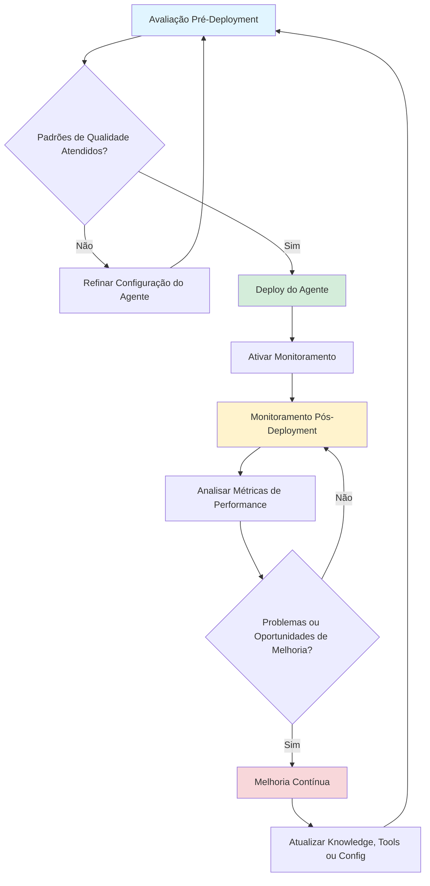

# Controle e Governança de Agentes de IA com watsonx Orchestrate

Nos laboratórios de hoje, você aprenderá como implementar práticas de governança para agentes de IA utilizando a interface do watsonx Orchestrate.

Serão abordados conceitos como guardrails, monitoramento, debugging e avaliação de agentes para reduzir riscos relacionados à IA Generativa e garantir operações mais seguras e confiáveis.

**Mas porque isso é importante?**

Antes de disponibilizar um agente para os usuários, precisamos responder algumas perguntas:

<code>
As respostas estão corretas?
O agente é seguro?
Ele respeita regras de compliance?
Os custos de uso estão controlados?
Como identificar problemas após o deployment?
</code>

## Objetivo 

Este laboratório ajuda um time desde de gerente de produtos, engenheiros de IA e líderes de negócio como a implementar um framework abrangente de governança usando as capacidades integradas de avaliação e monitoramento do watsonx Orchestrate.

**Atividades que vamos realizar hoje**

Implementar capacidades de **Controles e Governança de IA Agêntica** para abordar:

**Injeção de prompt**: Um usuário malicioso interagindo com o sistema pode instruir o LLM a gerar conteúdo prejudicial, alterar seu comportamento ou executar ações perigosas.

**Alucinações:** Em alguns casos, um LLM pode gerar declarações falsas, conhecidas como alucinações.

**Saída tóxica (HAP):** A aplicação pode gerar conteúdo odioso, abusivo ou inapropriado. O filtro HAP da IBM utiliza IA para prevenir esse tipo de saída.

**Vazamento de PII:** Informações pessoalmente identificáveis podem estar presentes em bases de conhecimento ou ser geradas por ferramentas de agentes.

**Proliferação de agentes:** Gerenciar e governar um grande número de agentes dentro de uma organização.

**Avaliação de qualidade:** Medir a qualidade das saídas de um sistema de IA antes de colocá-lo em produção.

**Monitoramento:** Acompanhamento contínuo com métricas em tempo real para garantir alto desempenho e baixo risco.

**Alertas:** Notificações quando houver violações nas métricas de qualidade, modelo ou desempenho.

**Debugging:** Análise e investigação de problemas quando o sistema não se comporta como esperado.

Ao completar este laboratório, você ganhará confiança para colocar seus agentes de IA em produção, sabendo que eles atendem padrões de qualidade e entregam valor de negócio mensurável.

## Valor para o seu Negócio

**Prevenir proliferação de agentes**: A proliferação descontrolada de agentes aumenta a complexidade, o custo computacional e os riscos, daí a necessidade de gerenciar e governar um grande número de agentes em uma organização.

**Proteção de reputação**: As organizações precisam garantir que seus sistemas de IA operem de forma segura, ética e alinhada às políticas corporativas. Falhas como ataques de prompt injection, respostas incorretas, geração de conteúdo inadequado ou execução de ações não autorizadas podem impactar a confiança dos usuários, gerar riscos operacionais e comprometer a reputação da empresa.

**Infrações regulatórias e questões legais**: Muitos riscos de IA são abordados por leis e regulamentos em muitas jurisdições. Embora um dos laboratórios os aborde com maior detalhe, as ferramentas de gerenciamento de risco abordadas neste laboratório também ajudam a reduzir potenciais questões de conformidade legal e regulatória.

**Produtividade**: Economia de tempo fazendo avaliações manuais e verificações de qualidade, bem como monitorando manualmente os modelos e sistemas de IA de sua equipe.

## Fluxo de Trabalho com o Orchestrate

O ciclo de vida de agentes no watsonx Orchestrate segue um modelo de melhoria contínua:

----

[Clique aqui para começar os laboratórios](./Step_by_Step_LabA.md)