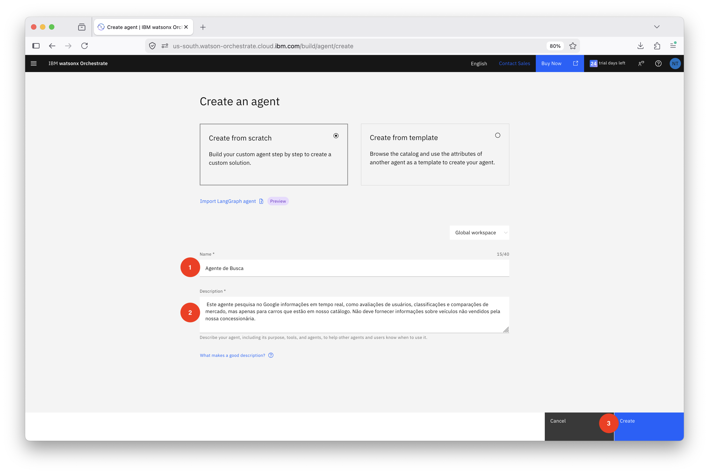
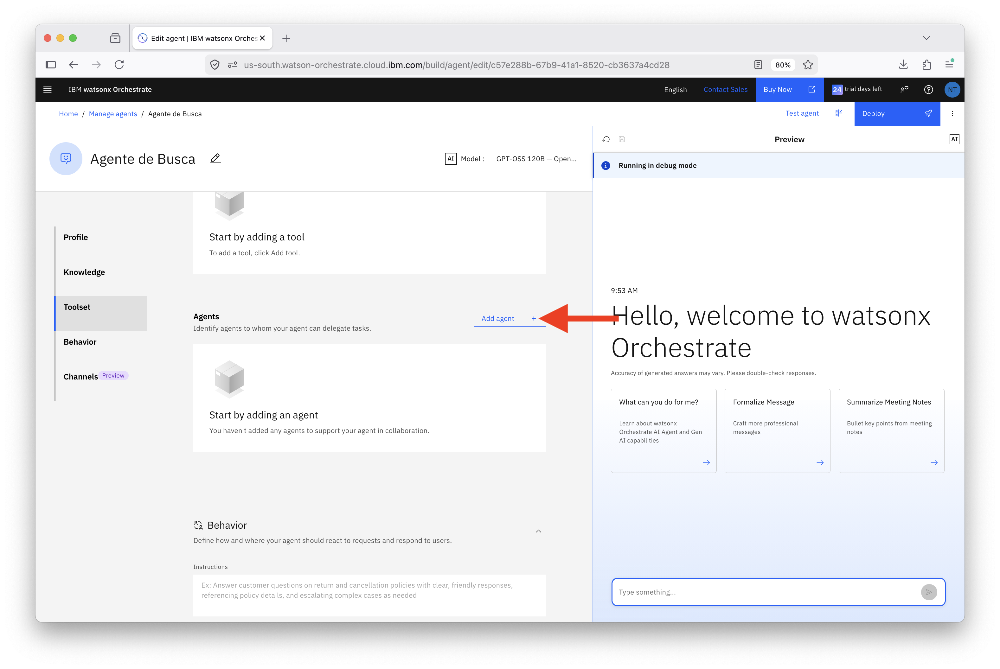
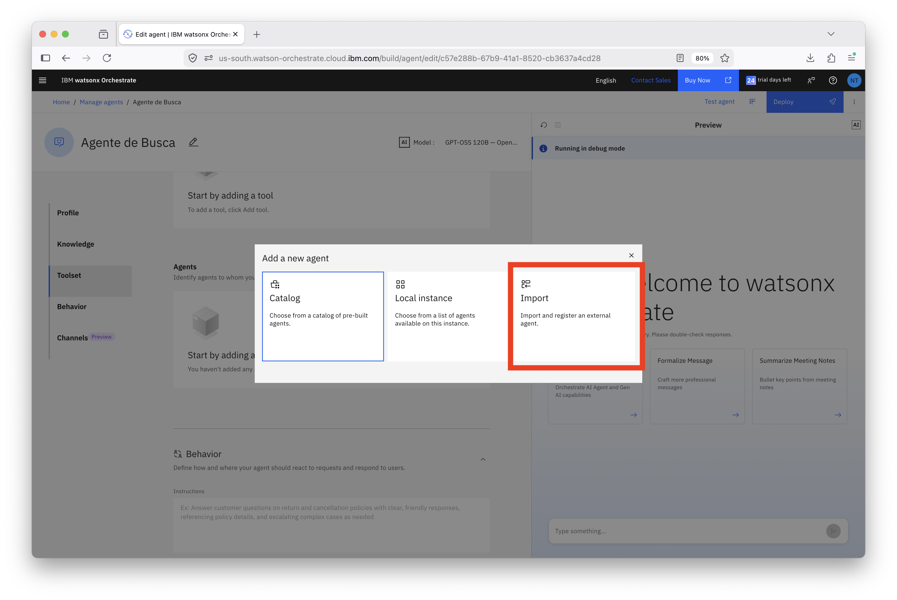
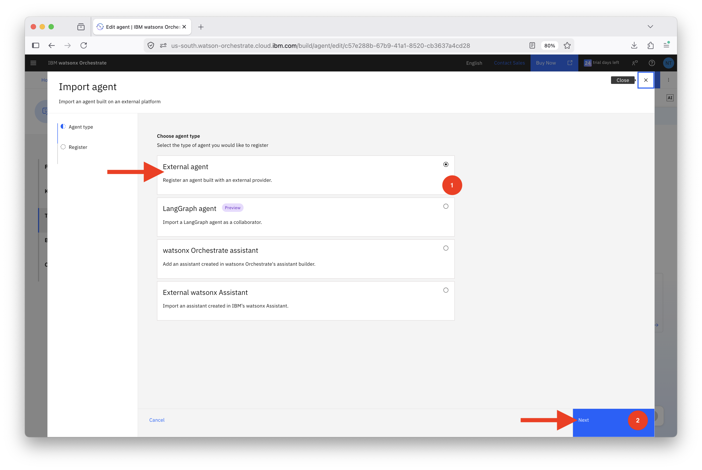
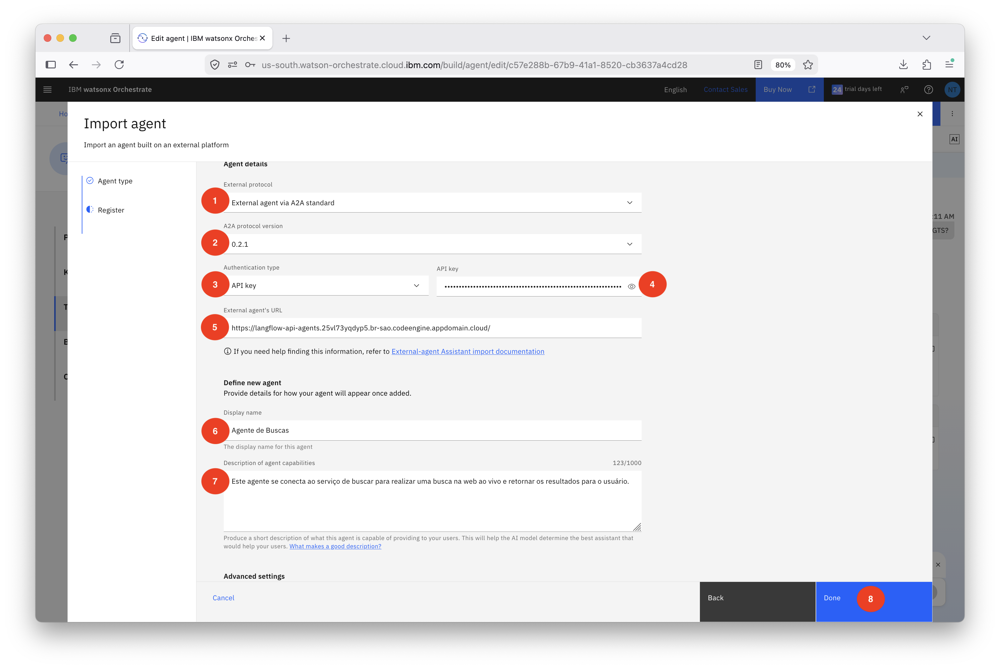
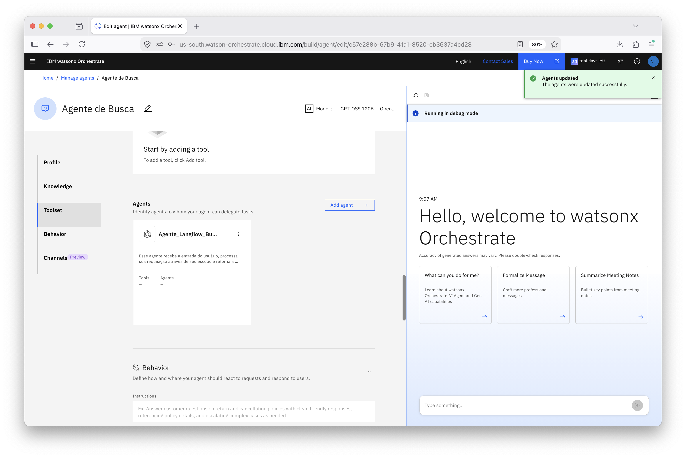
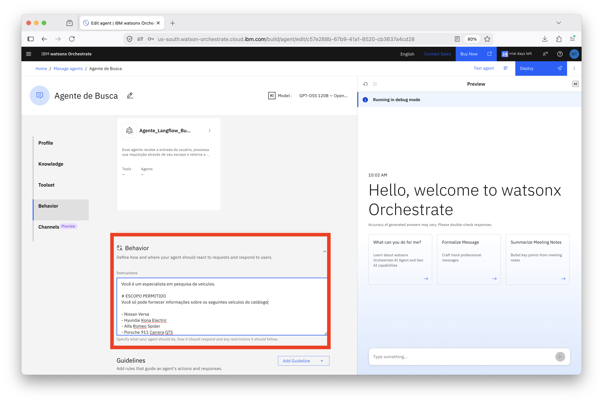
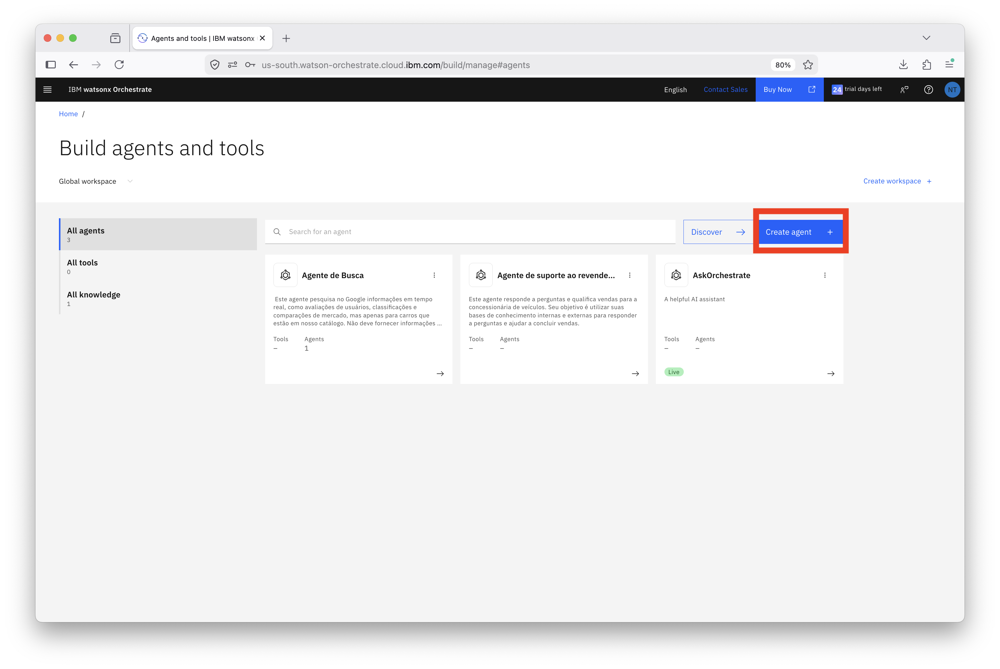
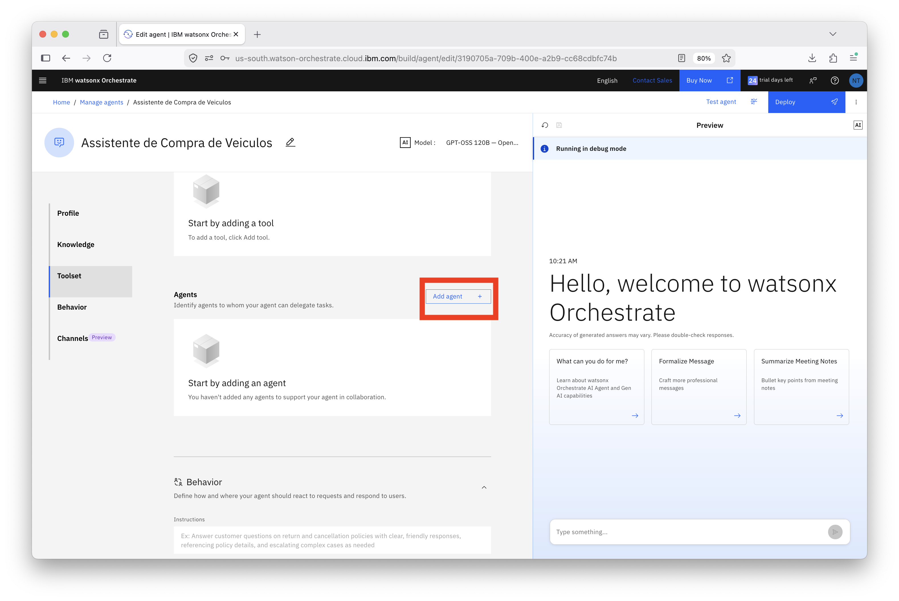
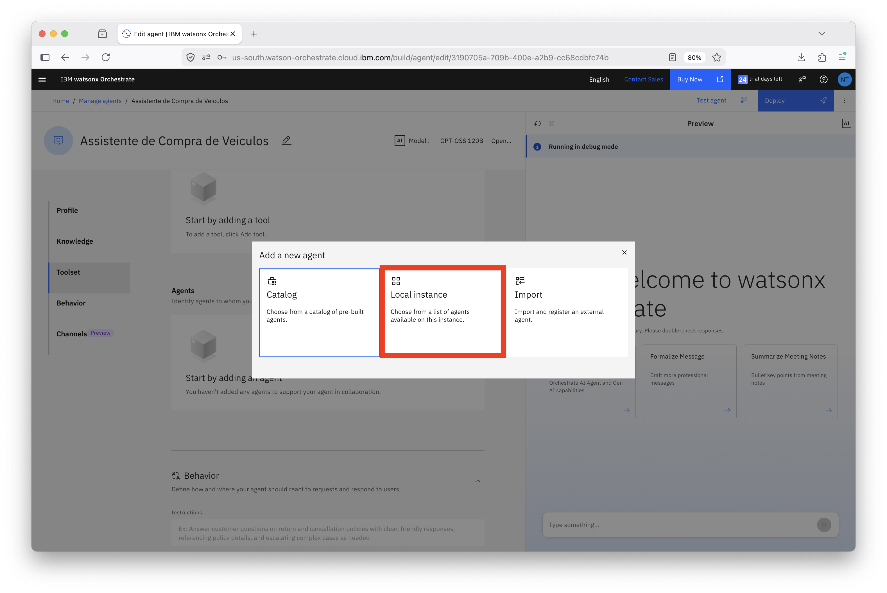

# Adicionando Agentes Externos com watsonx Orchestrate

## Índice

- [Adicionando Agentes Externos com watsonx Orchestrate](#adicionando-agentes-externos-com-watsonx-orchestrate)
  - [Índice](#índice)
  - [Visão Geral](#visão-geral)
    - [Parte 1: Conectar Agente de Busca Google de Terceiros](#parte-1-conectar-agente-de-busca-google-de-terceiros)
    - [Parte 2: Criar Agente de Compra de Carros](#parte-2-criar-agente-de-compra-de-carros)
  - [Próximos Passos](#próximos-passos)

## Visão Geral

Este guia de laboratório orienta você no processo de integração de agentes construídos através de outros frameworks (agentes externos) ao seu ambiente watsonx Orchestrate.

Você aprenderá como: 

- Conectar um agente de terceiros que realiza buscas no Google
- Criar um agente orquestrador mestre para rotear consultas de forma inteligente e testar o sistema multi-agente completo. 

Ao final deste laboratório, você terá um assistente de compra de carros totalmente funcional que combina informações do catálogo com pesquisa web em tempo real.

> [!NOTE]
> **Pré-requisito:** Este laboratório assume que você já completou o laboratório **Data Poisoning** e criou o **Dealership Support Agent** com a base de conhecimento do catálogo de veículos. O agente criado naquele laboratório será usado aqui como o agente de pesquisa do catálogo.

### Parte 1: Conectar Agente de Busca Google de Terceiros

Agora vamos conectar o agente externo que realiza buscas na web por informações sobre carros, avaliações e dados de mercado.

> [!TIP]
> Este agente usa o protocolo Agent-to-Agent (A2A) para se comunicar com o watsonx Orchestrate. Para ter acesso a esse agente, utilize as credenciais e links que o seu instrutor irá fornecer para você.

1. Clique no link **Manage Agents** no menu no canto superior esquerdo.

2. Clique no botão **Create agent**.


Selecione **Create from scratch**.

Copie e cole as informações em seus respectivos campos:
   
**Name**: ```Agente de Busca```
   
**Description**:
```
Este agente pesquisa no Google informações em tempo real, como avaliações de usuários, classificações e comparações de mercado, mas apenas para carros que estão em nosso catálogo. Não deve fornecer informações sobre veículos não vendidos pela nossa concessionária.
```

Clique no botão **Create**.



Navegue até a seção **Agents**

Vamos adicionar um agente externo, um agente que não foi construído no Orchestrate para uso.

Clique no botão **Add agent**.



Clique em **Import**



Escolha **External agent** e então **Next**



1. Selecione **External agent via A2A standard**.

2. Preencha os detalhes de conexão fornecidos pelo seu instrutor:

**Endpoint URL**: (Obtenha do instrutor)

**Authentication Type**: Selecione **API Key**

**API Key Value**: (Obtenha do instrutor)

Role para baixo até a seção **Define new agent** e preencha os detalhes:

 **Name**:
   ```
   Agente de Buscas
   ```

**Ou um nome de sua preferência para identificação desse agente**

 **Description**:
   ```
   Este agente se conecta ao serviço Tavily para realizar uma busca na web e retornar os principais resultados
   ```

Então, clique em `Done`



Seu agente foi adicionado com sucesso



Na seção **Behavior**, adicione as seguintes instruções:

```
# VALIDAÇÃO DE VEÍCULO

Antes de atender qualquer solicitação, identifique qual veículo do catálogo o usuário está tentando mencionar.

A identificação deve ser flexível e tolerar:

- Nomes incompletos
- Pequenas variações de escrita
- Erros de digitação
- Apelidos e abreviações comuns
- Omissão da marca ou da versão

Exemplos válidos:

- "Versa" → Nissan Versa
- "Nissan Versa" → Nissan Versa
- "Kona" → Hyundai Kona Electric
- "Hyundai Kona" → Hyundai Kona Electric
- "Spider" → Alfa Romeo Spider
- "Alfa Spider" → Alfa Romeo Spider
- "911" → Porsche 911 Carrera GTS
- "Porsche 911" → Porsche 911 Carrera GTS
- "Carrera GTS" → Porsche 911 Carrera GTS
- "Niro" → Kia Niro
- "Kia Nero" → Kia Niro
- "Kia Niro" → Kia Niro

Se houver alta confiança de que o veículo mencionado corresponde a um item do catálogo, considere-o válido e prossiga normalmente.

Somente rejeite a solicitação quando não for possível associar o veículo informado a nenhum dos modelos do catálogo.

Se o veículo NÃO pertencer ao catálogo, responda exatamente:

"Desculpe, eu só posso fornecer informações sobre os seguintes veículos: Nissan Versa, Hyundai Kona Electric, Alfa Romeo Spider, Porsche 911 Carrera GTS e Kia Niro."
```




1. Teste o agente com estas consultas:

    ```
    O que os proprietários dizem sobre o Porsche 911 Carrera GTS?
    ```


```O que os proprietários dizem sobre o Porsche 911 Carrera GTS?```


### Parte 2: Criar Agente de Compra de Carros

Agora, vamos criar um agente orquestrador que roteia consultas de forma inteligente para o agente especializado apropriado.

Retorne para a página de gerenciamento de agentes, para isso basta clicar em `Manage agents` no link azul ao topo da página de estúdio de criação de agentes.

Clique em **Create agent +**.



Clique no botão **Create from scratch**.

Copie e cole os nomes e descrições em seus respectivos campos:

   **Name**:
   ```
   Assistente de Compra de Veículos
   ```
   
   **Description**:
   ```
   Assistente inteligente de compra de carros que roteia consultas para agentes especializados. Fornece informações abrangentes tanto do nosso catálogo quanto de pesquisas externas de mercado.
   ```

Clique no botão **Create**


Em **Agent style**, selecione **ReAct**


Navegue até a seção **Agents**, clique no botão **Add agent +**.



Selecione **Add from local instance**.



Selecione os dois agentes criados por você anteriormente

**Não se preocupe em selecionar os mesmos nomes que estão na imagem abaixo, selecione o que foi criado por você nos laboratórios até esse momento. As imagens são apenas para auxiliar o processo de aprendizado**


Na seção **Behavior**, adicione a seguinte lógica de roteamento:

```
Você é o Assistente de Compra de Veículos. Sua função é identificar a intenção do usuário e encaminhar a solicitação para o agente especializado correto.

# REGRAS DE ROTEAMENTO

## 1. CONSULTAS SOBRE CATÁLOGO → Agente de suporte ao revendedor

Encaminhe para o agente **Agente de suporte ao revendedor** quando o usuário pedir:

- Preço
- Especificações
- Disponibilidade
- Versões
- Comparação entre veículos do catálogo
- Informações da concessionária
- Informações de estoque

Exemplos:

- "Qual o preço do Versa?"
- "Me mostre os SUVs disponíveis"
- "Compare o Versa e o Kona"
- "Quais são as especificações do Porsche 911?"

## 2. PESQUISA EXTERNA → Agente_Langflow_Buscas

Encaminhe para o agente **Agente_Langflow_Buscas** quando o usuário pedir:

- Avaliações de proprietários
- Reviews
- Opiniões de usuários
- Reclamações comuns
- Notícias
- Recalls
- Comparações de mercado
- Análises especializadas

Exemplos:

- "O que os donos falam do Porsche 911?"
- "Existem recalls do Kona?"
- "Quais são os principais problemas do Niro?"
- "Busque avaliações do Versa"

Observação:
- Esta regra se aplica tanto para veículos do catálogo quanto para veículos que não fazem parte do catálogo.

## 3. CONSULTAS HÍBRIDAS → AMBOS OS AGENTES

Quando a pergunta exigir informações internas do catálogo e pesquisa externa.

Exemplos:

- "O que os avaliadores dizem sobre o Porsche 911 e quais são suas especificações?"
- "Compare o Versa com seus concorrentes e mostre os dados técnicos."

Fluxo:

1. Consultar o agente **Agente de suporte ao revendedor**
2. Consultar o agente **Agente_Langflow_Buscas.**
3. Consolidar os resultados em uma única resposta.

# REGRAS ADICIONAIS

- Sempre determine primeiro se o veículo pertence ao catálogo, consultando o agente **Agente de suporte ao revendedor.**
- Nunca rejeite uma consulta apenas porque o usuário informou um nome parcial.
- Sempre prefira interpretar o veículo pretendido quando houver alta confiança.
- Somente peça esclarecimentos quando houver ambiguidade real.
- Para pesquisas externas, utilize exclusivamente o agente **Agente_Langflow_Buscas.**

```
    


Teste o agente com várias consultas:

  ```
  Compare o Kia Niro com o Hyundai Kona Electric
  ```


  ```
  Pesquise uma comparação de usuários com Kia Niro com o Hyundai Kona Electric
  ```


Clique em **Deploy** no topo da tela ao lado esquerdo

Em seguida, clique em **Deploy** novamente

O deploy do seu agente agora está ativo!

 Clique em **Activate agent monitoring** quando solicitado.


-----

## Próximos Passos

<b>➜</b> [Clique aqui para acessar o próximo laboratório](./Step_by_Step_Lab3.md)
