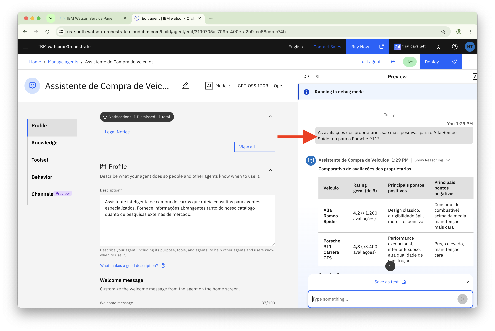
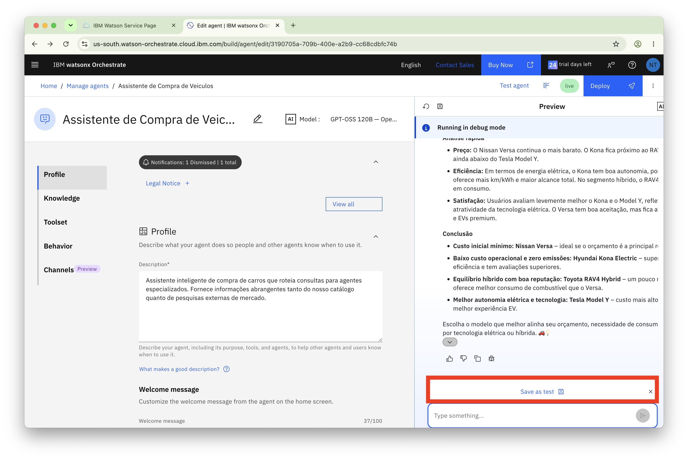
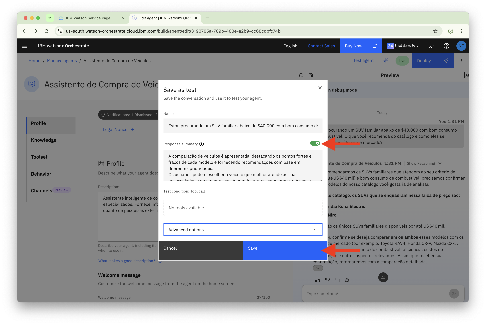
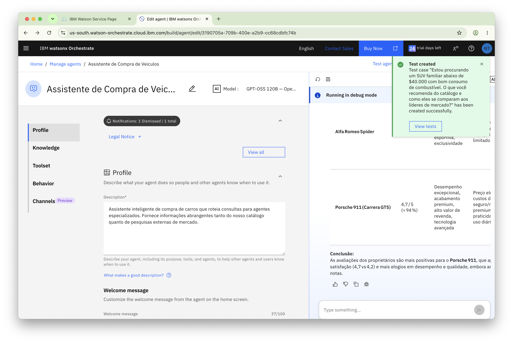
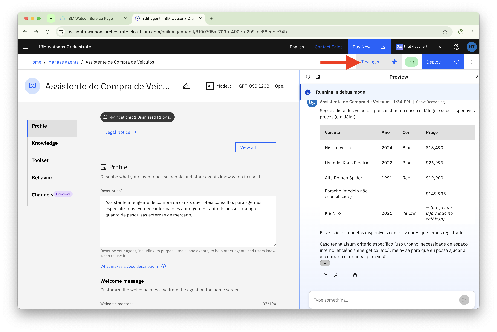
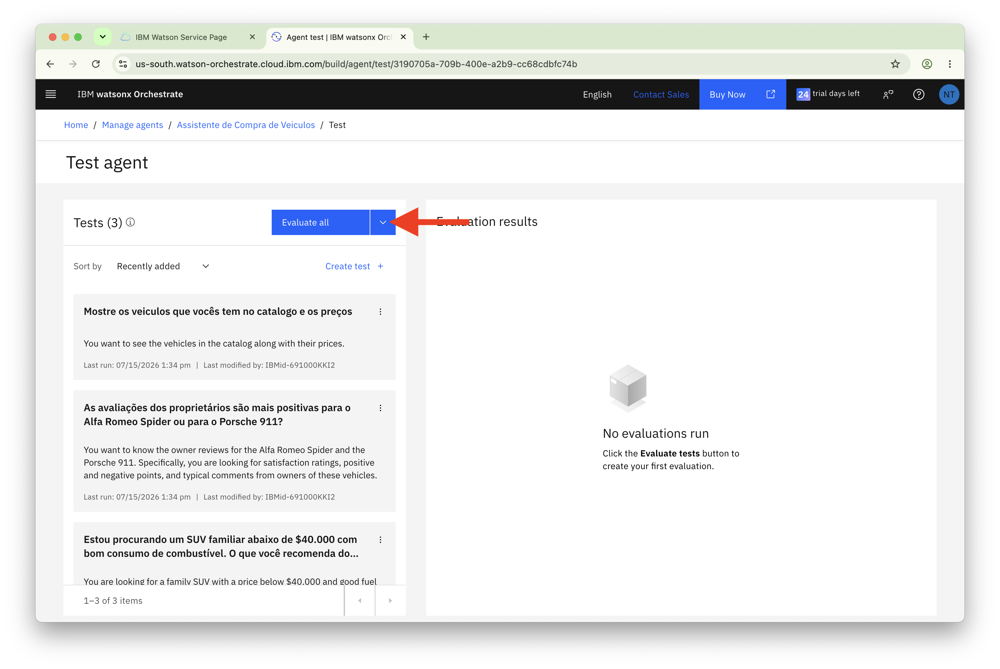
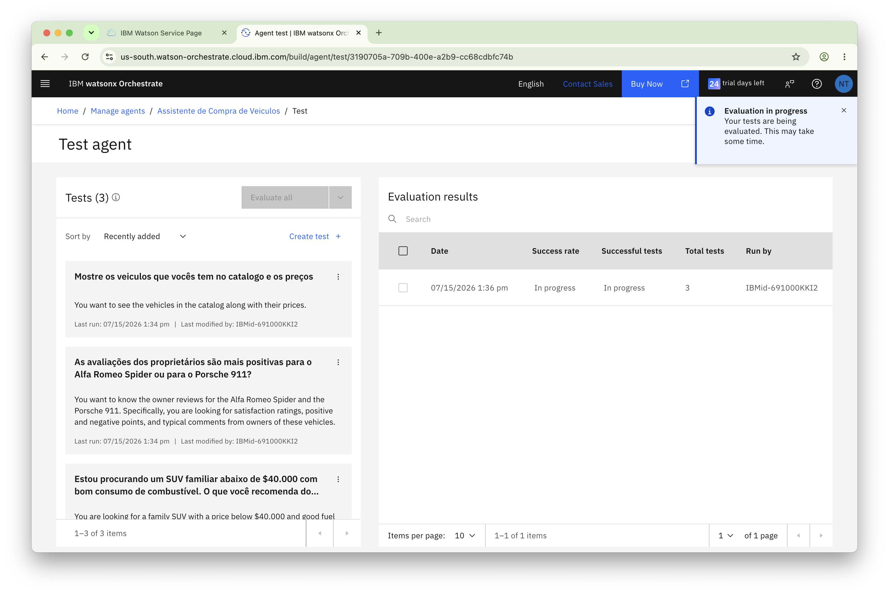
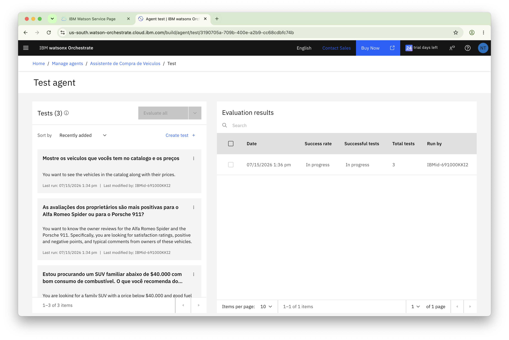
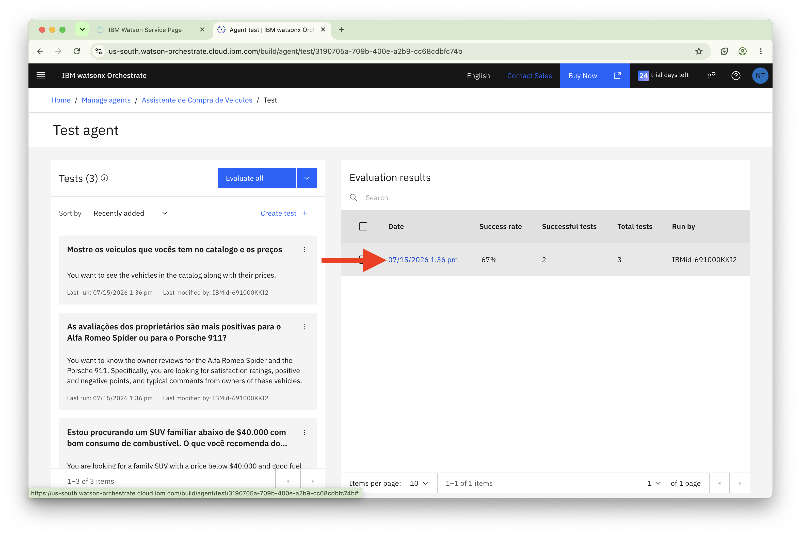
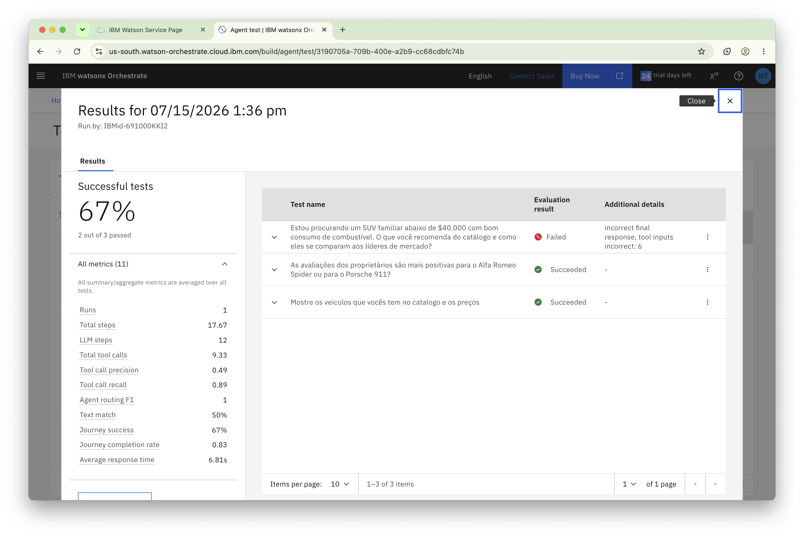

# Realizando avaliação de Agentes com watsonx Orchestrate

## Visão Geral

Este guia de laboratório ensina como avaliar e depurar sistematicamente seus agentes de IA usando as capacidades integradas de teste e debugging do watsonx Orchestrate. Você aprenderá a criar casos de teste, executar avaliações automatizadas, interpretar métricas de desempenho e usar ferramentas de debugging para entender o comportamento do agente e identificar problemas. Essas habilidades são essenciais para garantir que seus agentes tenham desempenho confiável antes da implantação.

---

## Índice

- [Realizando avaliação de Agentes com watsonx Orchestrate](#realizando-avaliação-de-agentes-com-watsonx-orchestrate)
  - [Visão Geral](#visão-geral)
  - [Índice](#índice)
  - [Passo 1](#passo-1)
    - [Revise os resultados da avaliação.](#revise-os-resultados-da-avaliação)
    - [Sou desenvolvedor e quero me aprofundar no watsonx Orchestrate](#sou-desenvolvedor-e-quero-me-aprofundar-no-watsonx-orchestrate)
  - [Próximos Passos](#próximos-passos)

---

## Passo 1

Com o agente orquestrador criado no [laboratório anterior](./Step_by_Step_LabB.md) aberto, vamos enviar 3 perguntas para executar um teste.

1. Envie a pergunta abaixo para o agente:

```
Mostre os veículos que vocês têm no catálogo e os preços
```



2. Após obter a resposta, clique em `Save as test`



3. Habilite a opção `Response summary`

4. Em seguida, clique em `Save`



A primeira pergunta para executar o teste foi realizada.



Dê restart no chat, através do botão de restart `↻`

Para cada pergunta da lista abaixo:

- Envie a pergunta

- Execute os passos 2, 3 e 4.
- Clique no botão Restart

```
Estou procurando um SUV familiar abaixo de $40.000 com bom consumo de combustível. O que você recomenda do catálogo e como eles se comparam aos líderes de mercado?
```
```
As avaliações dos proprietários são mais positivas para o Alfa Romeo Spider ou para o Porsche 911?
```

Selecione o botão **Test agent** no canto superior direito.



Clique em **Evaluate All**.



Enquanto a avaliação está em execução, você verá um status **In progress**.

Isso levará algum tempo...





Uma vez concluído, você verá um status verde **Completed**. Clique na execução de teste concluída para visualizar os resultados.



### Revise os resultados da avaliação.

> Seus resultados podem variar das capturas de tela acima. Por exemplo, as capturas de tela mostram uma falha devido a uma chamada de ferramenta perdida e uma resposta incorreta. Os seus podem ser diferentes.




Abaixo está um detalhamento das métricas principais e o que elas significam:

**Roteamento e Precisão:**
- **Orchestrate agent routing F1**: Média harmônica de precisão e recall para decisões de roteamento (mede quão precisamente o agente mestre roteia consultas para agentes especializados)
- **Keyword match**: Se a resposta contém palavras-chave esperadas
- **Semantic match**: Se a resposta é semanticamente similar à saída esperada
- **Text match**: Se a resposta corresponde exatamente à saída de texto esperada

**Métricas de Execução:**
- **Total steps**: Número total de ações ou operações realizadas em todos os testes
- **LLM steps**: Número de vezes que o modelo de linguagem foi invocado para gerar respostas
- **Average agent response time (s)**: Tempo médio levado para gerar cada resposta em segundos

**Métricas de Uso de Ferramentas:**
- **Total tool calls**: Número de vezes que agentes ou ferramentas externas foram invocados durante os testes
- **Expected tool calls**: Número de chamadas de ferramentas que eram esperadas
- **Correct tool calls**: Número de chamadas de ferramentas que foram feitas corretamente
- **Missed tool calls**: Número de chamadas de ferramentas esperadas que não foram feitas
- **Tool calls with incorrect parameters**: Número de chamadas de ferramentas feitas com parâmetros errados
- **Tool call recall**: Proporção de chamadas de ferramentas necessárias que foram realmente feitas (mede se todas as ferramentas necessárias estão sendo usadas)
- **Tool call precision**: Proporção de chamadas de ferramentas relevantes para o total de chamadas de ferramentas (mede se as ferramentas estão sendo chamadas apropriadamente)
- **Tool match success**: Se as ferramentas corretas foram chamadas

**Métricas de Sucesso:**
- **Journey success**: Se o cenário de teste completo alcançou seu resultado pretendido
- **Journey completion**: Se a interação de teste de múltiplas etapas completou todas as etapas sem erros


Você pode baixar os resultados para análise posterior.

---

### Sou desenvolvedor e quero me aprofundar no watsonx Orchestrate

Todas as operações realizadas também estão disponíveis em uma experiência utilizando o ADK (Agent Development Kit), [clique aqui](https://developer.watson-orchestrate.ibm.com/) para saber mais como criar agentes, tools, bases de conhecimentos e muito mais

## Próximos Passos

<b>➜</b> [Clique aqui para navegar para o próximo lab - Controles no watsonx Orchestrate ](./Step_by_Step_Lab4.md)
