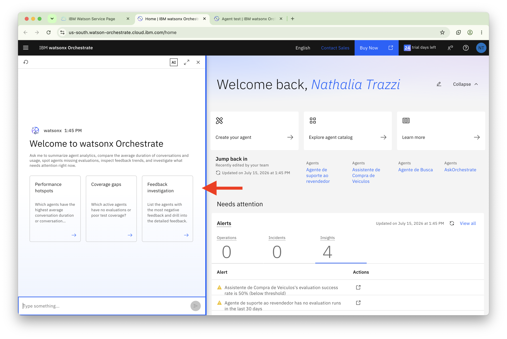
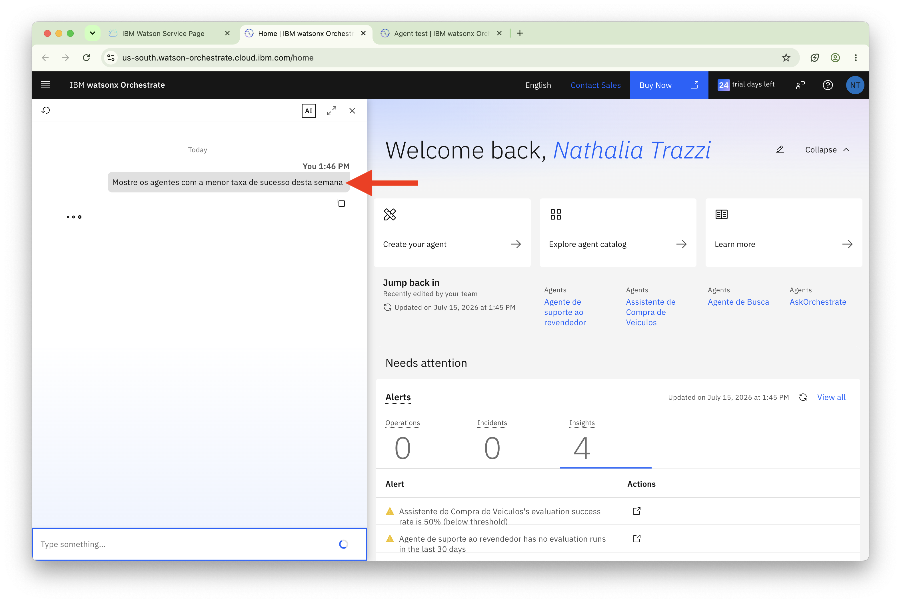
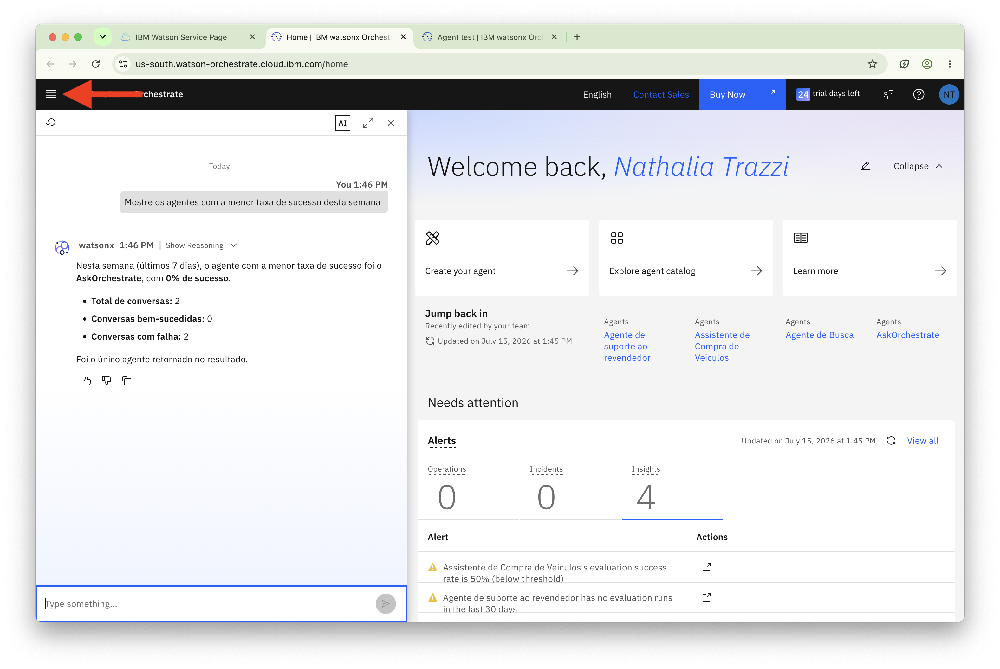
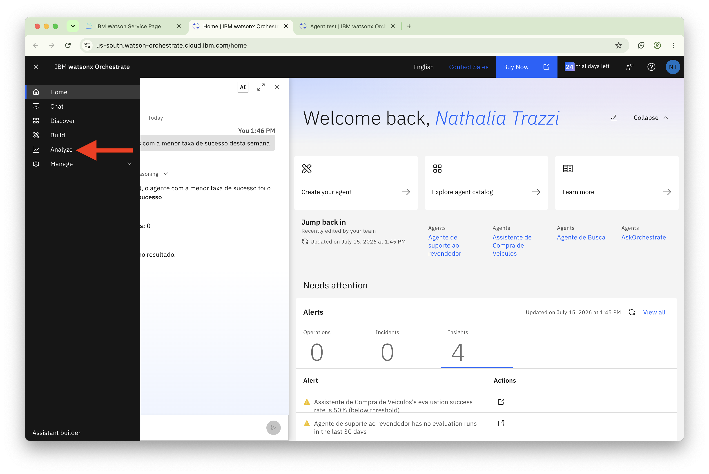
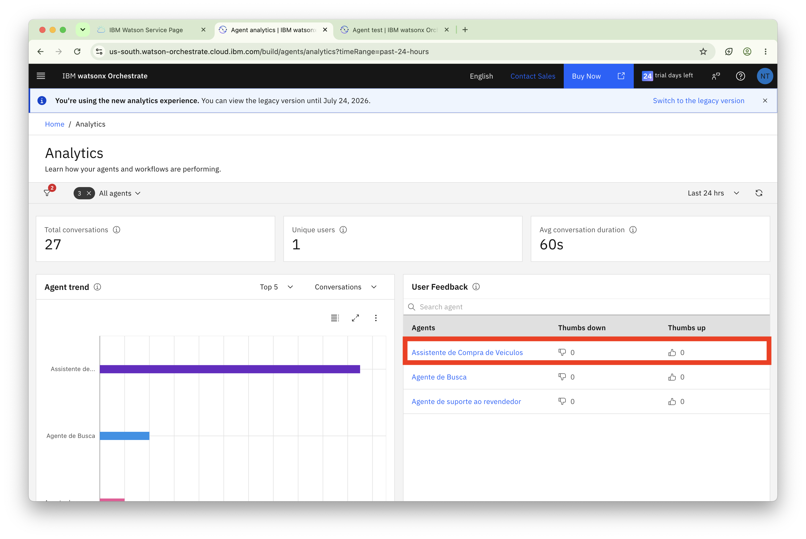
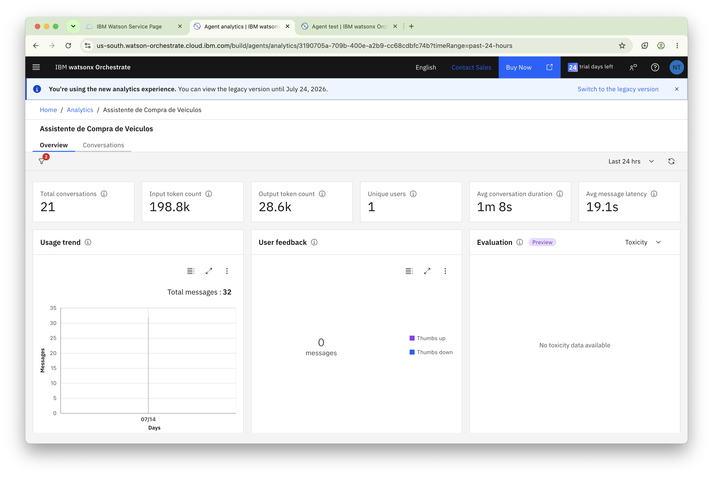
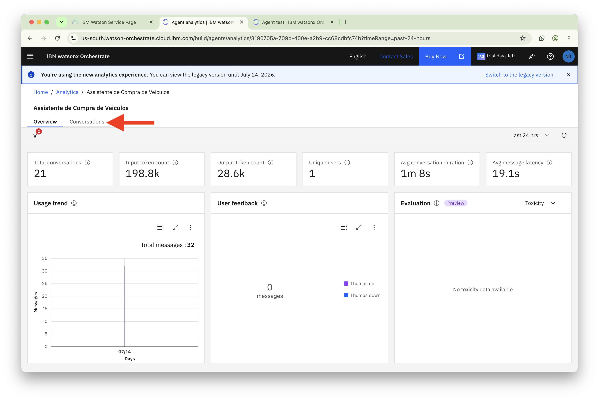
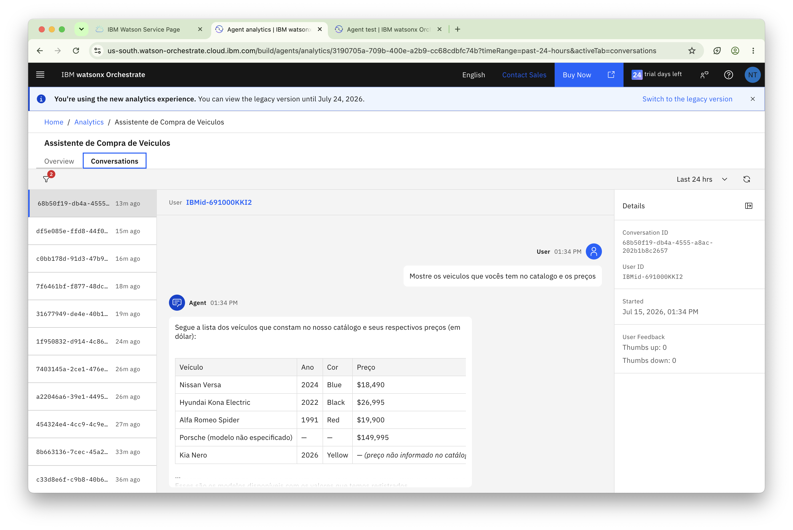

# Monitorando Agentes em Tempo Real com watsonx Orchestrate

## Visão Geral

Este laboratório apresenta os recursos de monitoramento em tempo real disponíveis no watsonx Orchestrate.

Ao longo das atividades, você aprenderá a acompanhar o desempenho dos agentes, analisar padrões de conversação e monitorar métricas importantes, como taxas de sucesso, feedback dos usuários e indicadores de segurança e qualidade das respostas.

O monitoramento contínuo é essencial para garantir a eficiência dos agentes em produção, identificar comportamentos inesperados e agir proativamente na resolução de problemas antes que eles impactem a experiência dos usuários.

---

## Índice

- [Monitorando Agentes em Tempo Real com watsonx Orchestrate](#monitorando-agentes-em-tempo-real-com-watsonx-orchestrate)
  - [Visão Geral](#visão-geral)
  - [Índice](#índice)
      - [Visualizar Resultados de Monitoramento](#visualizar-resultados-de-monitoramento)
    - [Sou desenvolvedor e quero me aprofundar no watsonx Orchestrate](#sou-desenvolvedor-e-quero-me-aprofundar-no-watsonx-orchestrate)
  - [Próximos Passos](#próximos-passos)

---

#### Visualizar Resultados de Monitoramento

Vamos verificar o dashboard de monitoramento. 

Clique em **IBM watsonx Orchestrate** no canto superior esquerdo para retornar à tela de boas-vindas do control plane.


Vamos explorar as analytics de agentes usando o chat à esquerda.



Faça a seguinte pergunta: ```Mostre os agentes com a menor taxa de sucesso desta semana```



Em seguida, vamos explorar Platform e Agent Analytics.

Clique no ícone de hambúrguer conforme indicado na imagem abaixo:



Selecione **Analyze** no menu hambúrguer.



Você verá o dashboard de avaliação com métricas-chave incluindo principais conversas, usuários únicos e duração média de conversação.

Você também verá gráficos refletindo o número de conversas com cada agente e o desempenho de seus agentes.

Clique no seu agente recém-criado, o orquestrador



Isso mostra detalhes de todas as mensagens na conversação do seu agente.



Vamos alterar a visualização, clique na aba `Conversations`



<h3>Note que devido a você ter poucas interações no seu agente e em apenas um dia, a maioria das métricas não deve estar disponível, assim como na imagem abaixo.</h3>



**Entendendo as Métricas**:

**Métricas de Feedback do Usuário**:

- **Thumbs up**: Número de respostas de feedback positivo dos usuários indicando satisfação com a resposta do agente.

- **Thumbs down**: Número de respostas de feedback negativo dos usuários indicando insatisfação com a resposta do agente.

- **Not rated**: Número de interações onde os usuários não forneceram feedback.

- **Toxicity**: Pontuação indicando o nível de conteúdo tóxico, ofensivo ou inapropriado na resposta (0.00 = nenhuma toxicidade detectada).

- **Input PII**: Pontuação indicando se informações pessoalmente identificáveis foram detectadas na entrada do usuário (0.00 = nenhuma PII detectada).

- **Output PII**: Pontuação indicando se informações pessoalmente identificáveis foram detectadas na resposta do agente (0.00 = nenhuma PII detectada).
  
----

### Sou desenvolvedor e quero me aprofundar no watsonx Orchestrate

Todas as operações realizadas também estão disponíveis em uma experiência utilizando o ADK (Agent Development Kit), [clique aqui](https://developer.watson-orchestrate.ibm.com/) para saber mais como criar agentes, tools, bases de conhecimentos e muito mais

## Próximos Passos

<b>➜</b> [Clique aqui para navegar para o próximo lab - Control Plane Lab do watsonx Orchestrate](./Step_by_Step_Lab6.md)
