# Control Plane Lab do watsonx Orchestrate

## Índice

- [Control Plane Lab do watsonx Orchestrate](#control-plane-lab-do-watsonx-orchestrate)
  - [Índice](#índice)
  - [Visão Geral](#visão-geral)
  - [Explorando o Control Plane](#explorando-o-control-plane)
    - [Dashboard](#dashboard)
  - [Needs Attention (Atenção necessária)](#needs-attention-atenção-necessária)
  - [Alertas operacionais](#alertas-operacionais)
  - [Agent Analytics](#agent-analytics)
    - [Sou desenvolvedor e quero me aprofundar no watsonx Orchestrate](#sou-desenvolvedor-e-quero-me-aprofundar-no-watsonx-orchestrate)
  - [Resumo](#resumo)
  - [Próximos passos](#próximos-passos)

## Visão Geral

O **Control Plane** do **watsonx Orchestrate** oferece às empresas uma forma centralizada de gerenciar, observar e otimizar agents em diferentes equipes, ferramentas, modelos e runtimes sejam eles construídos no Orchestrate ou executados em outros ambientes.

Neste lab, vamos experimentar em primeira mão o **Agentic Control Plane** (ACP). Tenha em mente que os benefícios do ACP ficam mais evidentes quanto mais agentes e ferramentas você tiver construído e implementando, tanto no watsonx Orchestrate quanto externamente, e quanto mais você tiver interagido com eles para obter dados reais.

Caso tenha seu próprio ambiente dedicado do watsonx Orchestrate, você poderá ver apenas alguns agents no dashboard do ACP. De qualquer forma, você poderá experimentar e aprender sobre os benefícios do Agentic Control Plane na prática! Vamos começar!

> [!NOTE]
> Nós estamos trabalhando em uma atualização deste laboratório para incluir scripts para os instrutores importarem agents e ferramentas, de forma que o dashboard contenha uma variedade de dados suficiente para executar este lab do Agentic Control Plane de forma independente.
> O laboratório é vivo e será atualizado ao decorrer dos próximos dias...

## Explorando o Control Plane

### Dashboard

Clique em **IBM watsonx Orchestrate** no canto superior esquerdo para ir à tela inicial/dashboard, caso ainda não esteja lá. 

O dashboard é a experiência inicial do Control Plane, o ponto de partida para gerenciar seu ecossistema de agents.

A partir daqui, podemos visualizar rapidamente métricas de desempenho e a saúde geral do ambiente de AI Agents.

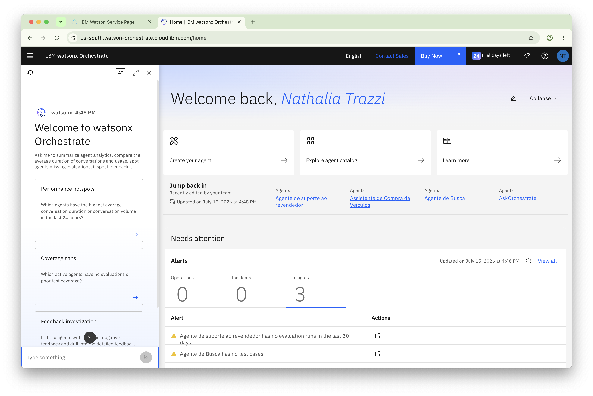

Na parte superior, podemos criar novos agents, explorar o catálogo de agents ou retomar trabalhos recentes.

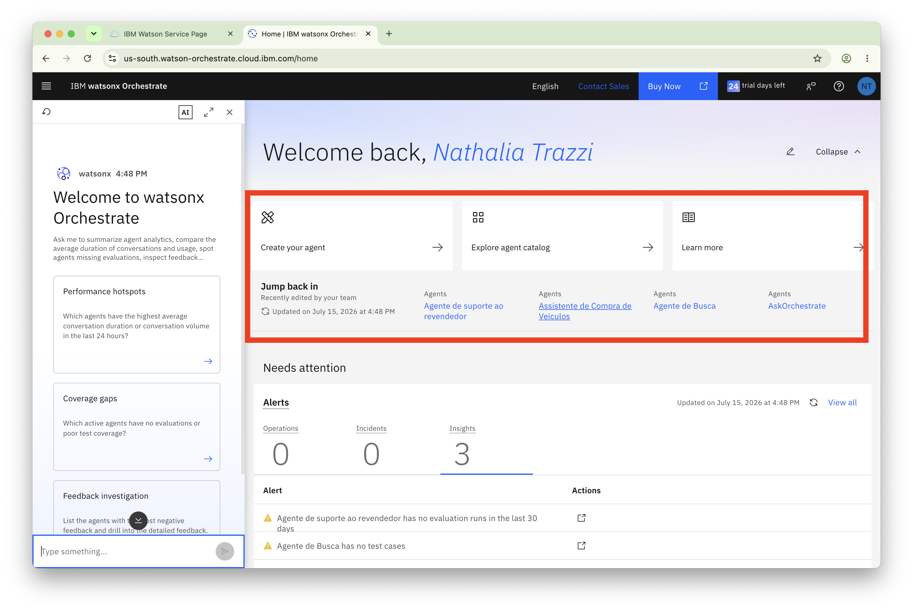

A seção **Needs Attention** destaca problemas no ambiente de AI agents que podem exigir atenção:

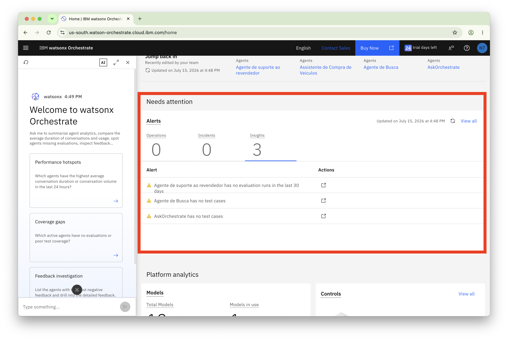

Aqui podemos monitorar alertas operacionais, incidentes e insights, como credenciais ausentes, pontos de sobrecarga de desempenho ou lacunas de avaliação, e navegar rapidamente para as ações necessárias para manter os agents saudáveis e confiáveis.

Na seção **Platform Analytics**, você pode inspecionar resumos de modelos e controles: total de modelos, modelos em uso e controles por asset.

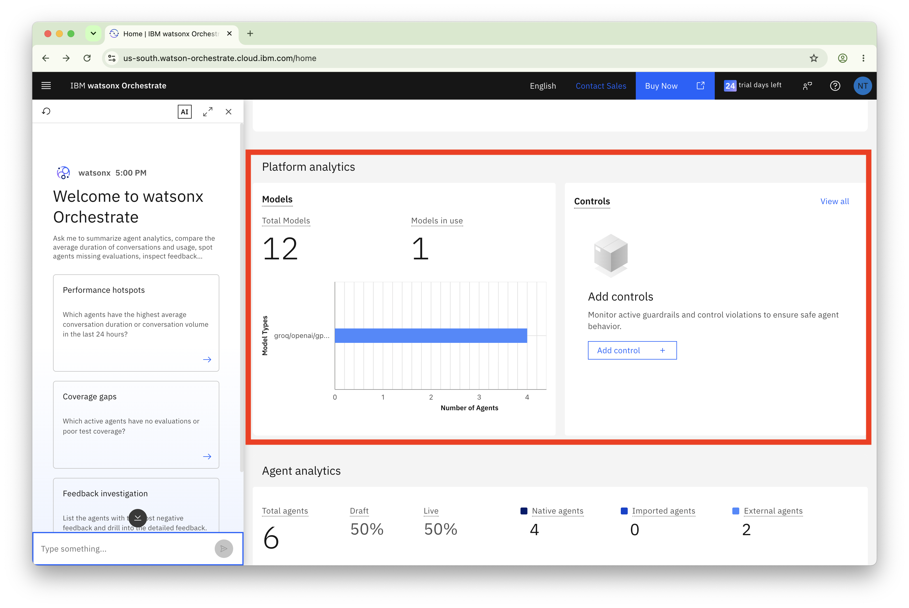

Você também pode visualizar todos os controles existentes para seus modelos, agents e ferramentas, além de adicionar novos controles. Veremos como adicionar controles no próximo e último lab.

A seção **Agent Analytics** permite revisar agents ativos, mensagens, mensagens com falha e métricas de latência para identificar regressões ou picos recentes:

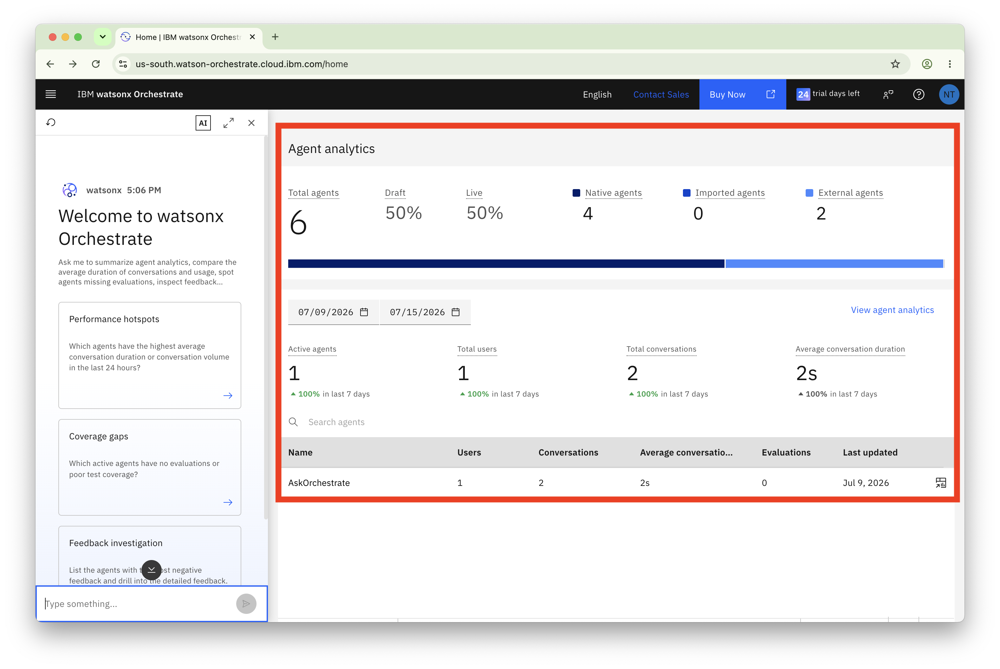

Vamos voltar à seção **Needs Attention** para observar os diferentes tipos de alertas.

## Needs Attention (Atenção necessária)

Vamos examinar os diferentes tipos de alertas disponíveis na seção **Needs Attention**: Operations, Incidents e Insights.

Primeiro, temos os alertas de _Operations_. São bloqueios operacionais com uma solução conhecida, como por exemplo credenciais de conexão ausentes:

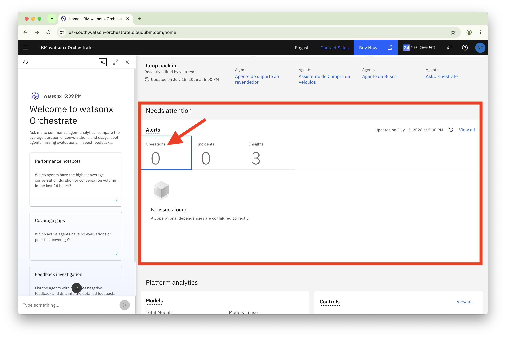

Em seguida, temos os alertas de _Incidents_. São alertas de produção que requerem investigação. Selecione o tile de contagem de Incidents para filtrar a lista de alertas por itens de nível de incidente:

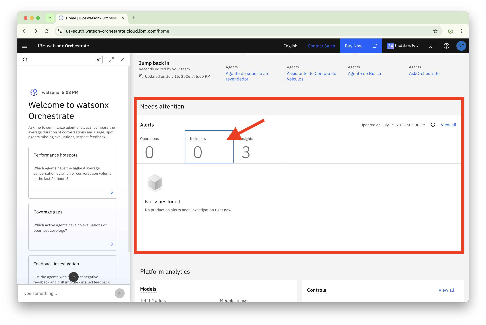

Observe como a lista de alertas mudou. Agora você pode ver que há um alerta indicando que um dos nossos AI agents teve uma taxa de falha de 9% nas últimas 24 horas.

Em seguida, temos os alertas de _Insights_. São recomendações para melhorar a qualidade e a prontidão dos agents. Clique em Insights agora para visualizá-los:

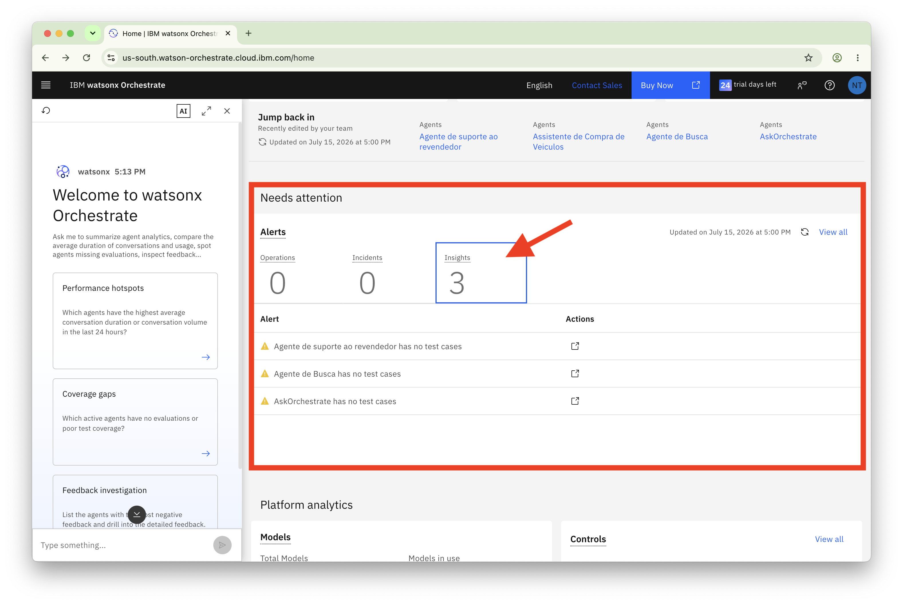

<b>Os Insights ajudam a entender causas raiz e evidências relacionadas a agents e ferramentas com falhas.</b>

## Alertas operacionais

Vamos tentar abrir um dos alertas para ver o que acontece. 

Como seu ambiente é novo, não possui muitos agentes e ainda não passou por muitos testes e interações, vamos continuar na aba `Insights`

Clique no link na coluna `Actions` para detalhar o problema:

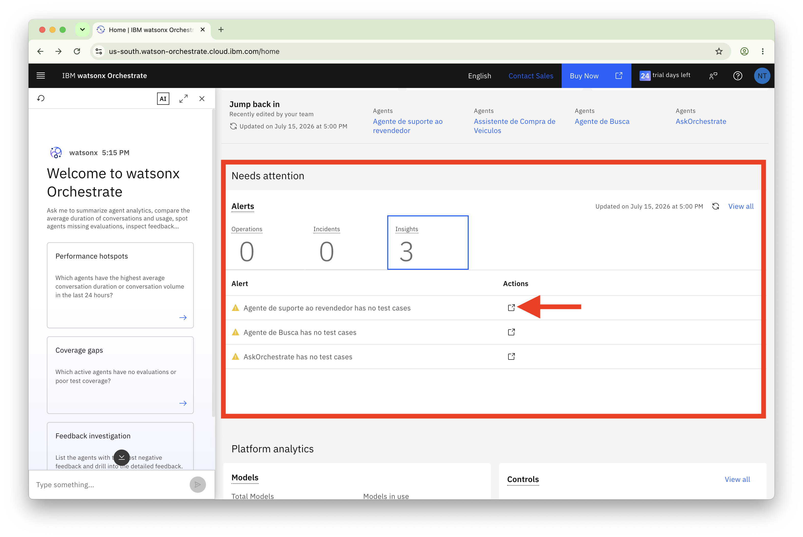

Observe que o Orchestrate enviou para a página utilizada no laboratório de `Realizando avaliação de Agente`

<b>Não é necessária nenhuma ação, apenas se quiser realizar novos testes conforme visto no laboratório `Realizando avaliação de Agente`</b>

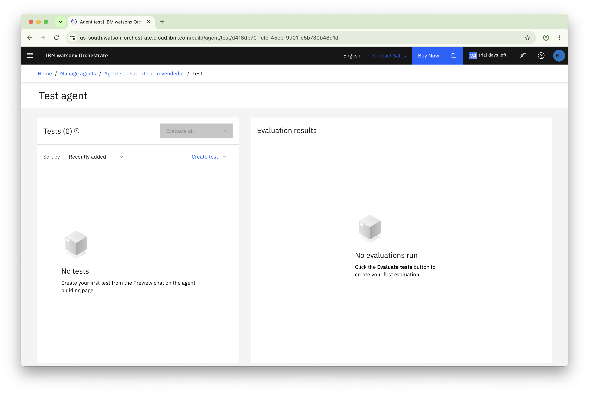

Retorne para página inicial do **Orchestrate**

## Agent Analytics

Na seção **Agent Analytics**, podemos passar de insights no nível do ambiente para investigação específica por agent.

À esquerda, Assistente de IA (chat): esse assistente conversacional ajuda a interpretar os dados de monitoramento. Em vez de você ter que ler tabela por tabela, você pode simplesmente perguntar em linguagem natural. Ele já sugere três "atalhos" de análise:

-> Performance hotspots — quais agentes tiveram maior duração média de conversa ou maior volume de conversas nas últimas 24h.

-> Coverage gaps — quais agentes ativos estão sem avaliações (evaluations) ou com cobertura de testes fraca.

-> Feedback investigation — listar os agentes com mais feedback negativo e detalhar esse feedback.

À direita no **Painel Agent analytics**  é o painel de métricas propriamente dito, onde você acompanha a saúde e o uso dos agentes.

Na faixa superior, temos visão do inventário de agentes:

Total agents: Total de agentes criados.
Draft: 50% / Live: 50% — Proporção entre agentes em rascunho e agentes já publicados.

Native agents: 4 / Imported agents: 0 / External agents: 2 — a origem dos agentes (criados nativamente, importados ou externos). 

Depois, há a opção de filtrar por período (07/09/2026 a 07/15/2026) e o link `View agent analytics` que leva à página completa de análise.

Por fim, uma tabela detalhada por agente, com busca (Search agents) e as colunas Name, Users, Conversations, Average conversation…, Evaluations, Last updated. No exemplo da imagem a seguir, temos apenas o agente `AskOrchestrate` aparece com 1 usuário, 2 conversas, 2s de duração média, 0 avaliações e última atualização em 9/jul/2026.

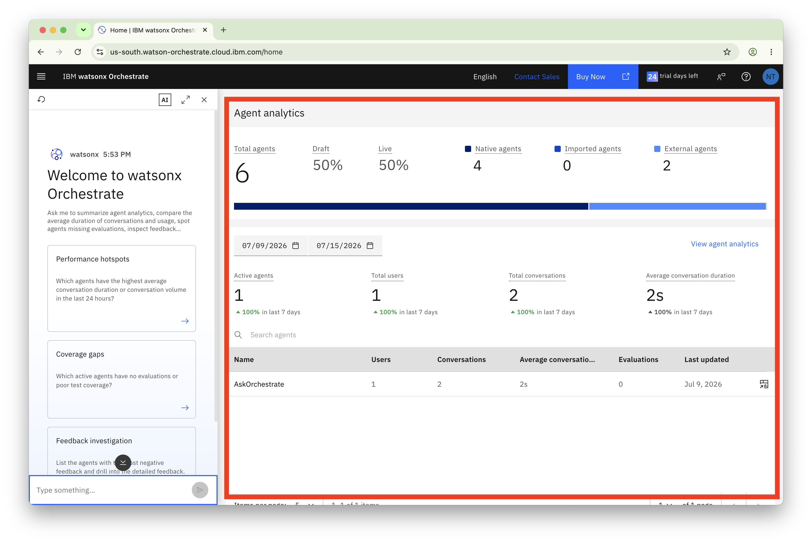

Clique em **View agent analytics**

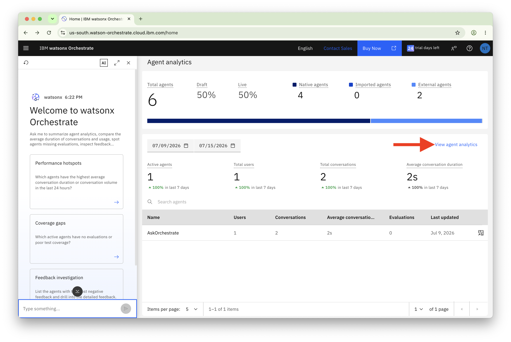

Aqui o Orchestrate permite ter visão detalhada de como os agentes e workflows estão se comportando.

Na linha de filtros, é possível controlar o que aparece no painel:

All agents: Seletor para escolher se você quer ver todos os agentes ou um específico.
Last 24 hrs: O período analisado (aqui, últimas 24 horas). É por isso que a URL termina em timeRange=past-24-hours.

O ícone de atualizar (recarregar os dados) à direita

**Métricas principais (cards do topo)**

Três indicadores-resumo do período:

Total conversations: Total de conversas realizadas.
Unique users: Quantos usuários distintos interagiram.
Avg conversation duration: Duração média de cada conversa.

**Agent trend**

Temos gráfico de barras para comparação dos agentes entre si. No topo dele há dois seletores: Top 5 (mostra os 5 principais) e Conversations (a métrica usada para ordenar — poderia ser trocada por outra, como duração).

Cada agente aparece com o número de conversas como na imagem a seguir.

Os ícones no canto do gráfico permitem ver os dados em formato de tabela, expandir o gráfico e acessar mais opções.

**User Feedback**
Para acompanhar o feedback dos usuários para cada agente

Agents — nome do agente (em azul, clicável para ver detalhes).
Thumbs down 👎 — quantidade de avaliações negativas.
Thumbs up 👍 — quantidade de avaliações positivas.

----

Selecione o último agente criado por você

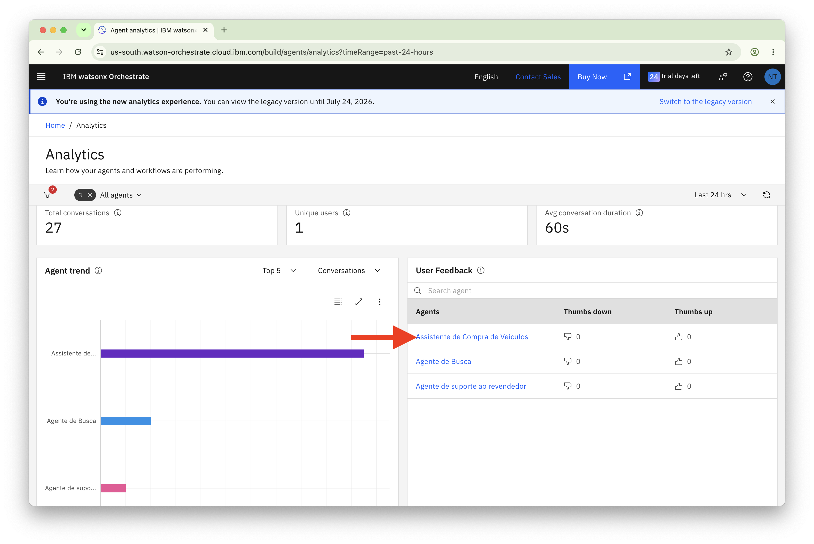

Ao selecionar um agent específico, você abrirá a visualização do agent builder e poderá inspecionar sua configuração. Ao fazer isso, você passa dos insights do Control Plane para o próprio agent. 

Essa é a página de análise de um agente específico, você chegou aqui clicando no nome do agente na tela de Analytics anterior. É o nível mais aprofundado do monitoramento.

O breadcrumb agora mostra três níveis: Home / Analytics / Assistente de Compra de Veículos , deixando claro o caminho percorrido até o detalhe do agente. 

Logo em seguida há duas abas:

- Overview (selecionada) — a visão geral com todas as métricas.
- Conversations — Onde você pode inspecionar as conversas individuais desse agente.

E, como nas telas anteriores, o filtro de período Last 24 hrs e o botão de atualizar continuam disponíveis.

**Métricas principais (cards do topo)**
Aqui aparecem mais indicadores do que na tela geral, porque agora o foco é um único agente. São seis cards:

- Total conversations: Total de conversas desse agente.
- Input token count: Quantidade de tokens recebidos (o que os usuários enviaram + o contexto processado). 
- Output token count: Tokens gerados pelo agente nas respostas.
- Unique users: Usuários distintos que interagiram.
- Avg conversation duration: Duração média de cada conversa.
- Avg message latency: Tempo médio que o agente leva para responder cada mensagem (indicador de velocidade/performance).

**Os tokens e a latência ajudam a avaliar eficiência e custo do agente, não só uso.**

**Usage trend (gráfico à esquerda)**: Mostra a tendência de uso ao longo do tempo, medida em número de mensagens por dia. 

**User feedback (painel central)**: Aqui aparece o feedback dos usuários em forma de gráfico, com a legenda Thumbs up (roxo) e Thumbs down (azul). 

**Evaluation (painel à direita)** Essa é uma funcionalidade serve para avaliar a qualidade das respostas do agente segundo critérios automáticos, como Toxicity (toxicidade), que verifica se o agente gerou conteúdo inadequado/ofensivo. 

Como não temos dados suficientes nesse momento, aparece "No toxicity data available". Esse seletor normalmente permite escolher outras dimensões de avaliação além de toxicidade.

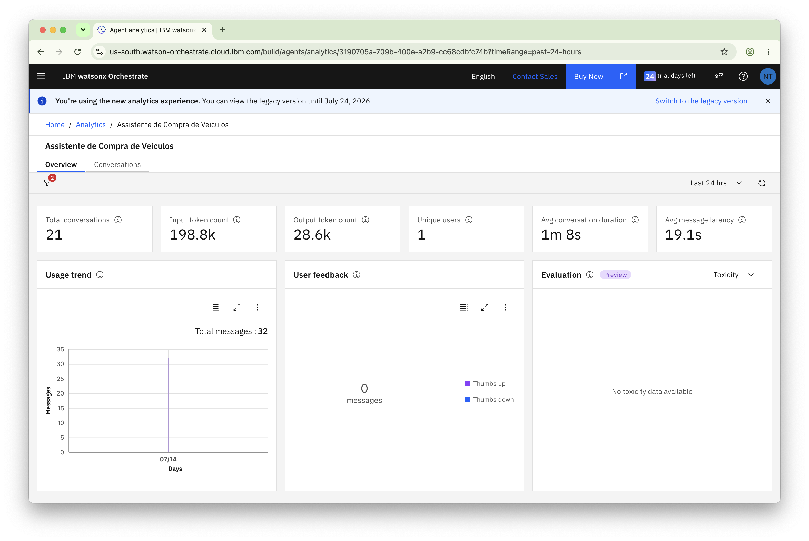

Clique na aba `Conversations`

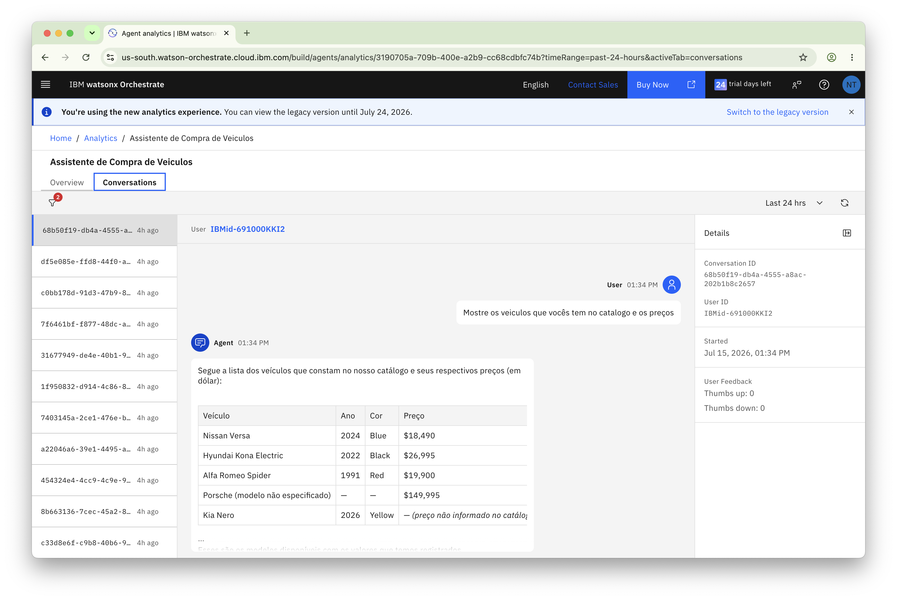

Essa é a aba Conversations do mesmo agente, é o nível mais granular do monitoramento: Aqui você não vê mais números agregados, mas sim cada conversa individual, mensagem por mensagem.

**Coluna da esquerda: Lista de conversas**

É a lista de todas as conversas do agente no período. Cada item mostra um ID único da conversa (ex: 68b50f19-db4a-4555-a...) e há quando aconteceu ("4h ago"). A primeira está selecionada (destacada com a barra azul à esquerda). Clicando em qualquer uma delas, o conteúdo aparece na coluna central. É como uma _caixa de entrada de e-mails_ de todas as interações que os usuários tiveram com esse agente.

**Coluna central: A transcrição da conversa**

Aqui aparece o diálogo completo da conversa selecionada, no formato de chat. No topo indica o usuário que participou, e o histórico de mensagens.

Essa é uma parte valiosa: você consegue ler exatamente o que o usuário perguntou e como o agente respondeu, verificando se a resposta foi correta, completa e bem formatada.

**Coluna da direita: Detalhes **

Um painel com os metadados da conversa selecionada:

- Conversation ID: o identificador único completo.
- User ID: Quem interagiu 
- Started : Quando começou
- User Feedback: Thumbs up: / Thumbs down: 0

Clique no ícone da _joaninha_, como indicado na imagem abaixo:

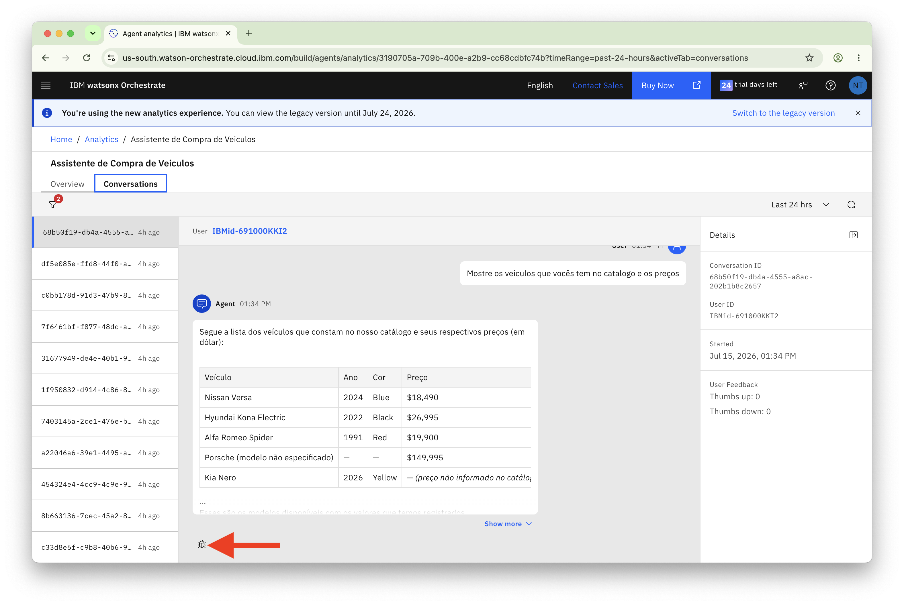

Essa é a tela de Debug de um agente.

1.  São os diferentes componentes que podem aparecer no fluxo, cada um com seu próprio ícone:

- User input: ponto de entrada, onde a mensagem do usuário chega.
- Agent: O agente que orquestra as tarefas.
- LLM: chamada a um modelo de linguagem.
- Tool: Função externa que o agente pode acionar.
- API: endpoint HTTP/REST.
- Knowledge base — Busca por informação em uma base de conhecimento, seja feita no próprio Orchestrate como utilizando bancos vetoriais.
- Workflow: Processo de várias etapas.
- Answer: Nó de resposta final.

2. Para retornar para o node anterior

3. Para avançar para o próximo node

4. ID único da conversa

5. Executar novamente para recarregar/reexecutar o trace.

6. Alternar a visualização do fluxo, mudando o layout do gráfico e realça o caminho que foi realmente percorrido na execução.

7. Reorganiza o diagrama num layout de árvore horizontal (da esquerda para a direita), exibindo a hierarquia dos nós de forma mais limpa e alinhada. É uma forma alternativa de visualizar o mesmo fluxo.

8. Mostra uma visão geral do nó selecionado, com os principais dados de forma resumida (por exemplo, o texto do input do usuário).

9.  Input: Mostra os dados de entrada que o nó recebeu, ou seja, o que chegou até ele para ser processado.

10.  Output: Mostra os dados de saída que o nó gerou, ou seja, o resultado do processamento.

11. Logs (Node logs): Mostra os registros técnicos detalhados daquele nó, úteis para depurar e entender o que aconteceu internamente em cada passo.

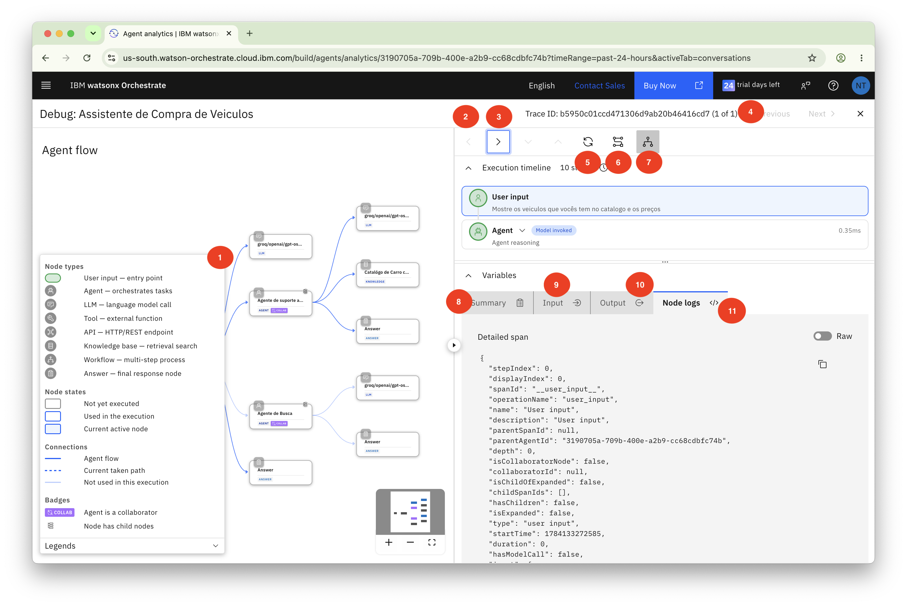

Clique no ícone de alterar a visualização do fluxo, nomeado como 6 na imagem anterior.

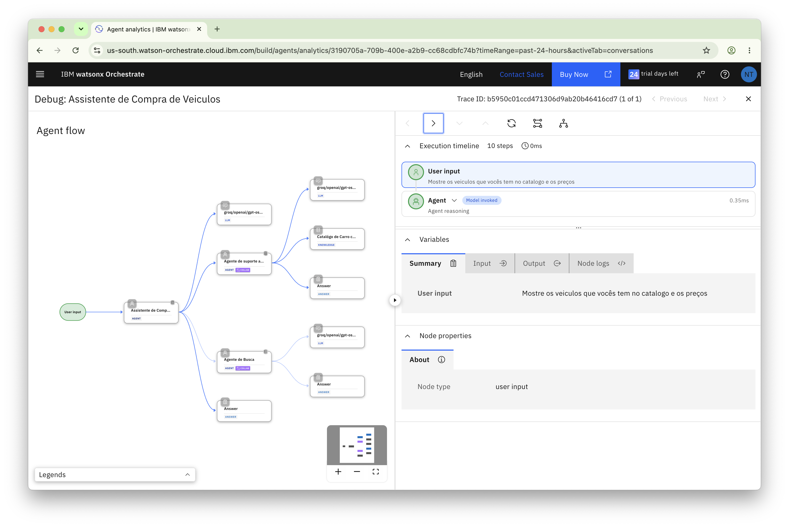

Ao ativar esse ícone, o diagrama passa a realçar em azul apenas o caminho que a execução realmente percorreu, enquanto os nós e conexões que não foram usados ficam apagados.

No exemplo vemos isso claramente: o caminho ativo, em azul forte, vai de User input → Assistente de Compra → Agente de suporte, que então aciona o LLM (groq/openai/gpt-os...), a base de conhecimento (Catálogo de Carros) e o nó de Answer. Já o ramo do Agente de Busca e seus nós filhos aparecem quase transparentes, indicando que aquele caminho não foi seguido nesta execução.

Essa visualização é útil para você enxergar rapidamente por onde a requisição passou de fato, sem se distrair com os nós que existem no fluxo mas não participaram daquela execução específica. Em vez de precisar analisar o diagrama inteiro, você foca apenas no trajeto real, o que ajuda muito na hora de investigar o comportamento do agente para fazer um _debug_ de um problema.

Clique no ícone de reorganização, nomeado como item 7 na imagem explicativa da página

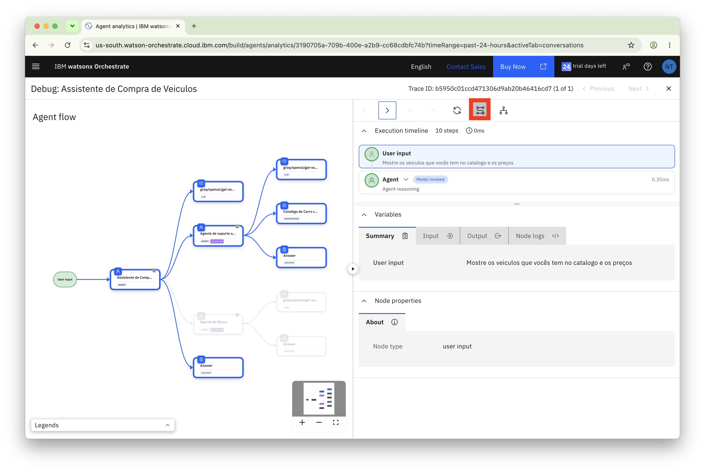

Ao ativar esse ícone, o diagrama é reorganizado num layout de árvore horizontal, com os nós dispostos da esquerda para a direita em colunas bem alinhadas.

Repare na diferença em relação às visualizações anteriores: aqui o fluxo aparece mais limpo e hierárquico, seguindo uma sequência clara:

`User input → Assistente de Compra → Agente de suporte → LLM / Catálogo de Carros / Answer`

Com os nós de cada nível organizados em uma mesma coluna vertical. O gráfico fica mais compacto e fácil de acompanhar.

 O layout em árvore é especial quando o diagrama tem muitos nós, porque distribui os elementos de maneira mais ordenada e evita que as conexões fiquem confusas ou sobrepostas. Você escolhe o modo de visualização que ficar mais legível para o que quer analisar naquele momento.

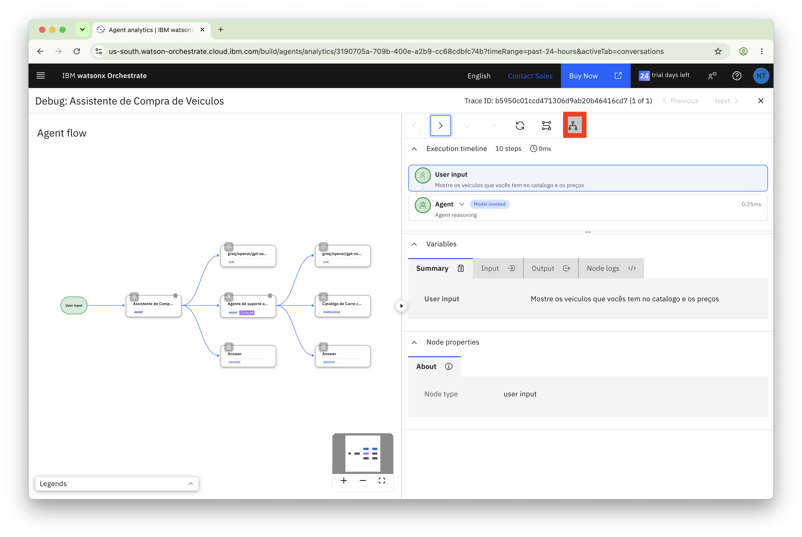

Ao clicar na aba `Input` (com o passo User input selecionado na imagem abaixo), o painel abaixo passa a mostrar os dados de entrada que aquele nó recebeu.

Em vez do resumo, aparecem os campos Request e Message, ambos com o texto "Mostre os veículos que vocês têm no catálogo e os preços" — ou seja, exatamente o que chegou até o nó para ser processado.

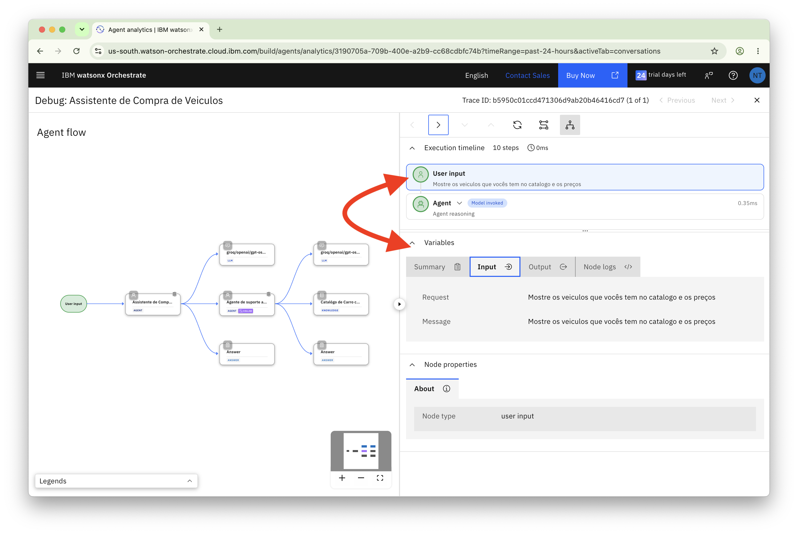

Quando o passo `Agent` é clicado, ele se expande e revela os sub-passos internos que o agente executou: 

- Agent reasoning (raciocínio)
- Collaborator: Agente de suporte ao revendedor (a chamada ao colaborador)
-  Agent processing (processamento) 
-  Answer (preparando a resposta), cada um com seu tempo de execução. Assim você vê a sequência real de ações do agente.
- 
E ao clicar na aba `LLM Model` (em Node properties), o painel mostra qual modelo de linguagem está por trás desse agente.

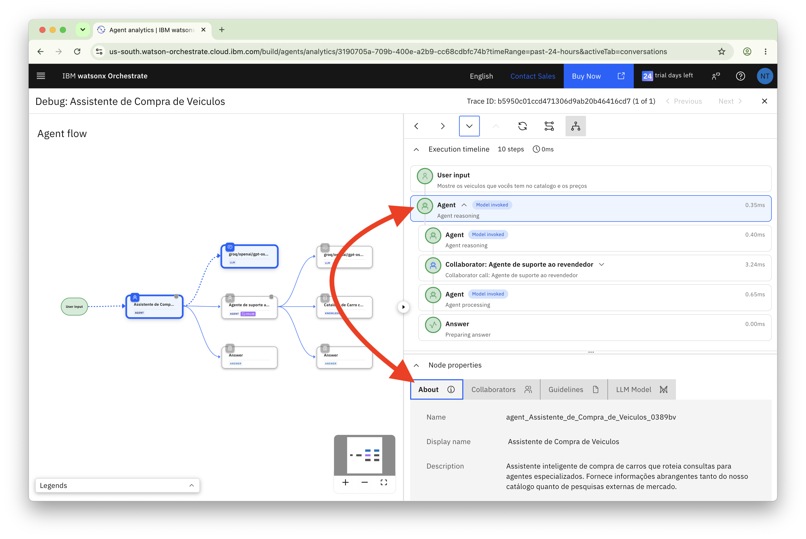

Com o passo Agent ainda selecionado, ao clicar em `About` (em Node properties), o painel mostra os dados de identificação do agente:

- Name: Nome técnico interno do agente
-  Display name: Nome do agente  
-  Description: Explicação sobre o agente definida ou atualizada na hora de seu desenvolvimento

Clique no ícone de `X` da interface do Orchestrate para retornar à página inicial

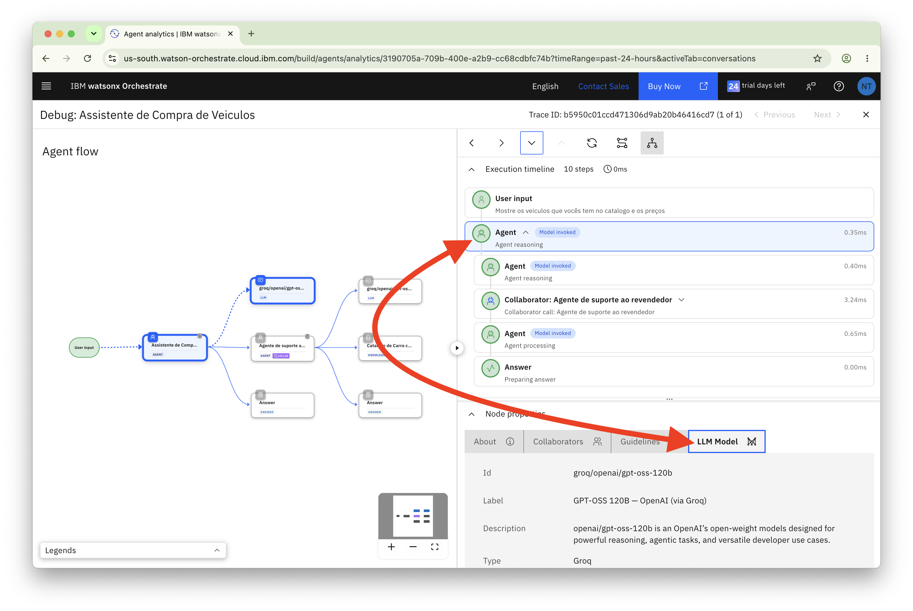

Navegue até a seção de `Platform analytics`

Na seção `Control`, clique em `View all`

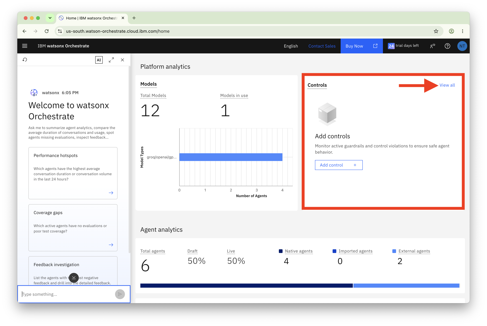

Essa é a página de Controls (controles) do Orchestrate. Os controles servem para definir e governar o comportamento dos seus ativos de IA Agêntica.

Você pode aplicá-los no nível de ativo (para agentes, modelos e ferramentas MCP) ou no nível empresarial (afetando toda a instância, através de políticas, guardrails e comportamentos da plataforma)

Há duas abas:

-  Asset Controls (selecionada — controles por ativo)
-  Enterprise Controls (controles empresariais)

O Orchestrate permite também visualizar as informações abaixo:

- Total number of controls: 0 — o número total de controles criados na instância.

- Agents with Controls: 0 — quantos agentes têm algum controle aplicado a eles.

- Models with Controls: 0 — quantos modelos têm algum controle aplicado.
- 
- MCP Tools with Controls: 0 — quantas ferramentas MCP têm algum controle aplicado.

Todos aparecem zerados porque nenhum controle foi criado ainda. Conforme os controles forem sendo criados para seus ativos, esses números serão atualizados para refletir a cobertura de governança da instância.

Como não existe nenhum controle, aparece a mensagem "Get started with controls", explicando que os controles ajudam a impor regras que governam como agentes, modelos e ferramentas MCP se comportam.

Clique no botão `Create Control`

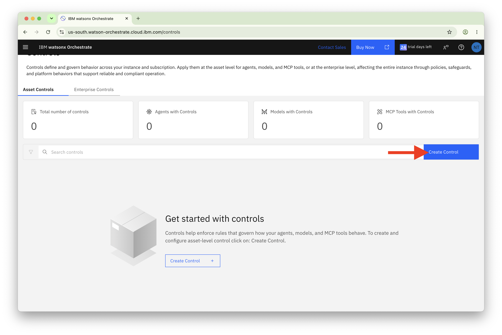

Nessa janela _pop-up_ vamos criar um controle. Temos diversos tipos de controles disponíveis para aplicar tanto em agentes, tools e modelos.

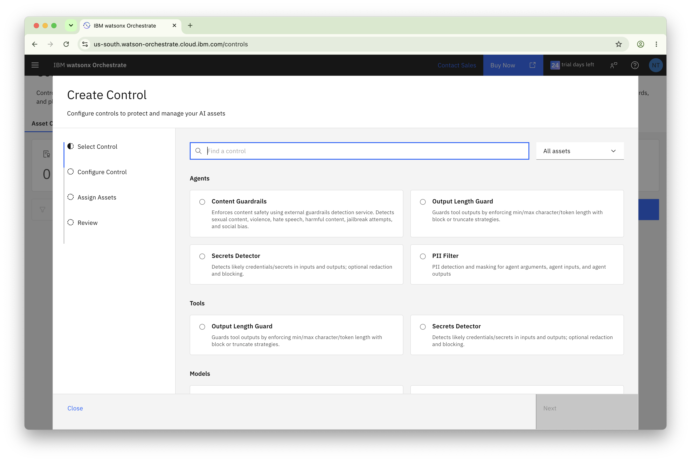

1. Selecione `Content Guardrails` para testar uma das opções disponíveis.

2. Em seguida, clique em `Next`

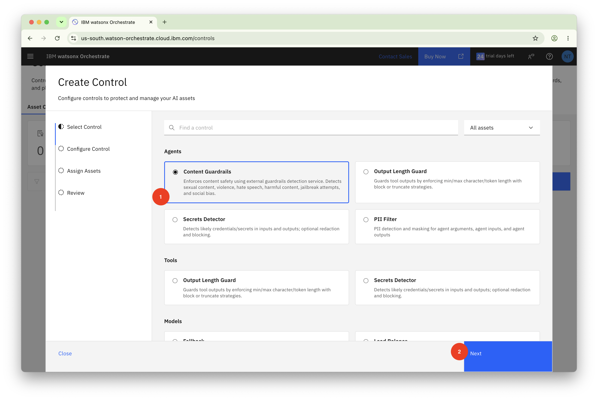

1. Dê um nome ao controle. Digite um nome que identifique o controle. No exemplo foi usado Controle_de_palavras_de_baixo_calão.

2. (Opcional) Adicione uma descrição. No campo Control instance description, você pode escrever uma breve explicação do que esse controle faz. É opcional, então pode deixar em branco.

3. Escolha o tipo de aplicação (Enforcement type). Marque onde o controle deve atuar (campo obrigatório, indicado pela segunda seta vermelha):

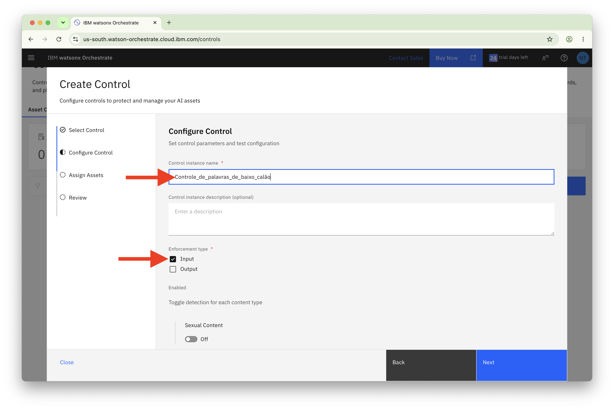

Ainda na etapa Configure Control, ao rolar a tela para baixo você encontra a seção "Toggle detection for each content type" (ativar detecção para cada tipo de conteúdo).

Aqui aparecem os tipos de conteúdo que o controle Content Guardrails pode detectar, cada um com um botão de alternância (toggle):

- Sexual Content (conteúdo sexual)
- Violence (violência)
- HAP (conteúdo de ódio, abuso e palavrões — Hate, Abuse and Profanity)
- Harm (conteúdo nocivo)
- Jailbreak (tentativas de burlar as regras do modelo)
- Social Bias (viés social/preconceito)

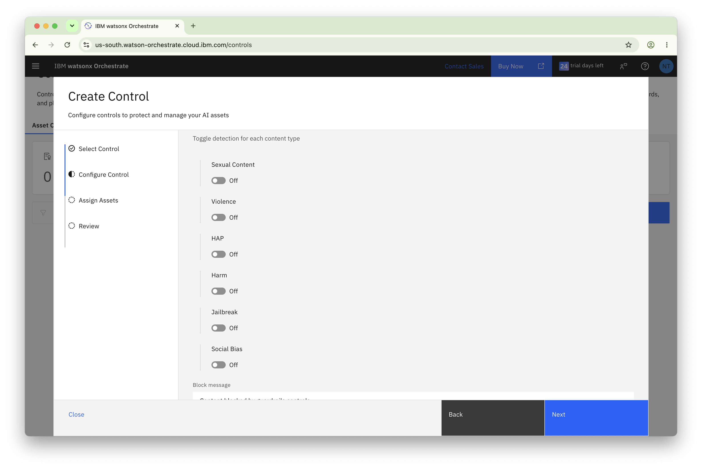

1. Ative os tipos de conteúdo.

2. Block message, você digita o texto que o usuário verá quando o conteúdo dele for bloqueado pelo controle. 

No exemplo foi escrito: `Esse conteúdo não é apropriado para esta conversa. Peço que mantenhamos uma comunicação respeitosa e construtiva. Estou aqui para ajudar da melhor forma possível e fornecer suporte adequado às suas necessidades`

Utilize a mesma mensagem copiando e colando no campo, ou escreva uma de sua preferência.

3. Clique em `Next`

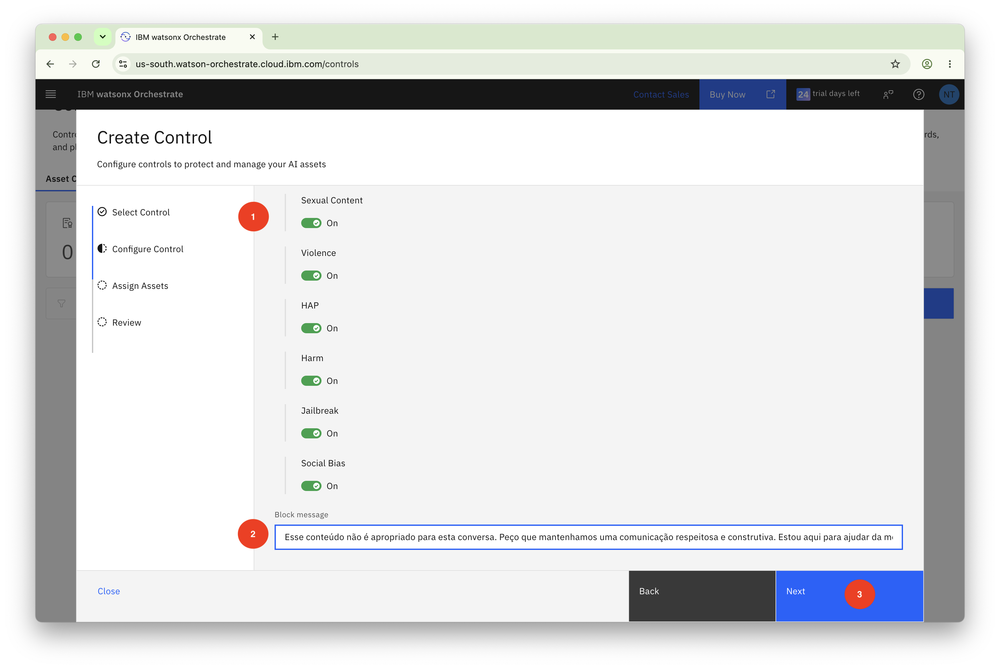

Clique em `Add agent` para criar o guardrail em um agente

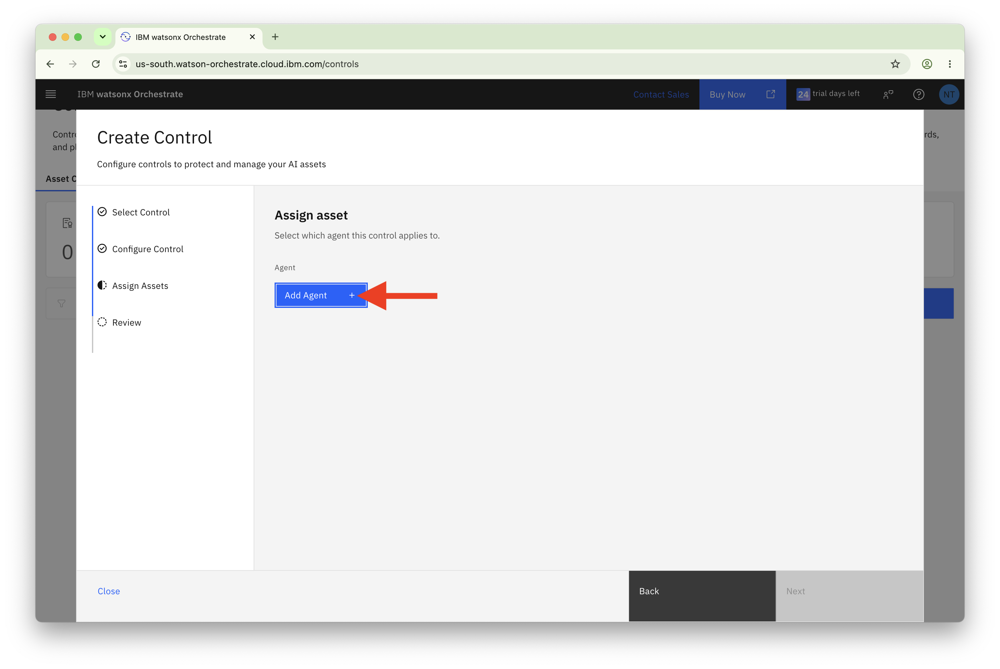

1. Selecione um agente criado por você, como por exemplo, o agente orquestrador que foi criado no último laboratório de criação de agentes

2. Clique em `Select`

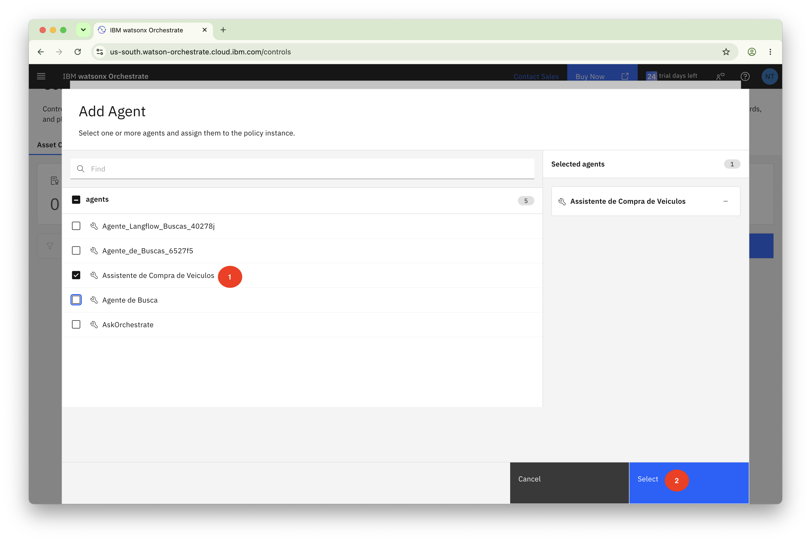

Clique em `Next`

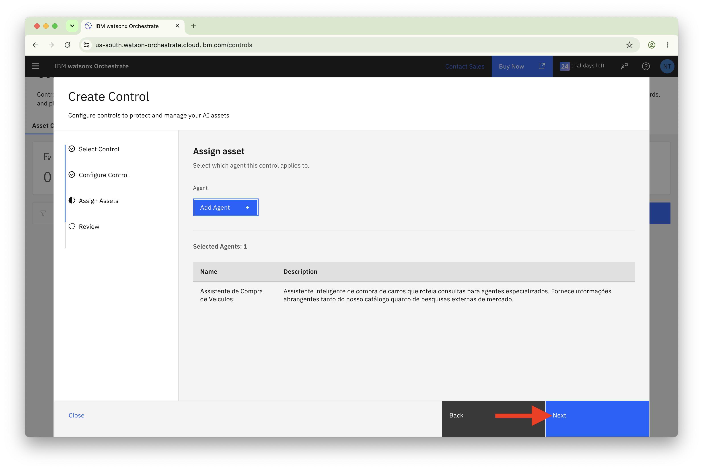

Você chegou à última etapa. Aqui o objetivo é conferir toda a configuração antes de criar o controle.

Revise tudo que foi criado e em seguida, clique em `Create control`

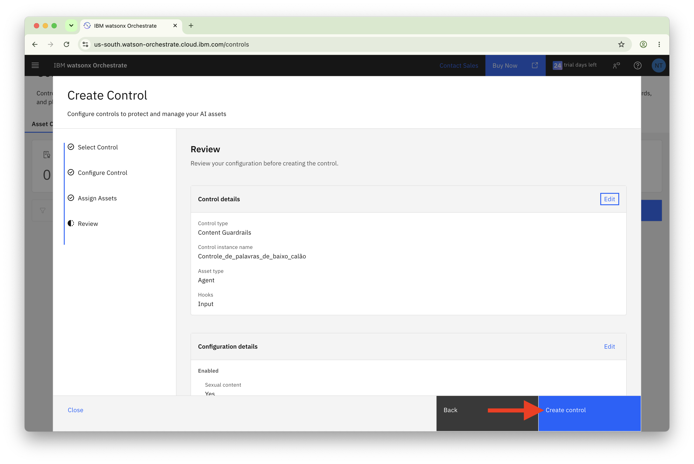

De volta à página de Controle, note a notificação verde "Control created successfully" (controle criado com sucesso), confirmando que deu tudo certo.

Repare que agora os cards de resumo no topo foram atualizados com a nova criação do controle.

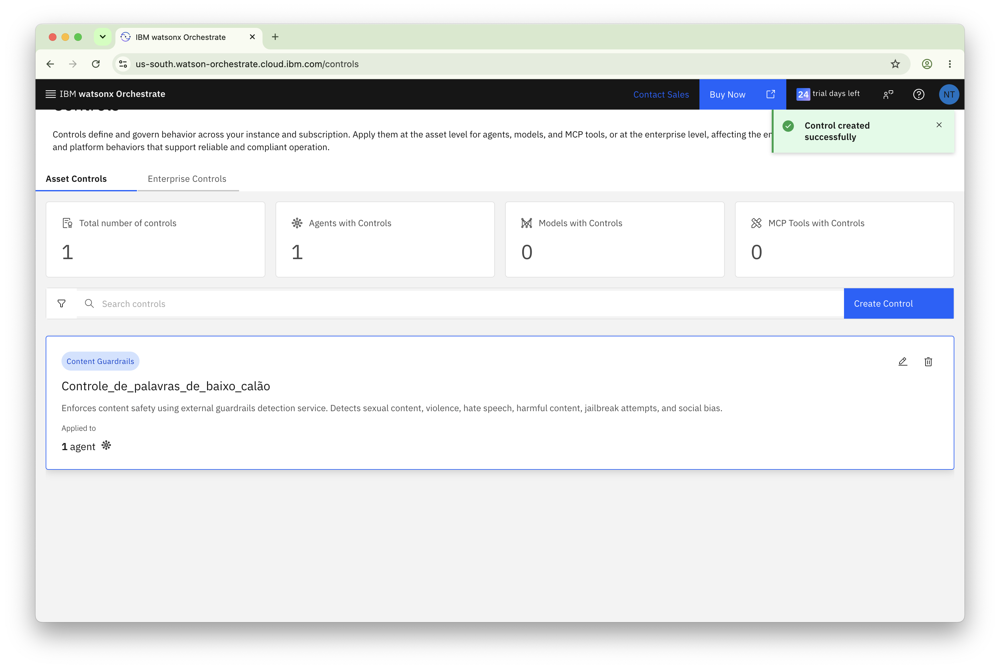

Clique na aba **Enterprise Controls**

Há também uma série de enterprise controls disponíveis. Não entraremos em detalhes sobre eles neste lab, mas você pode dar uma rápida olhada para ver o que está disponível!

Primeiro, clique em **Enterprise Controls** e revise os diferentes tipos de enterprise controls disponíveis:

**Data retention** O controle de data retention permite gerenciar a retenção de dados, especificando por quanto tempo o histórico de chats dos usuários neste tenant do wxO deve ser mantido (o padrão é 30 dias), após o qual será automaticamente excluído. Observe que todo o histórico de chats será excluído após 365 dias.

**Network** Você pode definir o acesso à rede especificando quais endereços IP podem acessar seu sistema (restrições de rede de entrada) e quais destinos externos seu sistema pode se conectar (restrições de rede de saída).

**Analytics** Este enterprise control ajuda a gerenciar como o analytics é coletado e exibido para seu tenant em dashboards, logs ou relatórios. Essas configurações ajudam a controlar quais informações são capturadas para que sua equipe possa obter insights úteis enquanto permanece alinhada às suas necessidades de privacidade e tratamento de dados. Você pode habilitar _Enable PII Masking_ para proteger dados potencialmente sensíveis, mascarando informações de identificação pessoal (PII) comuns nos metadados de trace. Quando o mascaramento está habilitado, inputs dos usuários e outputs dos agents permanecem visíveis, enquanto atributos sensíveis detectados — como e-mails e números de telefone — são mascarados antes de aparecer em dashboards, logs ou relatórios.

Retorne à aba `Asset control`

Clique no ícone de hambúrguer ao lado esquerdo da tela, escolha `Build`

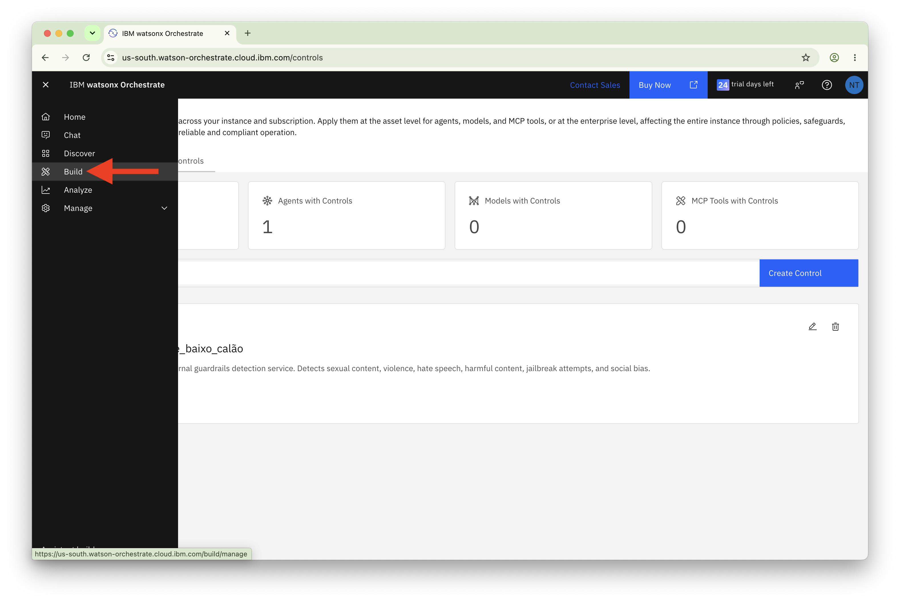

Escolha o agente que teve o controle aplicado

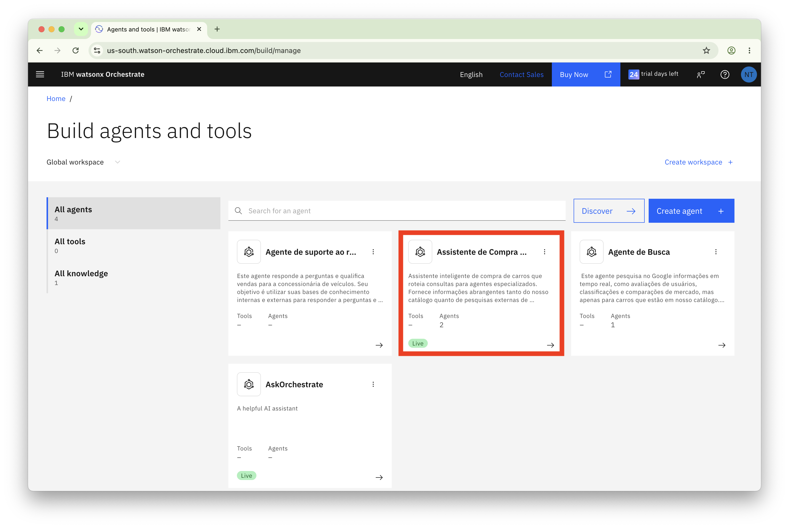

Envie uma pergunta extremamente ofensiva e de baixo calão para ver o guardrail recém-criado operando no agente.

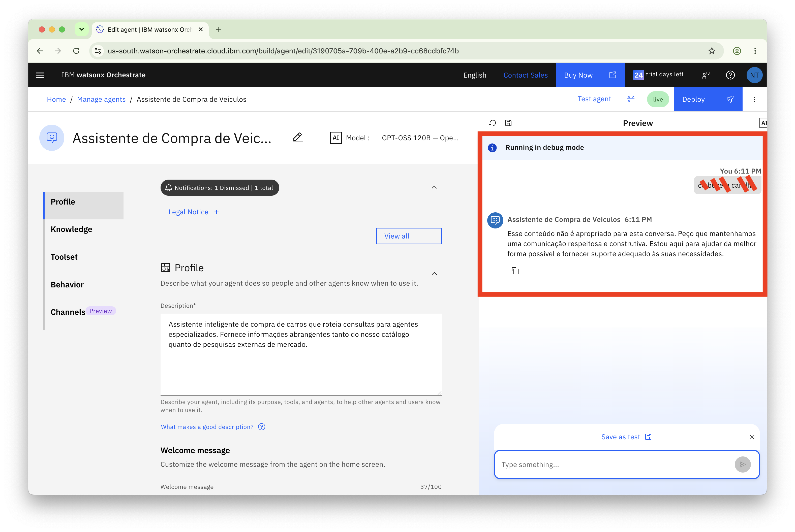

### Sou desenvolvedor e quero me aprofundar no watsonx Orchestrate

Todas as operações realizadas também estão disponíveis em uma experiência utilizando o ADK (Agent Development Kit), [clique aqui](https://developer.watson-orchestrate.ibm.com/) para saber mais como criar agentes, tools, bases de conhecimentos e muito mais

## Resumo

Controlar agents de IA empresariais exige mais do que um único dashboard. Requer visibilidade, governança, observabilidade, depuração, analytics e investigação assistida por IA em todo o ambiente de agents.

Com o Control Plane, as equipes podem passar de sinais dispersos para um controle centralizado, ajudando as empresas a gerenciar agents com maior confiança, clareza e segurança em escala.

**Parabéns por concluir o lab do Agentic Control Plane!**

---

## Próximos passos

Coletânea de links oficiais, documentação, tutoriais e novidades da IBM watsonx Orchestrate e do Agent Development Kit (ADK).

> Última atualização da coletânea: 15/07/2026.

| Recurso | Link |
|---|---|
| Portal oficial da ADK (Welcome) | https://developer.watson-orchestrate.ibm.com/ |
| O que é a ADK | https://developer.watson-orchestrate.ibm.com/getting_started/what_is |
| Instalação / primeiros passos | https://developer.watson-orchestrate.ibm.com/getting_started/installing |
| Comandos CLI úteis | https://developer.watson-orchestrate.ibm.com/getting_started/cli |
| Exemplos | https://developer.watson-orchestrate.ibm.com/getting_started/examples |
| Índice completo da doc (`llms.txt`) | https://developer.watson-orchestrate.ibm.com/llms.txt |

---

<b>Repositórios e pacotes</b>

| Recurso | Link |
|---|---|
| GitHub — `IBM/ibm-watsonx-orchestrate-adk` | https://github.com/IBM/ibm-watsonx-orchestrate-adk |
| PyPI — `ibm-watsonx-orchestrate` | https://pypi.org/project/ibm-watsonx-orchestrate/ |

---

<b>Agentes</b>

| Tópico | Link |
|---|---|
| Visão geral de agentes | https://developer.watson-orchestrate.ibm.com/agents/overview |
| Criando agentes nativos | https://developer.watson-orchestrate.ibm.com/agents/build_agent |
| Escolhendo o estilo do agente (ReAct, Flows, etc.) | https://developer.watson-orchestrate.ibm.com/agents/agent_styles |
| Conectar agentes externos (LangGraph, A2A) | https://developer.watson-orchestrate.ibm.com/agents/connect_agent |
| Importar e implantar agentes | https://developer.watson-orchestrate.ibm.com/agents/import_agent |
| Descrições e instruções de agentes | https://developer.watson-orchestrate.ibm.com/agents/descriptions |
| Gerenciar agentes | https://developer.watson-orchestrate.ibm.com/agents/manage_agent |
| Skills specifications (Public Preview) | https://developer.watson-orchestrate.ibm.com/agents/skills |

---

<b>Ferramentas (Tools) e Toolkits</b>

| Tópico | Link |
|---|---|
| Visão geral de tools | https://developer.watson-orchestrate.ibm.com/tools/overview |
| Tools em Python | https://developer.watson-orchestrate.ibm.com/tools/create_tool |
| Tools baseadas em OpenAPI | https://developer.watson-orchestrate.ibm.com/tools/create_openapi_tool |
| Gerenciamento de dependências Python | https://developer.watson-orchestrate.ibm.com/tools/python_dependency_management |
| Estrutura de resposta e anotações de tools | https://developer.watson-orchestrate.ibm.com/tools/tool_response_structure |
| Logs de tools Python | https://developer.watson-orchestrate.ibm.com/tools/log_behavior |
| Toolkits — visão geral | https://developer.watson-orchestrate.ibm.com/tools/toolkits/overview |
| Toolkits MCP remotos | https://developer.watson-orchestrate.ibm.com/tools/toolkits/remote_mcp_toolkits |
| Toolkits MCP locais | https://developer.watson-orchestrate.ibm.com/tools/toolkits/local_mcp_toolkits |
| Toolkits Python | https://developer.watson-orchestrate.ibm.com/tools/toolkits/python_toolkits |

---

<b>Agentic Workflows (Flows)</b>

| Tópico | Link |
|---|---|
| Entendendo agentic workflows | https://developer.watson-orchestrate.ibm.com/tools/flows/overview |
| Construindo um flow | https://developer.watson-orchestrate.ibm.com/tools/flows/building_flow |
| Mapeamento de entrada/saída | https://developer.watson-orchestrate.ibm.com/tools/flows/data_map |
| Nó de decisões (Public Preview) | https://developer.watson-orchestrate.ibm.com/tools/flows/decisions_node |
| Tratamento de erros | https://developer.watson-orchestrate.ibm.com/tools/flows/error_handling |
| Atividades multiusuário | https://developer.watson-orchestrate.ibm.com/tools/flows/multi_user |
| Mascaramento de dados sensíveis | https://developer.watson-orchestrate.ibm.com/tools/flows/masking_sensitive_data |
| Scheduler (Public Preview) | https://developer.watson-orchestrate.ibm.com/tools/flows/scheduler |
| Rodar workflows via MCP (Public Preview) | https://developer.watson-orchestrate.ibm.com/tools/flows/mcp_workflows |
| Testando um flow | https://developer.watson-orchestrate.ibm.com/tools/flows/testing_flow |

---

<b>MCP Server (Model Context Protocol)</b>

| Tópico | Link |
|---|---|
| Instalando o ADK MCP Server | https://developer.watson-orchestrate.ibm.com/mcp_server/wxOmcp_installation |
| Configurando o ADK MCP Server | https://developer.watson-orchestrate.ibm.com/mcp_server/wxOmcp_configuration |
| Conectando clientes MCP | https://developer.watson-orchestrate.ibm.com/mcp_server/wxOmcp_integration |
| Documentation MCP Server | https://developer.watson-orchestrate.ibm.com/mcp_server/wxOmcp_docs_server |

---

<b>Developer Edition (ambiente local)</b>

| Tópico | Link |
|---|---|
| O que é a Developer Edition | https://developer.watson-orchestrate.ibm.com/developer_edition/wxOde_overview |
| Instalando a Developer Edition | https://developer.watson-orchestrate.ibm.com/developer_edition/wxOde_setup |
| Gerenciando o servidor local | https://developer.watson-orchestrate.ibm.com/developer_edition/manage_local_server |
| Gerenciando a UI local | https://developer.watson-orchestrate.ibm.com/developer_edition/manage_ui |
| Ambiente air-gapped | https://developer.watson-orchestrate.ibm.com/environment/air_gap_environment |
| Boletins de segurança | https://developer.watson-orchestrate.ibm.com/developer_edition/security_bulletins |

<b>Modelos (LLMs)</b>

| Tópico | Link |
|---|---|
| Escolhendo o LLM | https://developer.watson-orchestrate.ibm.com/llm/getting_started_llm |
| Gerenciando modelos virtuais | https://developer.watson-orchestrate.ibm.com/llm/managing_llm |
| Políticas de modelo (Public Preview) | https://developer.watson-orchestrate.ibm.com/llm/model_policies |
| Observabilidade com Langfuse | https://developer.watson-orchestrate.ibm.com/llm/observability |

---

<b>SDK (Python)</b>

| Tópico | Link |
|---|---|
| Introdução ao SDK | https://developer.watson-orchestrate.ibm.com/sdk/sdk_intro |
| Client | https://developer.watson-orchestrate.ibm.com/sdk/client |
| Context | https://developer.watson-orchestrate.ibm.com/sdk/context |
| Memory | https://developer.watson-orchestrate.ibm.com/sdk/memory |
| Chat models | https://developer.watson-orchestrate.ibm.com/sdk/chat_wxo |
| Embeddings | https://developer.watson-orchestrate.ibm.com/sdk/wxo_embeddings |

---

<b>Avaliação (Evaluation) e Observabilidade</b>

| Tópico | Link |
|---|---|
| Visão geral de avaliação | https://developer.watson-orchestrate.ibm.com/evaluate/overview |
| Avaliando agentes e tools | https://developer.watson-orchestrate.ibm.com/evaluate/evaluate |
| Criando dataset de avaliação | https://developer.watson-orchestrate.ibm.com/evaluate/create_data |
| Avaliação rápida | https://developer.watson-orchestrate.ibm.com/evaluate/quick_eval |
| Rubric Evaluations | https://developer.watson-orchestrate.ibm.com/evaluate/rubric |
| Teste de vulnerabilidade de LLM | https://developer.watson-orchestrate.ibm.com/evaluate/llm_vulnerability |
| Traces — visão geral | https://developer.watson-orchestrate.ibm.com/traces/overview |
| Traces via CLI | https://developer.watson-orchestrate.ibm.com/traces/traces_with_cli |
| Traces via Python | https://developer.watson-orchestrate.ibm.com/traces/traces_with_python |

---

<b> Knowledge Bases, Conexões e Canais</b>

| Tópico | Link |
|---|---|
| Knowledge bases — visão geral | https://developer.watson-orchestrate.ibm.com/knowledge_base/overview |
| Criando knowledge bases | https://developer.watson-orchestrate.ibm.com/knowledge_base/build_kb |
| Por que usar conexões | https://developer.watson-orchestrate.ibm.com/connections/overview |
| Criando conexões | https://developer.watson-orchestrate.ibm.com/connections/build_connections |
| Canais — visão geral (Teams, Slack, WhatsApp, SMS...) | https://developer.watson-orchestrate.ibm.com/channels/overview |
| Adicionando voz a um agente | https://developer.watson-orchestrate.ibm.com/voice/adding_voice_to_agent |
| Configuração de voz | https://developer.watson-orchestrate.ibm.com/voice/managing_voice |
| Plug-ins | https://developer.watson-orchestrate.ibm.com/plugins/plugins |
| Workspaces | https://developer.watson-orchestrate.ibm.com/workspaces/overview |

---

<b>Tutoriais e Guias</b>

| Tutorial | Link |
|---|---|
| Seu primeiro agente (Hello World) | https://developer.watson-orchestrate.ibm.com/tutorials/tutorial_1_hello_world |
| Agente Empower | https://developer.watson-orchestrate.ibm.com/tutorials/tutorial_2_arrows_internal_employees |
| Suporte multilíngue | https://developer.watson-orchestrate.ibm.com/tutorials/tutorial_3_multi_language_support |
| Agente Healthcare Provider | https://developer.watson-orchestrate.ibm.com/tutorials/tutorial_4_healthcare_provider |
| Usando watsonx Orchestrate + BeeAI Framework | https://developer.watson-orchestrate.ibm.com/tutorials/tutorial_beeai_framework |
| Usando watsonx Orchestrate + Langflow | https://developer.watson-orchestrate.ibm.com/tutorials/tutorial_langflow |
| CI/CD — Parte 1 | https://developer.watson-orchestrate.ibm.com/tutorials/ci_cd/deployment-cicd-approach-1 |
| CI/CD — Parte 2 | https://developer.watson-orchestrate.ibm.com/tutorials/ci_cd/deployment-cicd-approach-2 |
| CI/CD — Parte 3 | https://developer.watson-orchestrate.ibm.com/tutorials/ci_cd/deployment-cicd-approach-3 |
| CI/CD — Parte 4 | https://developer.watson-orchestrate.ibm.com/tutorials/ci_cd/deployment-cicd-approach-4 |
| Guia de Performance (geral) | https://developer.watson-orchestrate.ibm.com/tutorials/performance/performance-guide-v2 |
| Tutoriais avançados | https://developer.watson-orchestrate.ibm.com/tutorials/advanced_tutorials |
| Getting Started (IBM Developer) | https://developer.ibm.com/tutorials/getting-started-with-watsonx-orchestrate/ |

---

<b>Documentação oficial do produto </b>

| Recurso | Link |
|---|---|
| Página de desenvolvedores do watsonx Orchestrate | https://www.ibm.com/products/watsonx-orchestrate/developers |
| Construindo agentes com a ADK | https://www.ibm.com/docs/en/watsonx/watson-orchestrate/base?topic=agents-building-using-adk |
| Release notes (SaaS) | https://www.ibm.com/docs/en/watsonx/watson-orchestrate/base?topic=release-notes |
| Release notes (On-premises) | https://www.ibm.com/docs/en/watsonx/watson-orchestrate/base?topic=notes-release-premises |

---

<b>Novidades / "Coisas novas" (2026)</b>

| Item | Link |
|---|---|
| Troubleshooting | https://developer.watson-orchestrate.ibm.com/release/troubleshooting |
| **Agentic Control Plane** (anúncio, jun/2026) | https://www.ibm.com/new/announcements/introducing-the-agentic-control-plane |
| What's new — comunidade (mar/2026) | https://community.ibm.com/community/user/blogs/daiane-camila-bizari2/2026/04/02/whats-new-in-ibm-watsonx-orchestrate |
| "Orchestrate More, Worry Less" (mar/2026) | https://community.ibm.com/community/user/blogs/alan-francis-cheeramvelil/2026/04/12/orchestrate-more-worry-less-whats-new-in-ibm-watso |
| Newsletter técnica (jun/2026) | https://community.ibm.com/community/user/blogs/gustavo-villegas/2026/05/28/watsonx-orchestrate-news-a-touchpoint-june2026 |

> Dica: consulte sempre a página **What's new** para ver a versão mais recente, já que a ADK é atualizada com frequência.

---
