# Adicionando Agentes Externos e Orquestradores com watsonx Orchestrate 

## Índice

- [Adicionando Agentes Externos e Orquestradores com watsonx Orchestrate](#adicionando-agentes-externos-e-orquestradores-com-watsonx-orchestrate)
  - [Índice](#índice)
  - [Visão Geral](#visão-geral)
    - [Parte 1: Conectar Agente de Busca Google de Terceiros](#parte-1-conectar-agente-de-busca-google-de-terceiros)
    - [Parte 2: Criar Agente de Compra de Carros](#parte-2-criar-agente-de-compra-de-carros)
    - [Sou desenvolvedor e quero me aprofundar no watsonx Orchestrate](#sou-desenvolvedor-e-quero-me-aprofundar-no-watsonx-orchestrate)
  - [Próximos Passos](#próximos-passos)

## Visão Geral

Neste laboratório, você irá explorar como conectar e orquestrar múltiplos agentes no watsonx Orchestrate para criar experiências mais inteligentes e completas.

Você aprenderá conceitos fundamentais de arquiteturas multiagentes, integração de agentes externos, descoberta de capacidades e tomada de decisão baseada em contexto, permitindo que cada agente contribua com sua especialidade para resolver as solicitações dos usuários.

> [!NOTE]
> **Pré-requisito:** Este laboratório assume que você já concluiu o [laboratório 1](Step_by_Step_Lab1.md) e criou um agente com a base de conhecimento do catálogo de veículos. O agente criado naquele laboratório será reutilizado aqui como agente responsável pelas consultas ao catálogo.


<h2>⚠️ Atenção <br>

<p>
Este laboratório utiliza agentes externos que não foram desenvolvidos no watsonx Orchestrate. Para as atividades deste exercício, será utilizado um agente criado com o Langflow, integrado ao Orchestrate por meio do protocolo <strong>A2A (Agent-to-Agent)</strong>.
</p>

<p>
Para estabelecer a comunicação entre os agentes, será necessário ter acesso à <strong>URL do agente</strong> e à respectiva <strong>API Key</strong>.
</p>

<p>
Essas credenciais serão fornecidas pelo instrutor. Antes de prosseguir com o laboratório, certifique-se de obtê-las para garantir que todas as etapas possam ser executadas corretamente.
</p>
</h2>

> Para saber mais sobre protocolo de comunicação A2A, clique [aqui](https://www.ibm.com/br-pt/think/topics/agent2agent-protocol)

### Parte 1: Conectar Agente de Busca Google de Terceiros

Agora vamos conectar o agente externo que realiza buscas na web por informações sobre carros, avaliações e dados de mercado.

> [!TIP]
> Este agente usa o protocolo Agent-to-Agent (A2A) para se comunicar com o watsonx Orchestrate. Para ter acesso a esse agente, utilize as credenciais e links que o seu instrutor irá fornecer para você.

1. Clique no link **Manage Agents** no menu no canto superior esquerdo.

2. Clique no botão **Create agent**.

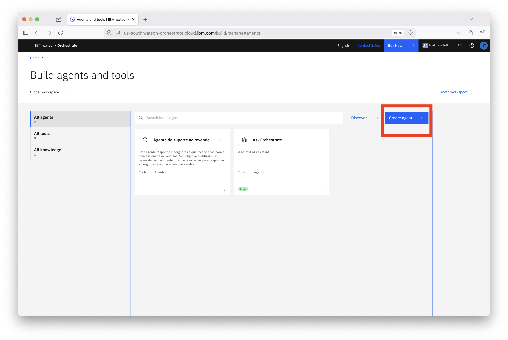

Selecione **Create from scratch**.

Copie e cole as informações em seus respectivos campos:
   
**Name**: ```Agente de Busca```
   
**Description**:
```
Este agente pesquisa no Google informações em tempo real, como avaliações de usuários, classificações e comparações de mercado, mas apenas para carros que estão em nosso catálogo. Não deve fornecer informações sobre veículos não vendidos pela nossa concessionária.
```

Clique no botão **Create**.


Navegue até a seção **Agents**

Vamos adicionar um agente externo, um agente que não foi construído no Orchestrate para uso.

Clique no botão **Add agent**.

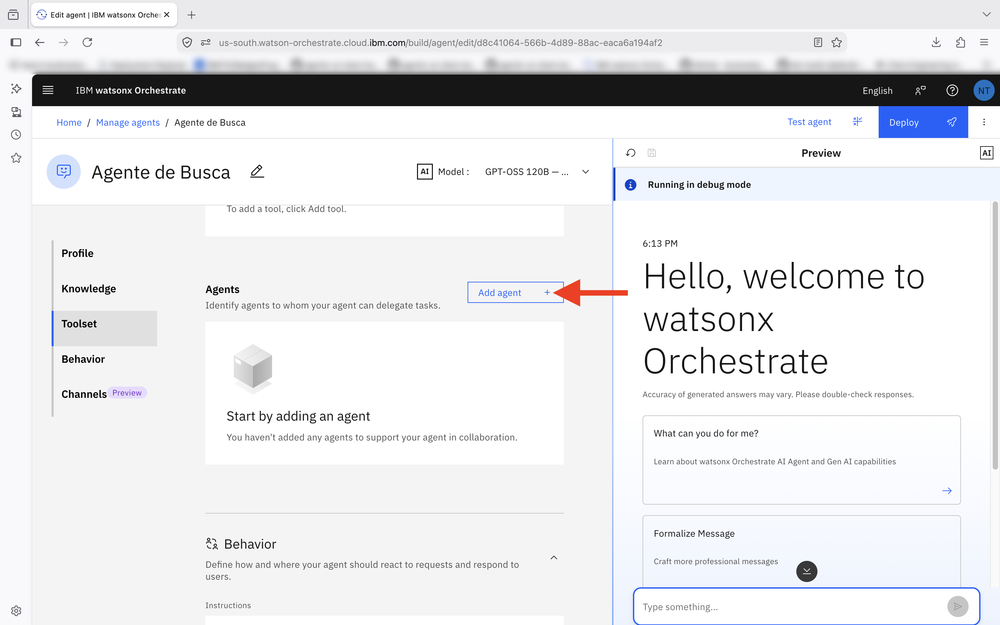

Clique em **Import**

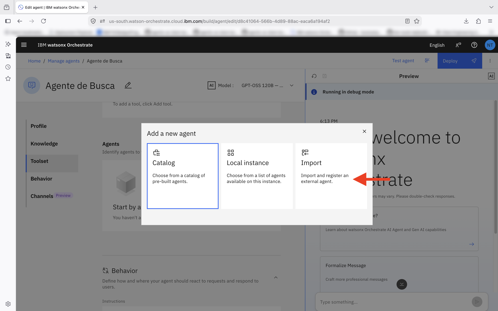

1. No primeiro item, selecione o ícone de _drop down_

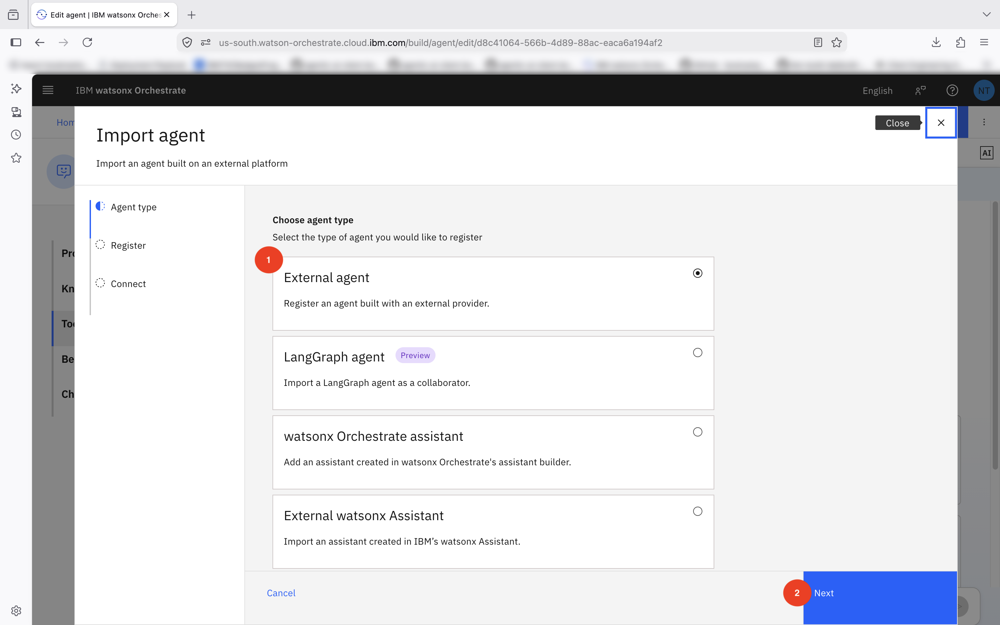

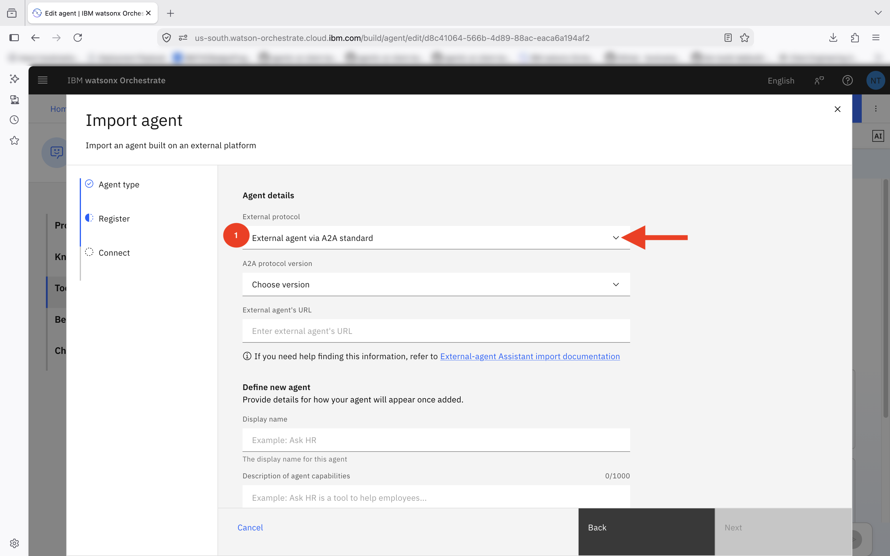

2. Selecione ou mantenha **External agent via A2A standard**.

Há também outras opções para se trabalhar com agentes e assitentes externos no watsonx Orchestrate.

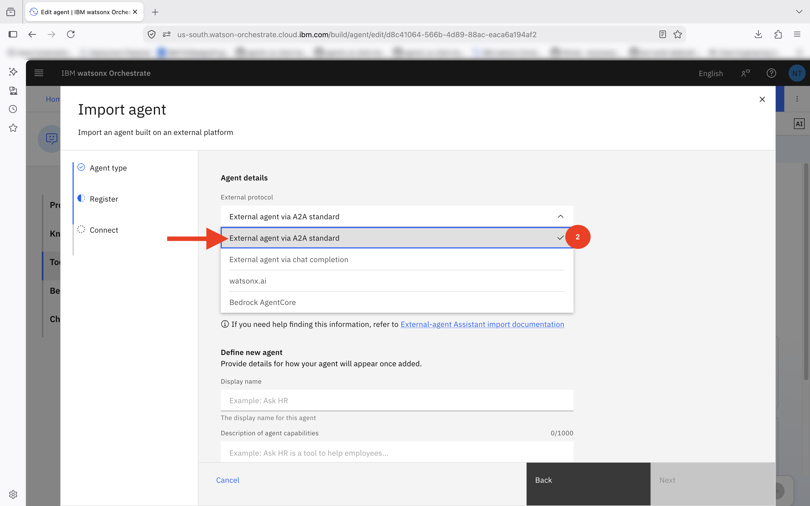

3. Escolha a versão `0.3.0` do tipo de protocolo que estamos trabalhando **A2A**

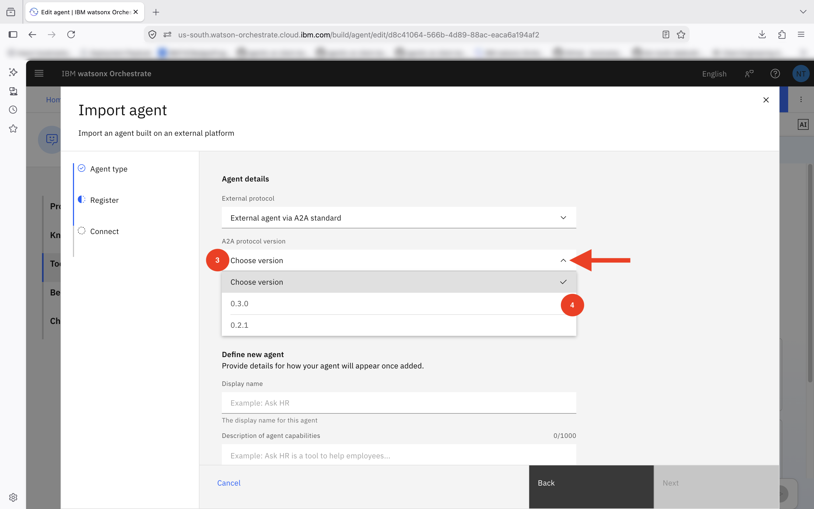

4. O campo **External agent's URL** é o endereço público onde seu agente externo está rodando. É por essa URL que o watsonx Orchestrate vai buscar o *Agent Card* (o documento que descreve as capacidades do agente no padrão A2A) e enviar as requisições em tempo de execução. 

> Nesse campo você deve copiar e colar o endpoint que o seu instrutor do bootcamp compartilhou, caso contrário, busque por Nathalia Trazzi.

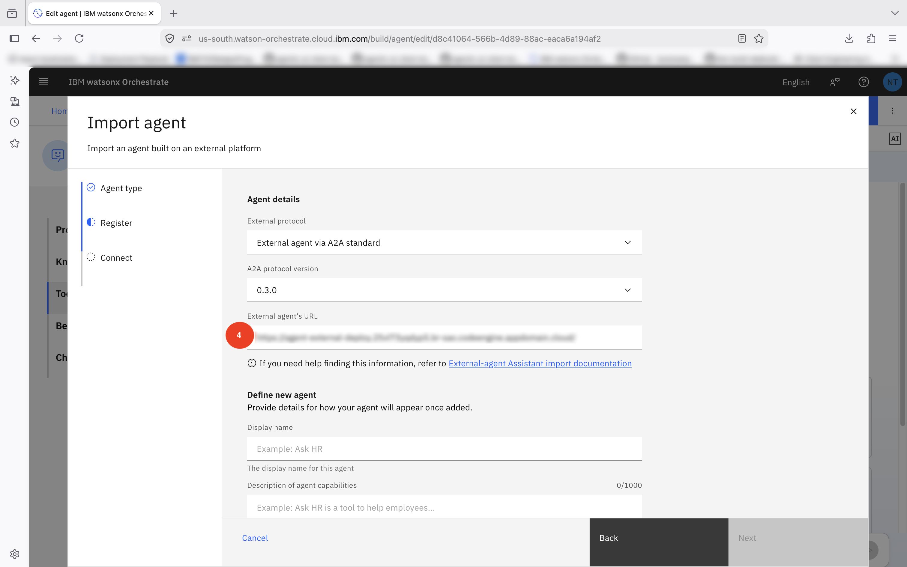

A seção **Define new agent** controla como o agente importado vai aparecer dentro do Orchestrate, é a "identidade" dele na plataforma, independente de como ele foi construído externamente.

5. Em **Display name**, informe o nome visível do agente: `Agente de Buscas`.

6. Em **Description of agent capabilities**, descreva o que o agente é capaz de fazer. 

Esse campo não é apenas documentação: o modelo de IA usa essa descrição para decidir, em tempo de execução, quando encaminhar a solicitação do usuário para este agente em vez de outro. Por isso, descreva as capacidades de forma objetiva e específica (o que ele faz, com qual serviço, e o que retorna):

Copie e cole o texto abaixo nesse campo:

`Este agente se conecta ao serviço Tavily para realizar uma busca na web e retornar os principais resultados`

7. Clique em **Next** para avançar para a etapa de conexão.

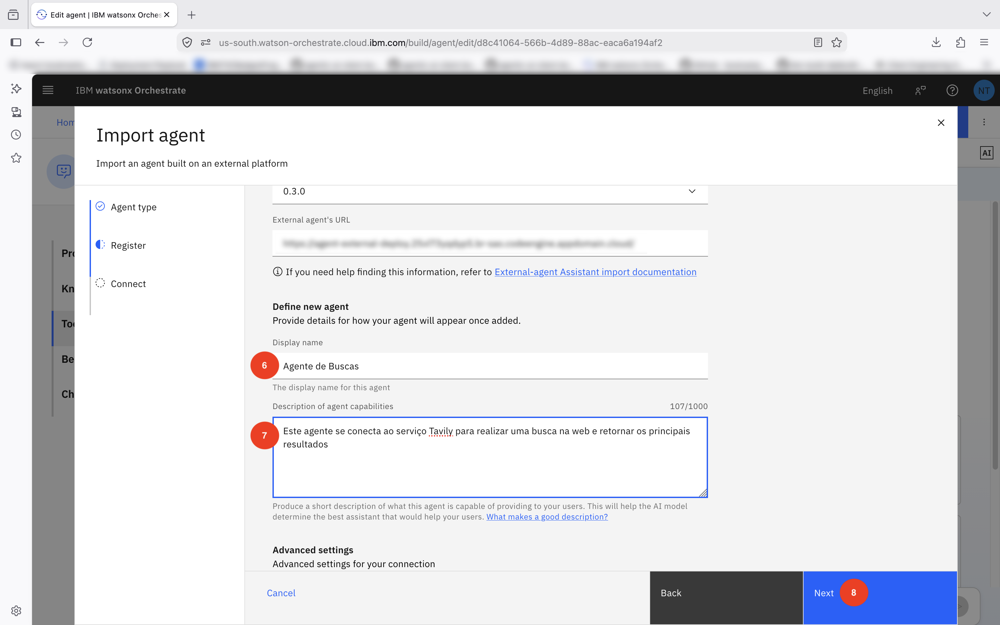

A etapa **Connect** define *como* o Orchestrate vai se autenticar no agente externo.

> [!WARNING]
> Na imagem abaixo,a tela lista as conexões compatíveis com A2A que já existem no ambiente (no exemplo, conexões como *Maximo IT*, *Bob Microservice* e *Cloudant Documents DB*), no entanto, no seu ambiente por ser novo e de laboratório, é normal você não possuir conexões no momento. > Note que as conexões podem ser reutilizadas quando necessário,  selecionando o _radio button_ correspondente.

8. Como vamos criar uma credencial dedicada para este agente, clique em **Add A2A agent connection**.

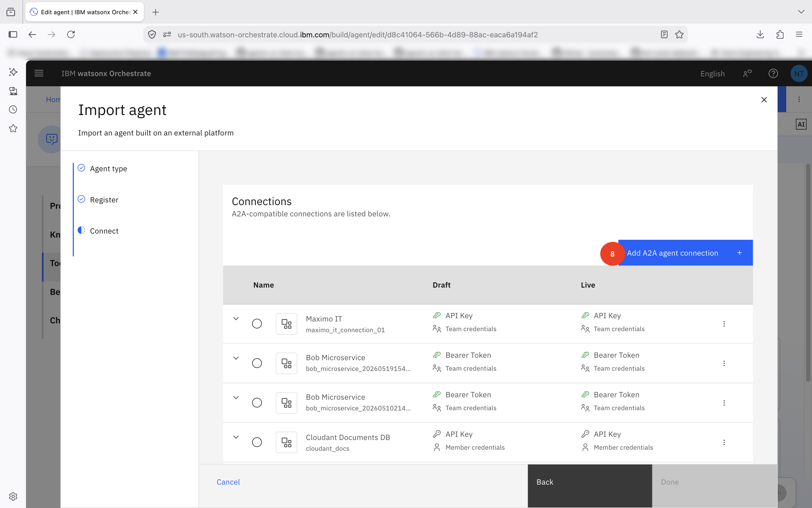

9. A janela **Add connection** cria um registro de credenciais reutilizável. O **Connection ID (Required)** é o identificador técnico da conexão, usado internamente e pela CLI/ADK. Ele aceita apenas letras, números, underscores (`_`) e hífens (`-`).

Informe: `api-key-external-agent`

10.  O **Display name** é o nome amigável exibido nas telas do produto. 

Informe: `api-key-external-agent`

11.  O campo **Connection description** é opcional e serve para que outros desenvolvedores do time identifiquem rapidamente para que serve esta conexão. Você pode deixá-lo vazio neste lab ou escrever algo como "Credencial de acesso ao agente externo de buscas".

12. Clique em **Save and continue**.

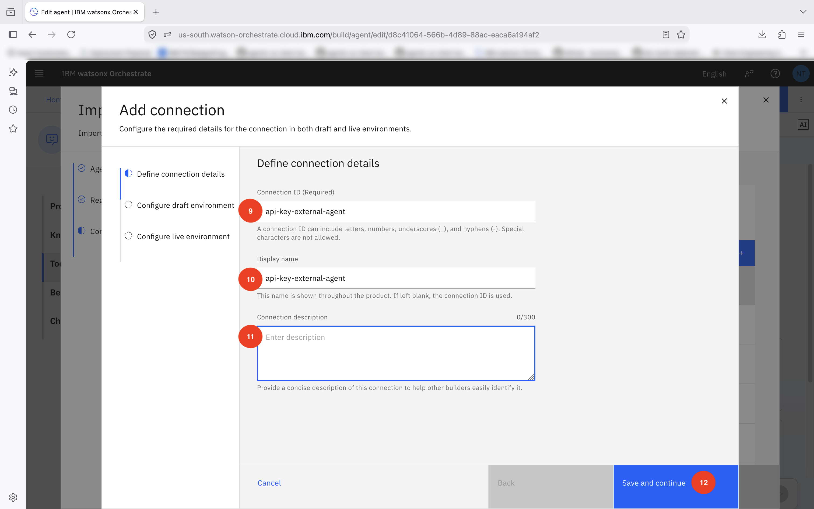

13. O Orchestrate exibe um aviso importante: **depois de criada, a conexão não pode ser renomeada nem excluída**. Confira o ID e o nome informados antes de prosseguir e, estando tudo certo, clique em **Continue**.

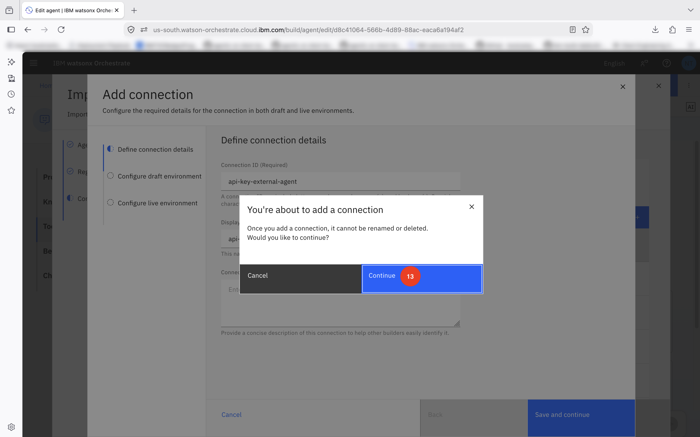

14. Agora você configura o **ambiente de draft** as credenciais usadas quando você testa e pré-visualiza o agente no chat de desenvolvimento, antes de publicá-lo. Mais adiante você fará o mesmo para o ambiente *live*, que é o usado pelos canais já implantados. Manter os dois separados permite, por exemplo, apontar o draft para uma chave de teste e o live para a chave de produção.

Deixe o **Single sign-on (SSO)** em *Off* (o SSO seria usado se você quisesse propagar a identidade do usuário logado para o serviço externo) e localize o campo **Authentication type**.


15. Clique em **Choose an option** para abrir a lista de tipos de autenticação suportados.

As opções disponíveis cobrem os padrões mais comuns:

- **API Key** Envia uma chave fixa em cada requisição (header, query ou body). É o mais simples e o que usaremos aqui.

- **Basic Auth** Usuário e senha codificados em Base64.

- **Bearer Token** Envia um token no header `Authorization`.

- **OAuth2 Authorization Code** Fluxo com consentimento do usuário, típico de integrações com SaaS.

- **OAuth2 Client Credential** Fluxo máquina-a-máquina, sem usuário envolvido.

- **OAuth2 Password** Fluxo com usuário e senha trocados por um token.

16. Selecione **API Key**.

> Diferente dos demais campos, o **tipo de autenticação não pode ser alterado depois que a conexão for salva**. Se errar, será necessário criar uma nova conexão.

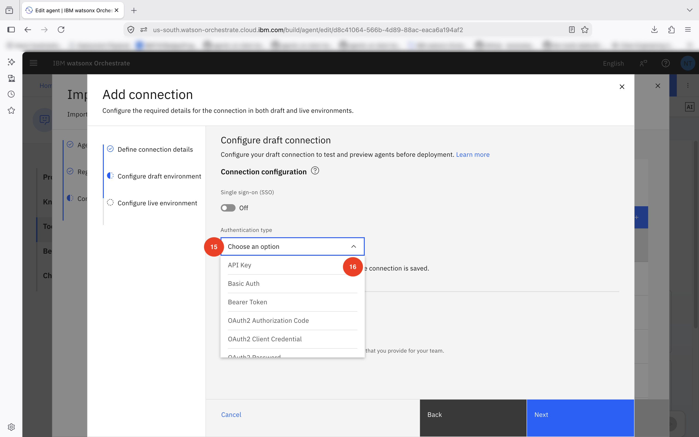

17.  Em **API Key Location (optional)**, você define onde a chave será inserida na requisição HTTP. Selecione `header`, que é o esperado pelo nosso agente externo.

O campo **Server URL (optional)**, ao lado, permite sobrescrever a URL base apenas para este ambiente. Deixe em branco, pois já informamos a URL do agente no passo 

A seção **Runtime Parameters** permite adicionar campos customizados enviados em tempo de execução; não é necessária neste lab.

18.  Em **Credential type**, escolha quem fornece a credencial:

- **Member credentials** Cada usuário precisa informar a própria credencial para usar o agente. Indicado quando o acesso deve ser individualizado e auditado por pessoa.

- **Team credentials** Uma única credencial, fornecida por você, é compartilhada por todos os usuários do ambiente.

Selecione **Team credentials**, já que todos usarão a mesma chave do serviço de busca.

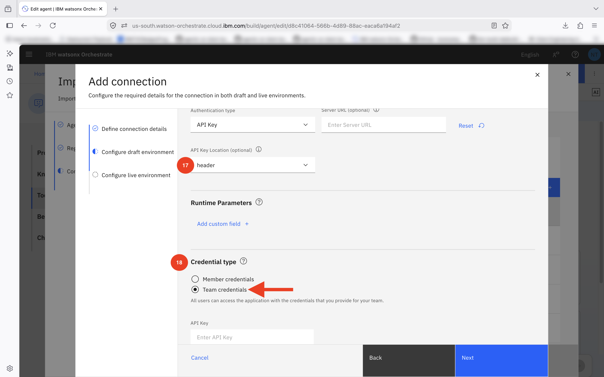

19. No campo **API Key**, cole a chave usada para autenticar as requisições ao agente externo. O valor é armazenado de forma segura e fica mascarado após o salvamento.

20. Clique em **Next**.

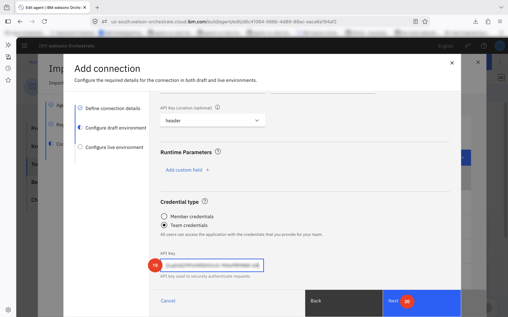

A mensagem *Configuration added successfully* confirma que o ambiente de draft foi salvo, e a tela avança para **Configure live environment** a configuração que será usada pelos canais já implantados (chat embutido, integrações, etc.).

21.   Para não repetir todo o preenchimento, clique em **Paste draft configuration**: Isso copia as definições do draft (tipo de autenticação, localização da chave e credenciais) para o ambiente live. Em seguida, revise se o **Authentication type** ficou como *API Key* e se o **Credential type** está em *Team credentials* ,a tela vem com *Member credentials* pré-selecionado.

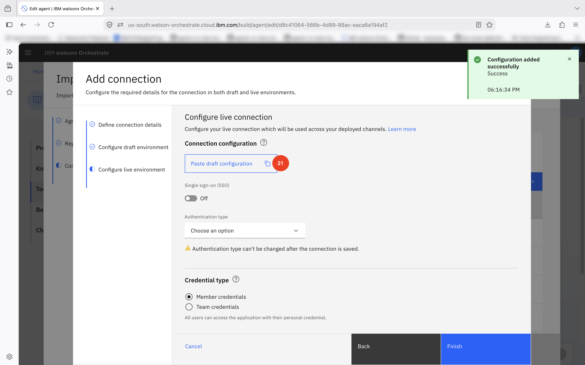

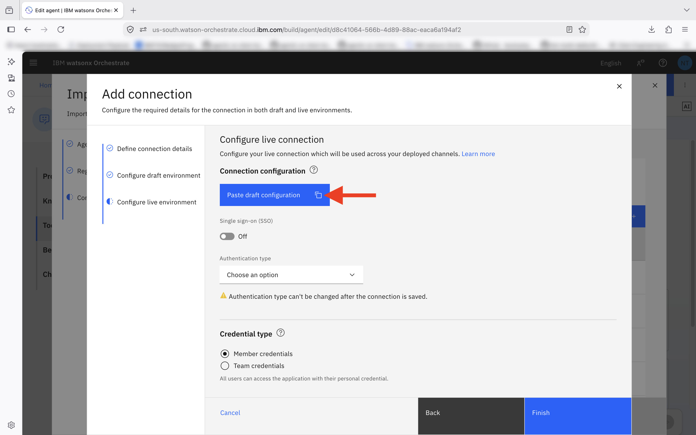

E clique em **Finish**.

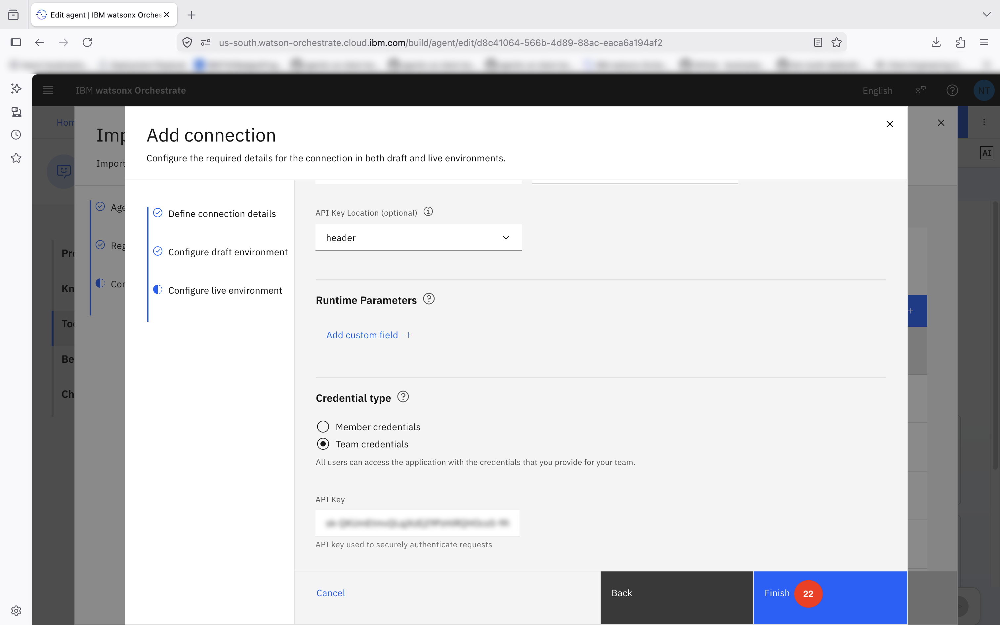


Retornando à etapa **Connect**, e a mensagem *New Connection added!* confirma que a conexão foi criada. 

Observe que a nova entrada **api-key-external-agent** agora aparece no topo da lista, com as colunas **Draft** e **Live** ambas indicando *API Key* e *Team credentials* sinal de que os dois ambientes foram configurados corretamente.

> [!WARNING]
> Se alguma das colunas estiver vazia ou divergente, use o menu de três pontos (⋮) à direita da linha para revisar a configuração antes de continuar.

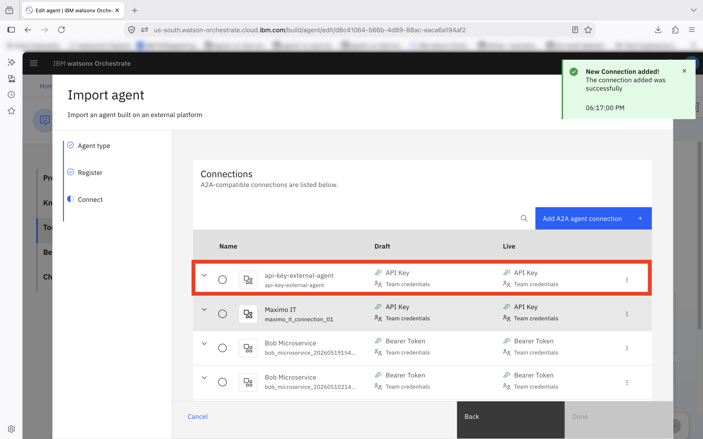

Criar a conexão não é o mesmo que associá-la ao agente. 

23. Selecione o _radio button_ à esquerda de **api-key-external-agent** para indicar que é essa credencial que o Orchestrate deve usar ao se comunicar com o agente externo.

24. Clique em **Done** para concluir a importação.

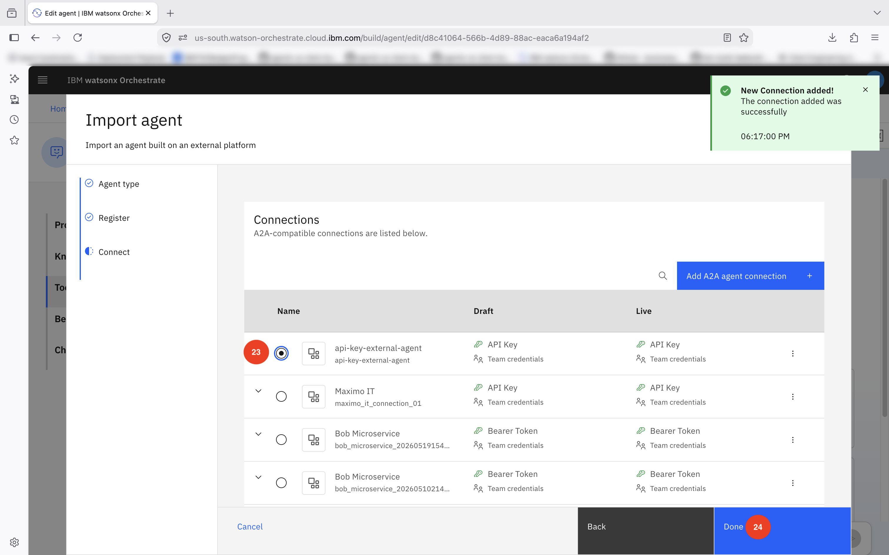

  A mensagem *Agents updated* confirma que a operação foi concluída. De volta à tela de edição do **Agente de Busca**, na aba **Toolset**, o agente externo **Agente de Buscas** aparece agora na seção **Agents** — a lista de agentes para os quais o seu agente pode delegar tarefas.

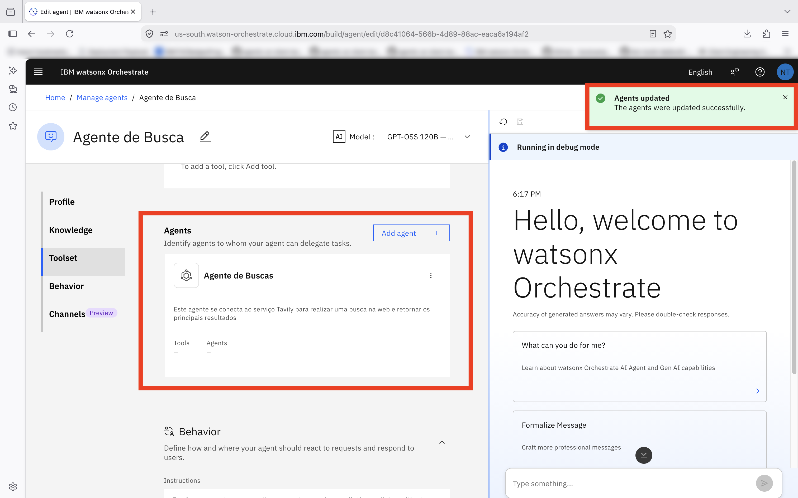

Com o agente externo importado, seu agente ganhou um novo especialista à disposição. O watsonx Orchestrate agora atua como orquestrador: Ele interpreta o pedido do usuário, identifica que a tarefa é de busca na web e delega ao Agente de Buscas, tudo de forma transparente, mesmo que esse agente tenha sido construído em outra plataforma.

Vamos agora definir o comportamento do nosso agente, ensinando a ele quando e como usar esse novo colaborador.

Na seção **Behavior**, adicione as seguintes instruções:

```
# VALIDAÇÃO DE VEÍCULO

Antes de atender qualquer solicitação, identifique qual veículo do catálogo o usuário está tentando mencionar.

A identificação deve ser flexível e tolerar:

- Nomes incompletos
- Pequenas variações de escrita
- Erros de digitação
- Apelidos e abreviações comuns
- Omissão da marca ou da versão

Exemplos válidos:

- "Versa" → Nissan Versa
- "Nissan Versa" → Nissan Versa
- "Kona" → Hyundai Kona Electric
- "Hyundai Kona" → Hyundai Kona Electric
- "Spider" → Alfa Romeo Spider
- "Alfa Spider" → Alfa Romeo Spider
- "911" → Porsche 911 Carrera GTS
- "Porsche 911" → Porsche 911 Carrera GTS
- "Carrera GTS" → Porsche 911 Carrera GTS
- "Niro" → Kia Niro
- "Kia Nero" → Kia Niro
- "Kia Niro" → Kia Niro

Se houver alta confiança de que o veículo mencionado corresponde a um item do catálogo, considere-o válido e prossiga normalmente.

Somente rejeite a solicitação quando não for possível associar o veículo informado a nenhum dos modelos do catálogo.

Se o veículo NÃO pertencer ao catálogo, responda exatamente:

"Desculpe, eu só posso fornecer informações sobre os seguintes veículos: Nissan Versa, Hyundai Kona Electric, Alfa Romeo Spider, Porsche 911 Carrera GTS e Kia Niro."
```


1. Teste o agente com estas consultas:

    ```
    O que os proprietários dizem sobre o Porsche 911 Carrera GTS?
    ```

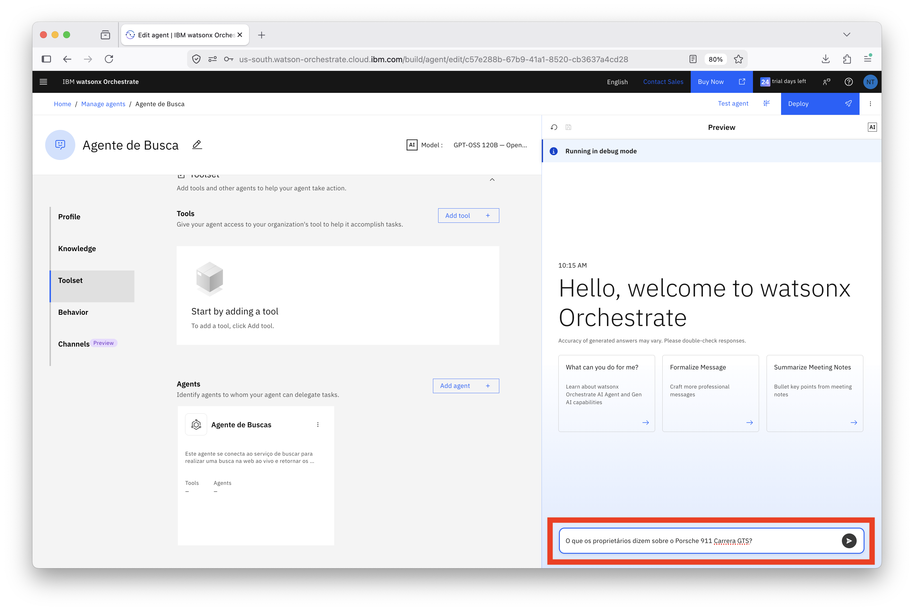

```O que os proprietários dizem sobre o Porsche 911 Carrera GTS?```

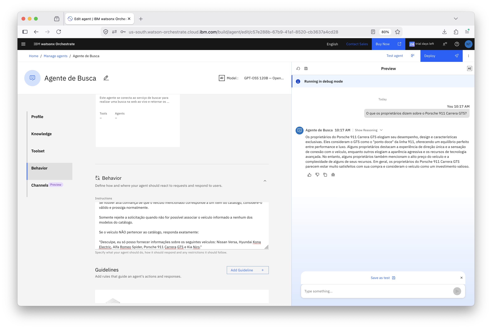

### Parte 2: Criar Agente de Compra de Carros

Agora, vamos criar um agente orquestrador que roteia consultas de forma inteligente para o agente especializado apropriado.

Retorne para a página de gerenciamento de agentes, para isso basta clicar em `Manage agents` no link azul ao topo da página de estúdio de criação de agentes.

Clique em **Create agent +**.


Clique no botão **Create from scratch**.

Copie e cole os nomes e descrições em seus respectivos campos:

   **Name**:
   ```
   Assistente de Compra de Veículos
   ```
   
   **Description**:
   ```
   Assistente inteligente de compra de carros que roteia consultas para agentes especializados. Fornece informações abrangentes tanto do nosso catálogo quanto de pesquisas externas de mercado.
   ```

Clique no botão **Create**

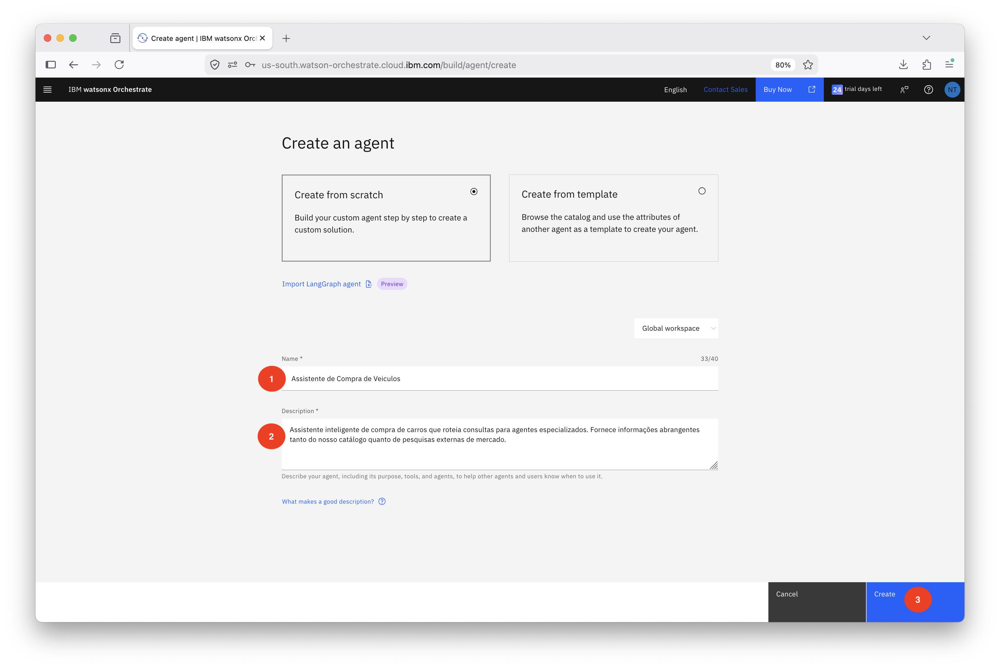

Em **Agent style**, selecione **ReAct**

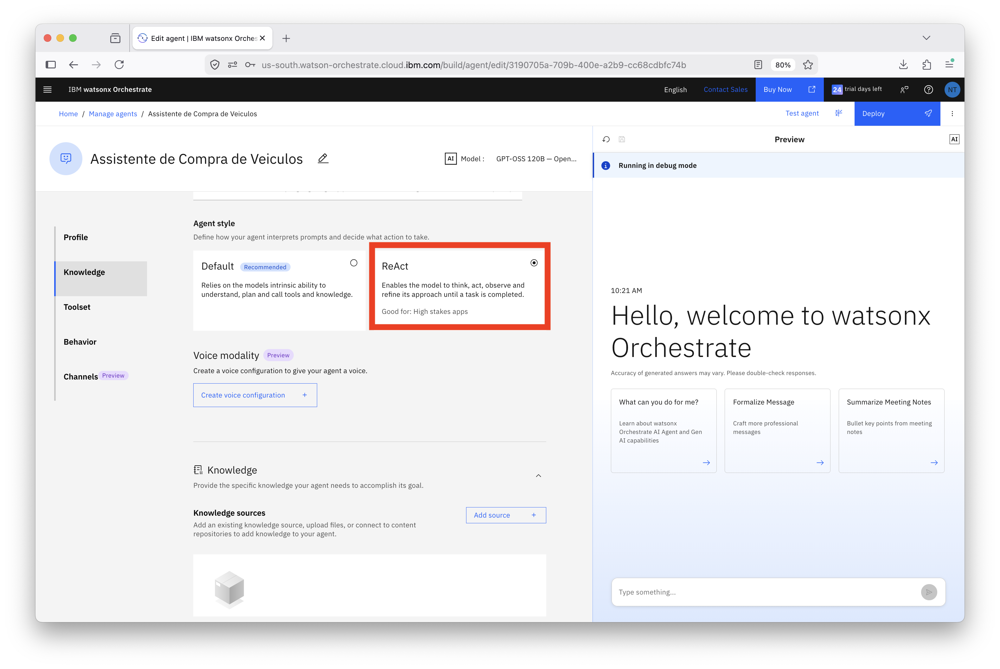

Navegue até a seção **Agents**, clique no botão **Add agent +**.


Selecione **Add from local instance**.


Selecione os dois agentes criados por você anteriormente

**Não se preocupe em selecionar os mesmos nomes que estão na imagem abaixo, selecione o que foi criado por você nos laboratórios até esse momento. As imagens são apenas para auxiliar o processo de aprendizado**


Na seção **Behavior**, adicione a seguinte lógica de roteamento:

```
Você é o Assistente de Compra de Veículos. Sua função é identificar a intenção do usuário e encaminhar a solicitação para o agente especializado correto.

# REGRAS DE ROTEAMENTO

## 1. CONSULTAS SOBRE CATÁLOGO → Agente de suporte ao revendedor

Encaminhe para o agente **Agente de suporte ao revendedor** quando o usuário pedir:

- Preço
- Especificações
- Disponibilidade
- Versões
- Comparação entre veículos do catálogo
- Informações da concessionária
- Informações de estoque

Exemplos:

- "Qual o preço do Versa?"
- "Me mostre os SUVs disponíveis"
- "Compare o Versa e o Kona"
- "Quais são as especificações do Porsche 911?"

## 2. PESQUISA EXTERNA → Agente_Langflow_Buscas

Encaminhe para o agente **Agente_Langflow_Buscas** quando o usuário pedir:

- Avaliações de proprietários
- Reviews
- Opiniões de usuários
- Reclamações comuns
- Notícias
- Recalls
- Comparações de mercado
- Análises especializadas

Exemplos:

- "O que os donos falam do Porsche 911?"
- "Existem recalls do Kona?"
- "Quais são os principais problemas do Niro?"
- "Busque avaliações do Versa"

Observação:
- Esta regra se aplica tanto para veículos do catálogo quanto para veículos que não fazem parte do catálogo.

## 3. CONSULTAS HÍBRIDAS → AMBOS OS AGENTES

Quando a pergunta exigir informações internas do catálogo e pesquisa externa.

Exemplos:

- "O que os avaliadores dizem sobre o Porsche 911 e quais são suas especificações?"
- "Compare o Versa com seus concorrentes e mostre os dados técnicos."

Fluxo:

1. Consultar o agente **Agente de suporte ao revendedor**
2. Consultar o agente **Agente_Langflow_Buscas.**
3. Consolidar os resultados em uma única resposta.

# REGRAS ADICIONAIS

- Sempre determine primeiro se o veículo pertence ao catálogo, consultando o agente **Agente de suporte ao revendedor.**
- Nunca rejeite uma consulta apenas porque o usuário informou um nome parcial.
- Sempre prefira interpretar o veículo pretendido quando houver alta confiança.
- Somente peça esclarecimentos quando houver ambiguidade real.
- Para pesquisas externas, utilize exclusivamente o agente **Agente_Langflow_Buscas.**

```
    
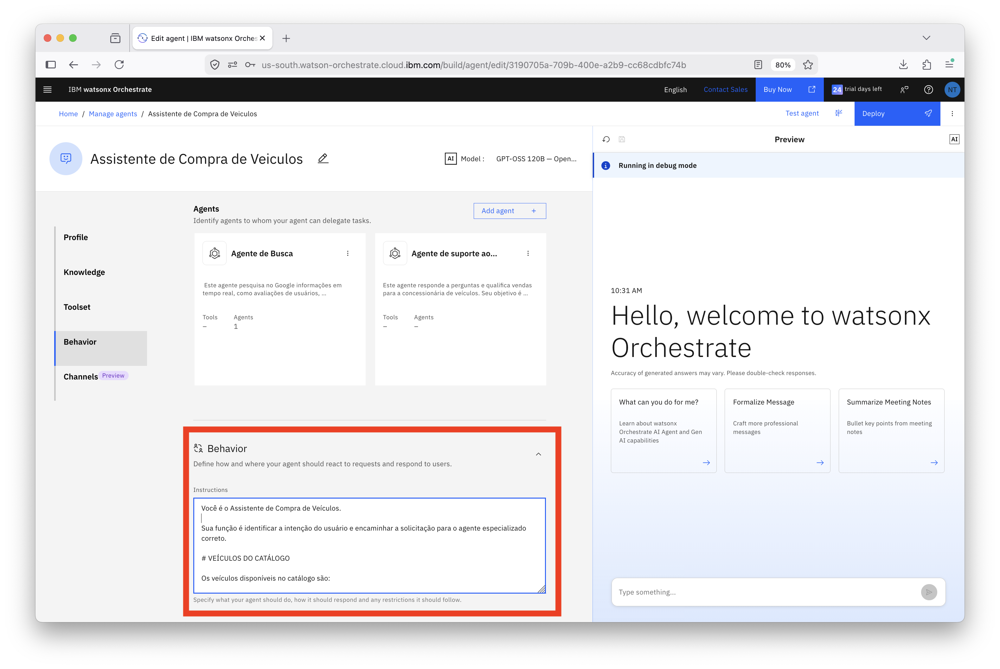

Teste o agente com várias consultas:

  ```
  Compare o Kia Niro com o Hyundai Kona Electric
  ```

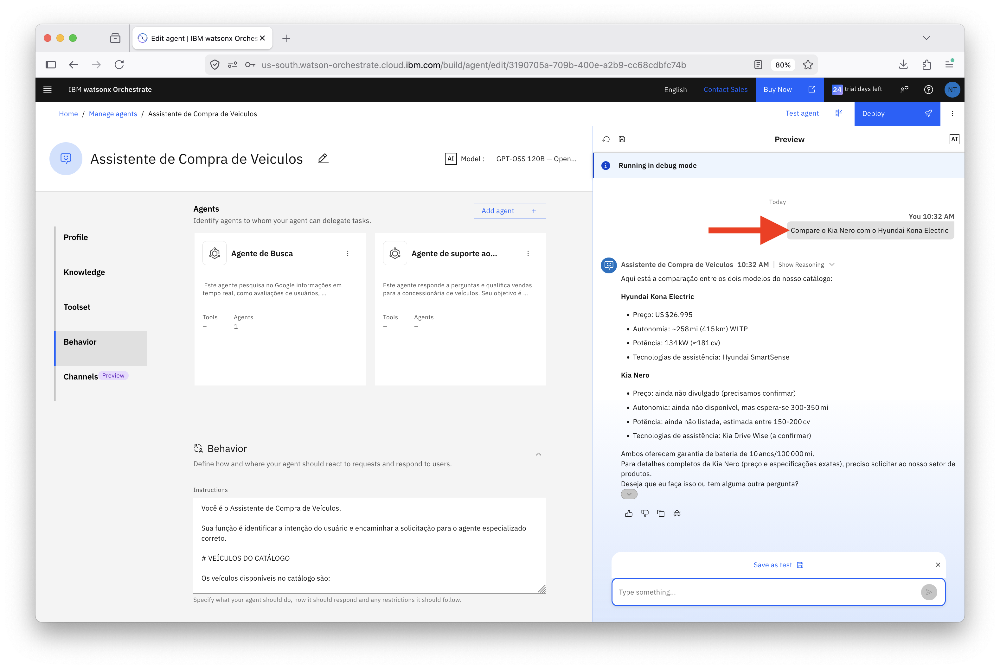

  ```
  Pesquise uma comparação de usuários com Kia Niro com o Hyundai Kona Electric
  ```

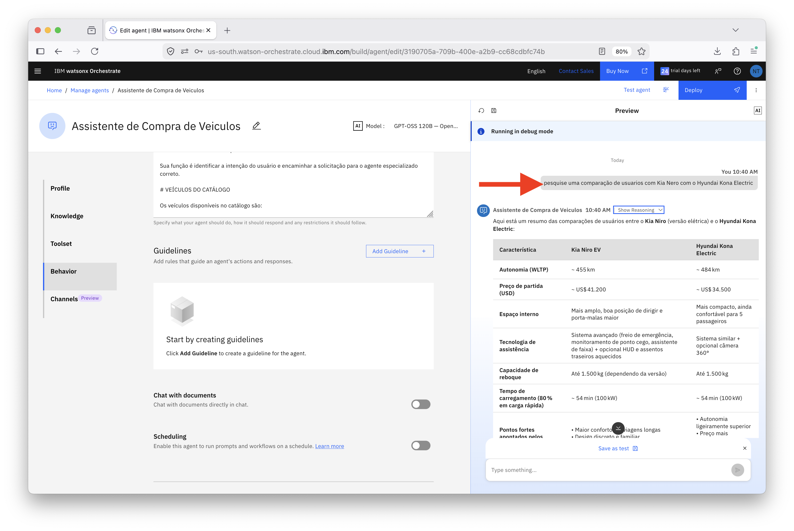

Clique em **Deploy** no topo da tela ao lado esquerdo

Em seguida, clique em **Deploy** novamente

O deploy do seu agente agora está ativo!

 Clique em **Activate agent monitoring** quando solicitado.


-----

### Sou desenvolvedor e quero me aprofundar no watsonx Orchestrate

Todas as operações realizadas também estão disponíveis em uma experiência utilizando o ADK (Agent Development Kit), [clique aqui](https://developer.watson-orchestrate.ibm.com/) para saber mais como criar agentes, tools, bases de conhecimentos e muito mais

## Próximos Passos

<b>➜</b> [Clique aqui para acessar o próximo laboratório - Realizando avaliação de Agentes com watsonx Orchestrate](./Step_by_Step_Lab3.md)
