# Adicionando Agentes Externos e Orquestradores com watsonx Orchestrate

## Índice

1. [Visão Geral](#visão-geral)
2. [Parte 1: Conectar Agente de Busca de Terceiros](#parte-1-conectar-agente-de-busca-de-terceiros)
3. [Parte 2: Criar o Agente Orquestrador](#parte-2-criar-o-agente-orquestrador)
4. [Sou desenvolvedor e quero me aprofundar no watsonx Orchestrate](#sou-desenvolvedor-e-quero-me-aprofundar-no-watsonx-orchestrate)
5. [Próximos Passos](#próximos-passos)

## Visão Geral

Neste laboratório, você vai explorar como conectar e orquestrar múltiplos agentes no watsonx Orchestrate para criar experiências mais completas e inteligentes.

Você vai aprender conceitos fundamentais de arquiteturas multiagentes: integração de um agente externo, descoberta de capacidades e tomada de decisão baseada em contexto, permitindo que cada agente contribua com sua especialidade para resolver as solicitações dos usuários.

> [!NOTE]
> **Pré-requisito:** este laboratório assume que você já concluiu o [laboratório 1](Step_by_Step_Lab1.md) e criou um agente com a base de conhecimento do catálogo de veículos. O agente criado naquele laboratório será reutilizado aqui como o agente responsável pelas consultas ao catálogo.


> ⚠️ **Atenção**
>
> Este laboratório utiliza um agente externo que não foi desenvolvido no watsonx Orchestrate. Para as atividades deste exercício, será utilizado um agente criado com o Langflow, integrado ao Orchestrate por meio do protocolo **A2A (Agent to Agent)**.
>
> Para estabelecer a comunicação entre os agentes, será necessário ter acesso à **URL do agente** e à respectiva **API Key**.
>
> Essas credenciais serão fornecidas pelo instrutor. Antes de prosseguir com o laboratório, certifique-se de obtê-las para garantir que todas as etapas possam ser executadas corretamente.

> Para saber mais sobre o protocolo de comunicação A2A, clique [aqui](https://www.ibm.com/br-pt/think/topics/agent2agent-protocol).

## Parte 1: Conectar Agente de Busca de Terceiros

Nesta parte, você vai conectar um agente externo que realiza buscas na web sobre carros, avaliações de proprietários e dados de mercado. Esse agente foi construído fora do watsonx Orchestrate, em Langflow, e vai se juntar à plataforma como um colaborador do seu agente de catálogo.

> Este agente usa o protocolo A2A para se comunicar com o watsonx Orchestrate. Para ter acesso a ele, utilize as credenciais e o link que o seu instrutor vai fornecer.

Clique no link **Manage Agents**, no menu do canto superior esquerdo, e em seguida no botão **Create agent**, no canto superior direito da tela.

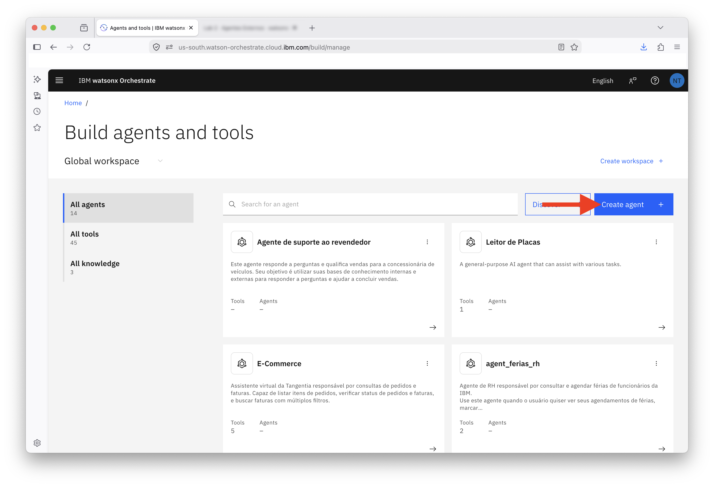

Uma janela se abre com as opções de criação. Escolha **Create from scratch**, a mesma opção usada no laboratório anterior para montar um agente do zero.

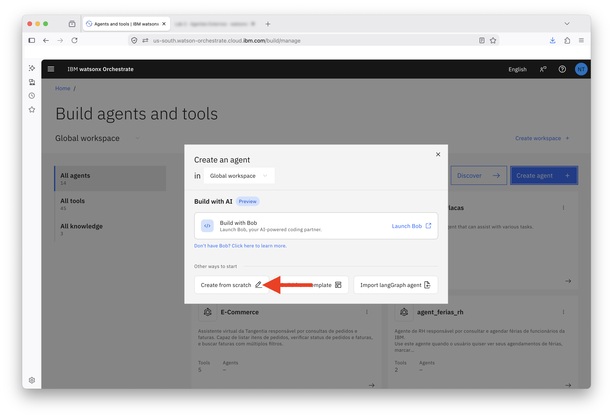

Você chega à tela de edição do agente, com o painel **Behavior** já selecionado. Preencha o perfil:

**1.** Em **Agent name**, informe `Agente de Busca`.

**2.** Em **Model**, mantenha `GPT-OSS 120B da OpenAI (via Groq)`.

**3.** Em **Description**, copie e cole o texto abaixo. É essa descrição que o modelo de roteamento vai ler mais adiante, na Parte 2, para decidir quando encaminhar uma pergunta a este agente:

```
Este agente pesquisa no Google informações em tempo real, como avaliações de usuários, classificações e comparações de mercado, mas apenas para carros que estão em nosso catálogo. Não deve fornecer informações sobre veículos não vendidos pela nossa concessionária.
```

**4.** Note as quatro abas do topo, **Behavior**, **Knowledge**, **Tools** e **Agents**: é na aba **Agents** que você vai conectar o colaborador externo daqui a pouco.

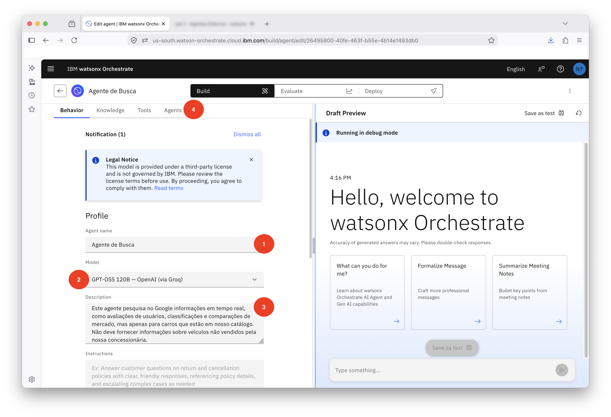

**5.** Navegue até a aba **Agents** e clique em **Add Agents**.

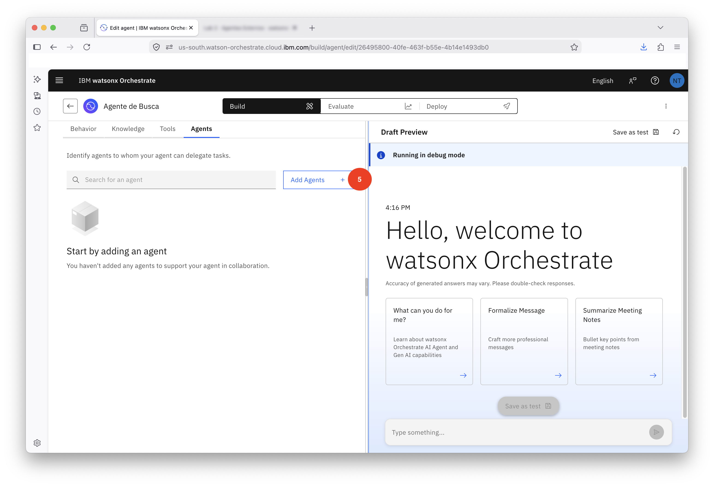

**6.** Uma janela mostra três formas de adicionar um colaborador: **Catalog** (agentes pré construídos), **Local instance** (agentes já existentes na sua instância) e **Import** (registrar um agente externo). Escolha **Import**, já que o agente de busca foi construído em outra plataforma.

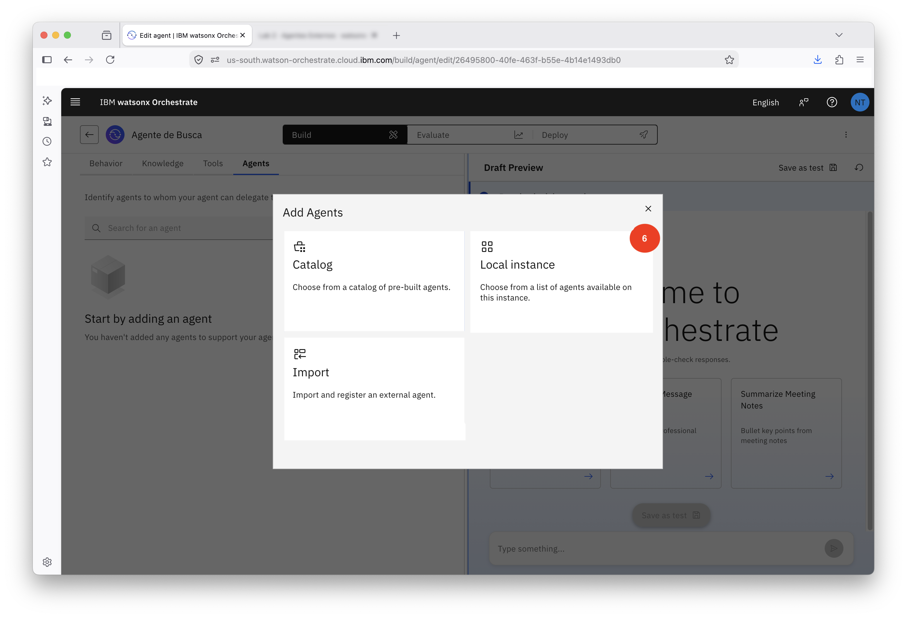

**7.** Na tela **Import agent**, em **Choose agent type**, mantenha selecionada a opção **External agent**, que registra um agente construído com um provedor externo.

**8.** Clique em **Next**.

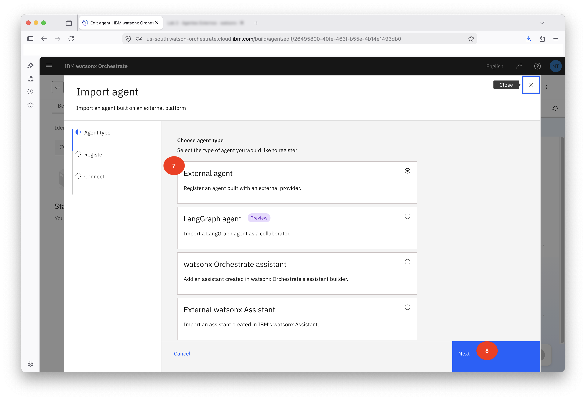

Você chega à etapa **Register**, onde ficam os detalhes técnicos da conexão.

**9.** Em **External protocol**, mantenha `External agent via A2A standard`.

**10.** Em **A2A protocol version**, abra o menu e escolha `0.3.0`, a versão do protocolo usada neste laboratório.

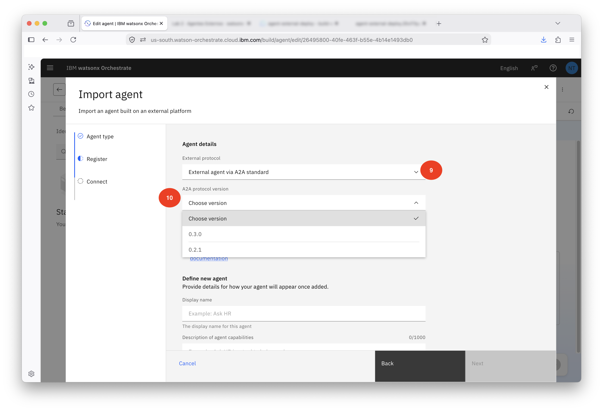

**11.** Em **External agent's URL**, cole o endereço público do agente externo que o seu instrutor compartilhou. É por essa URL que o watsonx Orchestrate busca o *Agent Card*, o documento que descreve as capacidades do agente no padrão A2A, e envia as requisições em tempo de execução.

**12.** Em **Display name**, na seção **Define new agent**, informe `Agente de Buscas`. Esse é o nome pelo qual o agente vai aparecer dentro do Orchestrate, independente de como foi construído externamente.

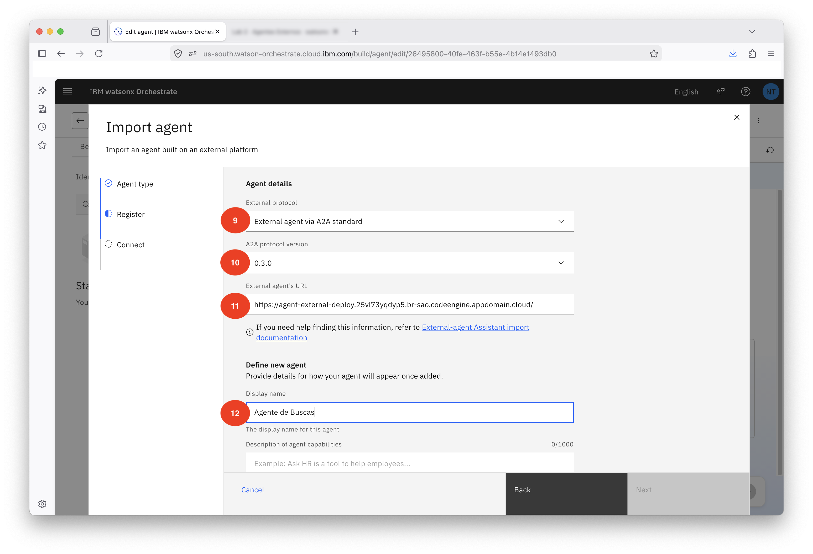

Ainda na seção **Define new agent**, em **Description of agent capabilities**, cole o texto abaixo. Assim como a descrição do próprio agente, é este texto que o modelo de IA vai usar para decidir quando encaminhar uma solicitação a este colaborador:

```
Este agente se conecta ao serviço Tavily para realizar uma busca na web e retornar os principais resultados
```

**13.** As opções em **Advanced settings** (**Support streaming**, **Support push notifications** e **Send conversation history**) podem ficar desligadas. Clique em **Next**.

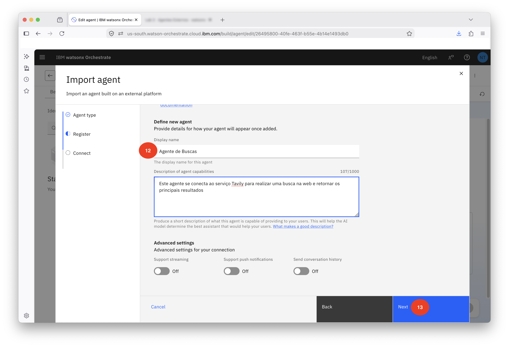

Você chega à etapa **Connect**, que define como o Orchestrate vai se autenticar no agente externo.

> [!WARNING]
> A lista de **Connections** pode já exibir conexões A2A compatíveis criadas por outras pessoas no ambiente. Isso é normal em um ambiente compartilhado. Como você vai criar uma credencial dedicada para este agente, não é necessário reaproveitar nenhuma delas.

**14.** Clique em **Add A2A agent connection**.

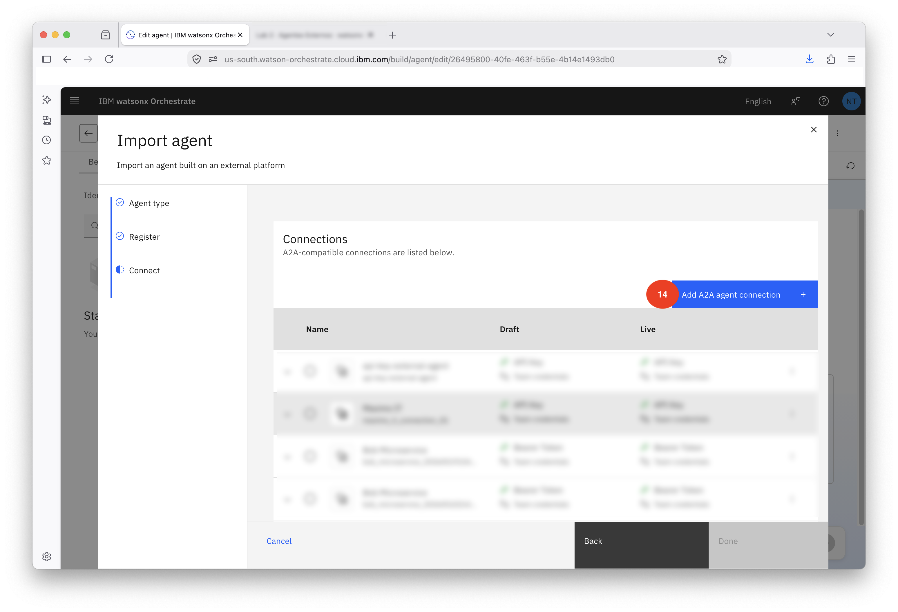

Abre se a janela **Add connection**, com três etapas: **Define connection details**, **Configure draft environment** e **Configure live environment**.

**15.** Em **Connection ID (Required)**, informe `apikey_external_agent`. Esse campo aceita apenas letras, números, underscores e hífens, porque é o identificador técnico usado internamente e pela CLI ou ADK.

**16.** Em **Display name**, repita `apikey_external_agent`, o nome amigável que vai aparecer nas telas do produto.

**17.** O campo **Connection description** é opcional; você pode deixá lo em branco. Clique em **Save and continue**.

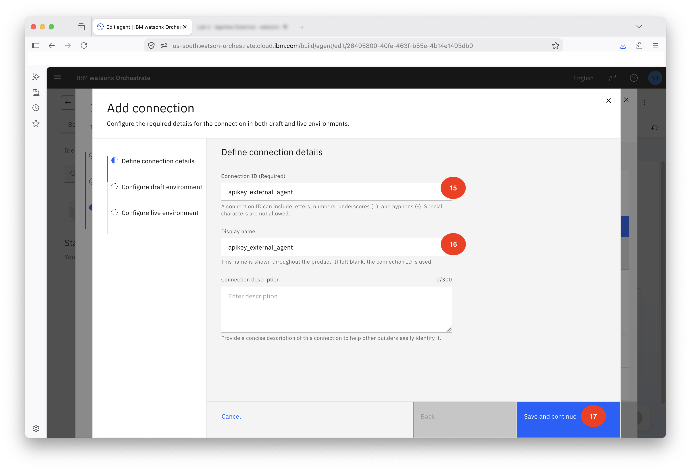

**18.** O Orchestrate exibe um aviso: depois de criada, a conexão não pode ser renomeada nem excluída. Confira o ID e o nome informados e, estando tudo certo, clique em **Continue**.

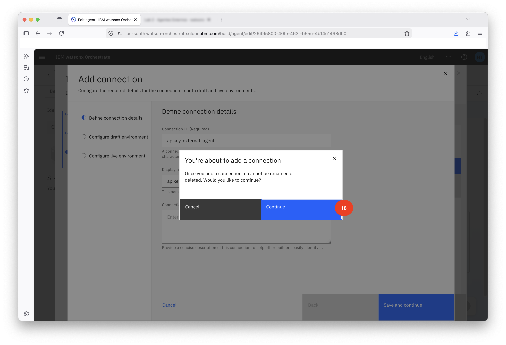

Você chega à etapa **Configure draft environment**, as credenciais usadas quando você testa e pré-visualiza o agente no chat de desenvolvimento, antes de publicá lo. Mais adiante você vai repetir a configuração para o ambiente *live*, usado pelos canais já implantados; manter os dois separados permite, por exemplo, apontar o draft para uma chave de teste e o live para a chave de produção.

**19.** Em **Authentication type**, abra a lista. Ela mostra os padrões suportados: **API Key** (uma chave fixa enviada em cada requisição), **Basic Auth** (usuário e senha em Base64), **Bearer Token** (um token no cabeçalho Authorization) e três variações de **OAuth2**, para fluxos com consentimento do usuário ou máquina a máquina. Selecione **API Key**, a opção usada neste laboratório.

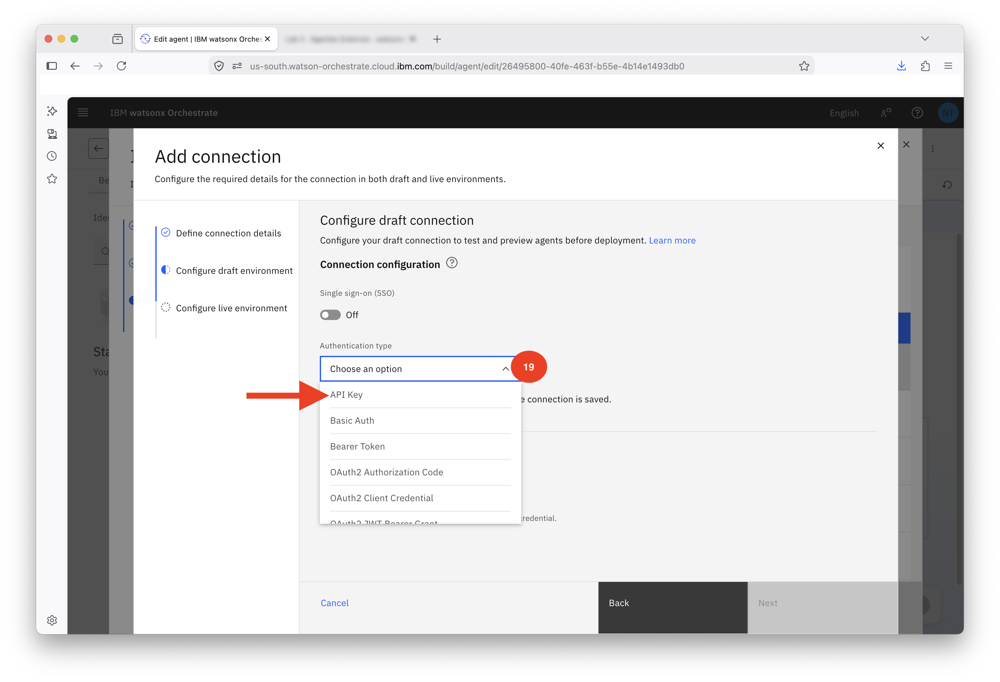

**20.** Em **API Key Location**, mantenha `header`, o local esperado pelo agente externo. O campo **Server URL** já vem preenchido com a URL informada anteriormente e pode ficar como está.

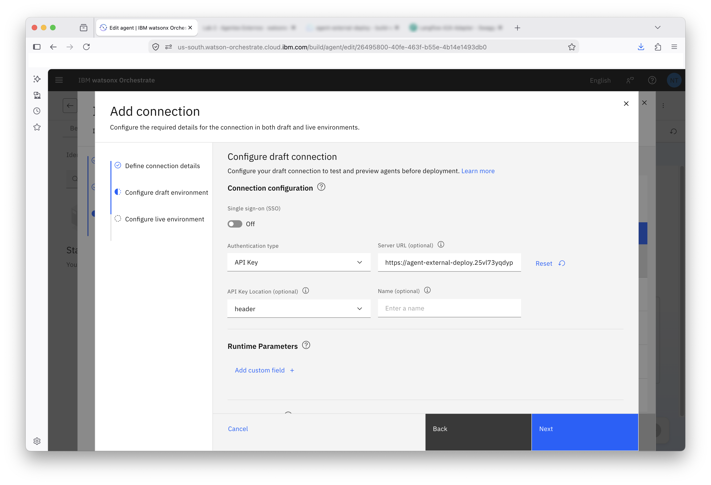

Role a tela até **Credential type**. Ele define quem fornece a credencial: **Member credentials**, em que cada usuário informa a própria chave, indicado quando o acesso deve ser individualizado; ou **Team credentials**, em que uma única credencial, fornecida por você, é compartilhada por todos os usuários do ambiente.

**21.** Selecione **Team credentials**, já que todos vão usar a mesma chave do serviço de busca.


**22.** No campo **API Key**, cole a chave usada para autenticar as requisições ao agente externo. O valor é mascarado assim que você segue para a próxima etapa. Clique em **Next**.

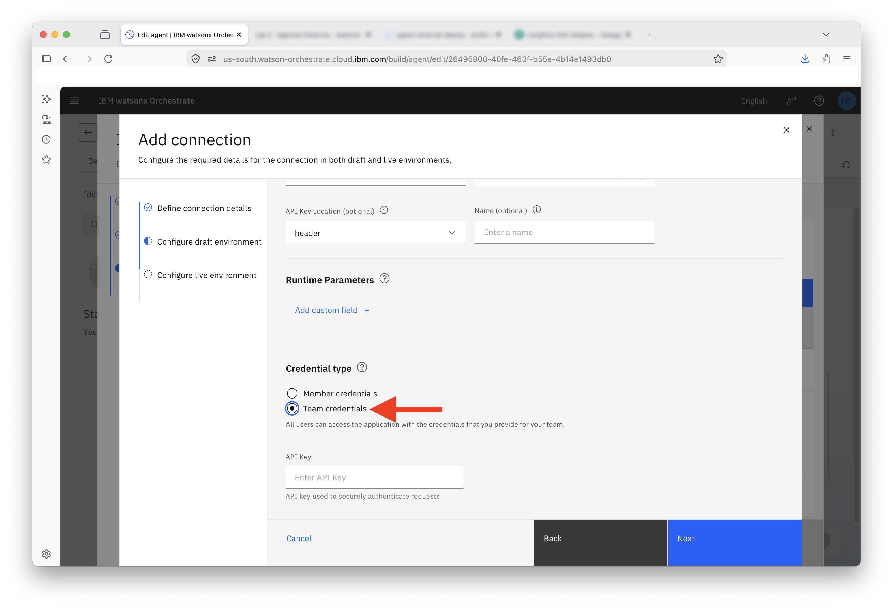

Você chega a **Configure live environment**, a configuração que os canais já implantados vão usar.

**23.** Para não repetir todo o preenchimento, clique em **Paste draft configuration**. Isso copia as definições do draft (tipo de autenticação, localização da chave e credenciais) para o ambiente live.

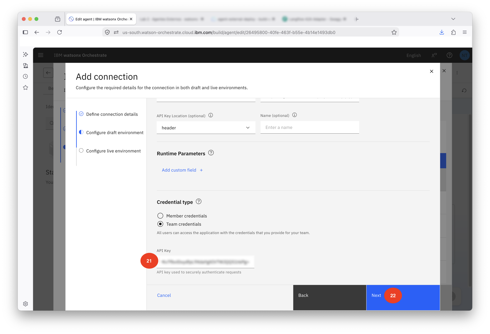

Revise se o **Authentication type** ficou como `API Key` e o **Credential type** como `Team credentials`; a tela tende a vir com `Member credentials` pré-selecionado, então vale conferir antes de seguir.

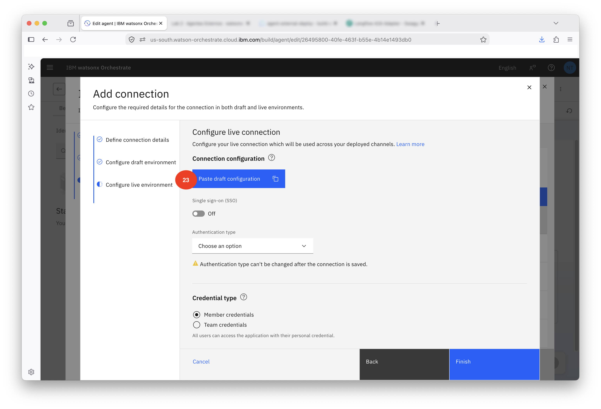

**24.** Confirme **Team credentials** e a API Key preenchida, e clique em **Finish**.


A tela mostra **Saving...** por alguns segundos enquanto o Orchestrate grava a conexão nos dois ambientes.

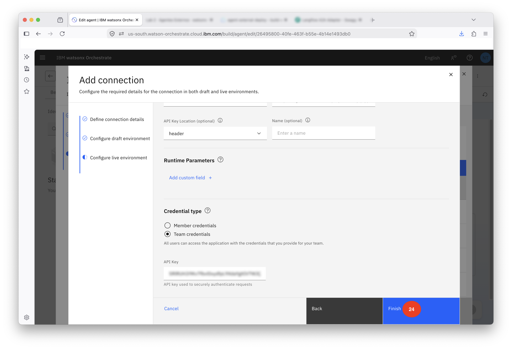

**25.** A notificação **New Connection added!** confirma que a conexão foi criada. Observe que a nova entrada **apikey_external_agent** aparece na lista, com as colunas **Draft** e **Live** indicando `API Key` e `Team credentials`, sinal de que os dois ambientes foram configurados corretamente. Selecione o *radio button* à esquerda dela para indicar que é essa credencial que o Orchestrate deve usar ao se comunicar com o agente externo.

> [!WARNING]
> Se alguma das colunas estiver vazia ou divergente, use o menu de três pontos à direita da linha para revisar a configuração antes de continuar.

**26.** Clique em **Done** para concluir a importação.

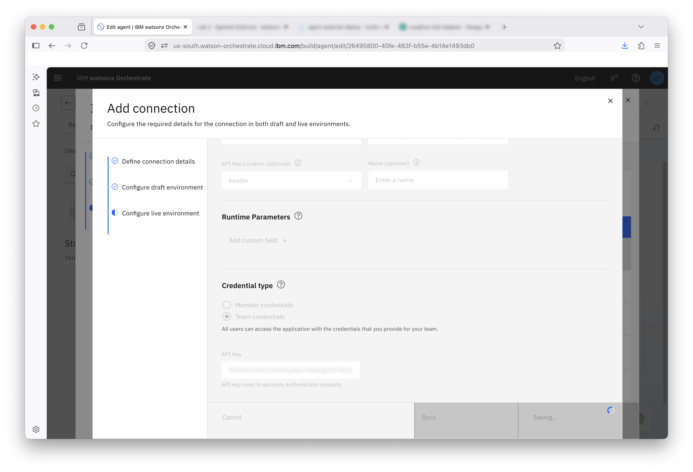

A notificação **Agents updated** confirma a operação.

**27.** De volta à tela de edição do **Agente de Busca**, na aba **Agents**, o agente externo **Agente de Buscas** já aparece na lista de colaboradores, junto com a descrição que você definiu ao importá lo.

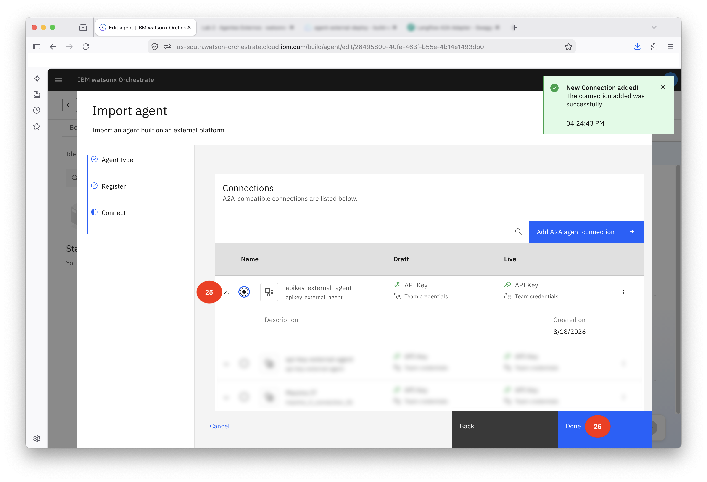

Com o agente externo importado, o **Agente de Busca** ganhou um especialista à disposição. O watsonx Orchestrate passa a atuar como orquestrador: interpreta o pedido do usuário, identifica que a tarefa é de busca na web e delega ao Agente de Buscas, de forma transparente, mesmo esse agente tendo sido construído em outra plataforma.

Vamos agora ensinar ao agente quando e como usar esse novo colaborador.

Clique na aba **Behavior**

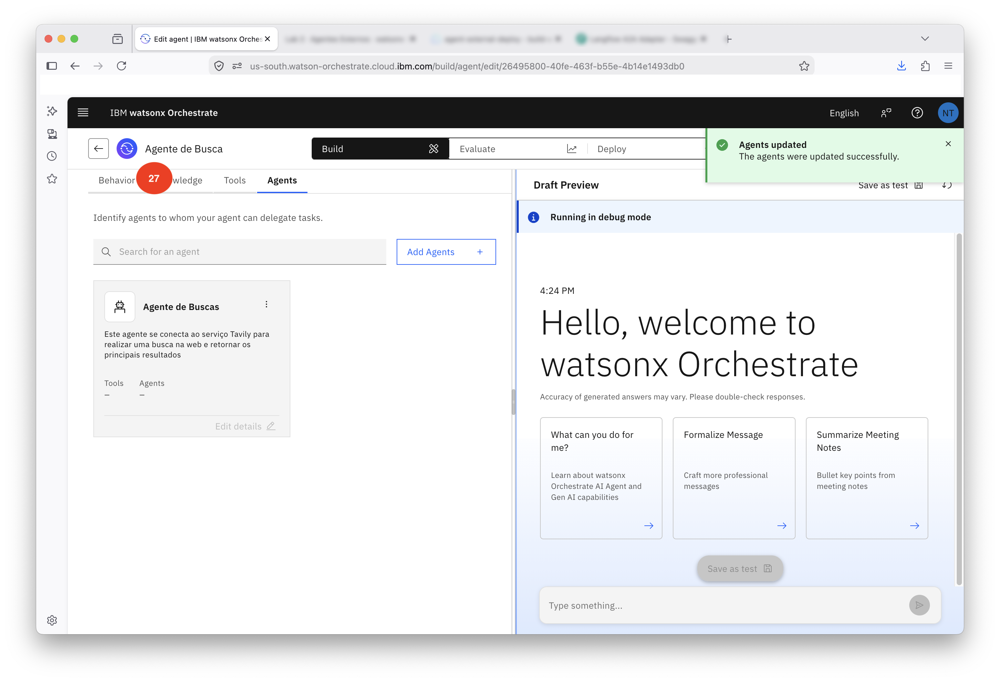

No campo **Instructions**, adicione as instruções abaixo. Elas fazem o agente validar, antes de qualquer busca, se o veículo mencionado pelo usuário pertence ao catálogo, mesmo diante de nomes incompletos, apelidos ou pequenos erros de digitação:

```
# VALIDAÇÃO DE VEÍCULO

Antes de atender qualquer solicitação, identifique qual veículo do catálogo o usuário está tentando mencionar.

A identificação deve ser flexível e tolerar:

- Nomes incompletos
- Pequenas variações de escrita
- Erros de digitação
- Apelidos e abreviações comuns
- Omissão da marca ou da versão

Exemplos válidos:

- "Versa" → Nissan Versa
- "Nissan Versa" → Nissan Versa
- "Kona" → Hyundai Kona Electric
- "Hyundai Kona" → Hyundai Kona Electric
- "Spider" → Alfa Romeo Spider
- "Alfa Spider" → Alfa Romeo Spider
- "911" → Porsche 911 Carrera GTS
- "Porsche 911" → Porsche 911 Carrera GTS
- "Carrera GTS" → Porsche 911 Carrera GTS
- "Niro" → Kia Niro
- "Kia Nero" → Kia Niro
- "Kia Niro" → Kia Niro

Se houver alta confiança de que o veículo mencionado corresponde a um item do catálogo, considere-o válido e prossiga normalmente.

Somente rejeite a solicitação quando não for possível associar o veículo informado a nenhum dos modelos do catálogo.

Se o veículo NÃO pertencer ao catálogo, responda exatamente:

"Desculpe, eu só posso fornecer informações sobre os seguintes veículos: Nissan Versa, Hyundai Kona Electric, Alfa Romeo Spider, Porsche 911 Carrera GTS e Kia Niro."
```

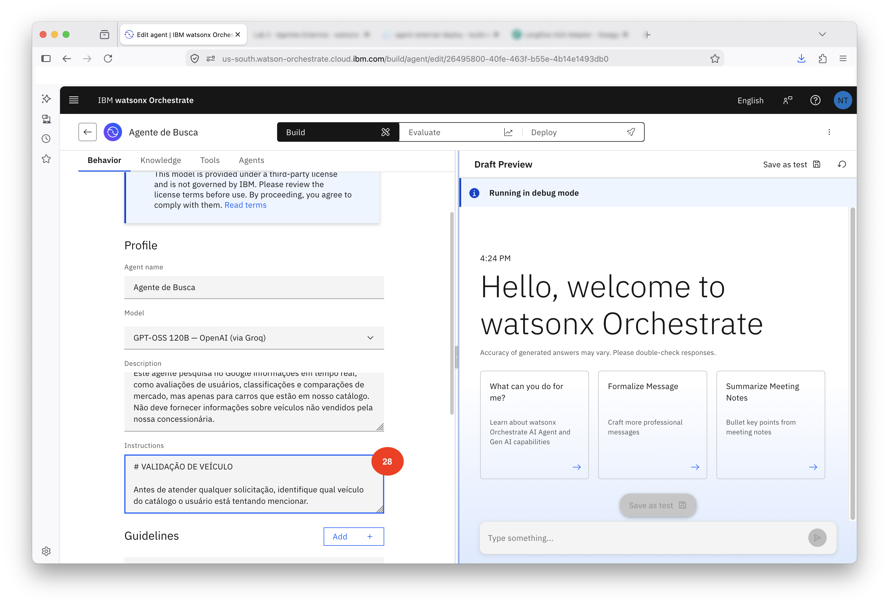


Teste o agente no **Draft Preview**. Envie a pergunta:

```
pesquisa sobre o Alfa Romeo Spider
```

O agente reconhece o veículo, delega a busca ao colaborador externo e devolve um resumo completo, com histórico do modelo, características técnicas e as diferentes gerações lançadas ao longo dos anos.

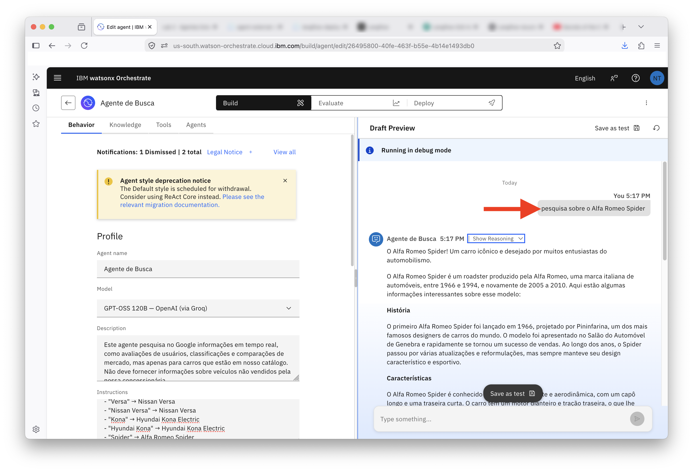

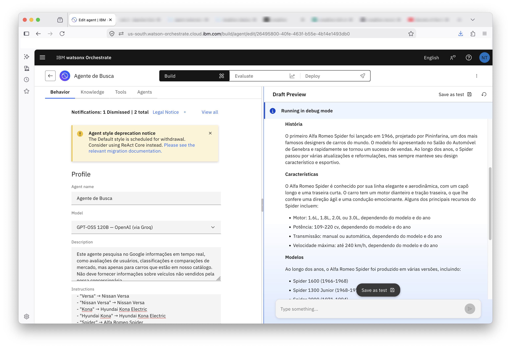

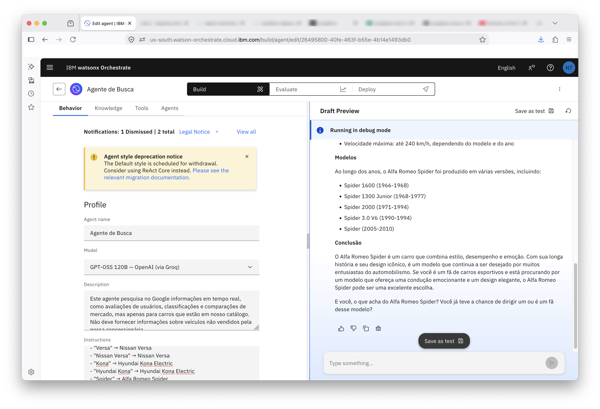

Envie agora uma segunda pergunta, comparando dois veículos bem diferentes entre si:

```
compare o nissan versa e o Alfa Romeo Spider
```

O agente monta uma tabela comparativa cobrindo segmento, ano de lançamento, motorização, transmissão e tração, e fecha com um resumo de para quem cada carro é indicado: o Versa para quem busca praticidade e economia, o Spider para quem valoriza estilo e prazer ao volante.

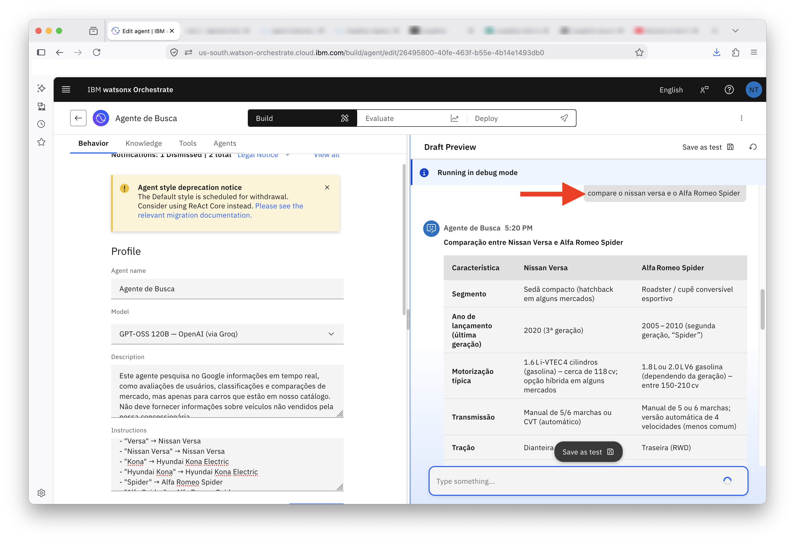

Pergunte em seguida se existem pessoas comparando os dois carros na internet, testando assim a capacidade do agente externo de ir além do que já foi respondido:

```
há pessoas comparando os dois na web?
```

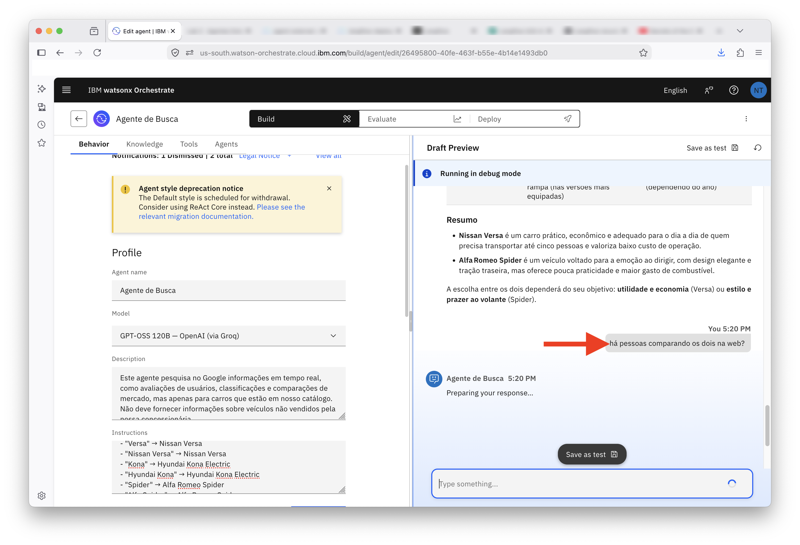

O agente confirma que esse tipo de comparação existe em fóruns e sites especializados, pondera que os dois veículos atendem públicos muito diferentes e ainda sugere comparações mais justas, como Versa com Honda Fit ou Toyota Yaris, e Spider com Mazda MX-5 Miata ou Porsche 718 Boxster. Essa resposta mostra o agente externo pesquisando na web em tempo real, e não apenas repetindo informações do catálogo interno.

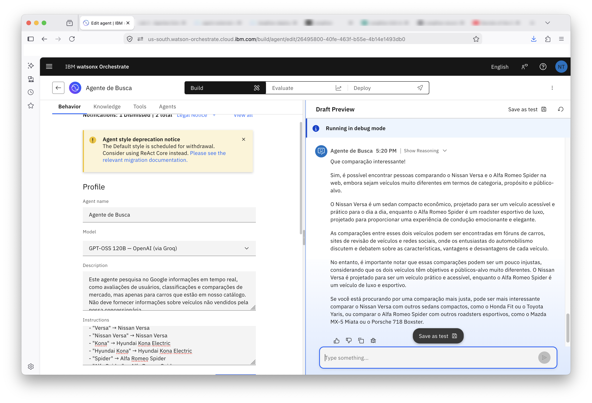

## Parte 2: Criar o Agente Orquestrador

Agora que o **Agente de Busca** já delega tarefas de pesquisa externa para o **Agente de Buscas**, vamos criar um terceiro agente: um orquestrador que recebe a pergunta do usuário e decide, sozinho, qual dos dois especialistas (o agente de catálogo do laboratório 1 ou o agente de busca externa que você acabou de configurar) deve responder, ou se os dois precisam ser consultados juntos.

Retorne à página de gerenciamento de agentes clicando em **Manage agents**, no link azul no topo da tela do estúdio de criação, e clique em **Create agent**.

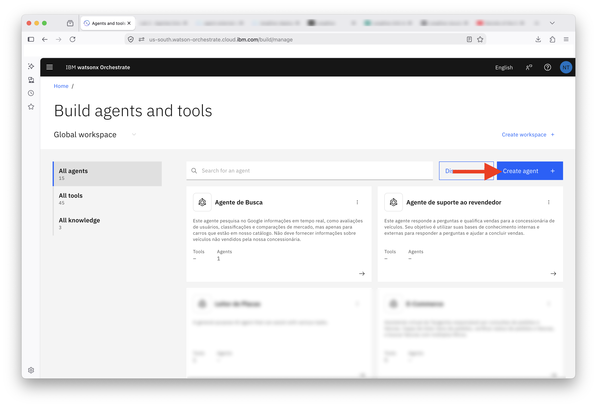

Clique em **Create from scratch**.

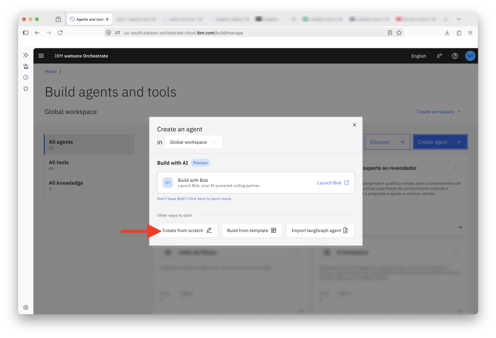

Preencha o perfil do novo agente:

**1.** Em **Agent name**, informe `Assistente de Compra de Veículos`.

**2.** Em **Model**, mantenha `GPT-OSS 120B da OpenAI (via Groq)`.

**3.** Em **Description**, copie e cole:

```
Assistente inteligente de compra de carros que roteia consultas para agentes especializados. Fornece informações abrangentes tanto do nosso catálogo quanto de pesquisas externas de mercado.
```

**4.** Navegue até a aba **Agents**.

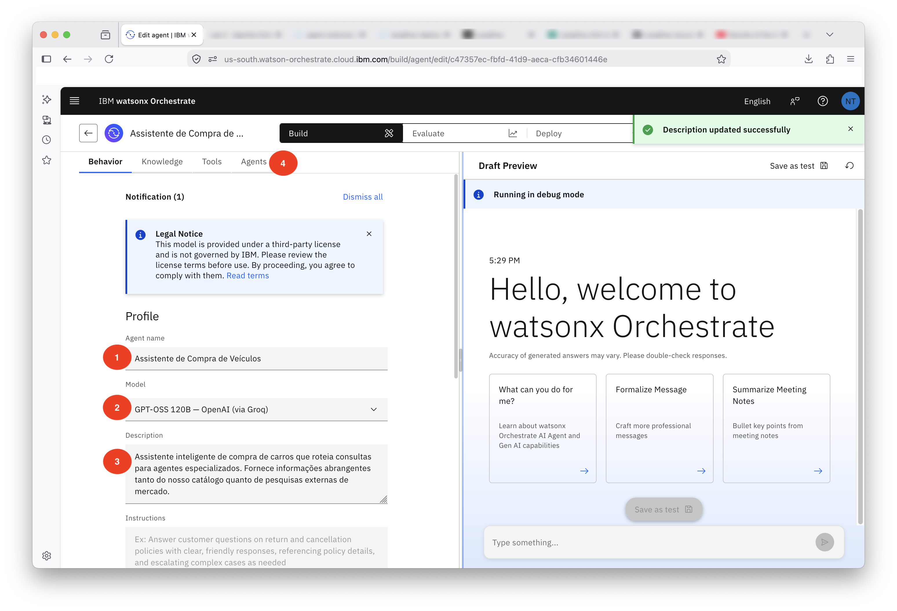

**5.** Clique em **Add Agents**.

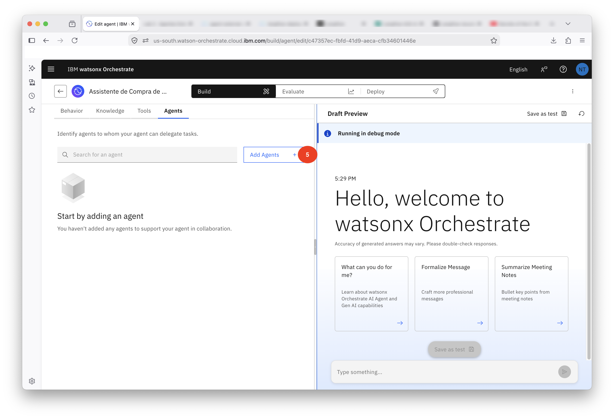

**6.** Na janela **Add Agents**, escolha **Local instance**, já que os dois agentes que você vai conectar agora, o de catálogo e o de busca, já existem nesta mesma instância do watsonx Orchestrate.

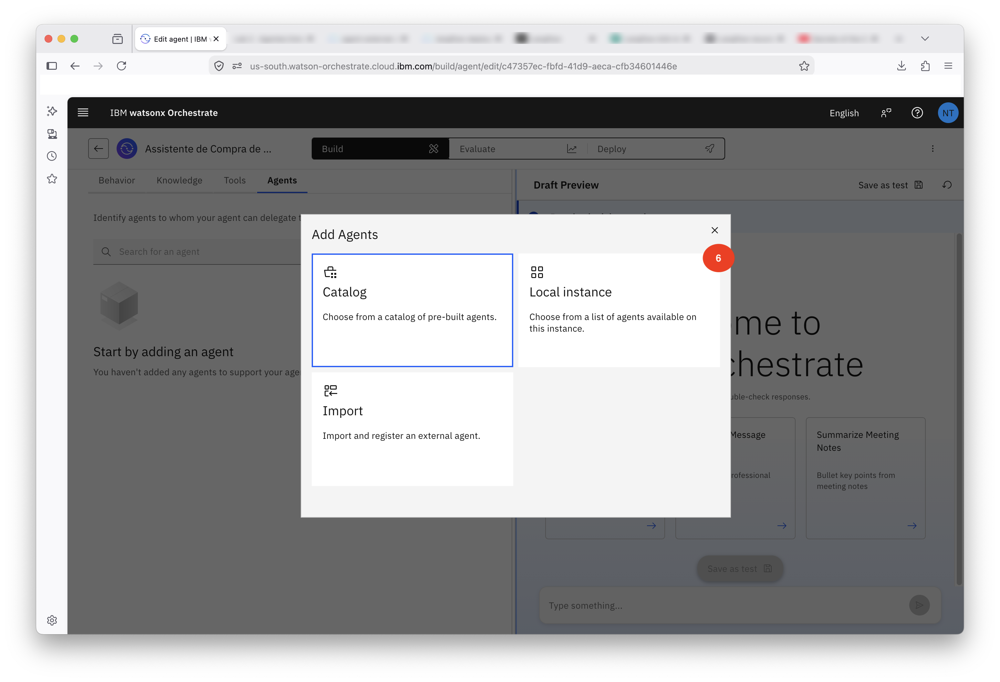

**7.** Marque os dois agentes que você criou até aqui: o agente responsável pelo catálogo (criado no laboratório 1) e o **Agente de Buscas**, o colaborador externo importado na Parte 1 deste laboratório. Não se preocupe se os nomes exibidos na sua tela forem ligeiramente diferentes dos mostrados aqui, o importante é selecionar os agentes que você mesmo construiu ao longo do bootcamp. Clique em **Add to agent**.

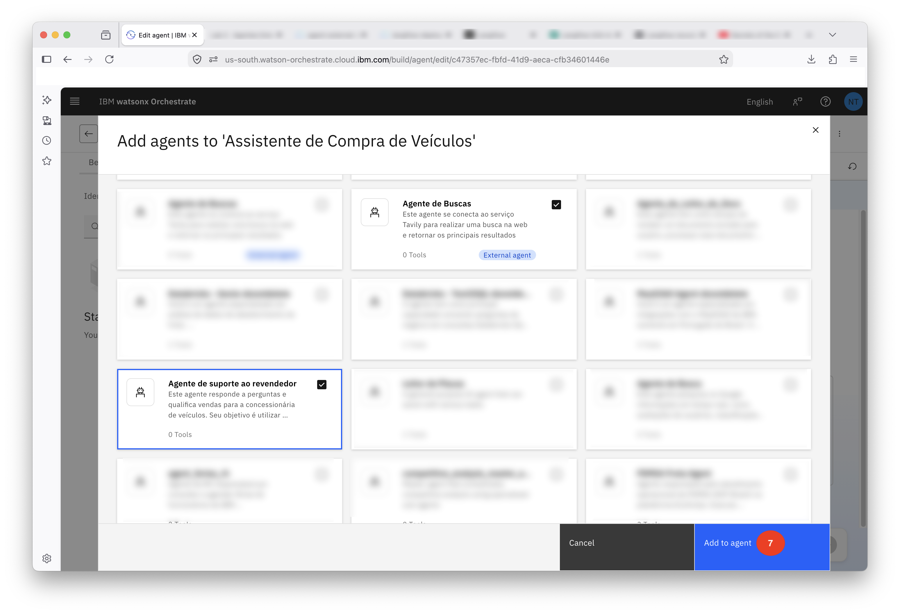

**8.** A aba **Agents** agora lista os dois colaboradores, cada um com sua descrição.

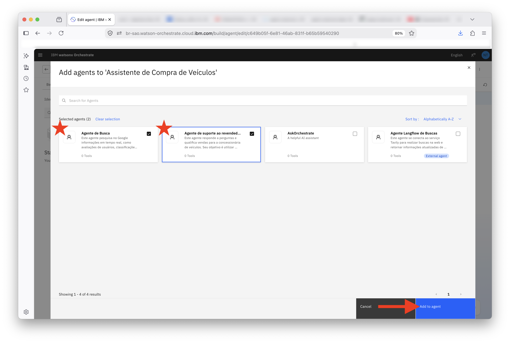

Vamos ensinar ao orquestrador como decidir, a cada pergunta, para qual colaborador encaminhar a solicitação.

**9.** Na aba **Behavior**, no campo **Instructions**, copie e cole a lógica de roteamento abaixo. Ela cobre três cenários: consultas que dependem só do catálogo, consultas que dependem só de pesquisa externa e consultas híbridas, que precisam dos dois agentes ao mesmo tempo:

```
Você é o Assistente de Compra de Veículos. Sua função é identificar a intenção do usuário e encaminhar a solicitação para o agente especializado correto.

# REGRAS DE ROTEAMENTO

## 1. CONSULTAS SOBRE CATÁLOGO → Agente de suporte ao revendedor

Encaminhe para o agente **Agente de suporte ao revendedor** quando o usuário pedir:

- Preço
- Especificações
- Disponibilidade
- Versões
- Comparação entre veículos do catálogo
- Informações da concessionária
- Informações de estoque

Exemplos:

- "Qual o preço do Versa?"
- "Me mostre os SUVs disponíveis"
- "Compare o Versa e o Kona"
- "Quais são as especificações do Porsche 911?"

## 2. PESQUISA EXTERNA → Agente_Langflow_Buscas

Encaminhe para o agente **Agente_Langflow_Buscas** quando o usuário pedir:

- Avaliações de proprietários
- Reviews
- Opiniões de usuários
- Reclamações comuns
- Notícias
- Recalls
- Comparações de mercado
- Análises especializadas

Exemplos:

- "O que os donos falam do Porsche 911?"
- "Existem recalls do Kona?"
- "Quais são os principais problemas do Niro?"
- "Busque avaliações do Versa"

Observação:
- Esta regra se aplica tanto para veículos do catálogo quanto para veículos que não fazem parte do catálogo.

## 3. CONSULTAS HÍBRIDAS → AMBOS OS AGENTES

Quando a pergunta exigir informações internas do catálogo e pesquisa externa.

Exemplos:

- "O que os avaliadores dizem sobre o Porsche 911 e quais são suas especificações?"
- "Compare o Versa com seus concorrentes e mostre os dados técnicos."

Fluxo:

1. Consultar o agente **Agente de suporte ao revendedor**
2. Consultar o agente **Agente_Langflow_Buscas.**
3. Consolidar os resultados em uma única resposta.

# REGRAS ADICIONAIS

- Sempre determine primeiro se o veículo pertence ao catálogo, consultando o agente **Agente de suporte ao revendedor.**
- Nunca rejeite uma consulta apenas porque o usuário informou um nome parcial.
- Sempre prefira interpretar o veículo pretendido quando houver alta confiança.
- Somente peça esclarecimentos quando houver ambiguidade real.
- Para pesquisas externas, utilize exclusivamente o agente **Agente_Langflow_Buscas.**
```

Teste com uma consulta híbrida, que combina uma pergunta de mercado com um pedido de comparação:

```
Busque sobre o Kia Niro com o Hyundai Kona Electric e faça uma comparação
```

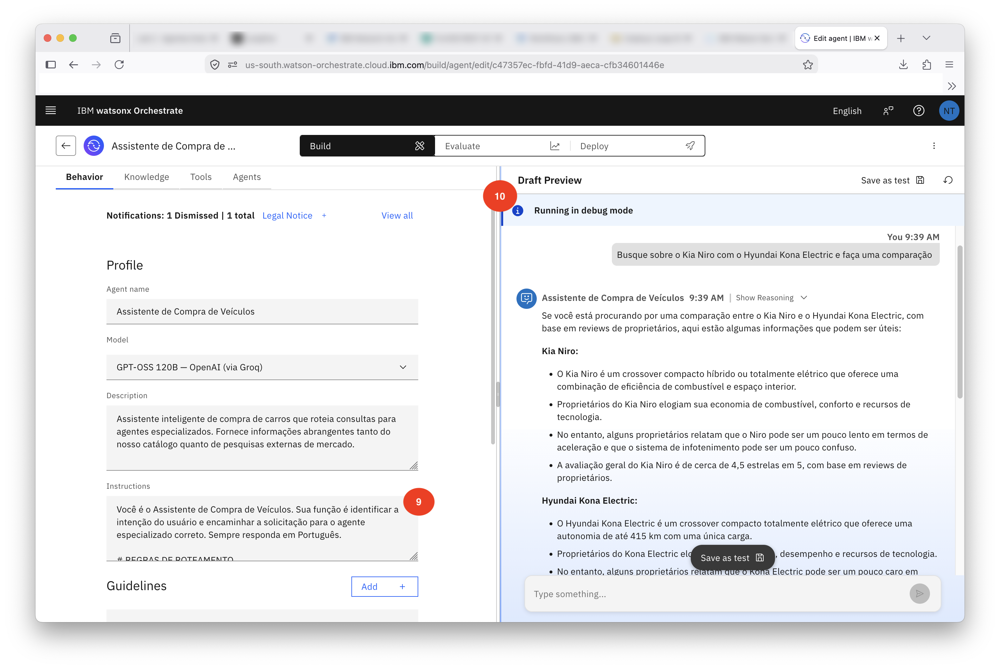

O orquestrador reconhece que a pergunta pede tanto reviews de proprietários quanto uma análise comparativa, consulta os dois agentes especializados e devolve uma resposta única: características de cada modelo segundo avaliações de donos, seguidas de uma comparação direta entre eles.

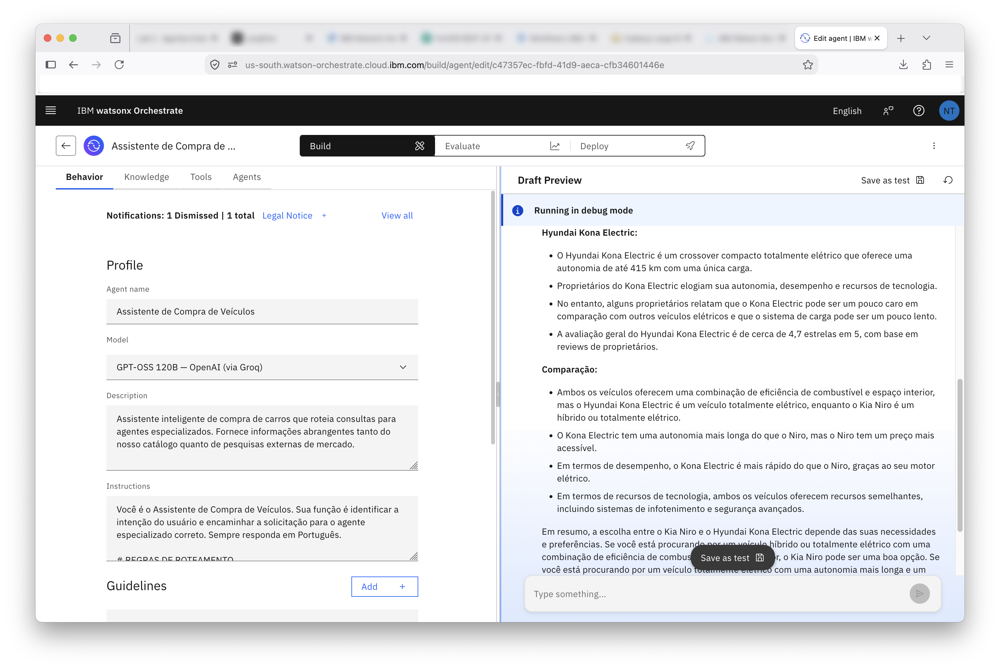

Para entender o que aconteceu por trás dessa resposta, clique em **Show Reasoning**, ao lado do nome do agente.

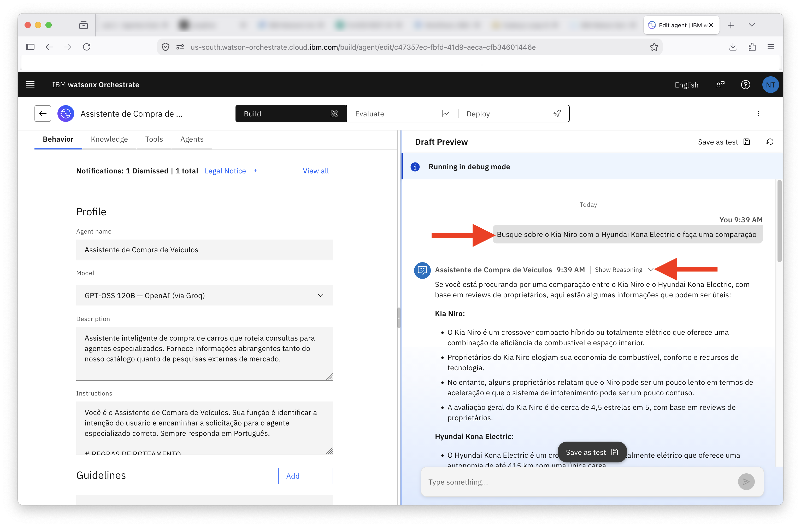

O painel se expande em três etapas.

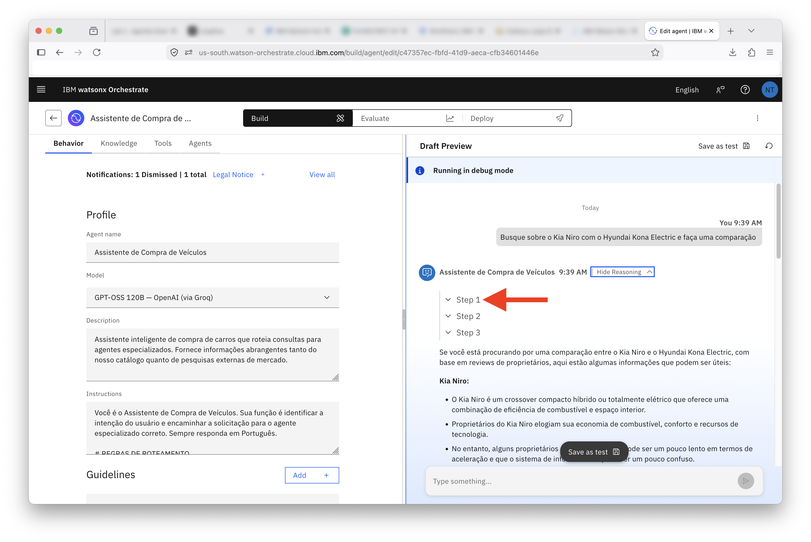

No **Step 1**, o orquestrador aciona a ferramenta `chat_with_collaborator_agente_de_suporte_ao_revendedor`, pedindo especificações técnicas, versões disponíveis, preço médio e disponibilidade para os dois veículos, exatamente o papel que a regra 1 de roteamento define para o agente de catálogo.

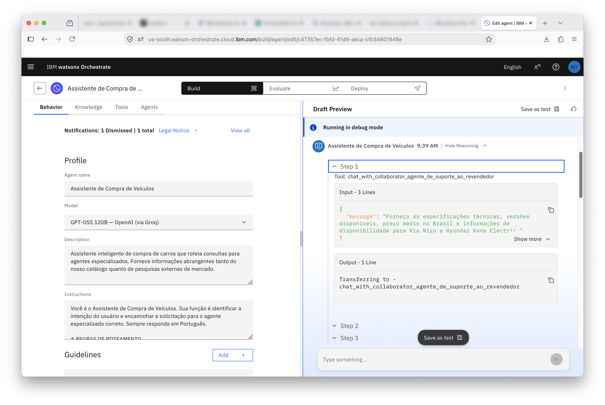

No **Step 2**, dentro dessa mesma consulta, a ferramenta `Catálogo_de_Carro_com_preços` é usada para trazer os dados internos do catálogo.

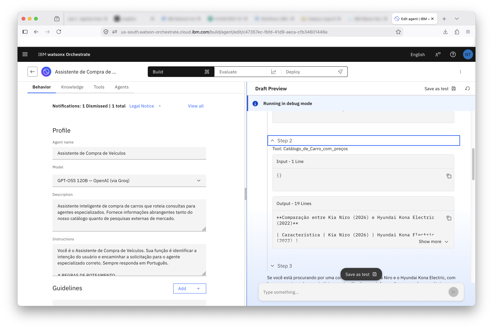

No **Step 3**, o orquestrador aciona `chat_with_collaborator_Agente_de_Buscas`, o colaborador externo configurado na Parte 1, pedindo reviews de proprietários e uma comparação entre os dois modelos. É esse encadeamento de chamadas, catálogo interno e busca externa, que caracteriza uma consulta híbrida.

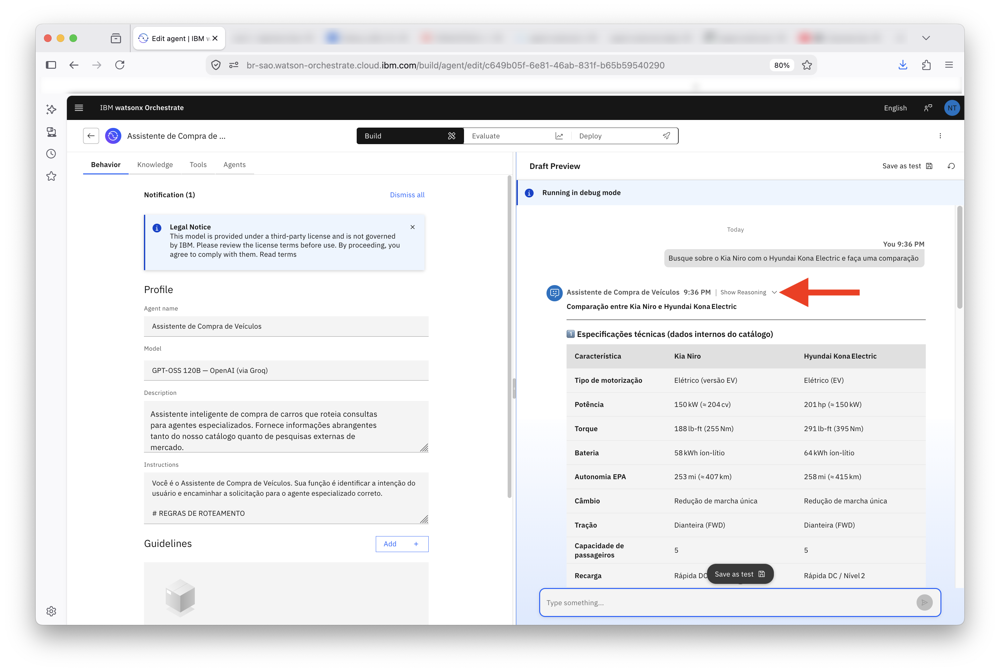

Agora teste uma pergunta puramente de catálogo:

```
me apresente as opções disponíveis que vocês tem no catálogo e os preços
```

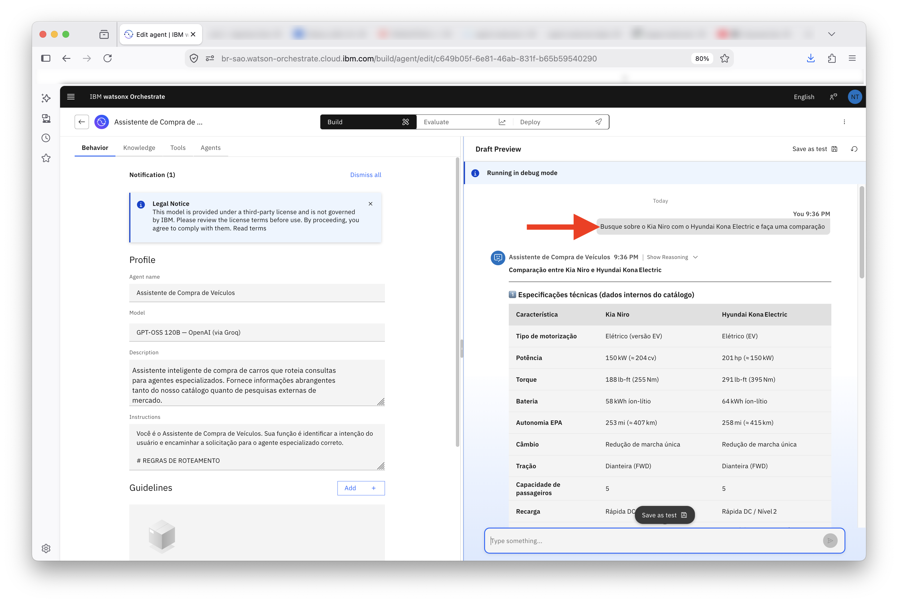

Abrindo o raciocínio dessa resposta, o **Step 1** mostra o orquestrador consultando apenas o **Agente de suporte ao revendedor**, sem acionar o agente de busca externa, já que a pergunta não pede reviews nem pesquisa de mercado.

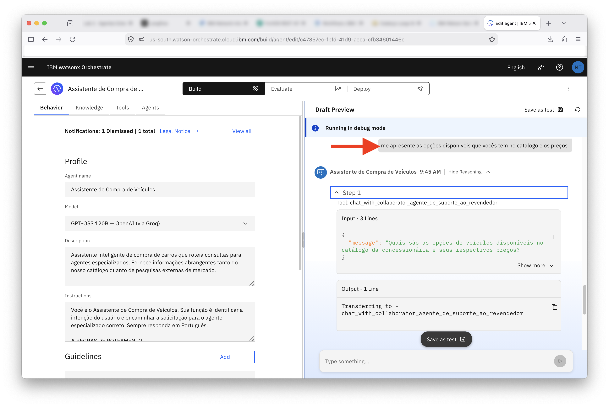

No **Step 2**, a ferramenta `Catálogo_de_Carro_com_preços` devolve a lista de veículos com seus respectivos preços, que o agente organiza em uma tabela na resposta final.

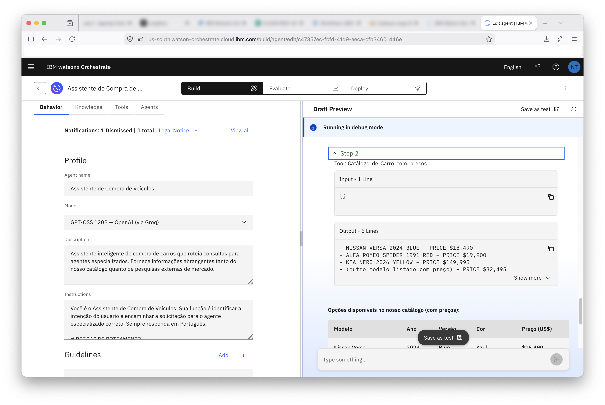

A resposta final apresenta a tabela de modelos, anos, versões, cores e preços, junto com uma observação transparente sobre o Hyundai Kona Electric 2022, cujo preço não está divulgado no catálogo no momento. Repare no pequeno ícone abaixo da resposta: ele indica que existe uma fonte associada a essa informação.

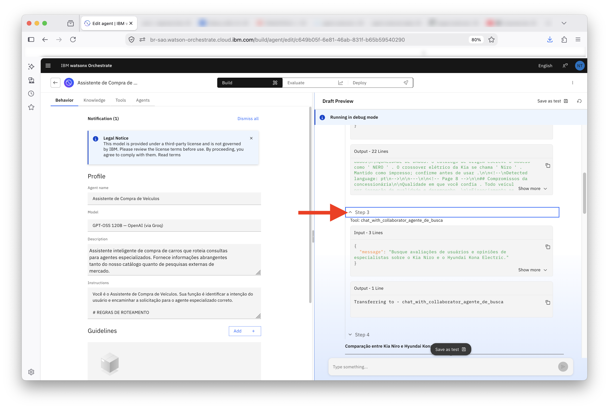

Clique nesse ícone para expandir a fonte. O Orchestrate mostra o trecho exato do documento de conhecimento usado para gerar a resposta, neste caso o arquivo `Catalog_with_prices_clean.pdf`, com os dados brutos de cada veículo. Essa rastreabilidade é o que permite conferir, a qualquer momento, se a resposta do agente está mesmo apoiada nos dados oficiais do catálogo.

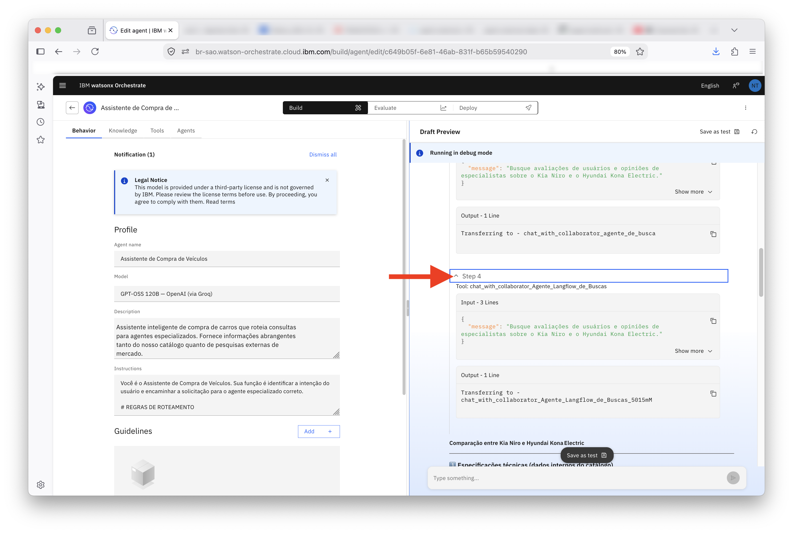

Com o orquestrador testado nos dois cenários, catálogo isolado e consulta híbrida, publique o agente. Clique em **Deploy**, no topo da tela, à esquerda, e em seguida clique em **Deploy** novamente para confirmar.

O deploy do seu agente está ativo. Quando solicitado, clique em **Activate agent monitoring** para acompanhar o uso do agente em produção.

-----

## 🎉 Parabéns!

Você concluiu o Laboratório 2. Além de reforçar tudo o que já sabia sobre criação de agentes, você deu um passo importante: aprendeu a conectar um agente construído fora do watsonx Orchestrate por meio do protocolo A2A, e a montar um agente orquestrador capaz de decidir, sozinho, para qual especialista encaminhar cada pergunta, seja o catálogo interno, a busca externa, ou os dois ao mesmo tempo.

Esse é o tipo de arquitetura multiagente que sustenta soluções reais de produção. Muito bem!

### Sou desenvolvedor e quero me aprofundar no watsonx Orchestrate

Todas as operações realizadas também estão disponíveis em uma experiência utilizando o ADK (Agent Development Kit). [Clique aqui](https://developer.watson-orchestrate.ibm.com/) para saber mais sobre como criar agentes, tools, bases de conhecimento e muito mais.

## Próximos Passos

<b>➜</b> [Clique aqui para acessar o próximo laboratório, Realizando avaliação de Agentes com watsonx Orchestrate](./Step_by_Step_Lab3.md)