# Monitorando Agentes em Tempo Real com watsonx Orchestrate

## Visão Geral

Este laboratório apresenta os recursos de monitoramento em tempo real disponíveis no watsonx Orchestrate.

Ao longo das atividades, você vai aprender a acompanhar o desempenho dos agentes, consultar as métricas por linguagem natural através do assistente integrado ao painel de controle, e analisar conversas individuais para entender o comportamento de um agente específico.

O monitoramento contínuo é essencial para garantir a eficiência dos agentes em produção, identificar comportamentos inesperados e agir proativamente na resolução de problemas antes que eles impactem a experiência dos usuários.

## Índice

- [Monitorando Agentes em Tempo Real com watsonx Orchestrate](#monitorando-agentes-em-tempo-real-com-watsonx-orchestrate)
  - [Visão Geral](#visão-geral)
  - [Índice](#índice)
  - [Visualizar Resultados de Monitoramento](#visualizar-resultados-de-monitoramento)
  - [Entendendo as Métricas](#entendendo-as-métricas)
  - [Resumo](#resumo)
  - [Sou desenvolvedor e quero me aprofundar no watsonx Orchestrate](#sou-desenvolvedor-e-quero-me-aprofundar-no-watsonx-orchestrate)
  - [Próximos Passos](#próximos-passos)

## Visualizar Resultados de Monitoramento

Vamos conhecer o painel de controle de monitoramento do watsonx Orchestrate. Ao acessar o ambiente da sua instância do watsonx Orchestrate, você pode ver um aviso apresentando os novos dashboards do Agentic Control Plane, que reúnem em um só lugar as métricas de mensagens, implantação, avaliação, agentes e controles referentes à sua instância.

Feche o aviso clicando em **Maybe later**, para ver o dashboard completo.

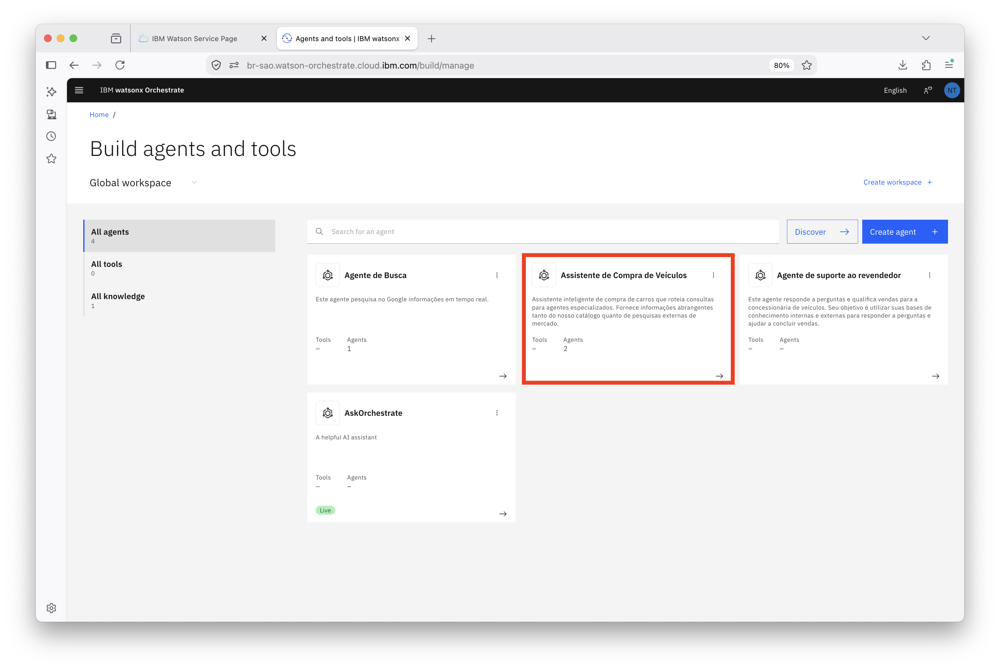

 Logo no topo, os cartões Messages, Feedback, Deployment status, Evaluation status, Agents e Controls resumem o estado geral do ambiente na última semana, enquanto o painel Needs attention, à direita, reúne os pontos que merecem atenção, como agentes sem casos de teste ou sem avaliação recente.

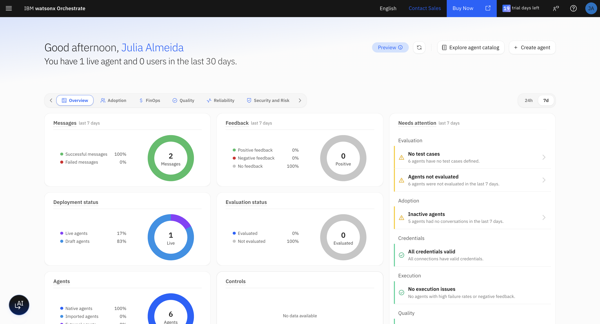

No canto inferior esquerdo da tela, clique no ícone circular com o símbolo de IA para abrir o assistente do painel de controle.

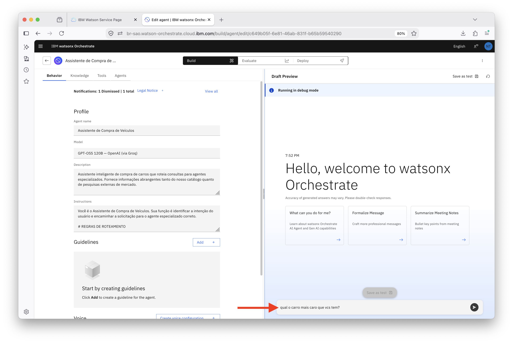

O assistente abre com sugestões prontas, como identificar os agentes com maior duração ou volume de conversas, encontrar agentes sem avaliação ou com cobertura de testes fraca, e listar os agentes com mais feedback negativo. Você também pode digitar sua própria pergunta em linguagem natural.

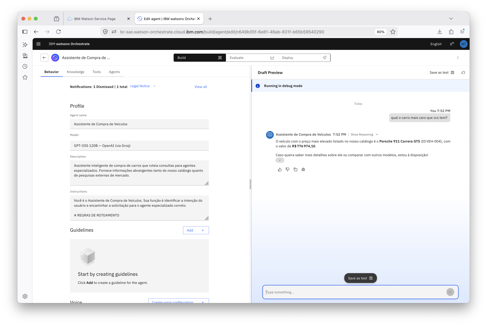

Role o dashboard para baixo para ver as seções Usage trends e Operational trends, com gráficos de usuários ativos, agentes ativos, mensagens, uso de tokens, taxa de falha, conversas com erro e latência ao longo dos últimos dias. Em seguida, digite a pergunta abaixo no campo de mensagem do assistente.

```
Mostre os agentes com a menor taxa de sucesso desta semana
```

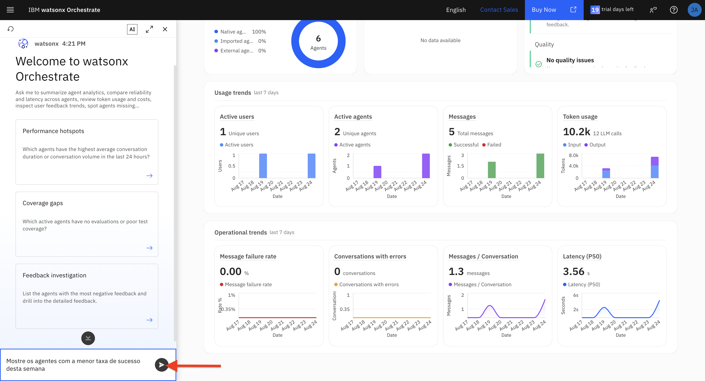

O assistente responde diretamente, sem que você precise navegar por gráficos. Nesse caso, ele identificou o AskOrchestrate como o agente com a menor taxa de sucesso da semana, zero por cento, detalhando o total de conversas e quantas delas falharam. Clique em `Show Reasoning` caso queira ver como o assistente chegou a essa conclusão, e use os ícones de joinha para avaliar a resposta.

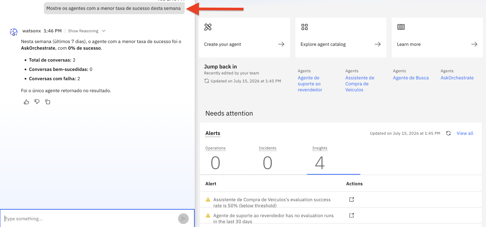

Agora vamos explorar a análise clássica, focada em conversas individuais. Clique no menu hambúrguer, no canto superior esquerdo, e selecione `Analyze`.

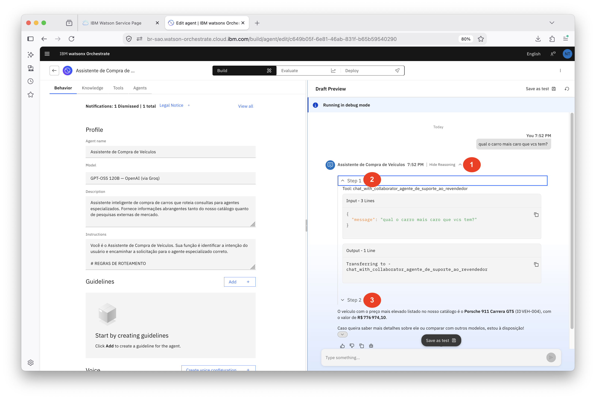

A página Analytics mostra o total de conversas, usuários únicos e duração média de conversação do período selecionado, além do gráfico Agent trend, comparando o volume de conversas entre os agentes, e da tabela User Feedback, com a contagem de avaliações positivas e negativas recebidas por cada um. Clique no nome de um agente, como `Car Sales Assistant`, para ver seus detalhes.

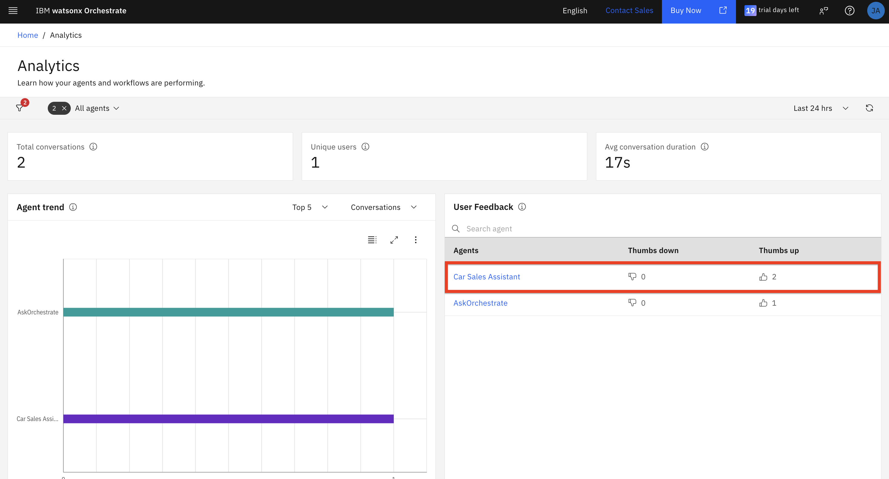

A aba Overview do agente traz métricas mais específicas, como contagem de tokens de entrada e saída, duração média de conversação, latência média por mensagem, o gráfico Usage trend, o donut de User feedback e o painel Evaluation, que inclui a métrica de toxicidade. Como esse recurso está em Preview e o agente teve poucas interações, é normal que ele ainda não mostre dados de toxicidade.

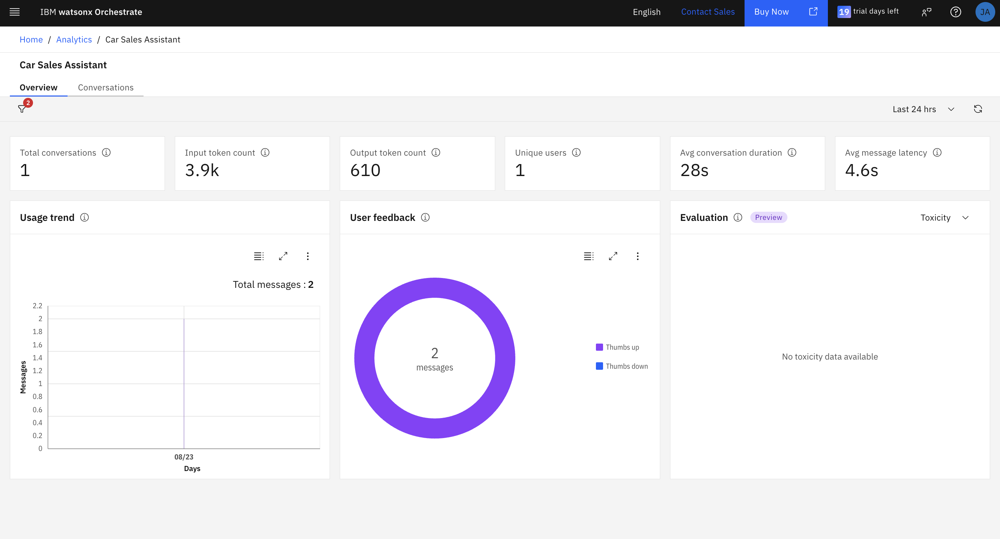

Clique na aba `Conversations` para mudar da visão agregada para a visão de conversas individuais.

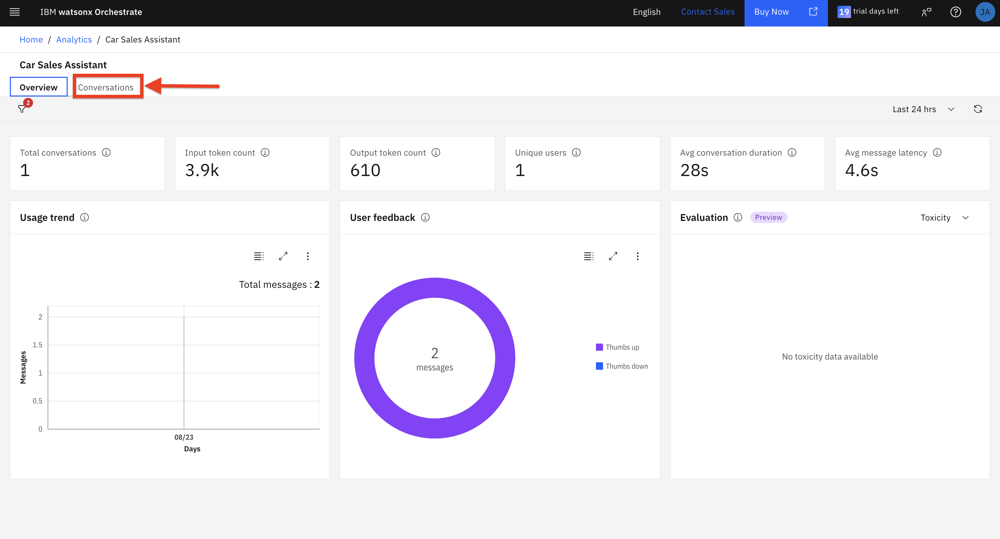

Selecione uma conversa na lista à esquerda para ver a troca de mensagens completa entre o usuário e o agente, com a opção de expandir o raciocínio de cada resposta. O painel Details, à direita, traz o identificador da conversa, o identificador do usuário, o horário de início e o total de feedbacks positivos e negativos recebidos naquela conversa específica.

Note que devido a você ter poucas interações no seu agente e em apenas um dia, a maioria das métricas não deve estar disponível, assim como na imagem abaixo.

Esses dois caminhos se complementam. O dashboard do Agentic Control Plane, com o assistente por linguagem natural, é o ponto de partida para perguntas amplas sobre o estado geral dos seus agentes. A página clássica de Analytics, com o detalhamento por conversa, é onde você investiga um caso específico até a mensagem exata que precisa ser entendida.

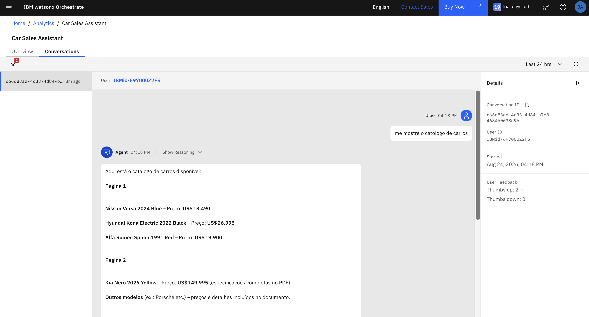

## Entendendo as Métricas:

Métricas de Feedback do Usuário:

`Thumbs up`: Número de respostas de feedback positivo dos usuários indicando satisfação com a resposta do agente.

`Thumbs down`: Número de respostas de feedback negativo dos usuários indicando insatisfação com a resposta do agente.

`Not rated`: Número de interações onde os usuários não forneceram feedback.

`Toxicity`: Pontuação indicando o nível de conteúdo tóxico, ofensivo ou inapropriado na resposta (0.00 = nenhuma toxicidade detectada).

`Input PII`: Pontuação indicando se informações pessoalmente identificáveis foram detectadas na entrada do usuário (0.00 = nenhuma PII detectada).

`Output PII`: Pontuação indicando se informações pessoalmente identificáveis foram detectadas na resposta do agente (0.00 = nenhuma PII detectada).

## Resumo

Parabéns por concluir o laboratório de monitoramento em tempo real do watsonx Orchestrate! 🎉 

Neste laboratório, você conheceu os dois caminhos que o watsonx Orchestrate oferece para acompanhar seus agentes em produção. Primeiro, explorou o dashboard do Agentic Control Plane, que reúne em uma única tela o estado geral do ambiente, mensagens, status de implantação, avaliação, agentes e controles, além do painel Needs attention, que já aponta o que precisa de atenção sem que você precise procurar. Em seguida, usou o assistente de IA integrado a esse painel para fazer uma pergunta em linguagem natural sobre a taxa de sucesso dos agentes na semana e recebeu uma resposta direta, já com o raciocínio disponível para consulta.

Depois, você passou para a página clássica de Analytics, mais focada em detalhamento por conversa. Ali viu o volume de conversas e o feedback recebido por cada agente, entrou nos detalhes de um agente específico, com métricas de tokens, latência e o painel de avaliação, e por fim abriu uma conversa individual para ver a troca de mensagens completa e os metadados daquela interação.

Com isso, você agora sabe quando recorrer a cada um desses recursos: o dashboard e o assistente por linguagem natural para ter uma visão ampla e rápida do que está acontecendo com seus agentes, e a análise por conversa para investigar um caso específico até a mensagem exata que precisa ser entendida. Essa combinação é o que torna possível identificar comportamentos inesperados e agir antes que eles afetem os usuários.

## Sou desenvolvedor e quero me aprofundar no watsonx Orchestrate

Todas as operações realizadas também estão disponíveis em uma experiência utilizando o ADK, o Agent Development Kit. [Clique aqui](https://developer.watson-orchestrate.ibm.com/) para saber mais sobre como criar agentes, tools, bases de conhecimento e muito mais.

## Próximos Passos

➜ [Clique aqui para navegar para o próximo lab, Control Plane Lab do watsonx Orchestrate](./Step_by_Step_Lab6.md)
