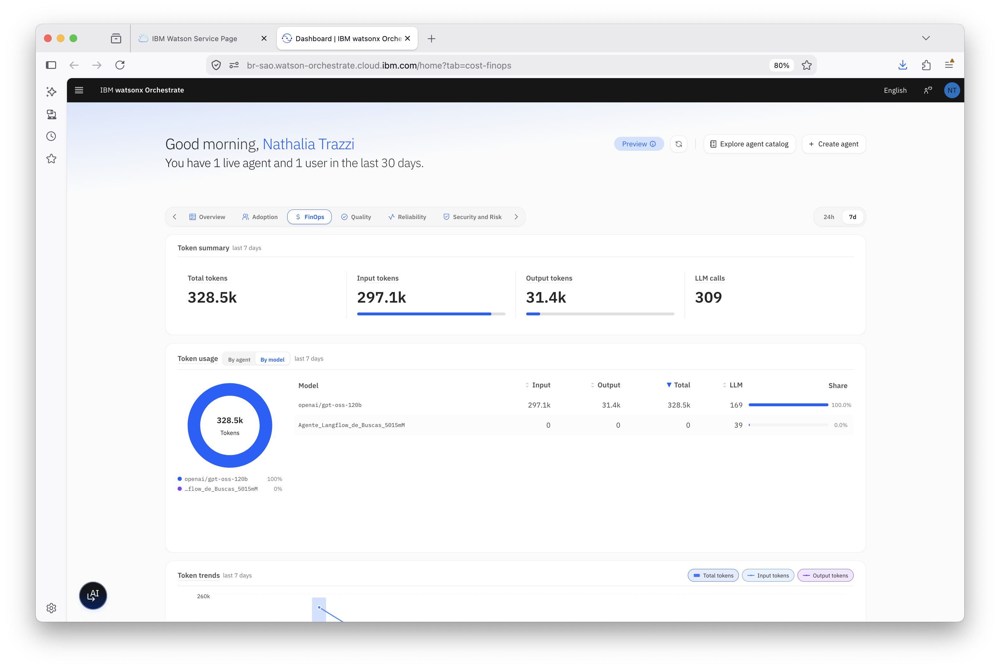
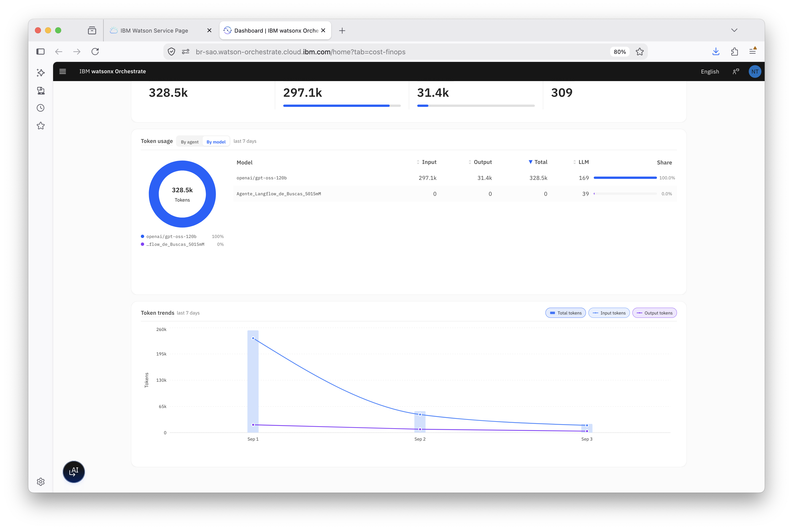

# Monitoramento em Tempo Real e Control Plane do watsonx Orchestrate

## Visão Geral

Este laboratório apresenta o **Agentic Control Plane** do **watsonx Orchestrate**, ele é um conjunto de painéis e ferramentas que reúne, em um só lugar, a visão de adoção, custos, qualidade, confiabilidade e segurança dos seus agentes e workflows construídos e reunidos.

Ao longo das atividades, você vai conversar com o agente do painel para consultar métricas em linguagem natural, navegar pelas abas do dashboard, conhecer o AgentOps e explorar as áreas de administração do tenant, o centro de controle de segurança e as configurações de seu tenant.

**O monitoramento contínuo é essencial para garantir a eficiência dos agentes em produção, identificar comportamentos inesperados e agir proativamente na resolução de problemas antes que eles impactem a experiência dos usuários.**

Conhecer essas ferramentas permite identificar rapidamente pontos de atenção, investigar falhas, acompanhar o consumo de tokens e revisar permissões, conexões e credenciais dos seus agentes antes que eles sejam expostos a usuários reais.

> [!NOTE]
> Os números mostrados nas imagens deste laboratório vêm de um ambiente de demonstração. No seu tenant, os valores serão diferentes, e alguns painéis podem aparecer como `No data available` se ainda não houver tráfego suficiente na janela de tempo selecionada.

## Índice

- [Monitoramento em Tempo Real e Control Plane do watsonx Orchestrate](#monitoramento-em-tempo-real-e-control-plane-do-watsonx-orchestrate)
  - [Visão Geral](#visão-geral)
  - [Índice](#índice)
  - [Explorando o Dashboard do Control Plane](#explorando-o-dashboard-do-control-plane)
    - [Perguntando ao agente do dashboard](#perguntando-ao-agente-do-dashboard)
    - [Overview: visão geral do ambiente](#overview-visão-geral-do-ambiente)
    - [Adoption: Engajamento e uso dos agentes](#adoption-engajamento-e-uso-dos-agentes)
    - [FinOps: consumo de tokens](#finops-consumo-de-tokens)
    - [Quality: qualidade das respostas](#quality-qualidade-das-respostas)
    - [Reliability: confiabilidade e desempenho](#reliability-confiabilidade-e-desempenho)
    - [Security and Risk: controles de segurança](#security-and-risk-controles-de-segurança)
    - [Navegando entre as abas e atualizando os dados](#navegando-entre-as-abas-e-atualizando-os-dados)
  - [Entendendo as Métricas](#entendendo-as-métricas)
  - [AgentOps: O Assistente de otimização de agentes](#agentops-o-assistente-de-otimização-de-agentes)
  - [Security Control Center: acessos, conexões e credenciais](#security-control-center-acessos-conexões-e-credenciais)
    - [Agents: o que cada agente pode acessar](#agents-o-que-cada-agente-pode-acessar)
    - [Connections: integrações com aplicações](#connections-integrações-com-aplicações)
    - [Team credentials: credenciais compartilhadas](#team-credentials-credenciais-compartilhadas)
  - [Configurações do Tenant](#configurações-do-tenant)
    - [Data Retention: retenção do histórico de chat](#data-retention-retenção-do-histórico-de-chat)
    - [API details: chaves e URL da instância](#api-details-chaves-e-url-da-instância)
    - [Embed Security: segurança do chat incorporado](#embed-security-segurança-do-chat-incorporado)
    - [Platform languages: idiomas do tenant](#platform-languages-idiomas-do-tenant)
    - [Member credentials: credenciais individuais](#member-credentials-credenciais-individuais)
    - [Models: seleção de modelos](#models-seleção-de-modelos)
    - [Analytics: mascaramento de PII](#analytics-mascaramento-de-pii)
    - [Catalog: acesso a ativos prontos](#catalog-acesso-a-ativos-prontos)
  - [Resumo](#resumo)
    - [Sou desenvolvedor e quero me aprofundar no watsonx Orchestrate](#sou-desenvolvedor-e-quero-me-aprofundar-no-watsonx-orchestrate)
  - [Próximos Passos](#próximos-passos)

## Explorando o Dashboard do Control Plane

Ao acessar o ambiente da sua instância do **watsonx Orchestrate**, você chega diretamente ao dashboard do Agentic Control Plane, com uma saudação personalizada e um resumo de quantos agentes estão em produção (Live) e quantos usuários interagiram com eles nos últimos 30 dias.

Antes de percorrer as abas, clique no ícone circular de IA, no canto inferior esquerdo da tela, para abrir o agente do painel de controle, conforme indicado na imagem abaixo:


### Perguntando ao agente do dashboard

O agente abre em um painel lateral, com uma mensagem de boas-vindas e três sugestões prontas, **Performance hotspots**, **Coverage gaps** e **Feedback investigation**, além de um campo livre para perguntas em linguagem natural.

Digite a pergunta abaixo no campo de mensagem e clique no botão de envio.

```
Quais são os pontos mais críticos dos meus agentes atualmente?
```


A pergunta aparece no histórico da conversa e o agente sinaliza que está processando, com a mensagem...


Enquanto elabora a resposta, o agente mostra o raciocínio que está executando: ele consulta conversas, traces e chamadas de ferramenta do período e monta um cálculo de severidade por agente para ranquear os pontos críticos.


A resposta final aponta os dois agentes com os pontos críticos mais relevantes dos últimos sete dias: o **Assistente de Compra de Veículos**, com severidade 2,78, uma conversa com falha, um trace com falha, sete observações com falha e taxa de falha de 11,11%; e o **Agente de Busca**, com severidade 2,31, seis conversas com falha, seis traces com falha, 22 observações com falha e taxa de falha de 9,23%. Os dois mantêm 100% de sucesso nas chamadas de ferramenta.

O resumo fecha a análise indicando que os problemas atuais não estão nas ferramentas nem em erros de mensagem, mas em falhas técnicas nas traces e no impacto delas sobre as conversas  e sugere priorizar a correção pelo agente de maior severidade. Use `Show Reasoning` para reabrir o raciocínio, os ícones de joinha para avaliar a resposta e o ícone de cópia para reaproveitar o texto.


Agora faça uma segunda pergunta, dessa vez olhando para o outro lado da operação.

```
Quais são os pontos positivos?
```

O agente responde destacando a estabilidade das ferramentas (65 chamadas no período, nenhuma falha, 100% de sucesso), a saúde geral da operação (162 mensagens no total, 155 bem-sucedidas, taxa geral de 95,68%) e os três agentes com sinais positivos, com o número de conversas de cada um.


Role a resposta para ver o restante da análise. 

Os problemas não vêm de falhas de ferramenta e os agentes continuam processando conversas com boa estabilidade técnica. O agente ainda se oferece para transformar a análise em uma leitura mais executiva, separando "o que está funcionando bem", "o que merece atenção" e "prioridade imediata".


Como o painel do agente fica lado a lado com o dashboard, você pode rolar a página ao fundo e conferir nos gráficos os mesmos números citados na resposta, sem perder o contexto da conversa.


Ao rolar o histórico para cima, você vê a pergunta enviada junto da resposta consolidada.

- Taxa geral de sucesso de 95,68% (155 de 162 mensagens) <br>
- Sucesso total em 65 chamadas de ferramenta e o detalhamento dos três agentes de melhor desempenho: Agente de Busca (score 100, 55 conversas), Agente de suporte ao revendedor (score 100, 20 conversas) e Assistente de Compra de Veículos (score 99, 9 conversas, todos sem mensagens com falha)


> [!TIP]
> O agente responde no mesmo idioma da pergunta, então você pode conversar com ele em português mesmo com a interface em inglês. Vale testar perguntas como "qual agente consumiu mais tokens esta semana?" ou "quais agentes ainda não têm casos de teste?".

### Overview: visão geral do ambiente

Feche o agente e volte ao dashboard. A aba **Overview**, selecionada por padrão, reúne seis cartões de resumo: **Messages**, **Feedback**, **Deployment status**, **Evaluation status**, **Agents** e **Controls**, cada um com a taxa de sucesso ou a distribuição relevante do período.

À direita, o painel **Needs attention** já aponta o que precisa da sua atenção, agrupado por categoria **Evaluation, Adoption, Credentials, Execution e Quality** sem que você precise procurar manualmente. No exemplo, ele sinaliza três agentes sem casos de teste, três agentes não avaliados nos últimos sete dias e um agente inativo, enquanto credenciais, execução e qualidade aparecem sem pendências.

No canto superior direito, o seletor **24h / 7d** define a janela de tempo aplicada a todos os cartões da aba.


Role a página para baixo para ver as seções **Usage trends**  usuários ativos, agentes ativos, mensagens e uso de tokens e **Operational trends**, com taxa de falha de mensagens (4,32%), conversas com erro (7), mensagens por conversa (1,2) e latência P50 (2,50 s) ao longo dos últimos sete dias.


### Adoption: Engajamento e uso dos agentes

Volte ao topo da página e clique na aba **Adoption**.

A seção **Engagement depth** mostra a relação entre usuários, conversas e chamadas de modelo: usuários por agente (0,3), conversas por usuário (140,00), mensagens por conversa (1,16) e chamadas de LLM por conversa (2,21), cada indicador acompanhado do total absoluto que o originou.


Logo abaixo, **Agent analytics** detalha o comportamento de cada agente no período. Quando ainda não há dados agregados para a janela selecionada, o painel exibe `No data available`, use o link **View agent analytics**, no canto superior direito do cartão, para abrir a visão completa de analytics.

Role a página para ver o gráfico **Adoption trends**, que compara conversas, usuários ativos e agentes ativos ao longo do tempo, e o painel **Model usage distribution**, que mostra quantos modelos estão disponíveis (11) e quantos estão efetivamente em uso (1, o GPT-OSS 120B), além de quantos agentes utilizam cada um deles.


### FinOps: consumo de tokens

Volte ao topo e clique na aba **FinOps**.

O **Token summary** resume o consumo da semana: 328,5 mil tokens no total, divididos entre 297,1 mil de entrada e 31,4 mil de saída, distribuídos em 309 chamadas de LLM. Logo abaixo, **Token usage** traz um gráfico de rosca com a distribuição percentual e uma tabela detalhada com tokens de entrada, saída, total, número de chamadas e participação de cada agente.


Role a página para ver a tabela completa e o gráfico **Token trends**, com pílulas de alternância entre Total tokens, Input tokens e Output tokens ao longo dos últimos sete dias. No exemplo, o Agente de suporte ao revendedor concentra 62,6% do consumo, seguido pelo Agente de Busca (20,8%) e pelo Assistente de Compra de Veículos (16,5%).


Alterne a visualização de **By agent** para **By model** para ver o mesmo consumo agrupado por modelo. Aqui, o `openai/gpt-oss-120b` responde por 100% dos tokens do período.



Repare no agente externo baseado em Langflow: ele aparece com zero tokens de entrada e saída, porque o processamento acontece fora do watsonx Orchestrate, mas suas 39 chamadas continuam sendo contabilizadas na coluna **LLM**. Esse é um detalhe importante ao comparar custos entre agentes nativos e externos.



Agora troque o seletor de período de **7d** para **24h**. Como não houve tráfego nas últimas 24 horas neste ambiente, todos os painéis passam a exibir `No data available`. Vale lembrar disso sempre que um dashboard parecer vazio: antes de investigar um problema, confira a janela de tempo selecionada.


### Quality: qualidade das respostas

Volte o seletor para **7d** e clique na aba **Quality**.

A seção **Insights** mostra quantos agentes já possuem avaliações configuradas (1 de 5), o feedback dos usuários e as métricas de **Helpfulness score** e **Hallucination score**. Esses três últimos indicadores dependem de feedback dos usuários e de avaliações executadas, então aparecem como `No data available` enquanto não houver esse insumo. O mesmo vale para a tabela **Agent feedback**, logo abaixo.


Role a página para ver três painéis lado a lado: **Top agents by positive feedback**, **Top agents by negative feedback** e **Tool call success**, este último com a taxa de sucesso das chamadas de ferramenta (100,0%) e o comparativo entre chamadas bem-sucedidas, com falha e totais. Mais abaixo, o gráfico **Feedback trends** permite alternar entre mensagens totais, bem-sucedidas, com falha, feedback positivo e negativo.


### Reliability: confiabilidade e desempenho

Volte ao topo e clique na aba **Reliability**.

A seção **Utilization (7-day)** mostra quantos modelos estão ativos, a média de mensagens por conversa e por agente ativo e quantos agentes estão sob carga com falhas de trace, no exemplo, dois. A tabela **Agent latency** detalha, por agente, mensagens, mensagens com falha, taxa de erro e as latências P50, P95 e P99, com um campo de busca para instâncias com muitos agentes.

A legenda abaixo da tabela explica o código de cores: mensagens com falha a partir de 20 e de 100; taxa de erro abaixo de 5%, entre 5% e 15% e acima de 15%; P95 abaixo de 3 s, entre 3 s e 6 s e acima de 6 s; e P99 abaixo de 5 s, entre 5 s e 8 s e acima de 8 s. É o caminho mais rápido para identificar qual agente merece investigação.


Role a página para ver **Deployment readiness** (65 chamadas de ferramenta, 7 conversas com falha e latência P95 de 55,01 s), **Runtime inventory** (5 agentes, toolkits e tools ainda não publicados e 1 base de conhecimento) e, na parte inferior, os gráficos **Latency trends**, que alterna entre os percentis p50, p95 e p99, e **Failed messages over time**, com o total de 7 mensagens com falha no período.


### Security and Risk: controles de segurança

Volte ao topo e clique na aba **Security and Risk**.

Essa aba resume o painel **Controls summary**, com o total de controles configurados na instância e sua divisão entre **Agent controls**, **Tool controls** e **Model controls**. Logo abaixo, a lista **Recent controls** mostra os controles mais recentes com o tipo, o ativo ao qual se aplicam, o ponto de aplicação e a data de criação.

No exemplo, existe um único controle: o `Controle de telefones`, do tipo **PII Filter**, aplicado a um agente, com enforcement em `INPUT & OUTPUT`. O link **View all**, no canto superior direito, abre a área completa de controles, onde novos controles podem ser criados.


### Navegando entre as abas e atualizando os dados

A barra de abas tem setas nas duas extremidades. A seta `>` (**Next**), à direita, avança para as abas seguintes quando elas não cabem na tela.


A seta `<` (**Previous**), à esquerda, faz o caminho inverso e devolve a barra para o início, na aba Overview.


Dois outros controles são úteis no dia a dia: o botão **Refresh data**, ao lado da etiqueta `Preview`, recarrega as métricas sem recarregar a página inteira; e o ícone de menu (☰), no canto superior esquerdo, abre a navegação principal do produto, que você usará nas próximas seções.


## Entendendo as Métricas

Antes de seguir, vale fixar o significado dos indicadores que aparecem nas abas do dashboard:

| Métrica | O que significa |
|---|---|
| `Successful / Failed messages` | Proporção de mensagens processadas com sucesso e de mensagens que terminaram em erro na janela selecionada. |
| `Positive / Negative / No feedback` | Distribuição do feedback dado pelos usuários (joinha para cima, para baixo ou nenhuma avaliação). |
| `Live / Draft agents` | Agentes publicados em produção versus agentes ainda em rascunho. |
| `Evaluated / Not evaluated` | Agentes que já passaram por avaliação versus os que ainda não têm avaliações executadas. |
| `Native / Imported / External agents` | Origem dos agentes: criados no Orchestrate, importados ou conectados a partir de plataformas externas. |
| `Input / Output tokens` | Tokens enviados ao modelo (prompt e contexto) e tokens gerados pelo modelo na resposta. |
| `LLM calls` | Número de chamadas feitas aos modelos de linguagem no período. |
| `Helpfulness score` | Quão útil a resposta do agente foi para a pergunta feita, medido pelas avaliações. |
| `Hallucination score` | Indicação de conteúdo gerado sem sustentação nos dados disponíveis ao agente. |
| `Tool call success` | Percentual de chamadas de ferramenta concluídas sem erro. |
| `Error rate` | Percentual de mensagens do agente que terminaram em falha. |
| `P50 / P95 / P99` | Latência mediana e as caudas de latência: 95% e 99% das requisições ficaram abaixo do valor mostrado. |
| `Agents under load` | Agentes com falhas de trace registradas na janela analisada. |
| `PII` | Informações pessoalmente identificáveis, como e-mails e telefones, detectadas na entrada do usuário ou na resposta do agente. |

## AgentOps: O Assistente de otimização de agentes

Abra o menu lateral pelo ícone ☰ e clique em **AgentOps**, item marcado com a etiqueta `Preview`.


O AgentOps abre um espaço de chat dedicado ao ciclo de vida dos agentes, o **Agent optimization assistant**, com um histórico de conversas à esquerda e três atalhos para começar:

- **Show available agents**: lista os agentes do workspace com seus detalhes principais.
- **Evaluate an agent**: executa casos de teste e resume os sinais de qualidade de um agente.
- **Optimize an agent**: otimiza as instruções (GEPA) ou as diretrizes (ACE) do agente.

Um banner no topo lembra que o AgentOps é um recurso em preview e que suas funcionalidades podem mudar antes da disponibilidade geral.


## Security Control Center: acessos, conexões e credenciais

Abra o menu lateral novamente, expanda o item **Manage** e selecione **Security**. Repare que, além de Security, o menu expandido também dá acesso a **Voice**, **Phone**, **Access management** e **Controls**  esta última é a área completa de controles que você viu resumida na aba Security and Risk.


### Agents: o que cada agente pode acessar

O **Security control center** abre na aba **Agents**, com a seção **Agent access overview**. Os filtros no topo separam os agentes por origem, `Native (4)`, `Imported (0)` e `External (1)`  e a tabela lista cada agente com seu identificador, a data da última atualização e dois links **View all**: um para os recursos acessíveis (conexões, tools e bases de conhecimento) e outro para as permissões do agente.

É aqui que você responde, de forma auditável, à pergunta "o que exatamente esse agente pode acessar?".


### Connections: integrações com aplicações

Clique na aba **Connections**. Esta área concentra as integrações com aplicações de terceiros, separadas em `Custom`, `Knowledge` e `Pre-built`, no exemplo, 172 conexões prontas estão disponíveis para uso.

A tabela mostra, para cada conexão, o tipo de autenticação configurado nos ambientes **Draft** e **Live** e a data da última atualização. O botão `Add connection` inicia a criação de uma nova integração.


### Team credentials: credenciais compartilhadas

Clique na aba **Team credentials**. Aqui ficam as credenciais compartilhadas pelo time, informadas durante a configuração de uma conexão, separadas por ambiente (`Draft environment` e `Live environment`).

Uma nota no topo lembra que as credenciais individuais de cada pessoa foram movidas para **Settings > Member credentials**, que você verá na próxima seção.


## Configurações do Tenant

Clique no avatar com suas iniciais, no canto superior direito, e selecione **Settings**.

O menu de perfil também mostra informações úteis do ambiente: o e-mail da conta, a região da instância (`br-sao`) e o plano contratado (`Agentic Essentials`), além dos atalhos para enviar feedback, consultar a política de privacidade e sair da sessão.


### Data Retention: retenção do histórico de chat

A página **Settings** abre na aba **Data Retention**, onde você define por quantos dias o histórico de conversas dos usuários do tenant fica armazenado, de 30 a 365 dias. Passado esse período, o histórico é excluído permanentemente, sem afetar os aplicativos conectados nem as skills adicionadas.

Um aviso no topo indica que essa configuração está migrando para os **Enterprise controls**, mantendo a configuração atual preservada.


### API details: chaves e URL da instância

Na aba **API details**, você gera as chaves de API usadas para obter o token JWT que autentica as requisições feitas à API do watsonx Orchestrate. Logo abaixo, o campo **Service instance URL** traz o endereço da sua instância, com um botão para copiá-lo, é o valor que você usará ao configurar o ADK ou qualquer integração externa.


### Embed Security: segurança do chat incorporado

A aba **Embed Security** controla a segurança do chat incorporado em sites e aplicações. A primeira opção define se os builders podem editar as configurações de segurança ou apenas visualizá-las.

Abaixo, a seção **Security** permite ativar a autenticação e a autorização dos usuários do chat incorporado: em **Chat user identity**, você informa a chave pública usada para verificar mensagens assinadas em RS256, garantindo que o tráfego venha de usuários reais; em **Encrypt sensitive information**, a mesma chave é usada para criptografar dados sensíveis.


### Platform languages: idiomas do tenant

Na aba **Platform languages**, você define quais idiomas ficam disponíveis para os usuários do tenant e qual deles é o padrão para todos.


### Member credentials: credenciais individuais

A aba **Member credentials** reúne as credenciais que você mesmo informou nos ambientes de rascunho e produção, o complemento individual das Team credentials que você viu no Security control center. Enquanto nenhuma credencial pessoal for adicionada, a lista aparece vazia, com o botão `Add credentials`.


### Models: seleção de modelos

Na aba **Models**, a opção **Model selection** habilita ou desabilita a escolha de modelos pelos usuários do tenant. Por padrão, ela vem desativada.


### Analytics: mascaramento de PII

A aba **Analytics** controla como os dados de analytics são coletados e exibidos. A opção **PII masking** mascara informações pessoalmente identificáveis, como e-mails e telefones, nos metadados de trace: as entradas dos usuários e as saídas dos agentes continuam visíveis, mas os atributos sensíveis detectados são mascarados antes de aparecerem em dashboards, logs e relatórios.

Vale ler a nota logo abaixo do controle: os logs já gerados permanecem intactos, e apenas as traces criadas depois da ativação são mascaradas.


### Catalog: acesso a ativos prontos

Por fim, a aba **Catalog** define como os ativos são acessados e exibidos no catálogo do tenant. A opção **Access to prebuilt assets** habilita ou bloqueia o acesso dos usuários aos ativos prontos disponíveis na instância.


## Resumo

Parabéns! 🎉 Você concluiu o Control Plane Lab do watsonx Orchestrate.

Ao longo deste laboratório, você usou o assistente de IA integrado ao painel para fazer perguntas em linguagem natural sobre os pontos críticos e os pontos positivos dos seus agentes, recebendo respostas diretas, com o raciocínio disponível para consulta.

Em seguida, navegou pelas seis abas do dashboard do Agentic Control Plane:
- Overview,
-  Adoption
-  FinOps
-  Quality
-  Reliability 
-  Security and Risk

Onde foi possível entender como cada uma resume um aspecto diferente da operação: uso geral, engajamento, custo de tokens, qualidade das respostas, confiabilidade e segurança. Também viu como a janela de tempo (24h ou 7d) e a alternância entre visões por agente e por modelo mudam completamente a leitura dos painéis.

Depois, conheceu o AgentOps, o assistente de otimização de agentes em preview, e percorreu as áreas de administração do tenant: o Security control center, com os acessos de cada agente, as conexões e as credenciais de time, e as configurações em Settings, de retenção de dados e chaves de API a mascaramento de PII e acesso ao catálogo.

Com isso, você agora sabe onde encontrar as principais métricas de adoção, custo, qualidade, confiabilidade e segurança dos seus agentes, e onde ajustar as configurações que sustentam a governança do seu ambiente.

### Sou desenvolvedor e quero me aprofundar no watsonx Orchestrate

Todas as operações realizadas também estão disponíveis em uma experiência utilizando o ADK, o Agent Development Kit. [Clique aqui](https://developer.watson-orchestrate.ibm.com/) para saber mais sobre como criar agentes, tools, bases de conhecimento e muito mais.

## Próximos Passos

Este é o último laboratório desta série. **Abaixo está uma coletânea de links oficiais, documentação, tutoriais e novidades da IBM watsonx Orchestrate e do Agent Development Kit (ADK) para você continuar se aprofundando.**

> Última atualização da coletânea: 15/07/2026.

| Recurso | Link |
|---|---|
| Portal oficial da ADK (Welcome) | https://developer.watson-orchestrate.ibm.com/ |
| O que é a ADK | https://developer.watson-orchestrate.ibm.com/getting_started/what_is |
| Instalação / primeiros passos | https://developer.watson-orchestrate.ibm.com/getting_started/installing |
| Comandos CLI úteis | https://developer.watson-orchestrate.ibm.com/getting_started/cli |
| Exemplos | https://developer.watson-orchestrate.ibm.com/getting_started/examples |
| Índice completo da doc (`llms.txt`) | https://developer.watson-orchestrate.ibm.com/llms.txt |

---

<b>Repositórios e pacotes</b>

| Recurso | Link |
|---|---|
| GitHub: `IBM/ibm-watsonx-orchestrate-adk` | https://github.com/IBM/ibm-watsonx-orchestrate-adk |
| PyPI: `ibm-watsonx-orchestrate` | https://pypi.org/project/ibm-watsonx-orchestrate/ |

---

<b>Agentes</b>

| Tópico | Link |
|---|---|
| Visão geral de agentes | https://developer.watson-orchestrate.ibm.com/agents/overview |
| Criando agentes nativos | https://developer.watson-orchestrate.ibm.com/agents/build_agent |
| Escolhendo o estilo do agente (ReAct, Flows, etc.) | https://developer.watson-orchestrate.ibm.com/agents/agent_styles |
| Conectar agentes externos (LangGraph, A2A) | https://developer.watson-orchestrate.ibm.com/agents/connect_agent |
| Importar e implantar agentes | https://developer.watson-orchestrate.ibm.com/agents/import_agent |
| Descrições e instruções de agentes | https://developer.watson-orchestrate.ibm.com/agents/descriptions |
| Gerenciar agentes | https://developer.watson-orchestrate.ibm.com/agents/manage_agent |
| Skills specifications (Public Preview) | https://developer.watson-orchestrate.ibm.com/agents/skills |

---

<b>Ferramentas (Tools) e Toolkits</b>

| Tópico | Link |
|---|---|
| Visão geral de tools | https://developer.watson-orchestrate.ibm.com/tools/overview |
| Tools em Python | https://developer.watson-orchestrate.ibm.com/tools/create_tool |
| Tools baseadas em OpenAPI | https://developer.watson-orchestrate.ibm.com/tools/create_openapi_tool |
| Gerenciamento de dependências Python | https://developer.watson-orchestrate.ibm.com/tools/python_dependency_management |
| Estrutura de resposta e anotações de tools | https://developer.watson-orchestrate.ibm.com/tools/tool_response_structure |
| Logs de tools Python | https://developer.watson-orchestrate.ibm.com/tools/log_behavior |
| Toolkits: visão geral | https://developer.watson-orchestrate.ibm.com/tools/toolkits/overview |
| Toolkits MCP remotos | https://developer.watson-orchestrate.ibm.com/tools/toolkits/remote_mcp_toolkits |
| Toolkits MCP locais | https://developer.watson-orchestrate.ibm.com/tools/toolkits/local_mcp_toolkits |
| Toolkits Python | https://developer.watson-orchestrate.ibm.com/tools/toolkits/python_toolkits |

---

<b>Agentic Workflows (Flows)</b>

| Tópico | Link |
|---|---|
| Entendendo agentic workflows | https://developer.watson-orchestrate.ibm.com/tools/flows/overview |
| Construindo um flow | https://developer.watson-orchestrate.ibm.com/tools/flows/building_flow |
| Mapeamento de entrada/saída | https://developer.watson-orchestrate.ibm.com/tools/flows/data_map |
| Nó de decisões (Public Preview) | https://developer.watson-orchestrate.ibm.com/tools/flows/decisions_node |
| Tratamento de erros | https://developer.watson-orchestrate.ibm.com/tools/flows/error_handling |
| Atividades multiusuário | https://developer.watson-orchestrate.ibm.com/tools/flows/multi_user |
| Mascaramento de dados sensíveis | https://developer.watson-orchestrate.ibm.com/tools/flows/masking_sensitive_data |
| Scheduler (Public Preview) | https://developer.watson-orchestrate.ibm.com/tools/flows/scheduler |
| Rodar workflows via MCP (Public Preview) | https://developer.watson-orchestrate.ibm.com/tools/flows/mcp_workflows |
| Testando um flow | https://developer.watson-orchestrate.ibm.com/tools/flows/testing_flow |

---

<b>MCP Server (Model Context Protocol)</b>

| Tópico | Link |
|---|---|
| Instalando o ADK MCP Server | https://developer.watson-orchestrate.ibm.com/mcp_server/wxOmcp_installation |
| Configurando o ADK MCP Server | https://developer.watson-orchestrate.ibm.com/mcp_server/wxOmcp_configuration |
| Conectando clientes MCP | https://developer.watson-orchestrate.ibm.com/mcp_server/wxOmcp_integration |
| Documentation MCP Server | https://developer.watson-orchestrate.ibm.com/mcp_server/wxOmcp_docs_server |

---

<b>Developer Edition (ambiente local)</b>

| Tópico | Link |
|---|---|
| O que é a Developer Edition | https://developer.watson-orchestrate.ibm.com/developer_edition/wxOde_overview |
| Instalando a Developer Edition | https://developer.watson-orchestrate.ibm.com/developer_edition/wxOde_setup |
| Gerenciando o servidor local | https://developer.watson-orchestrate.ibm.com/developer_edition/manage_local_server |
| Gerenciando a UI local | https://developer.watson-orchestrate.ibm.com/developer_edition/manage_ui |
| Ambiente air-gapped | https://developer.watson-orchestrate.ibm.com/environment/air_gap_environment |
| Boletins de segurança | https://developer.watson-orchestrate.ibm.com/developer_edition/security_bulletins |

<b>Modelos (LLMs)</b>

| Tópico | Link |
|---|---|
| Escolhendo o LLM | https://developer.watson-orchestrate.ibm.com/llm/getting_started_llm |
| Gerenciando modelos virtuais | https://developer.watson-orchestrate.ibm.com/llm/managing_llm |
| Políticas de modelo (Public Preview) | https://developer.watson-orchestrate.ibm.com/llm/model_policies |
| Observabilidade com Langfuse | https://developer.watson-orchestrate.ibm.com/llm/observability |

---

<b>SDK (Python)</b>

| Tópico | Link |
|---|---|
| Introdução ao SDK | https://developer.watson-orchestrate.ibm.com/sdk/sdk_intro |
| Client | https://developer.watson-orchestrate.ibm.com/sdk/client |
| Context | https://developer.watson-orchestrate.ibm.com/sdk/context |
| Memory | https://developer.watson-orchestrate.ibm.com/sdk/memory |
| Chat models | https://developer.watson-orchestrate.ibm.com/sdk/chat_wxo |
| Embeddings | https://developer.watson-orchestrate.ibm.com/sdk/wxo_embeddings |

---

<b>Avaliação (Evaluation) e Observabilidade</b>

| Tópico | Link |
|---|---|
| Visão geral de avaliação | https://developer.watson-orchestrate.ibm.com/evaluate/overview |
| Avaliando agentes e tools | https://developer.watson-orchestrate.ibm.com/evaluate/evaluate |
| Criando dataset de avaliação | https://developer.watson-orchestrate.ibm.com/evaluate/create_data |
| Avaliação rápida | https://developer.watson-orchestrate.ibm.com/evaluate/quick_eval |
| Rubric Evaluations | https://developer.watson-orchestrate.ibm.com/evaluate/rubric |
| Teste de vulnerabilidade de LLM | https://developer.watson-orchestrate.ibm.com/evaluate/llm_vulnerability |
| Traces: visão geral | https://developer.watson-orchestrate.ibm.com/traces/overview |
| Traces via CLI | https://developer.watson-orchestrate.ibm.com/traces/traces_with_cli |
| Traces via Python | https://developer.watson-orchestrate.ibm.com/traces/traces_with_python |

---

<b>Knowledge Bases, Conexões e Canais</b>

| Tópico | Link |
|---|---|
| Knowledge bases: visão geral | https://developer.watson-orchestrate.ibm.com/knowledge_base/overview |
| Criando knowledge bases | https://developer.watson-orchestrate.ibm.com/knowledge_base/build_kb |
| Por que usar conexões | https://developer.watson-orchestrate.ibm.com/connections/overview |
| Criando conexões | https://developer.watson-orchestrate.ibm.com/connections/build_connections |
| Canais: visão geral (Teams, Slack, WhatsApp, SMS...) | https://developer.watson-orchestrate.ibm.com/channels/overview |
| Adicionando voz a um agente | https://developer.watson-orchestrate.ibm.com/voice/adding_voice_to_agent |
| Configuração de voz | https://developer.watson-orchestrate.ibm.com/voice/managing_voice |
| Plug-ins | https://developer.watson-orchestrate.ibm.com/plugins/plugins |
| Workspaces | https://developer.watson-orchestrate.ibm.com/workspaces/overview |

---

<b>Tutoriais e Guias</b>

| Tutorial | Link |
|---|---|
| Seu primeiro agente (Hello World) | https://developer.watson-orchestrate.ibm.com/tutorials/tutorial_1_hello_world |
| Agente Empower | https://developer.watson-orchestrate.ibm.com/tutorials/tutorial_2_arrows_internal_employees |
| Suporte multilíngue | https://developer.watson-orchestrate.ibm.com/tutorials/tutorial_3_multi_language_support |
| Agente Healthcare Provider | https://developer.watson-orchestrate.ibm.com/tutorials/tutorial_4_healthcare_provider |
| Usando watsonx Orchestrate + BeeAI Framework | https://developer.watson-orchestrate.ibm.com/tutorials/tutorial_beeai_framework |
| Usando watsonx Orchestrate + Langflow | https://developer.watson-orchestrate.ibm.com/tutorials/tutorial_langflow |
| CI/CD: Parte 1 | https://developer.watson-orchestrate.ibm.com/tutorials/ci_cd/deployment-cicd-approach-1 |
| CI/CD: Parte 2 | https://developer.watson-orchestrate.ibm.com/tutorials/ci_cd/deployment-cicd-approach-2 |
| CI/CD: Parte 3 | https://developer.watson-orchestrate.ibm.com/tutorials/ci_cd/deployment-cicd-approach-3 |
| CI/CD: Parte 4 | https://developer.watson-orchestrate.ibm.com/tutorials/ci_cd/deployment-cicd-approach-4 |
| Guia de Performance (geral) | https://developer.watson-orchestrate.ibm.com/tutorials/performance/performance-guide-v2 |
| Tutoriais avançados | https://developer.watson-orchestrate.ibm.com/tutorials/advanced_tutorials |
| Getting Started (IBM Developer) | https://developer.ibm.com/tutorials/getting-started-with-watsonx-orchestrate/ |

---

<b>Documentação oficial do produto</b>

| Recurso | Link |
|---|---|
| Página de desenvolvedores do watsonx Orchestrate | https://www.ibm.com/products/watsonx-orchestrate/developers |
| Construindo agentes com a ADK | https://www.ibm.com/docs/en/watsonx/watson-orchestrate/base?topic=agents-building-using-adk |
| Release notes (SaaS) | https://www.ibm.com/docs/en/watsonx/watson-orchestrate/base?topic=release-notes |
| Release notes (On-premises) | https://www.ibm.com/docs/en/watsonx/watson-orchestrate/base?topic=notes-release-premises |

---

<b>Novidades / "Coisas novas" (2026)</b>

| Item | Link |
|---|---|
| Troubleshooting | https://developer.watson-orchestrate.ibm.com/release/troubleshooting |
| **Agentic Control Plane** (anúncio, jun/2026) | https://www.ibm.com/new/announcements/introducing-the-agentic-control-plane |
| What's new: comunidade (mar/2026) | https://community.ibm.com/community/user/blogs/daiane-camila-bizari2/2026/04/02/whats-new-in-ibm-watsonx-orchestrate |
| "Orchestrate More, Worry Less" (mar/2026) | https://community.ibm.com/community/user/blogs/alan-francis-cheeramvelil/2026/04/12/orchestrate-more-worry-less-whats-new-in-ibm-watso |
| Newsletter técnica (jun/2026) | https://community.ibm.com/community/user/blogs/gustavo-villegas/2026/05/28/watsonx-orchestrate-news-a-touchpoint-june2026 |

> Dica: consulte sempre a página **What's new** para ver a versão mais recente, já que a ADK é atualizada com frequência.
