# Debug de Agentes com watsonx Orchestrate

## Visão Geral

Quando um agente responde de um jeito inesperado, a pergunta que importa não é apenas o que ele respondeu, e sim por que ele chegou até ali. O modo de debug do **watsonx Orchestrate** responde exatamente isso: Registra cada passo da execução, mostra o caminho percorrido dentro do fluxo do agente e expõe os dados brutos que trafegaram entre o usuário, o modelo de linguagem e os colaboradores.

Neste laboratório você vai:

- Reproduzir uma interação no Draft Preview abrir a janela de Debug a partir da própria resposta;
- Percorrer a linha do tempo de execução passo a passo;
- Ler as variáveis de entrada e saída de cada nó;
- Interpretar o log detalhado em JSON e alternar entre as visualizações do fluxo para isolar o caminho que realmente foi executado.;

Ao final, você vai saber transformar uma resposta suspeita em um diagnóstico concreto, identificando se o problema está nas instruções do agente, no roteamento entre colaboradores ou na resposta do modelo.

## Índice

- [Debug de Agentes com watsonx Orchestrate](#debug-de-agentes-com-watsonx-orchestrate)
  - [Visão Geral](#visão-geral)
  - [Índice](#índice)
  - [Passo 1: Reproduza a conversa](#passo-1-reproduza-a-conversa)
  - [Passo 2: Entenda a janela de Debug](#passo-2-entenda-a-janela-de-debug)
  - [Passo 3: O passo User input](#passo-3-o-passo-user-input)
  - [Passo 4: O passo Agent](#passo-4-o-passo-agent)
  - [Passo 5: O passo Answer](#passo-5-o-passo-answer)
  - [Passo 6: Leia o fluxo de outras maneiras](#passo-6-leia-o-fluxo-de-outras-maneiras)
  - [Resumo](#resumo)
  - [Sou desenvolvedor e quero me aprofundar no watsonx Orchestrate](#sou-desenvolvedor-e-quero-me-aprofundar-no-watsonx-orchestrate)
  - [Próximos Passos](#próximos-passos)

## Passo 1: Reproduza a conversa

Vamos continuar com o Agente de Busca, o mesmo agente do [laboratório anterior](./Step_by_Step_Lab4.md). Com ele aberto na aba Build, olhe para o topo do painel Draft Preview: a faixa azul com a mensagem `Running in debug mode` avisa que o Orchestrate está gravando o rastreamento completo de tudo que acontece ali. É esse registro que alimenta a janela de depuração.

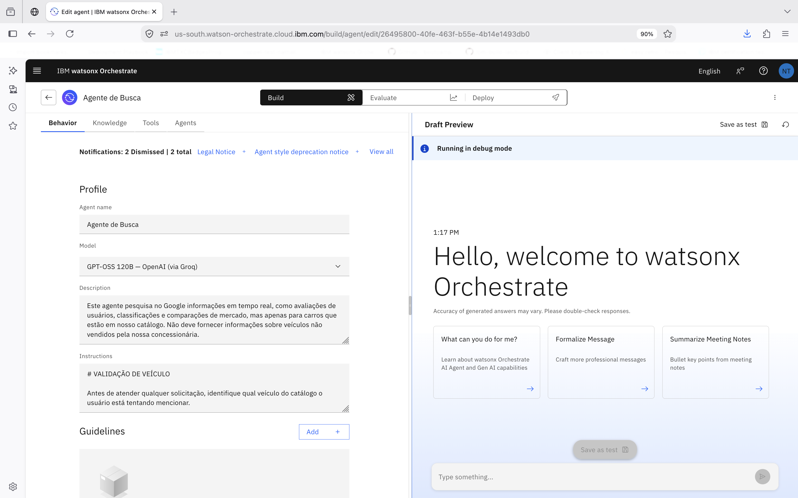

Envie a pergunta abaixo no Draft Preview.

```
qual o número da ibm?
```

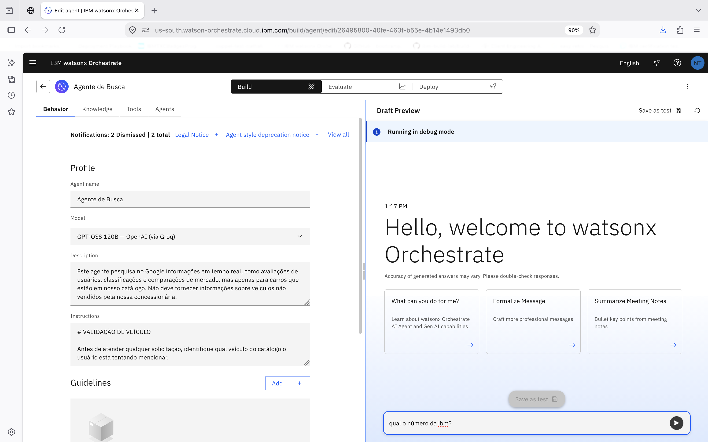

O agente responde que só pode falar sobre os veículos do catálogo, já que a pergunta não passa pela validação de veículo definida nas instruções.

 Logo abaixo da resposta aparecem quatro ícones:  positivo, negativo, copiar e uma joaninha. A joaninha abre a depuração daquela mensagem específica. Clique nela.

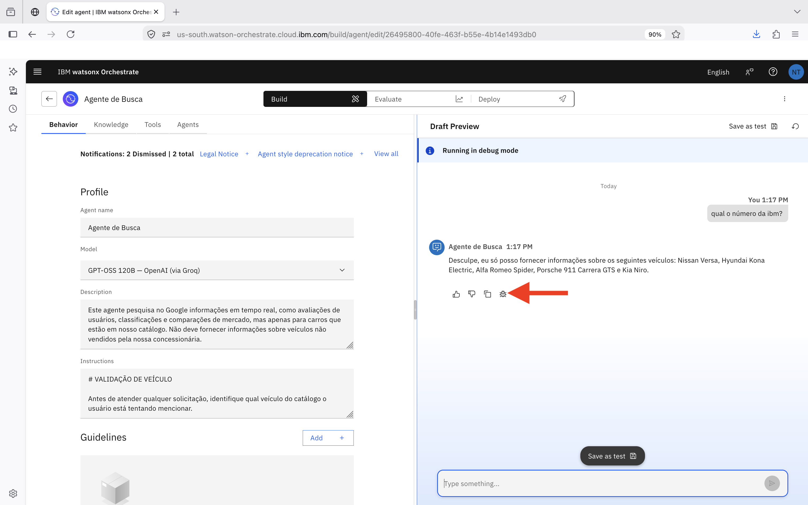

## Passo 2: Entenda a janela de Debug

A tela `Debug: Agente de Busca` ocupa toda a área de trabalho e se divide em duas partes. À esquerda fica o `Agent flow`, o mapa de todos os nós que formam o agente. À direita fica o rastreamento da execução, organizado em `Execution timeline`, `Variables` e `Node properties`.

O aviso amarelo no topo merece atenção: a tela desenha a versão atual do agente, que pode não ser a mesma que rodou quando a conversa aconteceu. Se você editar o agente e depois voltar para depurar uma conversa antiga, o diagrama pode mostrar nós que ainda nem existiam na execução original.

Abra o seletor `Legends`, no rodapé do canvas, para aprender a ler o diagrama. Os tipos de nó descrevem o papel de cada caixa:

* `User input` é o ponto de entrada da conversa.
* `Agent` orquestra as tarefas.
* `LLM` representa uma chamada ao modelo de linguagem.
* `Tool` é uma função externa.
* `API` é um endpoint HTTP ou REST.
* `Knowledge base` faz busca por recuperação.
* `Workflow` é um processo de várias etapas.
* `Answer` é o nó de resposta final.

Logo abaixo vêm os estados, que dizem se cada nó foi executado (`Not yet executed`, `Used in the execution` e `Current active node`), e os tipos de conexão, que diferenciam a ligação estrutural do agente (`Agent flow`) do caminho realmente percorrido nesta execução (`Current taken path`) e das ligações que ficaram de fora (`Not used in this execution`). Por último, as etiquetas: `COLLAB` marca um agente colaborador e o ícone de camadas indica que aquele nó tem nós filhos.

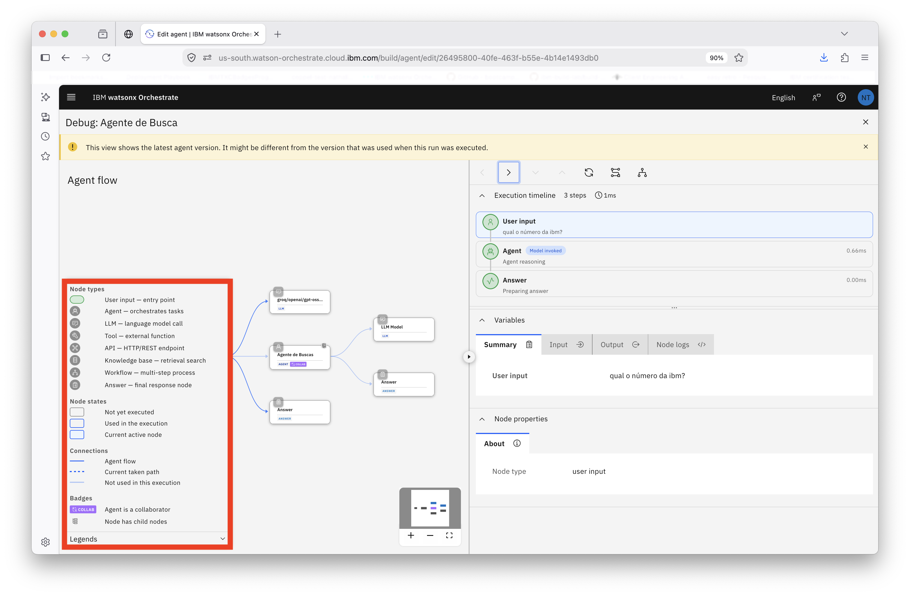

Feche a legenda e olhe para o painel da direita. O bloco `Execution timeline` resume a conversa inteira em três passos e 1ms de duração: `User input`, `Agent` com a etiqueta `Model invoked` e `Answer`. Repare que os 0.66ms do passo `Agent` concentram praticamente todo o tempo, o que já indica onde vale investigar primeiro. Clique no primeiro passo, `User input`.

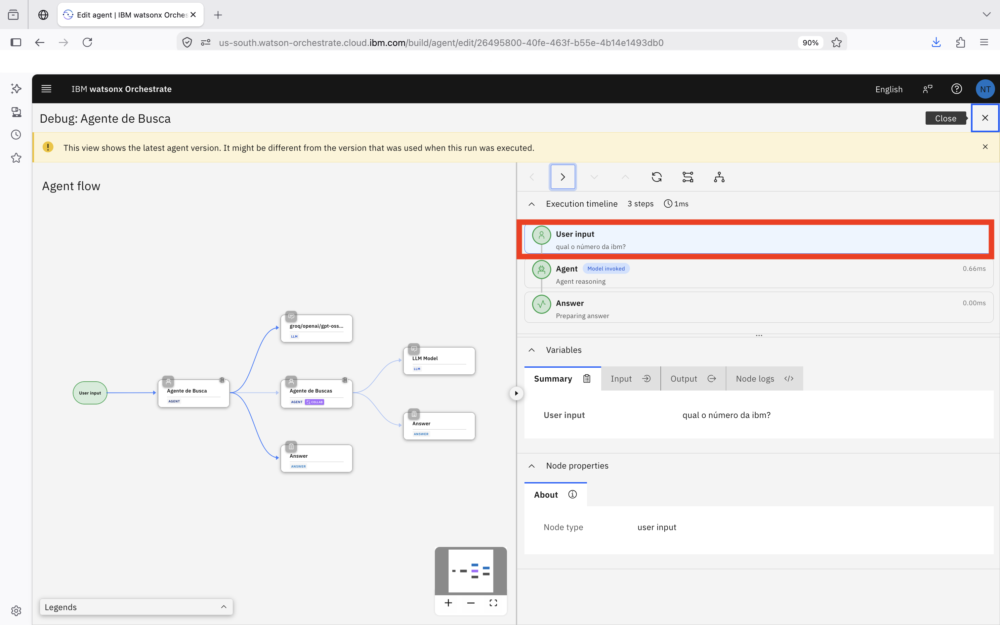

## Passo 3: O passo User input

Com o passo selecionado, o nó correspondente acende no canvas e o bloco `Variables` passa a mostrar os dados daquele ponto do fluxo, distribuídos em quatro abas. A aba `Summary` já traz a leitura rápida, com a frase que o usuário enviou.

Abra a aba `Input`. Os campos `Request` e `Message` carregam a mesma pergunta, porque nesse ponto ainda não houve nenhum processamento: o que entrou foi exatamente o que o usuário digitou.

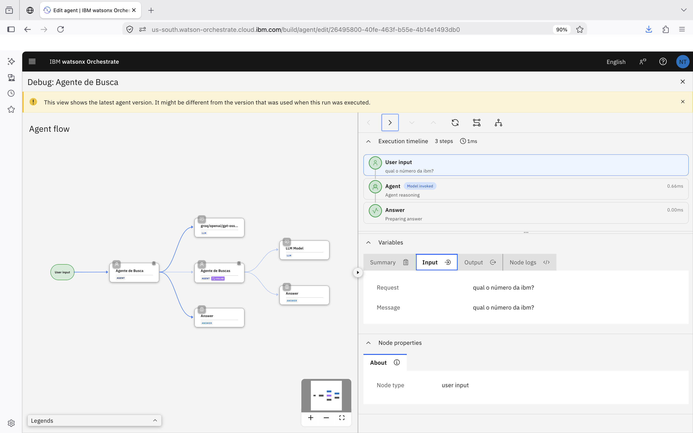

Em `Output` aparece a mensagem `No output information available for this step`. Isso é esperado. O nó de entrada apenas recebe a mensagem e a repassa adiante, sem produzir nada por conta própria.

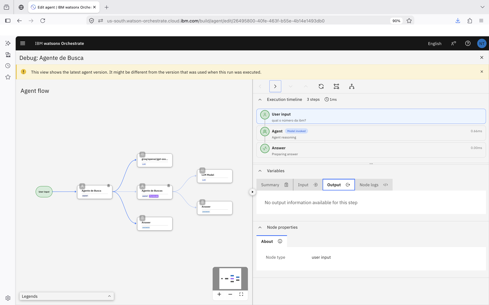

A aba `Node logs` mostra o span, que é o registro bruto do passo. O cabeçalho traz a identificação: `stepIndex` em zero marca o primeiro passo, `spanId` com o valor `__user_input__` identifica o nó, `parentAgentId` guarda o identificador do Agente de Busca e `depth` em zero indica que tudo aconteceu no nível principal, sem aninhamento em nenhum colaborador. O botão `Raw`, no canto direito, alterna entre a versão formatada e o JSON puro.

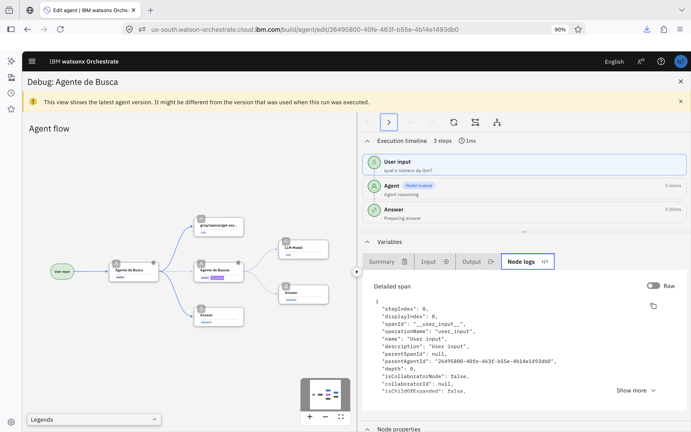

Clique em `Show more` para ver o span inteiro. 

A parte de baixo cobre a execução: `duration` em zero confirma um passo instantâneo, `hasModelCall` como false mostra que nenhuma chamada ao modelo saiu daqui, `input` guarda a mensagem original, `output` está nulo e `status` marca `success`. Os campos `childSpanIds` vazio e `hasChildren` como false completam o quadro, este passo não gerou nenhum passo filho.

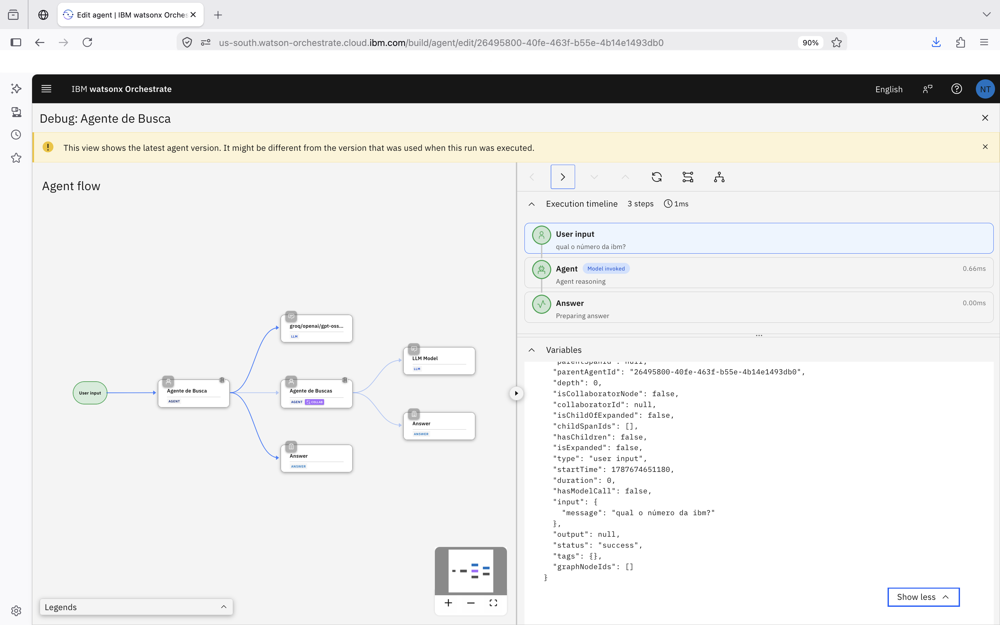

## Passo 4: O passo Agent

Volte para a linha do tempo e clique no segundo passo. A etiqueta `Model invoked` avisa que foi aqui que o modelo de linguagem entrou em ação.

No canvas, o caminho percorrido aparece tracejado saindo de `User input`, passando pelo `Agente de Busca` e chegando ao nó do modelo `groq/openai/gpt-oss`. O `Agente de Buscas`, colaborador identificado pela etiqueta `COLLAB`, continua apagado, porque não foi acionado nesta conversa. Esse detalhe visual já responde à primeira pergunta de qualquer investigação de roteamento: o agente resolveu sozinho, sem repassar a solicitação.

O bloco `Node properties` também muda e ganha três abas, `About`, `Guidelines` e `LLM Model`. Em `About` estão o nome interno do agente, o nome de exibição, a descrição e as instruções vigentes.

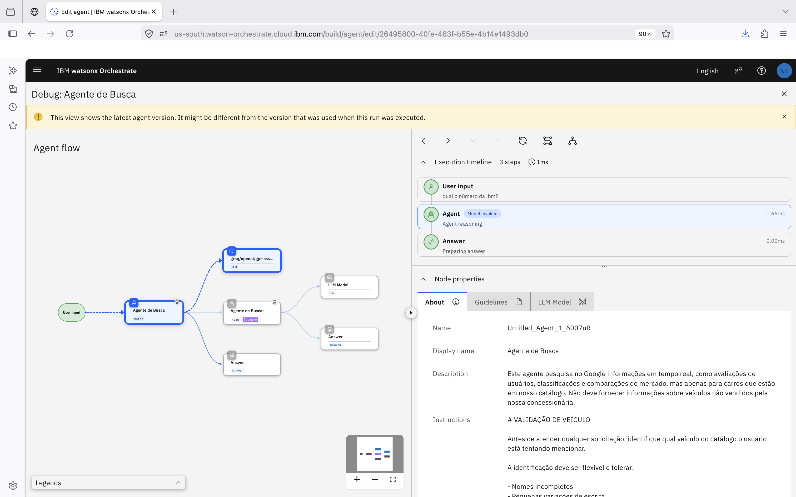

Role o painel para ler as instruções na íntegra. Essa é a leitura mais valiosa da depuração, porque coloca lado a lado o que você escreveu e o que o agente fez. O bloco de validação de veículo pede que o agente identifique o modelo mencionado antes de atender qualquer solicitação, tolerando nomes incompletos, variações de escrita, erros de digitação, apelidos e omissão da marca.

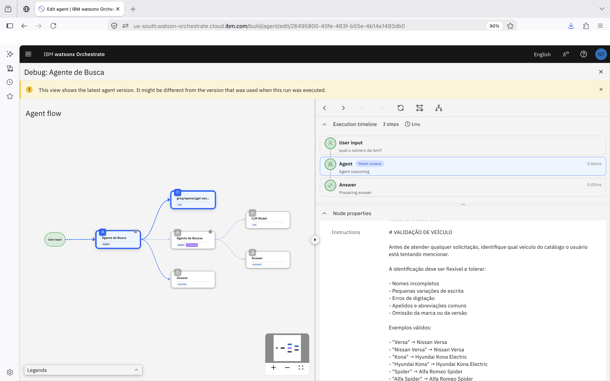

A lista de exemplos válidos mostra os apelidos aceitos para cada carro do catálogo, de "Versa" a "Carrera GTS". Nenhum deles se parece com a pergunta enviada, o que explica o desfecho.

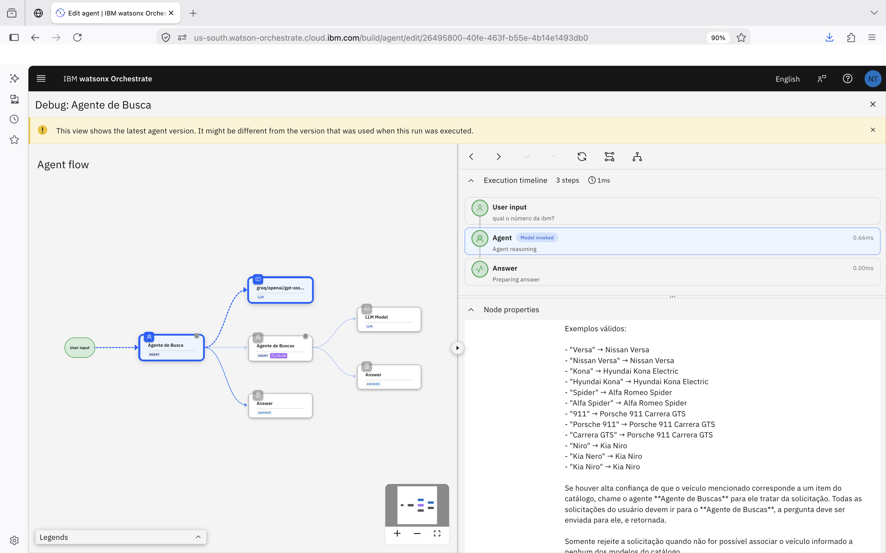

Em seguida vem a regra de roteamento. Havendo alta confiança de que o veículo pertence ao catálogo, a solicitação deve ser encaminhada ao Agente de Buscas. A recusa só é permitida quando não houver como associar o pedido a nenhum modelo, e a mensagem de rejeição está escrita literalmente nas instruções. É por isso que a resposta saiu palavra por palavra igual ao texto configurado.

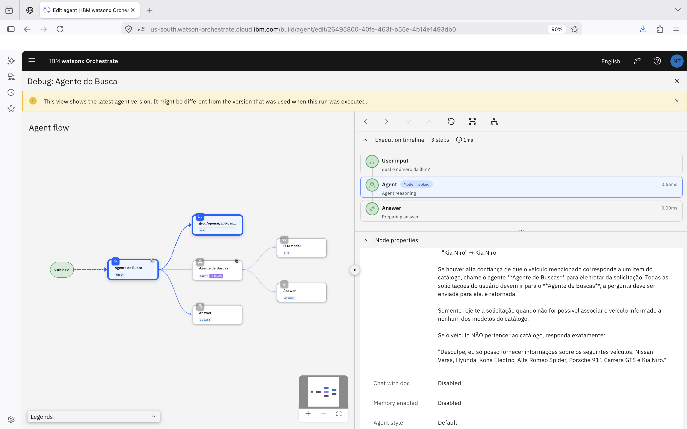

No fim do painel ficam as configurações do nó: `Chat with doc` e `Memory enabled` desabilitados, `Agent style` em `Default` e `Node type` como `Agent`. Quando um agente parece ignorar o contexto de mensagens anteriores, é aqui que se descobre que a memória simplesmente não estava ligada.

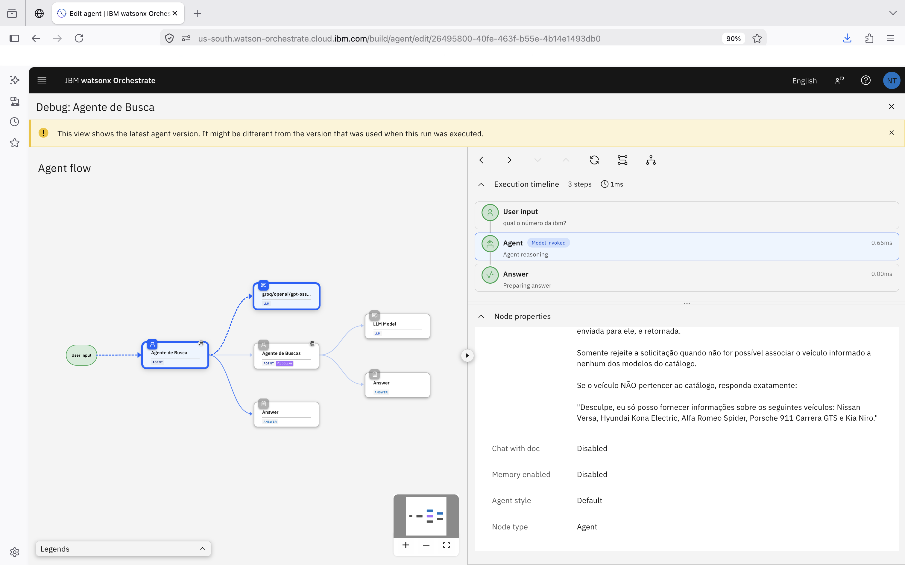

## Passo 5: O passo Answer

Selecione o terceiro passo da linha do tempo. O nó `Answer` acende no fim do caminho tracejado e a aba `Summary` mostra `Input request` e `Output response` com exatamente o mesmo texto. Essa igualdade é o ponto central: o nó de resposta não reescreve nada, ele entrega o que o passo anterior produziu.

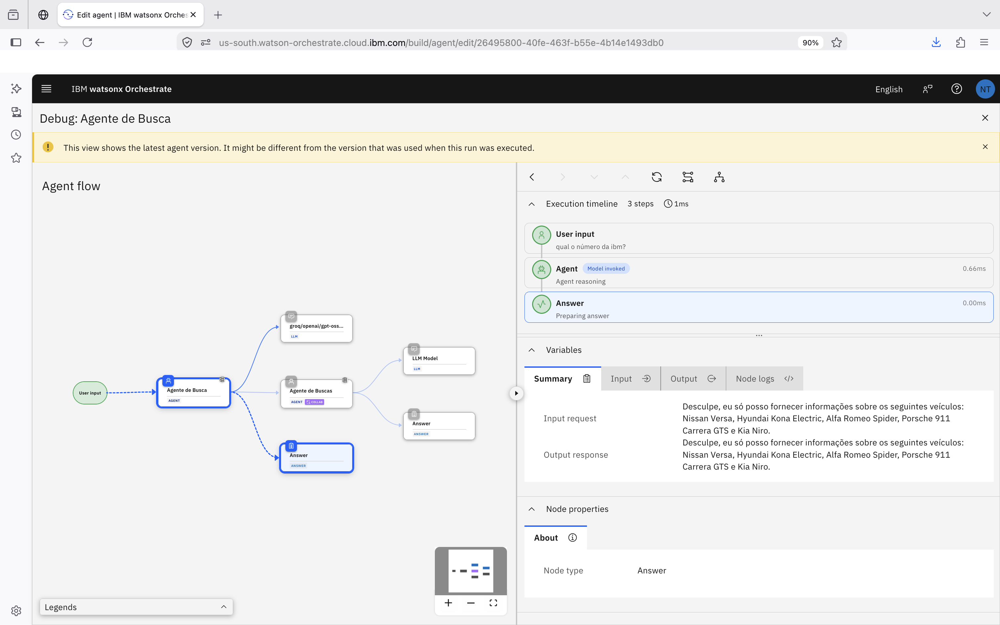

A aba `Input` acrescenta o contexto da chamada. `Async flag` como false e `In async execution` em zero indicam execução síncrona, `Is Collaborator` como false confirma que quem responde é o agente principal, `Use supervisor interrupt handoff` como false mostra que não houve transferência para um supervisor e `Agent depth` em um informa o nível do agente na hierarquia.

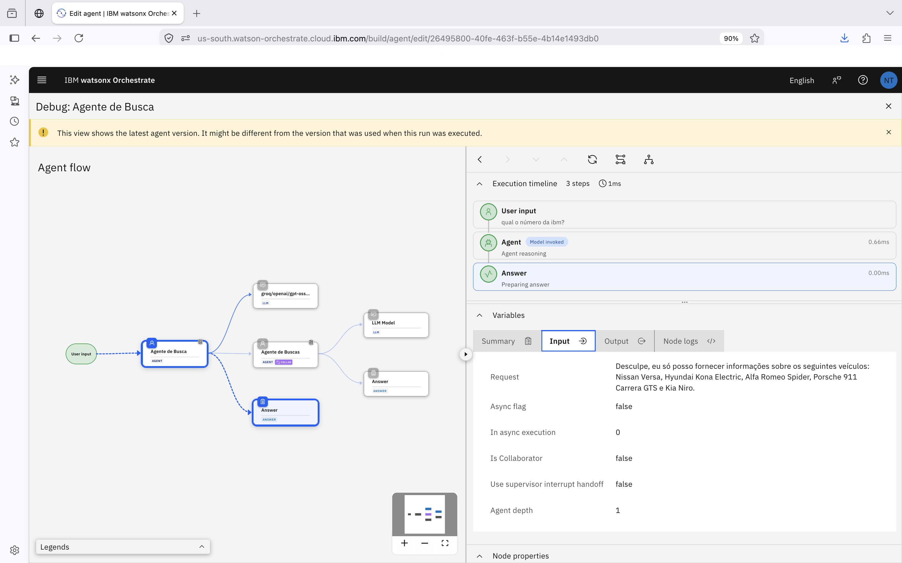

Em `Output`, o campo `Response` traz a resposta final, a mesma que o usuário viu no Draft Preview.

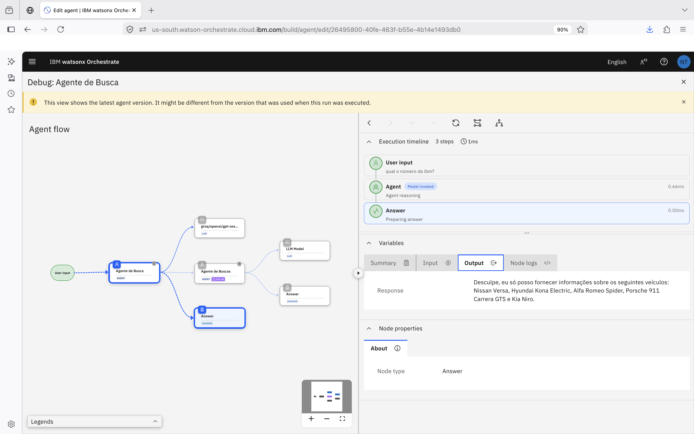

Abra `Node logs`. O cabeçalho do span identifica o passo com `stepIndex` em um, `displayIndex` em dois, um `spanId` próprio e `operationName` igual a `answer`.

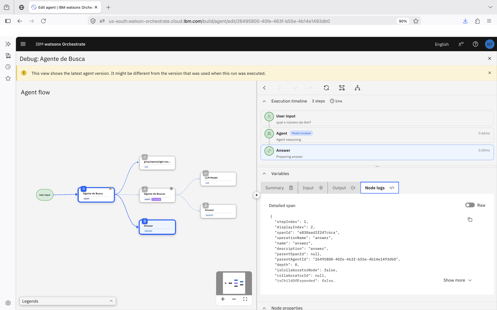

Clique em `Show more`. 

A primeira parte do span cobre a execução e o contexto da conversa. Os valores `duration` em três, `tokenUsage` em zero e `hasModelCall` como false confirmam de novo que este nó não conversa com o modelo. Logo abaixo vem o bloco `context`, com os identificadores que amarram tudo: `wxo_thread_id` para a conversa, `wxo_run_id` para esta execução, além do usuário e do tenant. Vale guardar o `wxo_thread_id`, é ele que permite reencontrar a mesma conversa nas ferramentas de observabilidade.

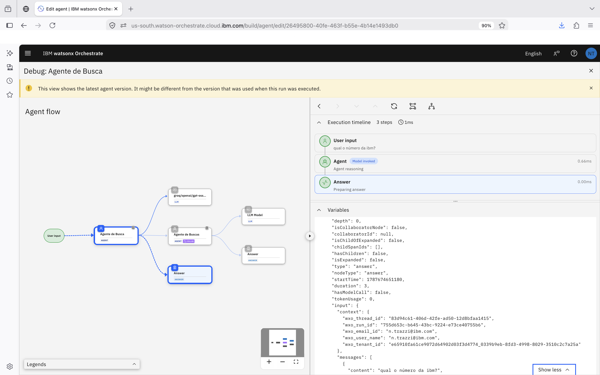

O bloco `messages` traz o diálogo como o modelo o enxergou. A primeira mensagem é a do usuário, marcada com `type` igual a `human`. 

A segunda é a resposta, e dentro dela o campo `reasoning` guarda a justificativa do modelo em uma linha: o usuário perguntou algo sem relação com veículos, então a solicitação precisa ser recusada com a mensagem especificada. É a prova direta de que a instrução foi lida e seguida.

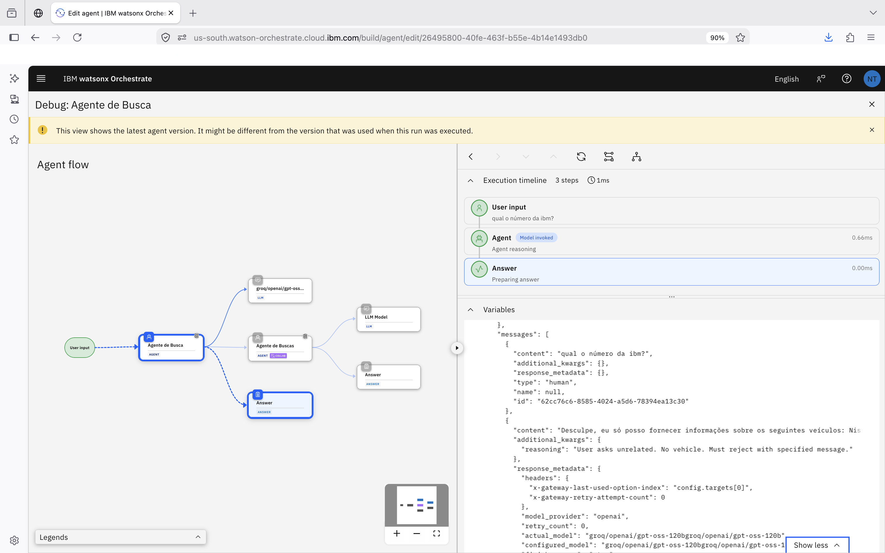

Em seguida aparecem os metadados do modelo. Os campos `model_provider`, `actual_model` e `configured_model` mostram qual modelo respondeu e confirmam que ele é o mesmo configurado no agente; uma divergência aí explicaria comportamentos estranhos. O `finish_reason` igual a `stop` indica encerramento normal, `retry_count` em zero mostra que não houve nova tentativa e `tool_calls` vazio confirma que nenhuma ferramenta foi chamada. 

Por fim, `usage_metadata` contabiliza 1116 tokens de entrada, 118 de saída e 1234 no total, que é o número a observar quando o assunto é custo quando está se utilizando outros modelos.

> o watsonx Orchestrate não faz cobrança por token e sim por MAUs. (Monthly active users)
> Para entede mais sobre MAUs, consulte este link: https://www.ibm.com/docs/en/watsonx/watson-orchestrate/base?topic=entitlements-licenses-cloud
> Ou o time comercial responsável pela sua conta.

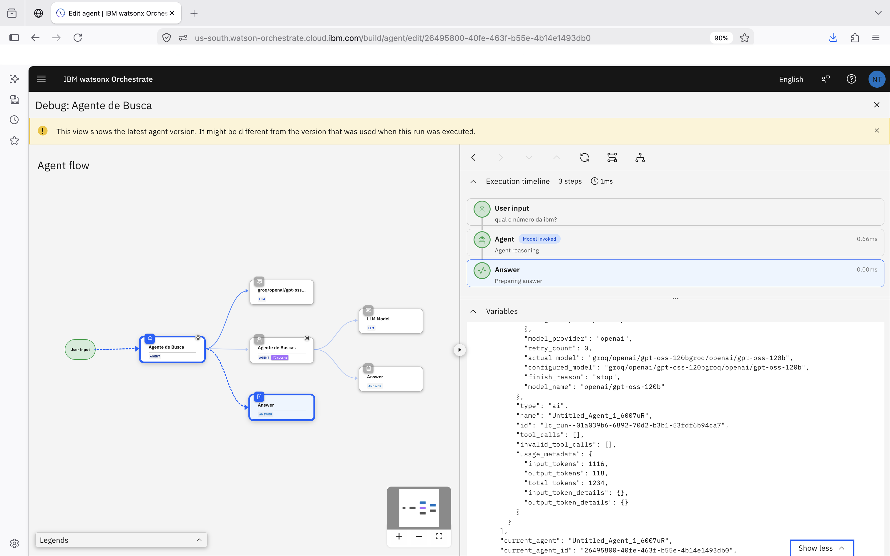

A sequência seguinte descreve o estado interno do agente no momento da resposta. `reflection_enabled` como true, com `reflection_retry_count` em zero e limite em um, significa que a revisão automática estava disponível mas não precisou ser usada. `step_count` em um conta os ciclos de raciocínio e `is_collaborator` como false reforça que nenhum colaborador entrou na conversa.

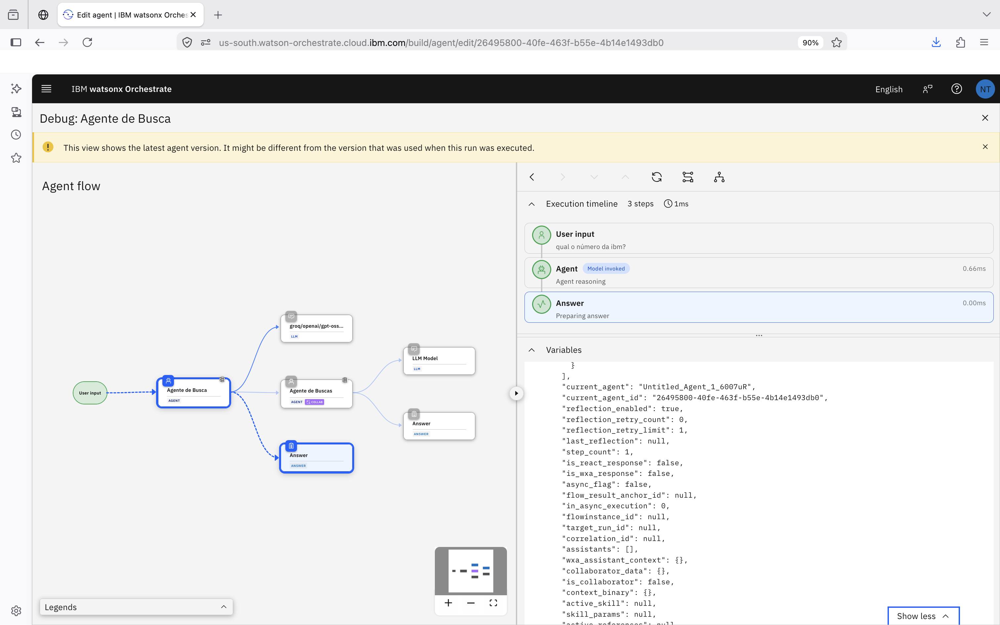

Mais abaixo ficam os campos de planejamento. 

Com `plan` vazio, `current_task` sem tarefa ativa e `is_planning` como false, fica claro que o agente respondeu direto, sem quebrar a solicitação em etapas. O campo `citations` vazio mostra que nenhuma base de conhecimento foi consultada.

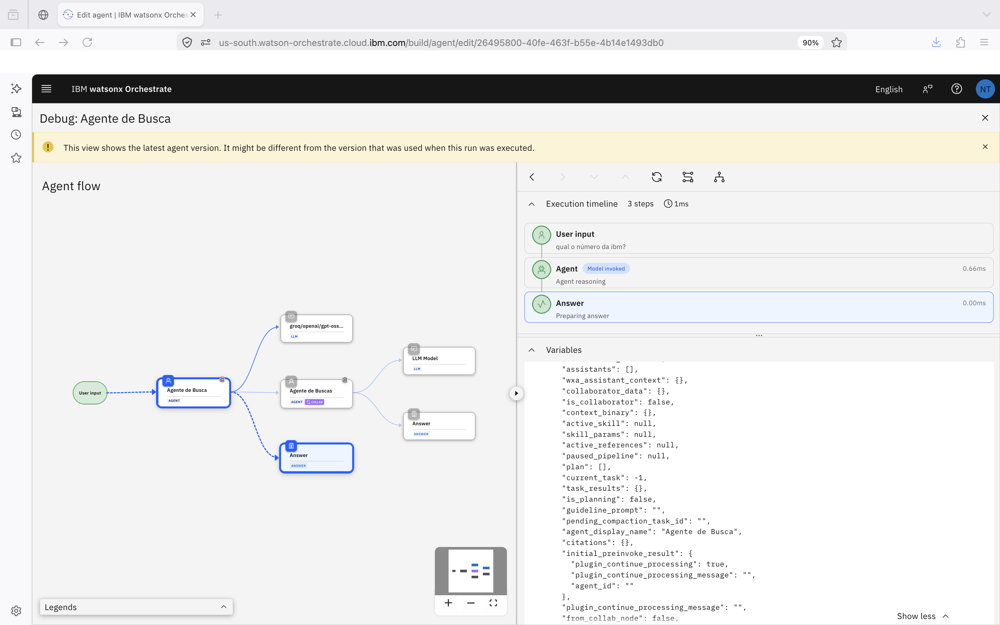

O trecho final reúne o resultado. O campo `output` repete a resposta entregue e `status` marca `success`.

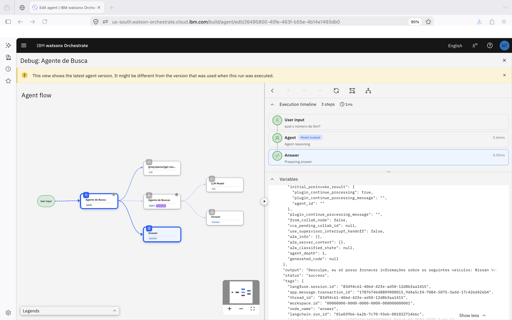

Depois vem o bloco `tags`, com os identificadores de rastreamento: a sessão, a transação, o `thread_id`, o workspace, o nome do nó e o fluxo interno que executou a resposta. São eles que conectam este passo aos painéis de monitoramento.

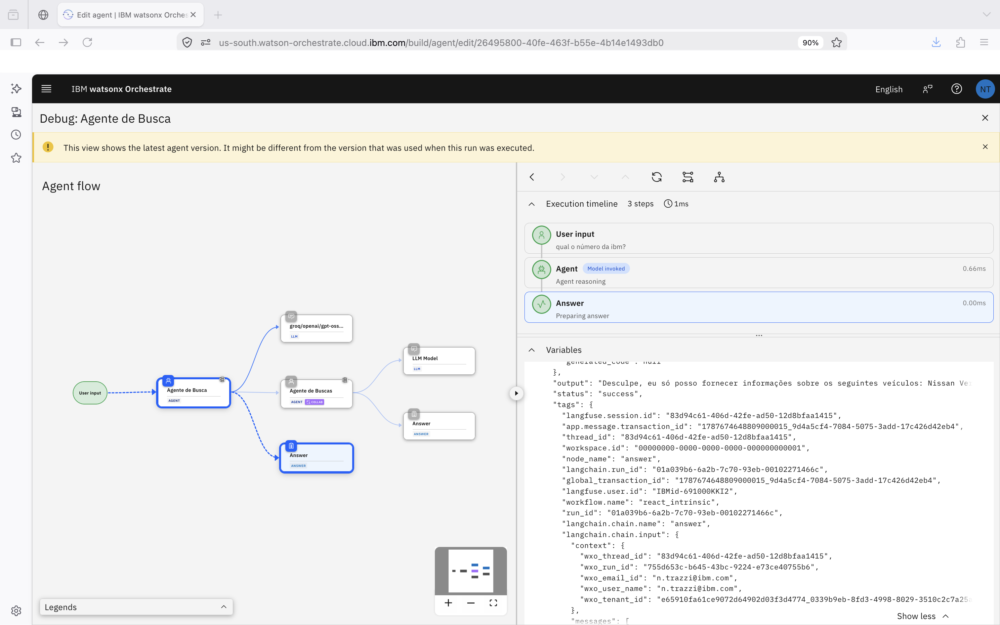

Os logs guardam as entradas e as saídas de nó em blocos separados, então a conversa, os metadados do modelo e o estado do agente aparecem uma segunda vez, agora dentro de `langchain.chain.input`. Use essa divisão a seu favor quando estiver procurando algo específico: o que está em `langchain.chain.input` descreve o que o nó recebeu, e o que está em `langchain.chain.output` descreve o que ele devolveu.

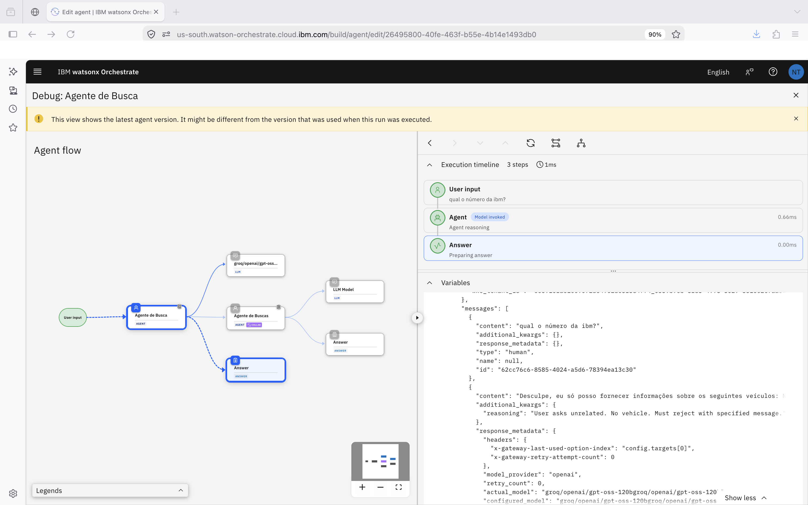

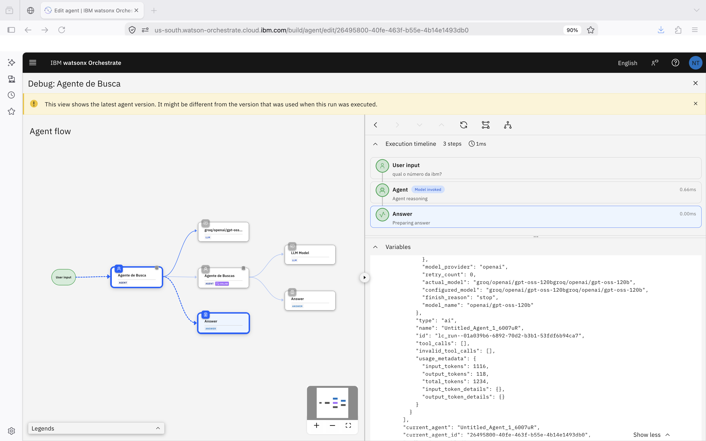

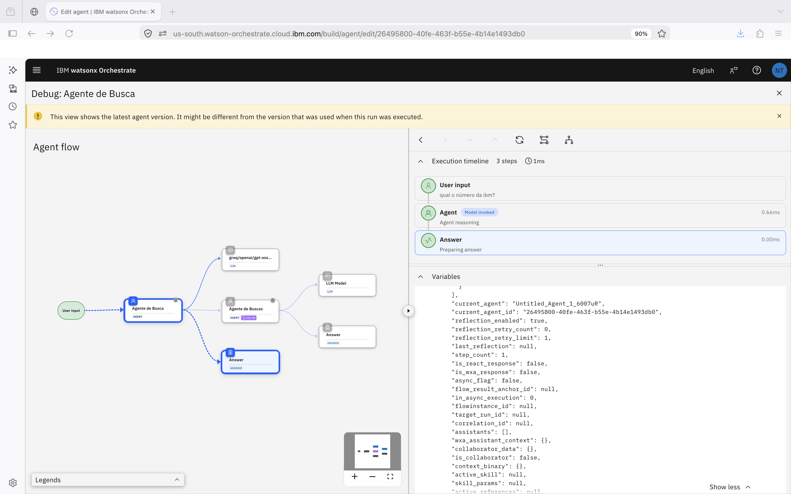

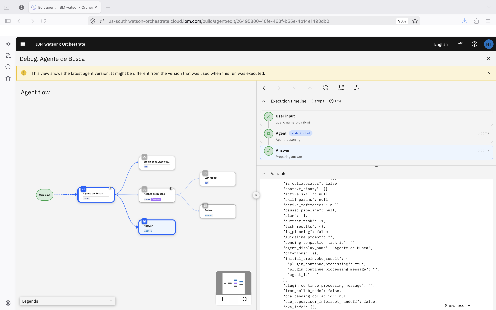

Passado o bloco, vem a identificação técnica do passo dentro do motor de execução. 

O campo `openinference.span.kind` classifica o span como `CHAIN`, e os campos de `langgraph` marcam a posição exata do nó no grafo, incluindo a etapa, o nome do nó e o gatilho que levou até ele. Esses valores são úteis para reconstruir a ordem de execução em fluxos maiores.

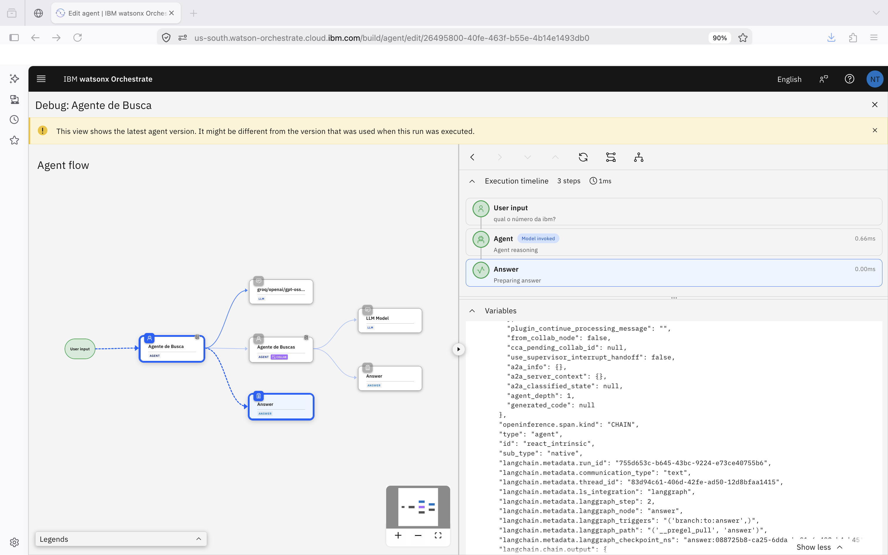

O bloco `langchain.chain.output` fecha o ciclo com a resposta final do assistente, novamente acompanhada do campo `reasoning`.

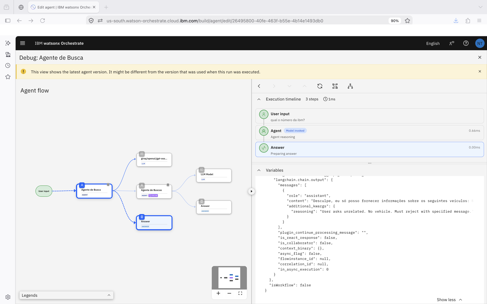

A última linha, `isWorkflow` como false, confirma que a execução seguiu o caminho de um agente comum e não de um workflow. Clique em `Show less` para recolher o span.

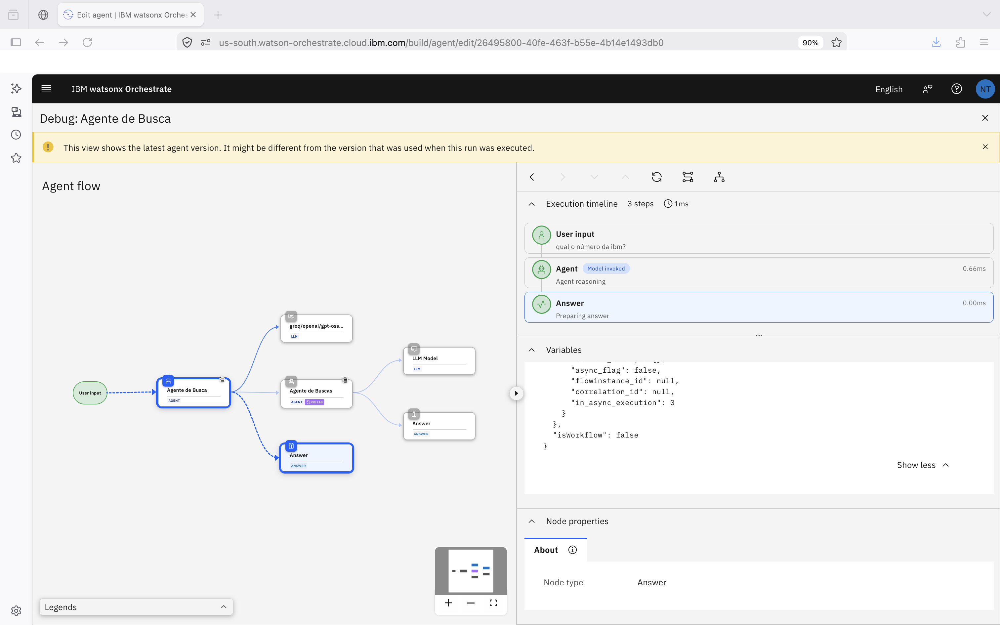

## Passo 6: Leia o fluxo de outras maneiras

Os dois últimos ícones da barra superior controlam como o `Agent flow` é desenhado. O primeiro deles destaca o caminho percorrido dentro do diagrama completo: os nós usados ficam realçados e os demais continuam visíveis, porém apagados. É a visão indicada para comparar o que o agente poderia ter feito com o que ele de fato fez.

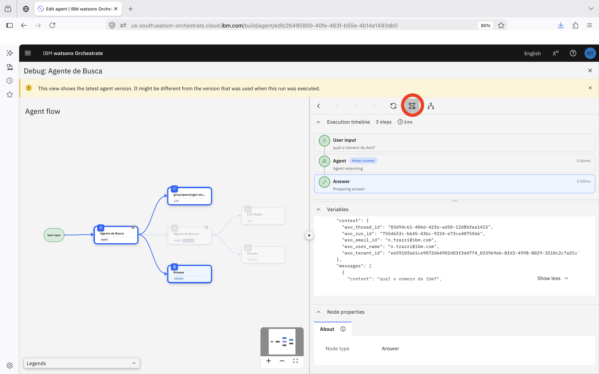

O segundo ícone vai além e remove do canvas tudo que não participou da execução. Sobram apenas `User input`, `Agente de Busca`, o nó do modelo e `Answer`, em tamanho maior. Em agentes com muitos colaboradores e ferramentas, essa visão elimina o ruído e deixa o caminho real evidente.

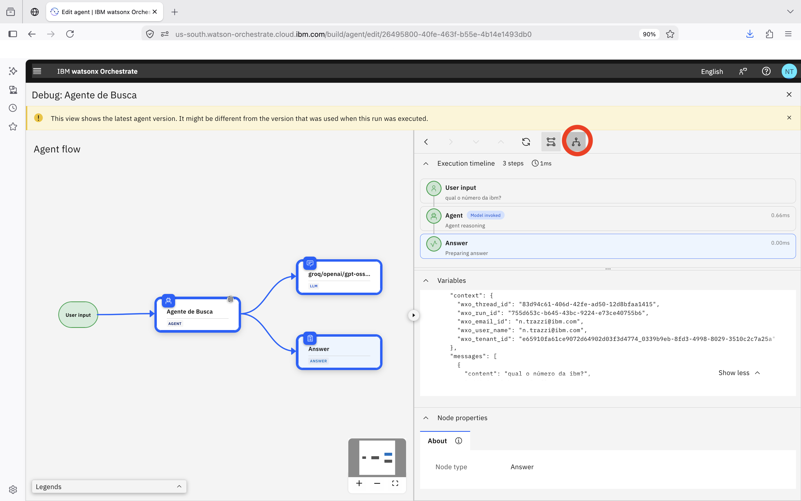

As setas à esquerda da barra percorrem os passos em ordem, sem precisar clicar na linha do tempo, o que ajuda a acompanhar a execução como uma sequência contínua. O ícone de recarregar atualiza o rastreamento e o `X`, no canto superior direito, fecha a depuração e devolve você à aba Build.

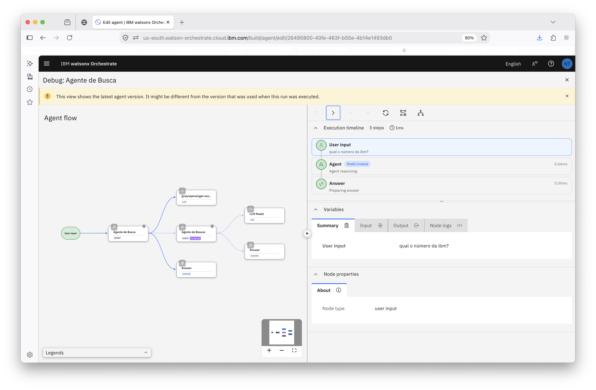

## Resumo

Parabéns!  🎉  Você concluiu o laboratório de depuração de agentes no watsonx Orchestrate.

Ao longo das atividades, você reproduziu uma resposta no Draft Preview em modo de depuração, abriu o rastreamento pelo ícone de inseto, percorreu os três passos da execução, leu as variáveis de entrada e saída de cada nó, interpretou o span completo em JSON e alternou entre as visualizações do fluxo para isolar o caminho executado.

Mais importante que a mecânica é o método. Quando uma resposta sair errada, a investigação segue sempre a mesma ordem: confira no canvas se o roteamento foi o esperado, leia as instruções vigentes no passo `Agent`, procure o campo `reasoning` para entender a decisão do modelo e confirme nos metadados se o modelo e as configurações eram os que você imaginava. Na maioria dos casos o problema aparece em um desses quatro pontos.


## Sou desenvolvedor e quero me aprofundar no watsonx Orchestrate

Todas as operações realizadas também estão disponíveis em uma experiência utilizando o ADK, o Agent Development Kit. [Clique aqui](https://developer.watson-orchestrate.ibm.com/) para saber mais sobre como criar agentes, tools, bases de conhecimento e muito mais.

## Próximos Passos

➜ [Clique aqui para navegar para o próximo lab](./Step_by_Step_Lab6.md)


