# Construindo Workflows no watsonx Orchestrate

- [Construindo Workflows no watsonx Orchestrate](#construindo-workflows-no-watsonx-orchestrate)
  - [Glossário de Termos Técnicos](#glossário-de-termos-técnicos)
  - [Descrição do Caso de Uso](#descrição-do-caso-de-uso)
    - [O que você vai aprender](#o-que-você-vai-aprender)
- [Parte 1 — Criando o agente](#parte-1--criando-o-agente)
    - [Escolhendo o método de criação](#escolhendo-o-método-de-criação)
    - [Conhecendo o editor do agente](#conhecendo-o-editor-do-agente)
    - [Preenchendo o perfil do agente](#preenchendo-o-perfil-do-agente)
- [Parte 2 — Criando o Agentic Workflow](#parte-2--criando-o-agentic-workflow)
    - [Nomeando o workflow](#nomeando-o-workflow)
  - [Conhecendondo a barra de ferramentas do Flow Builder](#conhecendondo-a-barra-de-ferramentas-do-flow-builder)
    - [Edit details — Overview e Parameters](#edit-details--overview-e-parameters)
    - [Flow settings](#flow-settings)
- [Parte 3 — Montando o fluxo: coleta do arquivo](#parte-3--montando-o-fluxo-coleta-do-arquivo)
    - [Abrindo o painel de nós](#abrindo-o-painel-de-nós)
    - [Adicionando o nó User activity](#adicionando-o-nó-user-activity)
    - [Adicionando o File upload](#adicionando-o-file-upload)
- [Parte 4 — Configurando o Document extractor](#parte-4--configurando-o-document-extractor)
    - [Adicionando o nó de extração](#adicionando-o-nó-de-extração)
    - [Selecionando o formato do documento](#selecionando-o-formato-do-documento)
    - [Fazendo upload dos documentos de exemplo](#fazendo-upload-dos-documentos-de-exemplo)
    - [Criando o primeiro campo: Nome](#criando-o-primeiro-campo-nome)
    - [Criando o campo FILIAÇÃO](#criando-o-campo-filiação)
    - [Criando o campo CPF](#criando-o-campo-cpf)
  - [Corrigindo a extração com Description e Examples](#corrigindo-a-extração-com-description-e-examples)
  - [Validando com um segundo documento](#validando-com-um-segundo-documento)
  - [Ajustando idioma e modelo](#ajustando-idioma-e-modelo)
    - [Idioma](#idioma)
    - [Modelo](#modelo)
    - [Fechando o extrator](#fechando-o-extrator)
- [Parte 5 — Finalizando o fluxo e refinando o agente](#parte-5--finalizando-o-fluxo-e-refinando-o-agente)
    - [Concluindo o workflow](#concluindo-o-workflow)
    - [Refinando as instruções do agente](#refinando-as-instruções-do-agente)
- [Parte 6 — Testando o agente ponta a ponta](#parte-6--testando-o-agente-ponta-a-ponta)
    - [Resultados](#resultados)
  - [Boas práticas](#boas-práticas)
- [Próximos passos](#próximos-passos)

## Glossário de Termos Técnicos

| Termo | Significado |
|---|---|
| **Agent / Agente** | Componente de IA que recebe instruções, raciocina sobre elas e aciona ferramentas ou outros agentes para completar uma tarefa. |
| **Agentic Workflow** | Workflow orquestrado por um agente de IA, combinando lógica low-code com raciocínio autônomo para automatizar processos de negócio. |
| **Auto-map chat history** | Funcionalidade que usa as últimas interações do chat para preencher automaticamente as entradas de um workflow. |
| **Behavior** | Aba do editor de agente onde se configuram perfil, modelo, descrição e instruções de comportamento. |
| **Branch** | Nó de controle de fluxo que cria caminhos condicionais (similar a um `if/else`). |
| **Canvas** | Área de trabalho visual do Flow Builder onde os nós são posicionados e conectados. |
| **Catalog** | Repositório de ferramentas e integrações prontas disponíveis para uso em agentes e workflows. |
| **Data type** | Tipo de dado de um campo de extração (ex.: `String`, `Number`, `Date`). |
| **Debug mode** | Modo de execução do Draft Preview que exibe informações detalhadas de raciocínio e chamadas de ferramentas do agente. |
| **Decision** | Nó do Flow Builder que automatiza decisões de negócio complexas com base em regras. |
| **Description** | Campo textual que descreve o propósito de um agente ou campo de extração, orientando o modelo sobre o que buscar. |
| **Document classifier** | Nó que identifica e categoriza automaticamente o tipo de documento recebido. |
| **Document extractor** | Nó do Flow Builder que usa um LLM para extrair campos específicos de documentos, com suporte a schema, descrições e exemplos. |
| **Draft Preview** | Painel lateral do editor de agente que simula o chat com o agente antes da publicação. |
| **Edit details** | Botão do Flow Builder para editar nome, descrição e parâmetros do workflow. |
| **Examples** | Pares de entrada/saída fornecidos ao Document extractor para orientar o modelo sobre o formato e o conteúdo esperado de um campo. |
| **Field name** | Nome atribuído a um campo no schema de extração do Document extractor. |
| **File upload** | Nó de coleta dentro do User activity que solicita ao usuário o envio de um arquivo. |
| **Flow Builder** | Editor visual low-code do watsonx Orchestrate para criação e configuração de Agentic Workflows. |
| **Flow controls** | Nós que controlam a ordem e o caminho de execução do fluxo (Branch, For each, Loop, Parallel). |
| **Flow inspector** | Ferramenta do Flow Builder que inspeciona a estrutura e o estado do fluxo em tempo real. |
| **Flow settings** | Painel de configurações gerais de um workflow (auto-map, agendamento, mascaramento de dados etc.). |
| **Flow variables** | Variáveis criadas e gerenciadas dentro de um workflow para armazenar e passar dados entre nós. |
| **For each** | Nó de controle que itera sobre uma lista, executando um conjunto de ações para cada item. |
| **Generative prompt** | Nó que invoca um LLM para gerar texto ou conteúdo estruturado como parte do fluxo. |
| **Global workspace** | Workspace padrão e compartilhado de uma instância do watsonx Orchestrate. |
| **Ground truth** | Conjunto de valores corretos e verificados manualmente, usado como referência para medir a acurácia de extração. |
| **Instructions** | Campo do perfil do agente que define seu comportamento — como ele deve agir, raciocinar e responder. |
| **JSON** | JavaScript Object Notation — formato leve de troca de dados estruturados, utilizado na saída do agente neste laboratório. |
| **LangGraph** | Framework open-source da LangChain para construção de agentes stateful baseados em grafos; o watsonx Orchestrate permite importar agentes criados com ele. |
| **LLM** | Large Language Model — modelo de linguagem de grande escala, como GPT ou Llama, que alimenta as capacidades de IA generativa da plataforma. |
| **Logic block** | Nó do Flow Builder para implementar transformações de dados ou lógica de negócio simples. |
| **Loop** | Nó de controle que repete uma ação até que uma condição seja satisfeita. |
| **Low-code** | Abordagem de desenvolvimento em que a maior parte da lógica é construída visualmente, com mínima escrita de código. |
| **Mask sensitive information** | Configuração do workflow que mascara variáveis e saídas contendo dados sensíveis (ex.: CPF, senhas, endereços). |
| **MCP server** | Model Context Protocol server — servidor que expõe ferramentas externas para consumo por agentes de IA. |
| **Metrics Summary / Overall accuracy** | Painel do Document extractor que exibe a acurácia geral da extração com base nos documentos verificados. |
| **Model** | Campo de configuração do agente ou do Document extractor onde se escolhe o LLM que será utilizado. |
| **Multimodal** | Capacidade de um modelo processar diferentes tipos de entrada, como texto e imagem simultaneamente. |
| **Node / Nó** | Bloco funcional individual dentro de um workflow no Flow Builder (ex.: File upload, Document extractor). |
| **OpenAPI** | Especificação padrão para descrever APIs REST; o watsonx Orchestrate permite importar ferramentas a partir de arquivos nesse formato. |
| **Parallel** | Nó de controle que executa múltiplas ações simultaneamente para reduzir o tempo total de processamento. |
| **Parameters** | Aba do Edit details onde se definem as entradas e saídas formais de um workflow. |
| **Placeholder** | Elemento visual no canvas que indica onde o próximo nó pode ser inserido. |
| **Prompt engineering** | Técnica de escrever instruções ou descrições em linguagem natural para orientar o comportamento de um LLM. |
| **Schema** | Estrutura que define os campos a serem extraídos de um documento no Document extractor (nome, tipo de dado, descrição, exemplos). |
| **Scheduling** | Configuração que permite ao usuário final agendar a execução de um workflow. |
| **Structured** | Formato de documento com layout fixo e previsível (ex.: formulários, notas fiscais padronizadas). |
| **Text extractor** | Nó do Flow Builder que extrai o texto bruto de um documento sem interpretar seu significado. |
| **Tidy canvas** | Função do Flow Builder que reorganiza automaticamente o layout visual do fluxo no canvas. |
| **Tools** | Ferramentas que podem ser adicionadas a um agente para ampliar suas capacidades (workflows, APIs, integrações). |
| **Trigger Conditions** | Condições ou pedidos que ativam uma ferramenta, auxiliando o agente a decidir quando chamá-la. |
| **Unstructured** | Formato de documento sem layout consistente (ex.: contratos, relatórios, e-mails, fotos de documentos). |
| **URL assinada (Signed URL)** | URL temporária e autenticada que concede acesso a um arquivo armazenado em nuvem sem expor credenciais permanentes. |
| **User activity** | Nó do Flow Builder que encapsula interações diretas com o usuário dentro do fluxo (coleta de dados, apresentação de resultados). |
| **Verify document** | Ação do Document extractor pela qual o usuário confirma que os valores extraídos estão corretos, alimentando a métrica de acurácia. |
| **Workspace** | Ambiente de trabalho isolado dentro do watsonx Orchestrate onde agentes, ferramentas e knowledge são organizados. |

---


## Descrição do Caso de Uso

Ao final deste laboratório você terá construído um **agente de Inteligência Artificial generativa capaz de receber um documento enviado pelo usuário no chat, processá-lo através de um workflow agêntico low-code e devolver os dados extraídos de forma estruturada.**

O caso de uso é a leitura de uma **CNH (Carteira Nacional de Habilitação)**, extraindo os campos Nome, Filiação, CPF e Data de Nascimento. 

> A mesma técnica se aplica a contratos, notas fiscais, apólices, RGs, comprovantes e qualquer outro documento do seu processo.

### O que você vai aprender

- Criar um agente do zero e configurar perfil, modelo e instruções
- Criar um **Agentic workflow** como ferramenta do agente
- Navegar pelo **Flow Builder** e entender suas configurações
- Coletar arquivos do usuário com o nó **User activity → File upload**
- Configurar o nó **Document extractor** e definir um schema de extração
- Corrigir extrações imprecisas usando **Description** e **Examples**
- Verificar documentos e acompanhar a métrica de acurácia
- Testar o agente ponta a ponta no **Draft Preview**

---

Para utilizar o workflow, nesse laboratório, vamos criar um novo agente.

**Embora nesse laboratório estamos utilizando Workflows com agentes, workflows podem ser acionados sem agentes e podem funcionar como um serviço a parte.**

Vamos começar!

---

# Parte 1 — Criando o agente

Na tela de **Build agents and tools**, você verá a lista de agentes do workspace (no laboratório, o *Global workspace*), com os contadores de **All agents**, **All tools** e **All knowledge**.

No canto superior direito, clique em **Create agent**.

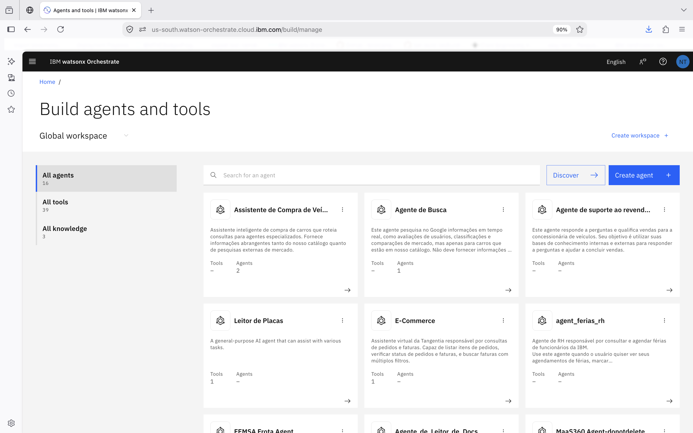

### Escolhendo o método de criação

A janela **Create an agent** oferece três caminhos:

| Opção | Quando usar |
|---|---|
| **Create from scratch** | Você define manualmente perfil, instruções e ferramentas — **usaremos esta** |
| **Build from template** | Partir de um modelo pronto da IBM |
| **Import langGraph agent** | Importar um agente já desenvolvido em LangGraph |

Confirme que o workspace selecionado é o **Global workspace** e clique em **Create from scratch**.

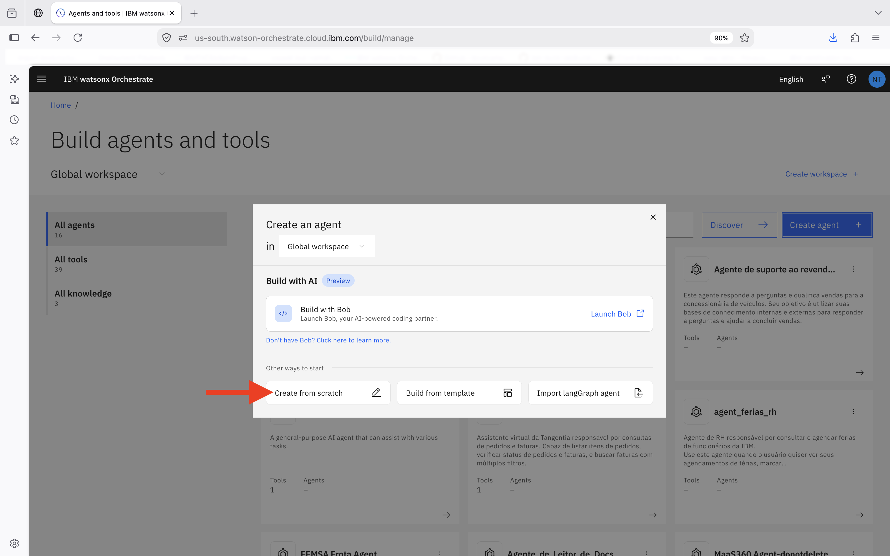

### Conhecendo o editor do agente

Na tela **Edit agent**, dividida em duas áreas:

- **Esquerda — construção:** abas `Behavior`, `Knowledge`, `Tools` e `Agents`
- **Direita — Draft Preview:** chat de teste rodando em *debug mode*, com o botão **Save as test**

No topo estão os três estágios do ciclo de vida do agente: **Build → Evaluate → Deploy**.

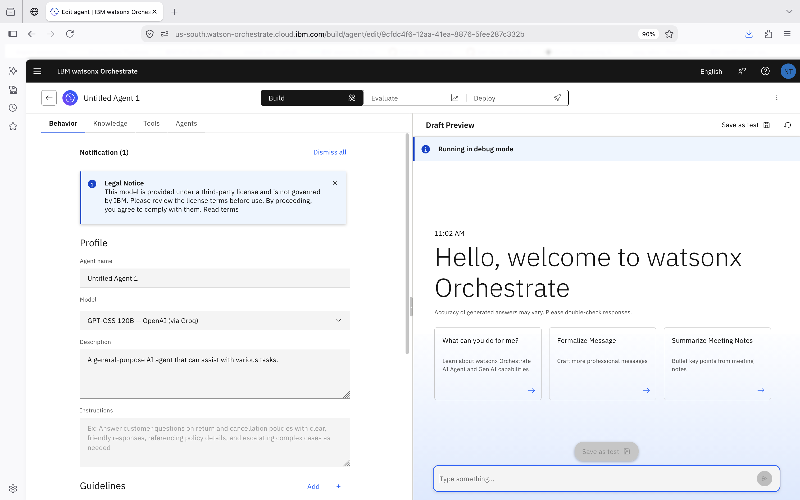

### Preenchendo o perfil do agente

Ainda na aba **Behavior**, seção **Profile**, preencha os campos na ordem indicada:

**1. Agent name**

```
Agente leitor de documentos
```

**2. Model**

```
GPT-OSS 120B — OpenAI (via Groq)
```

**3. Description** é o que ajuda outros agentes e o roteador a saberem *quando* acionar este agente.

Copie e cole o seguinte texto no campo:

```
Agente inteligente responsável por receber documentos de novos contratos,
processá-los utilizando o workflow definido e realizar a extração automatizada
dos dados relevantes, garantindo agilidade e precisão no tratamento das informações
```

**4. Instructions** é o comportamento que o agente deve seguir:

Copie e cole o seguinte texto no campo:

```
Receba o documento do contrato enviado pelo usuário e valide se o arquivo está
acessível e legível. Em seguida, execute o workflow de processamento disponível
para analisar o documento e extrair todas as informações relevantes. Organize os
dados extraídos de forma estruturada e retorne os resultados ao usuário. Caso o
documento esteja corrompido, ilegível ou não contenha as informações esperadas,
informe o usuário.
```

**5.** Clique na aba **Tools**.

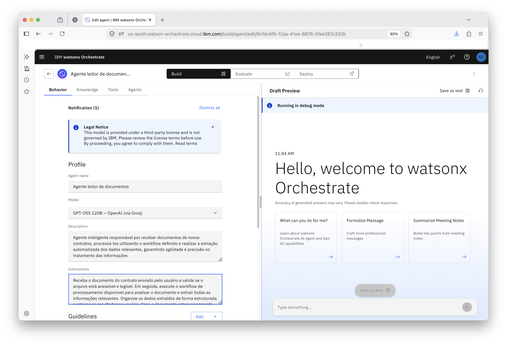

> **Description × Instructions:** a *Description* responde “para que serve este agente”; as *Instructions* respondem “como ele deve se comportar”. 
> Voltaremos às instruções na Parte 5 desse laboratório, elas ainda serão refinadas.

Agora vamos criar nosso workflow.

---

# Parte 2 — Criando o Agentic Workflow

Na aba **Tools**, Clique em **Add Tool** (item 6).

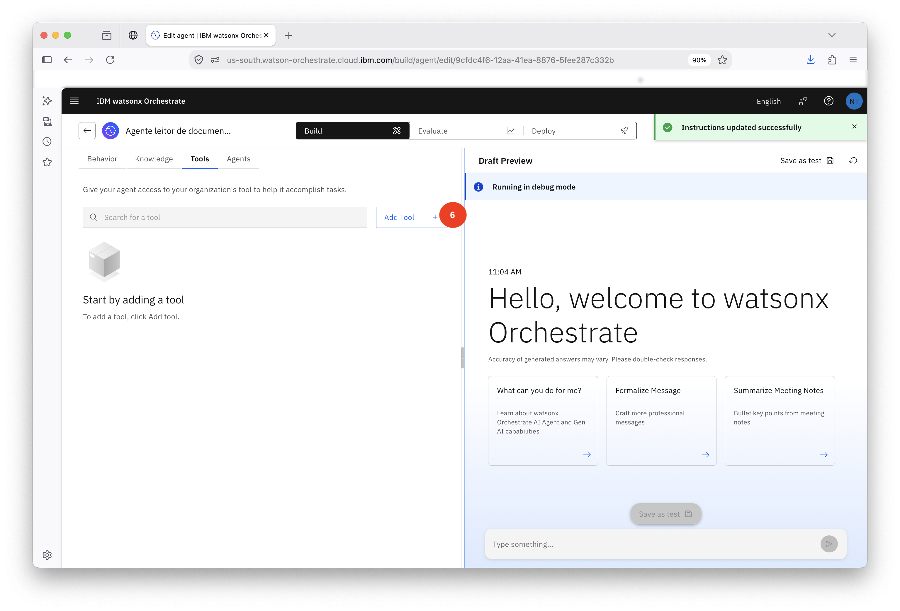

A janela **Add a tool** apresenta duas seções:

**Create**
- **Agentic workflow** — automatiza processos de negócio repetíveis com workflows low-code que integram extração de documentos e entrada humana ← **é o que vamos usar**
- **Build with Bob** — parceiro de codificação com IA (Preview)

**Add from**
- **Catalog** — catálogo de ferramentas existentes
- **Local instance** — ferramentas já disponíveis na instância
- **MCP server** — importar ferramentas externas de um servidor MCP
- **OpenAPI** — importar ferramentas a partir de um arquivo OpenAPI

Clique em **Agentic workflow → Start Building** (item 7).

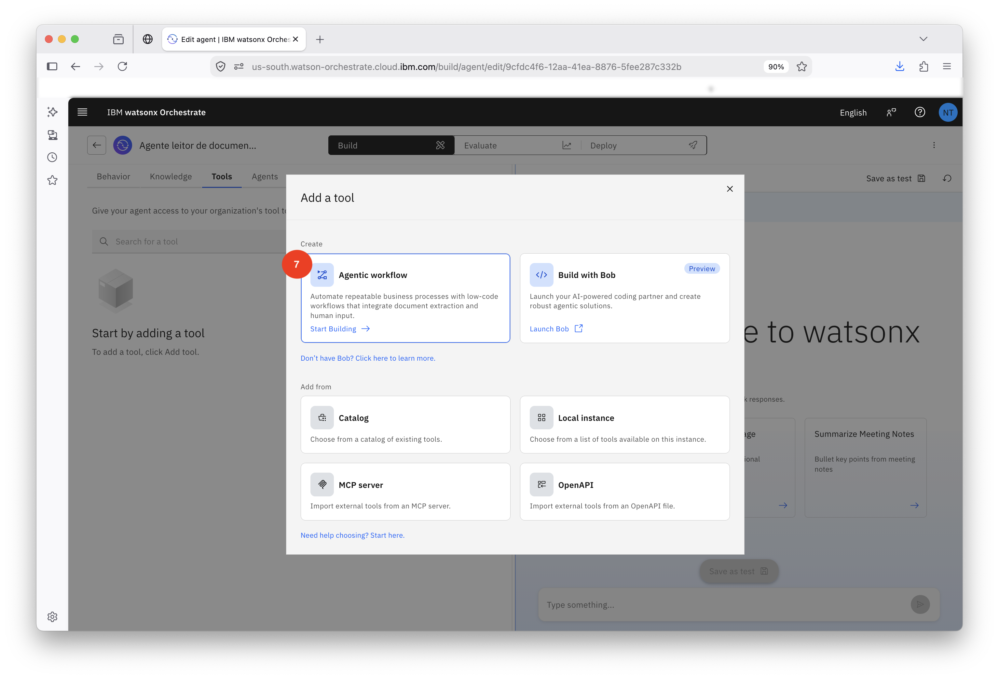

Na janela **Name your agentic workflow**, clique em **Start building** (item 8). 

O nome padrão *Agentic workflow 1* será ajustado no próximo passo.

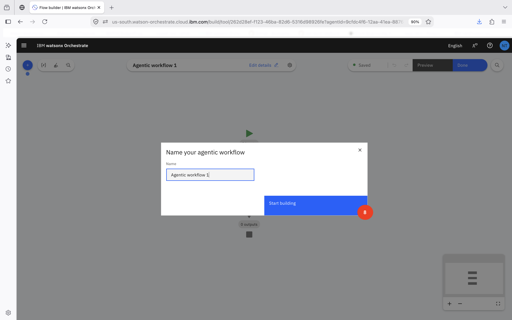

### Nomeando o workflow

Você está agora no **Flow builder**. 

Use **Edit details** no topo e altere o nome para:

```
Extração de documentos
```

O indicador **Saved** confirma o salvamento automático.

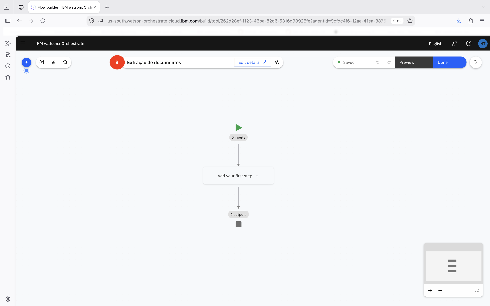

> **Guarde esse nome.** Ele será citado literalmente nas instruções do agente na Parte 5.

---

## Conhecendondo a barra de ferramentas do Flow Builder

Antes de montar o fluxo, familiarize-se com os controles do canto superior esquerdo. 

Passe o mouse sobre cada ícone:

| 1 | `+` | **Add activities, controls, tools, or agents** (`⌘K`) | Abre o painel de nós disponíveis |

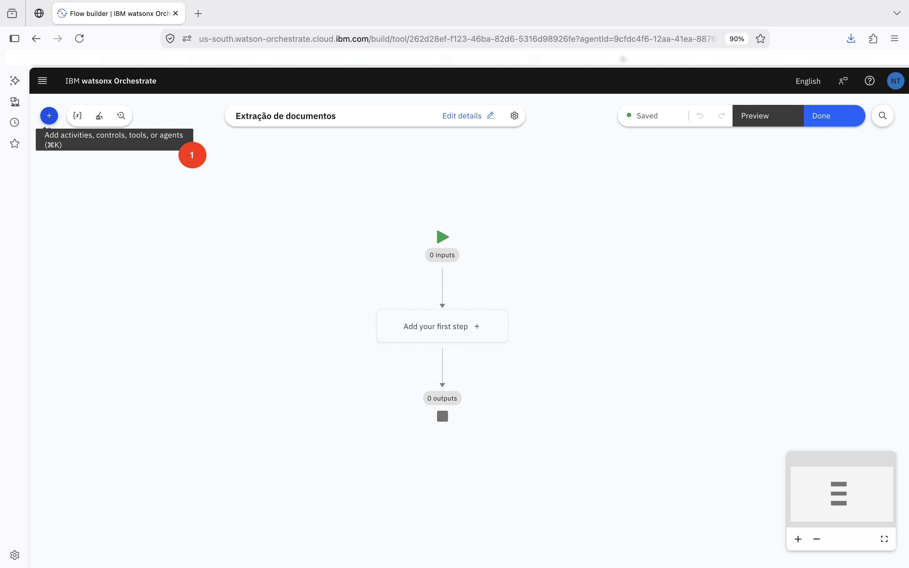

| 2 | `{x}` | **Flow variables** | Gerencia as variáveis do fluxo |

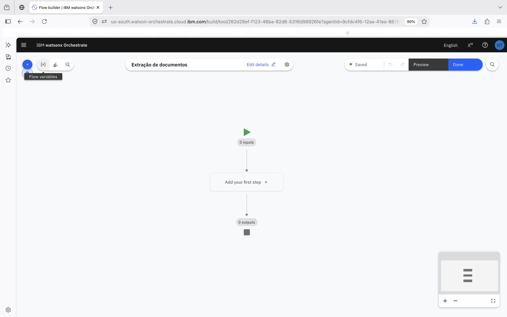

| 3 | 🧹 | **Tidy canvas** | Reorganiza automaticamente o layout do canvas |

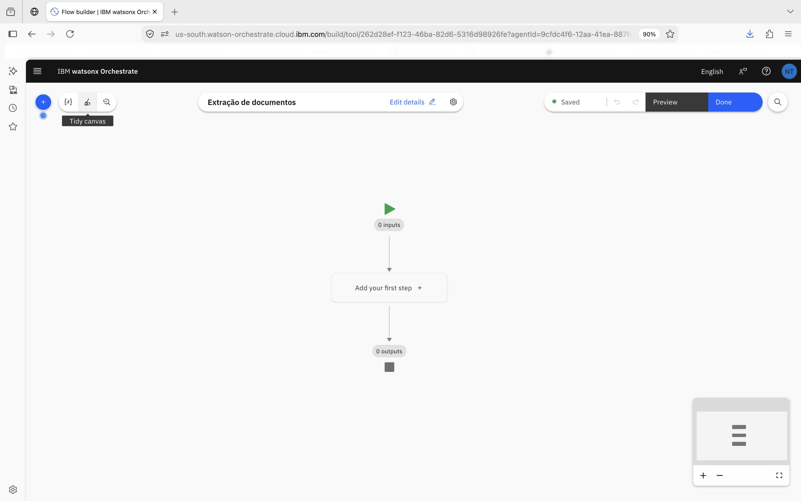

| 4 | 🔍 | **Open flow inspector** | Inspeciona a estrutura e o estado do fluxo |

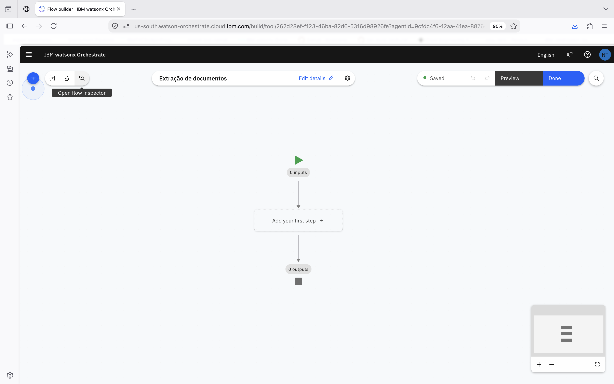

| 5 | ⚙️ | **Flow settings** | Configurações gerais do fluxo |
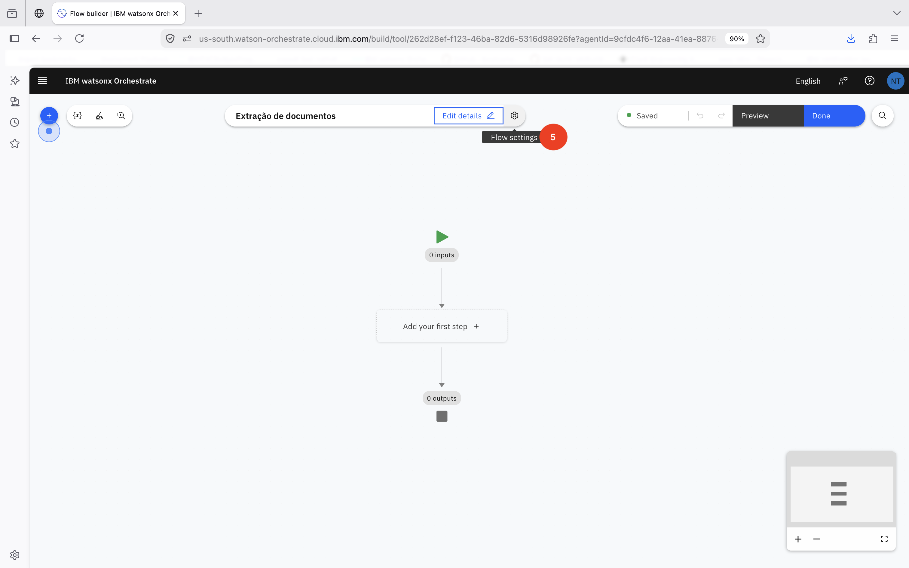

### Edit details — Overview e Parameters

Ao abrir **Edit details**, há duas abas: **Overview** (Name e Description) e **Parameters**.

O campo **Description** é opcional, mas altamente recomendado.

A própria interface sugere três pilares para uma boa descrição:

- **Functionality** — o que a ferramenta faz e quais tarefas suporta; deixe claras capacidades e limitações
- **Use Cases** — quando usar a ferramenta, com palavras-chave, ações do usuário e tipos de solicitação
- **Trigger Conditions** — situações ou pedidos que ativam a ferramenta, para o agente decidir o momento certo de chamá-la

Não faremos nada nessa sessão, clique em **Done**

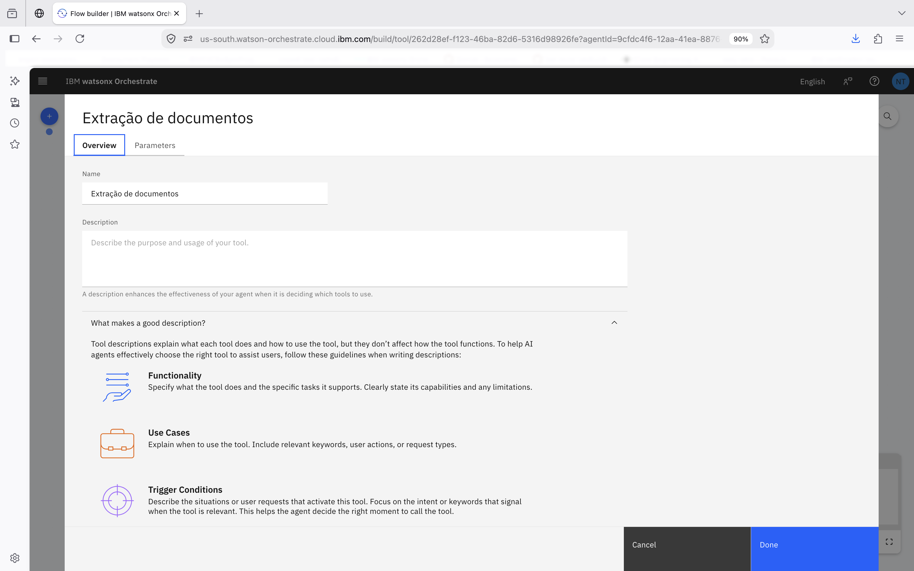

### Flow settings

Abra **Flow settings** e conheça as opções:

| Configuração | O que faz | Estado no lab |
|---|---|---|
| **Auto-map chat history to inputs** | Tenta mapear automaticamente as entradas dos nós usando as últimas cinco interações do chat | Ligado |
| **Scheduling** | Define se o usuário final pode agendar a execução do fluxo | Ligado |
| **Agent summarization** | Permite que o agente resuma e raciocine ao final do fluxo | Desligado |
| **Custom summarization instructions** | Personaliza como grandes volumes de dados são resumidos antes do auto-mapping | — |
| **Mask sensitive information** | Mascara variáveis e saídas com dados sensíveis (ex.: senha, endereço) | — |
| **Translate user activities** | Escolhe os idiomas para tradução das atividades do usuário | — |
| **Configure external system notifications** | Configura notificações de fluxo e tarefas para sistemas externos | — |

Feche o painel em **Close**.

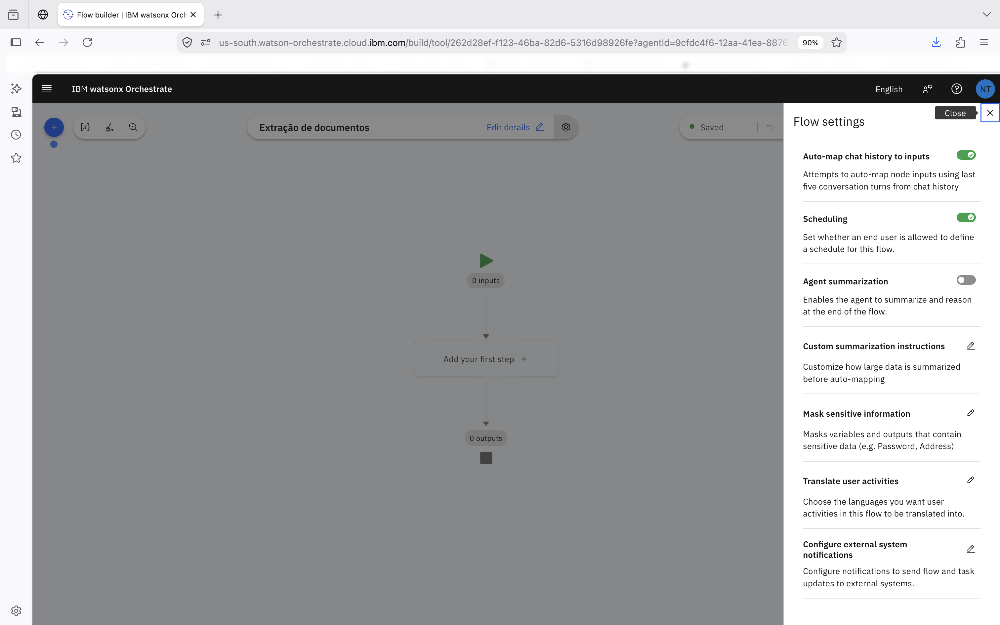

> **Mask sensitive information** é especialmente relevante quando o documento contém CPF, endereço ou dados bancários. Avalie ativá-lo em cenários produtivos.

---

# Parte 3 — Montando o fluxo: coleta do arquivo

### Abrindo o painel de nós

Clique no botão `+` (**Add activities, controls, tools, or agents**). O painel abre com três abas: **Flow nodes**, **Tools** e **Agents**.

Em **Flow nodes** você encontra:

**Flow activities**

| Nó | Descrição |
|---|---|
| **Decision** | Automatiza decisões de negócio complexas |
| **Document classifier** | Identifica documentos com base em classes |
| **Document extractor** | Extrai informações de documentos |
| **Generative prompt** | Usa um LLM para gerar texto ou conteúdo estruturado |
| **Logic block** | Implementa transformação de dados ou lógica de negócio simples |
| **Text extractor** | Extrai texto bruto de documentos |
| **User activity** | Coleta entradas do usuário e apresenta dados dentro do chat |

**Flow controls**

Flow controls são os nós que controlam o fluxo da automação. Eles não processam dados diretamente, apenas definem o caminho, a repetição e a ordem de execução das atividades.

**Branch:** Cria caminhos diferentes com base em uma condição. Funciona como um if/else. Exemplo: se o CPF estiver preenchido, segue por um caminho; se não, segue por outro.

**For each:** Repete um conjunto de ações para cada item de uma lista. Exemplo: processar vários arquivos enviados, um por vez.

**Loop:** Repete uma ação até que uma condição seja atendida. Exemplo: solicitar o envio do documento novamente até que o CPF seja informado ou até atingir o limite de tentativas.

**Parallel:** Executa várias ações ao mesmo tempo. Exemplo: extrair dados do documento, consultar o CPF e verificar restrições simultaneamente, reduzindo o tempo total de processamento.

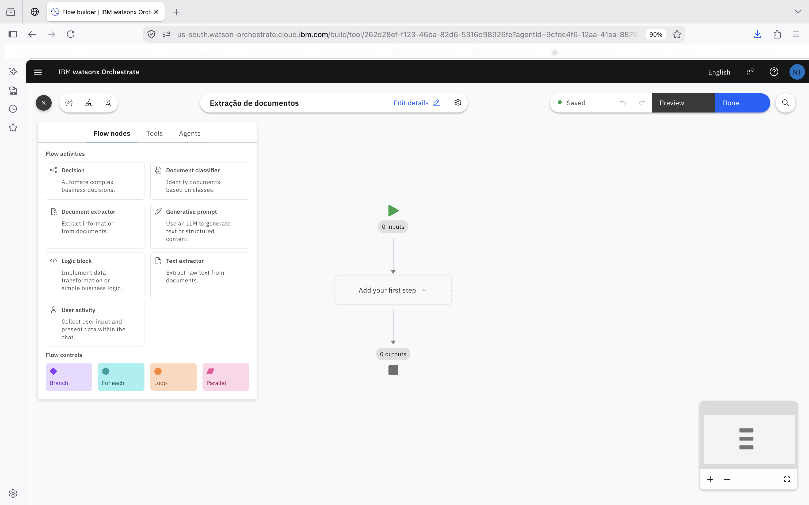

### Adicionando o nó User activity

Arraste o card **User activity** do painel para o placeholder **Add your first step** no canvas.

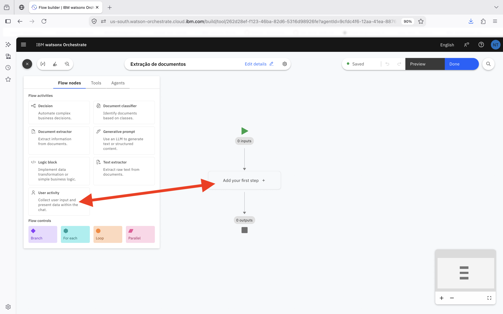

O nó **User activity 1** é criado como um contêiner delimitado por linha tracejada verde, contendo **Start → Add → End**.

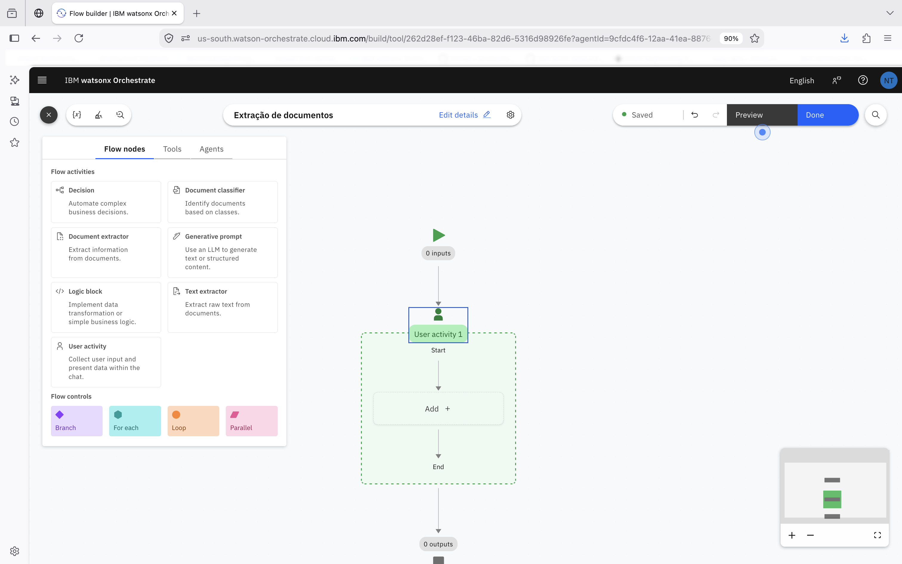

> O **User activity** é um bloco de interação: tudo o que estiver dentro dele acontece em diálogo com o usuário no chat.

### Adicionando o File upload

Clique em **Add** dentro do User activity. 

O menu **User activities** exibe:

- `Collect from user` ›
- `Present to user` ›
- `Add a form`
- `Add a flow activity` ›
- `Add a flow control` ›
- `Call a tool`
- `Call an agent`

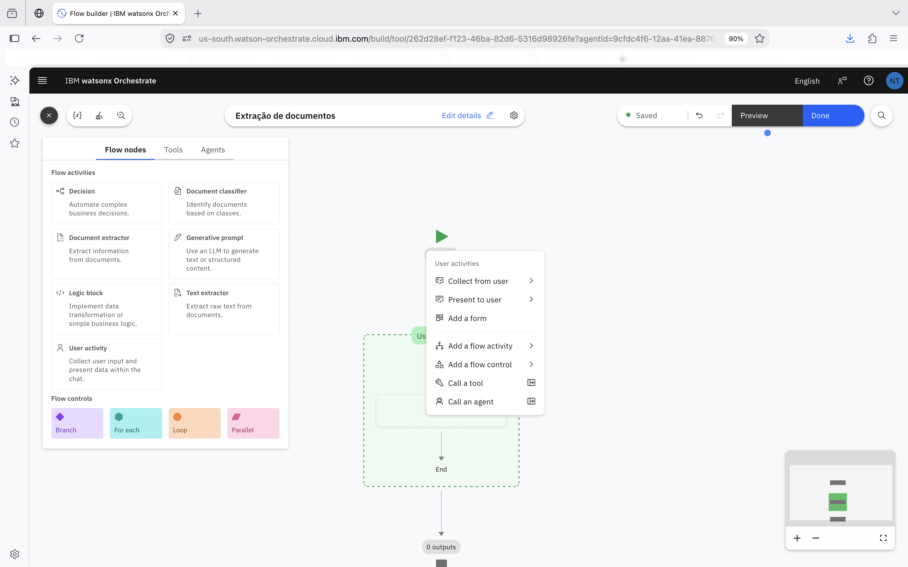

Escolha **Collect from user** (item 1). O submenu mostra os tipos de coleta: `Boolean choice`, `Date`, **`File upload`**, `Number`, `Single choice`, `Text`.

Selecione **File upload** (item 2).

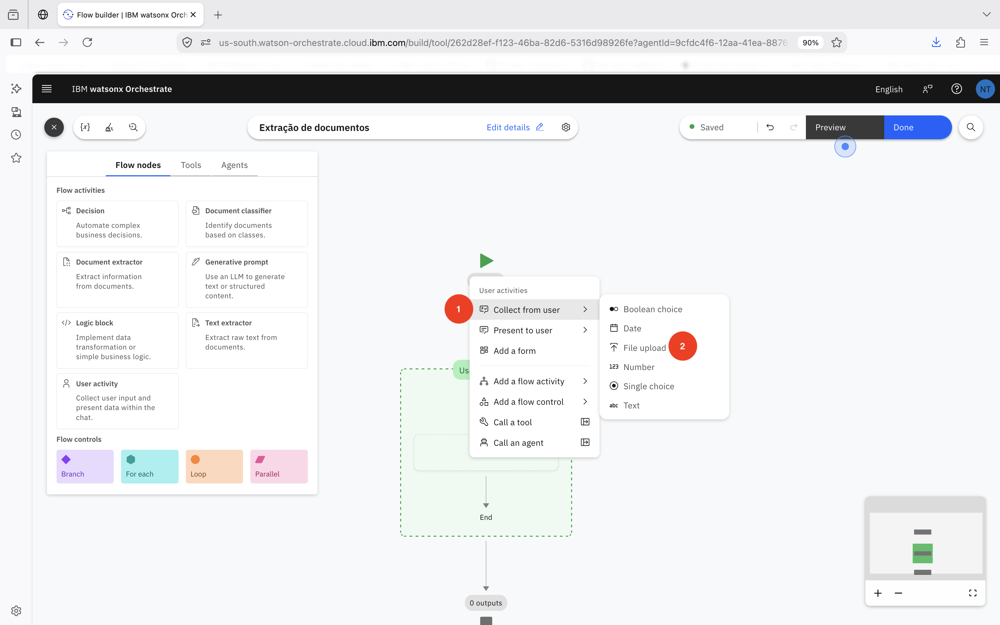

O nó **File upload 1** aparece dentro do User activity 1, entre Start e End.


---

# Parte 4 — Configurando o Document extractor

### Adicionando o nó de extração

Arraste o card **Document extractor** do painel para a posição **imediatamente após o File upload 1**, ainda dentro do bloco **User activity**

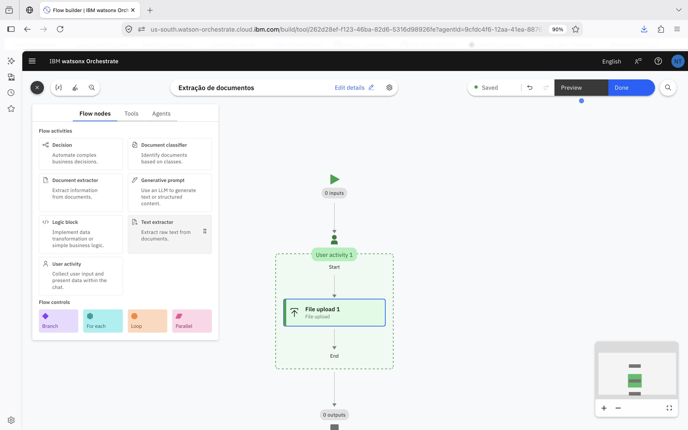

### Selecionando o formato do documento

O painel **Select a document format** com duas opções:

| Formato | Quando usar |
|---|---|
| **Structured** | Documentos com layout sempre igual — notas fiscais, formulários fiscais, carteiras de identidade |
| **Unstructured** | Documentos sem layout consistente — contratos, relatórios, e-mails |

Selecione **Unstructured**.

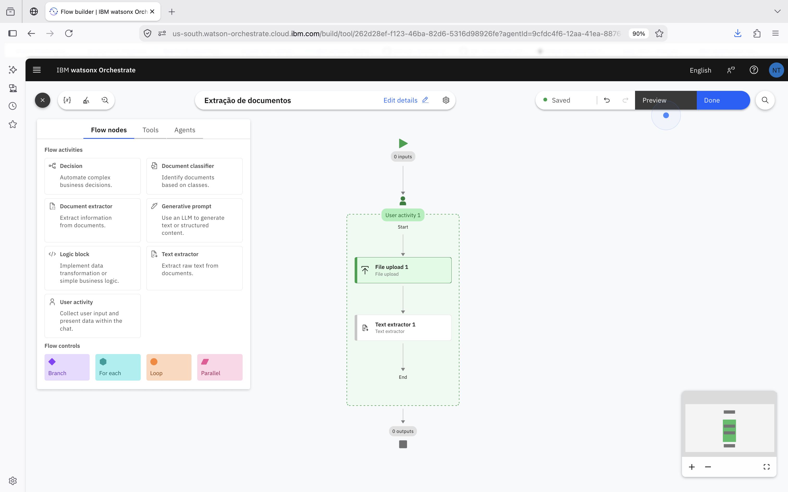

> **Por que Unstructured para uma CNH?** Apesar de a CNH ter layout padronizado, as fotos enviadas por usuários variam muito em enquadramento, rotação, iluminação e versão do documento. O modo *Unstructured* usa um LLM multimodal com descrição semântica dos campos, sendo mais tolerante a essa variação.

### Fazendo upload dos documentos de exemplo

O editor do **Document extractor** abre em tela cheia. À direita, o painel **Upload documents** informa:

> Faça upload de até 100 documentos de exemplo.
> Tamanho máximo por arquivo: 10 MB.
> Tipos de arquivo suportados: .pdf, .docx, .pptx, .jpg, .png, .tiff, .xlsx e .heic.

Arraste sua primeira CNH (`11837-41.jpg`) para a área `Drag and drop files here or upload`

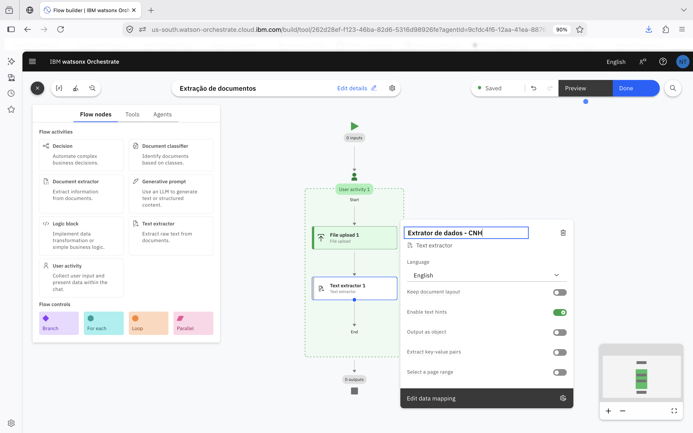

Aguarde enquanto a imagem é processada...

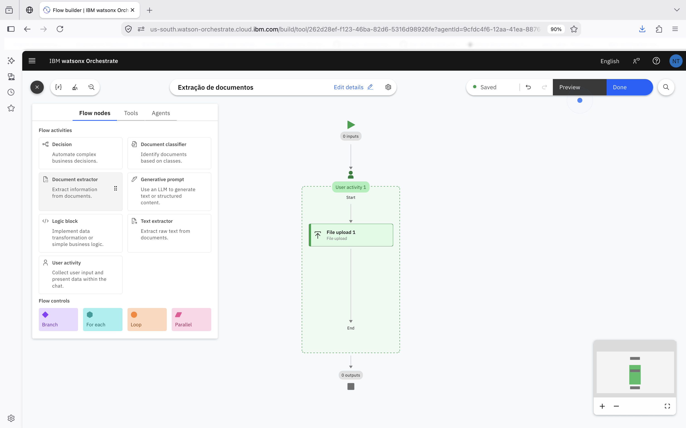

Note os elementos da tela:

- **Metrics Summary** (esquerda) — *Overall accuracy* começa em `0% (0/1)`
- **Define your schema** (centro) — onde criaremos os campos
- **Visualizador** (direita) — pré-visualização do documento com zoom e navegação de páginas
- **Model** (topo) — modelo de extração, inicialmente `llama-4-maverick-17b-128e-instruct`
- **Idioma** (topo) — inicialmente `EN`

### Criando o primeiro campo: Nome

Clique em **Add field +**, digite o nome do campo e pressione Enter:

```
Nome
```

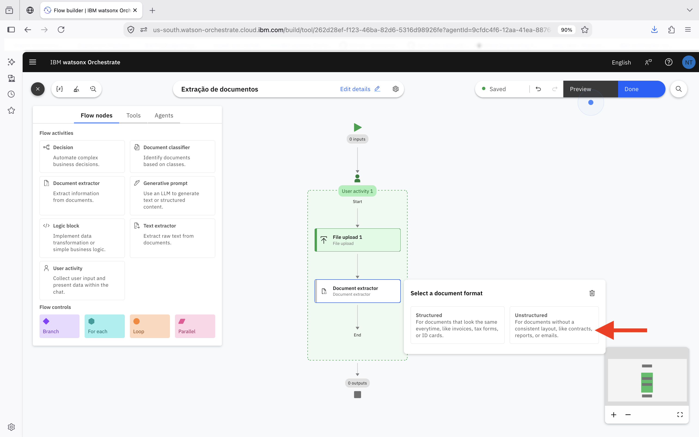

O modelo processa o documento e a tabela ganha três colunas: **Field Name**, **Extracted Value** (com selo *AI*) e **Correct Value**.

Resultado esperado: `FERNANDO CAETANO`, com o valor destacado em azul sobre o documento à direita.


### Criando o campo FILIAÇÃO

Clique em **Add field +** 

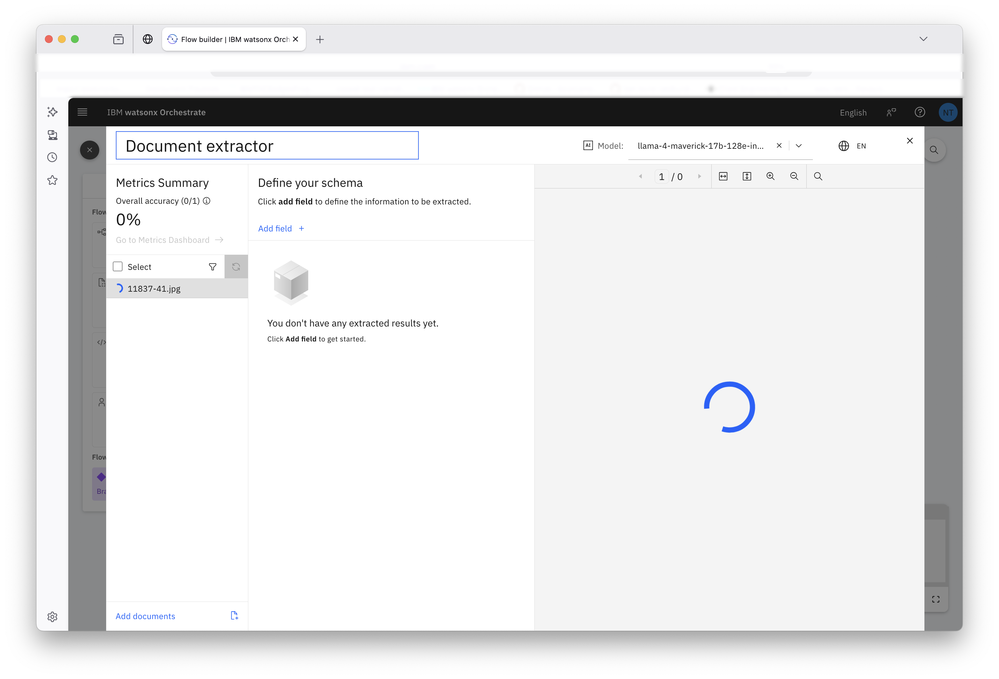

Agora o nome do campo será:

```
FILIAÇÃO
```


Resultado esperado: `SERGIO CAETANO, LENE MARIA CAETANO`.


### Criando o campo CPF 

Clique em **Add field +** novamente 

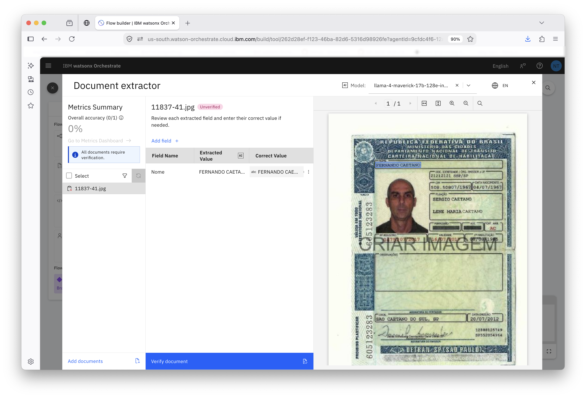

O nome do novo campo será:

```
CPF
```

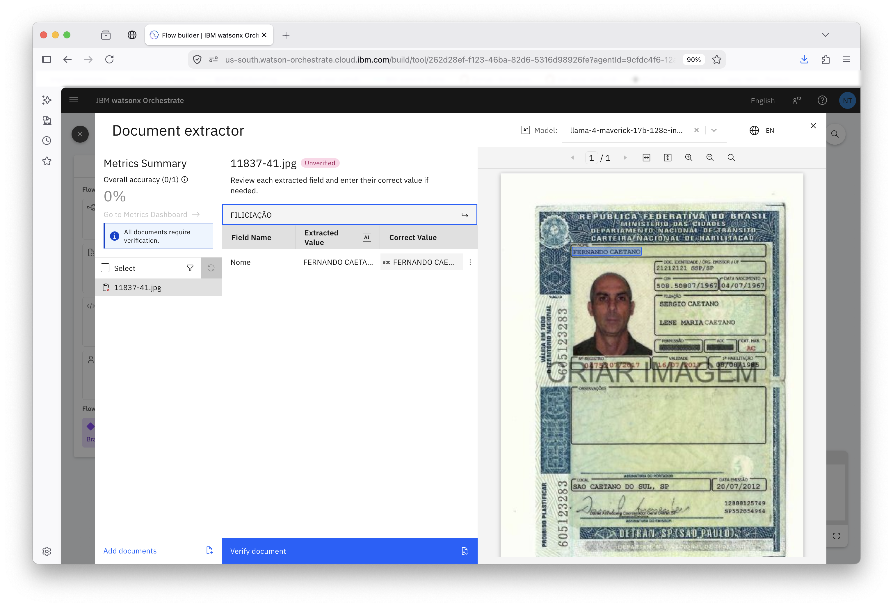

Aguarde o processamento...

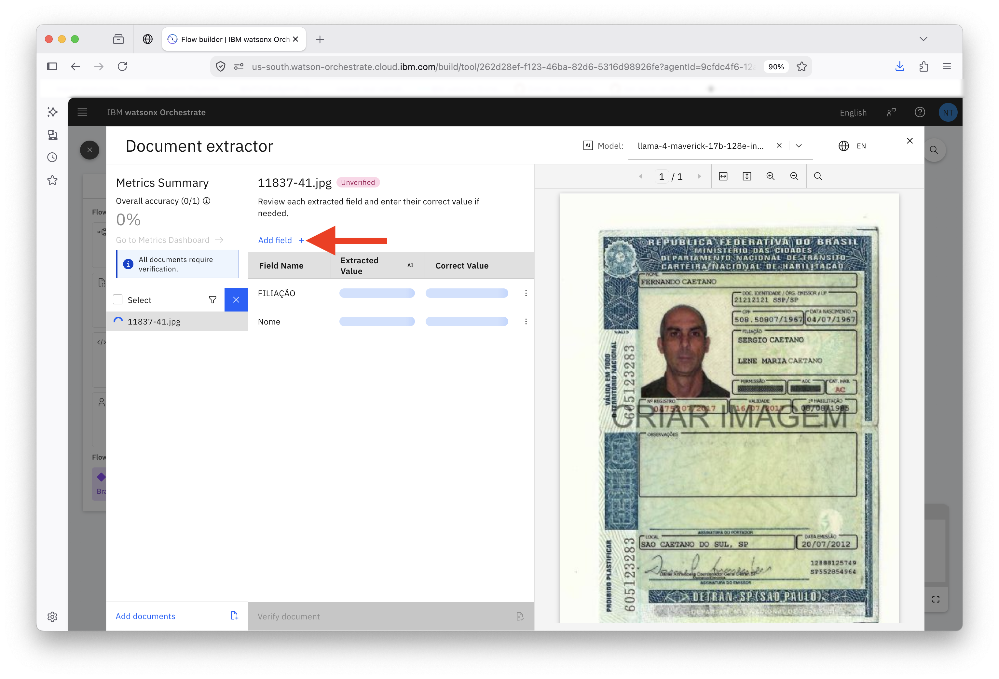

**Note que alguns contratempos quando estamos lidando com modelos de inteligência artificial generativa podem ocorrer.**

O valor extraído vem como `12000125749`, que é o número de registro no rodapé do documento, não o CPF.

**E é nosso dever dizer para o modelo o que esperamos dele e não simplesmente esperar que ele advinhe.**

Este é um dos momentos mais importantes desse laboratório: **Ensinar o modelo onde olhar**.

---

## Corrigindo a extração com Description e Examples

Clique no ícone `(⋮)` da linha do CPF (item 1), escolha **Edit** (item 2).

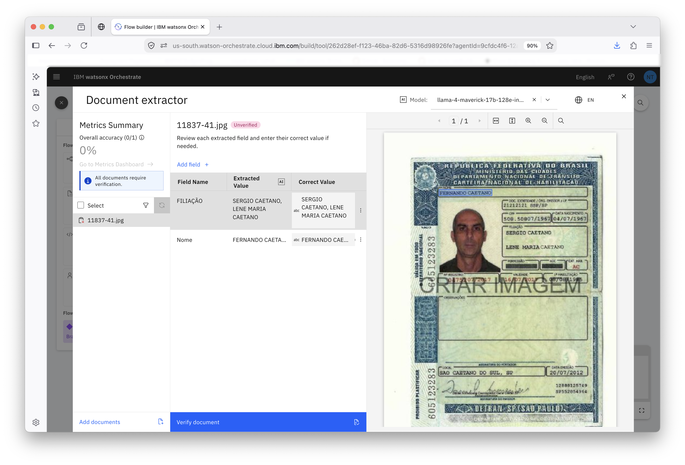

Essa tela é a configuração de um campo de extração no nó Document Extractor do IBM watsonx Orchestrate. Nela, você ensina o modelo a identificar e extrair uma informação específica do documento. No exemplo da imagem, o campo configurado é CPF.

Preencha assim:

| # | Campo | Valor |
|---|---|---|
| 1 | **Field name** | `CPF` |
| 2 | **Data type** | `String` |
| 3 | **Description** | Ative o toggle |
| 4 | **Descrição** | `O CPF é uma sequência númerica, ele está presente abaixo do campo CPF, ao lado da linha de data de nascimento.` |
| 5 | **Examples** | Ative o toggle |
| 6 | **Input** | `"CPF"` |
| 7 | **Output** | `508.50807/1967` |
| 8 | — | Clique em **Submit** |

> O *Document extractor* não é uma caixa-preta. Quando o modelo confunde campos, você não muda o modelo, você **descreve o campo em linguagem natural** (onde ele fica, como se parece, qual o padrão) e **dá exemplos concretos**. 
> <br>
> Aqui estamos fazendo o papel de prompt engineering aplicado no que queremos processar, nesse caso, documentos.

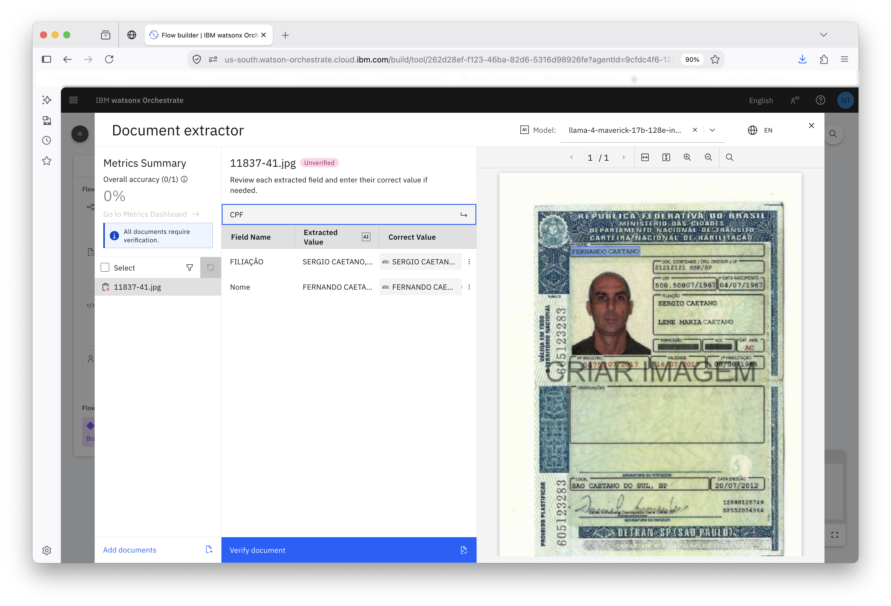

A dica exibida na própria interface: *“Adicione 3-5 examples para ajudar o LLM a entender qual é a saída que você está esperando”*

Após o envio, o modelo reprocessa e agora extrai o valor correto.


Clique em **Add field +**


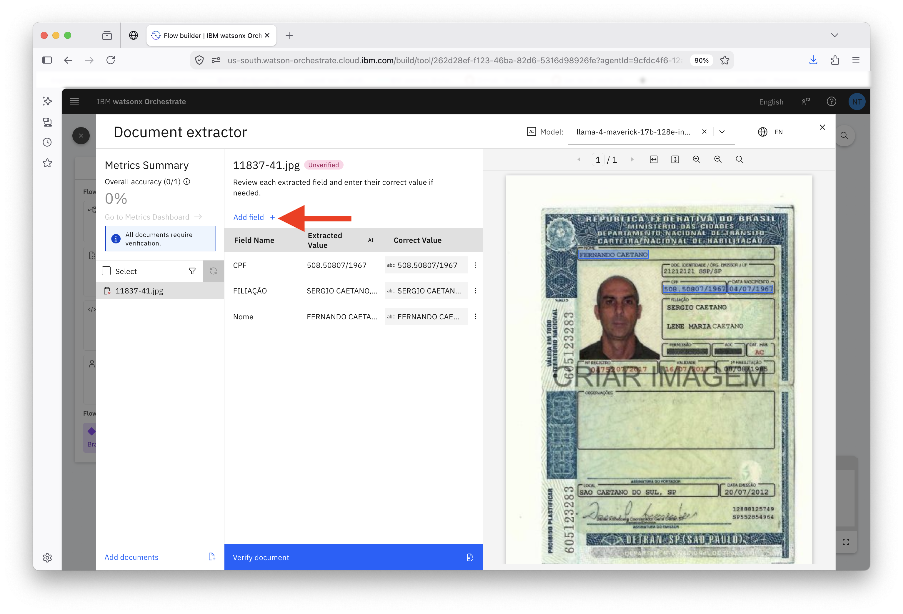


Adicione o último campo:

```
DATADENASCIMENTO
```

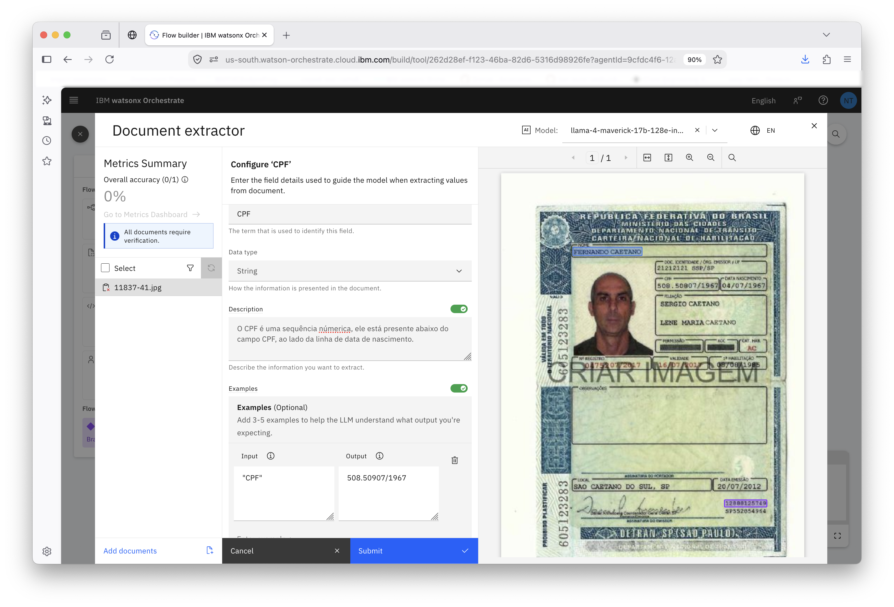

Aguarde o processamento...

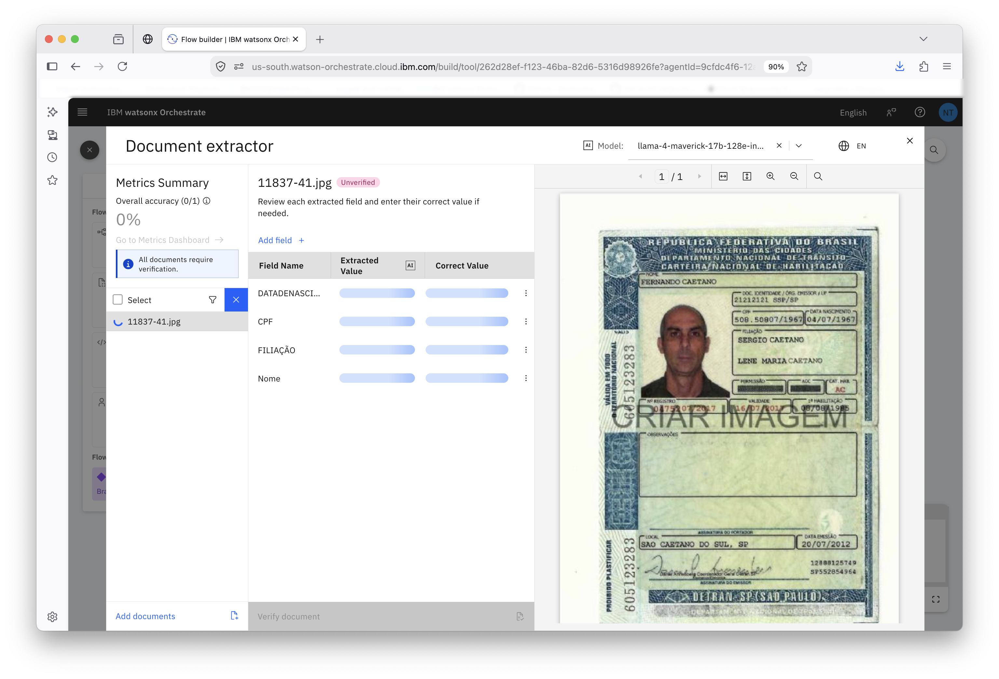

Resultado esperado: `04/07/1967`


Note que no exemplo anterior, haviamos configurado um número errado e isso foi de próposito. **O modelo identificou que o número digitado não era o mesmo que estava no documento e corrigiu sozinho.**

Reabra **Configure ‘CPF’** e ajuste o campo **Output** do exemplo correto:

```
508.508.07/1967
```

Clique em **Submit**.

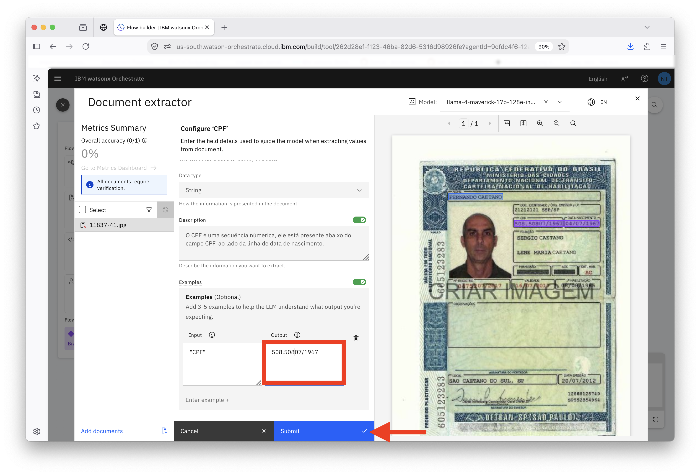

> O valor do **Output** no exemplo ensina o modelo tanto *o que* extrair quanto *como formatar*. Use isso para padronizar máscaras (datas, documentos, moedas).

Clique no botão azul **Verify document** no rodapé.


O documento muda de `Unverified` para **`Verified`**, a mensagem passa a ser *“All documents have been verified successfully”* e o **Overall accuracy** sobe para **100% (1/1)**.


> **O que é a verificação?** Ao verificar, você declara que os valores da coluna *Correct Value* são a verdade absoluta (ground truth) daquele documento. Isso alimenta a métrica de acurácia e serve de baseline para comparar modelos e ajustes de schema.

---

## Validando com um segundo documento

Um único documento não prova nada. 

Clique em **Add documents** e suba a segunda CNH (`cnh1.jpg`).

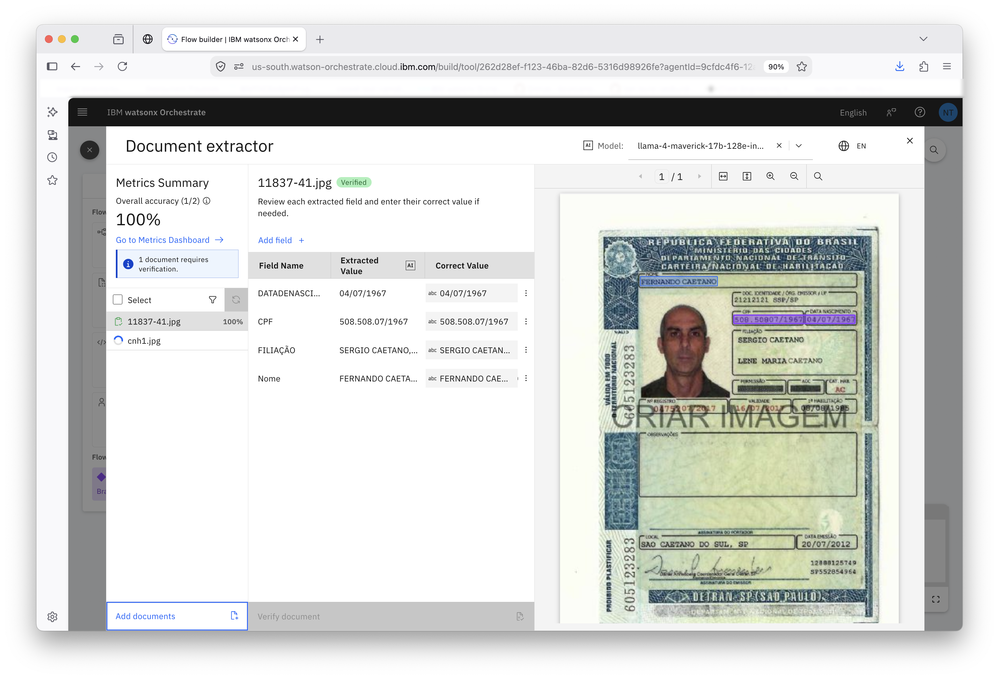

O painel de métricas passa a exibir *“1 document requires verification”* e a acurácia vira `(1/2)`.

Selecione `cnh1.jpg` na lista à esquerda. O modelo extrai automaticamente os quatro campos do novo documento:

| Campo | Valor extraído |
|---|---|
| DATADENASCIMENTO | `18/01/2020` |
| CPF | `20605204/0001-63` |
| FILIAÇÃO | `NOME DO SEU PAI E MÃE AQUI...` |
| Nome | `MASTER LASER MAQUINAS` |

Revise, corrija o que for necessário e clique em **Verify document**.

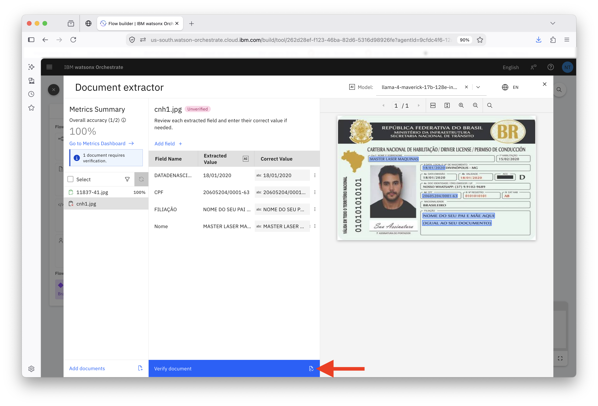

Agora a acurácia é **100% (2/2)** e ambos os documentos aparecem verificados com 100%.

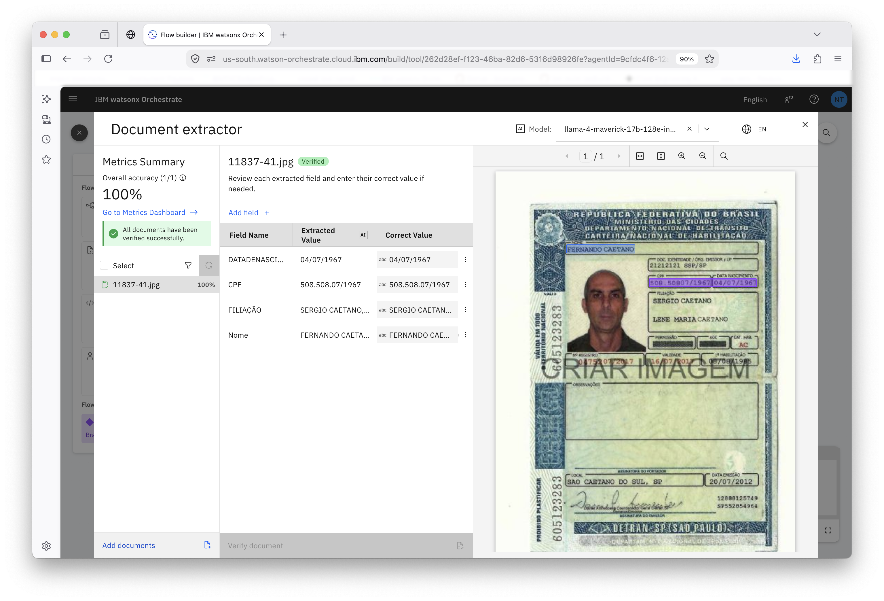

> Este segundo documento é de um modelo de CNH diferente (novo padrão, com layout distinto). Se o schema funciona nos dois, ele generaliza bem. **Sempre teste com variações reais** antes de colocar em produção.

---

## Ajustando idioma e modelo 

### Idioma

Clique no seletor de idioma (🌐 `EN`) no topo direito. A lista traz dezenas de opções: *Afrikaans, Albanian, Aymara, Basque, Belarusian, Bengali, Bislama, Bulgarian, Catalan, Chinese (Simplified), Chinese (Traditional), Cree, Danish, Dutch, English, English with Handwriting* e mutios outros.


Selecione **Portuguese** (`PT`). O extrator reprocessa os documentos com o novo idioma.


### Modelo

Clique no campo **Model**.

As opções recomendadas incluem:

| Modelo | Observação |
|---|---|
| `llama-4-maverick-17b-128e-instruct-fp8` | Recomendado: Padrão do laboratório |
| `granite-4-h-small` | Recomendado |
| `mistral-small-3-1-24b-instruct-2503` | Recomendado |
| `mistral-medium-2505` | Recomendado ⚠️ |

Mantenha o `llama-4-maverick-17b-128e-instruct-fp8` para este laboratório.

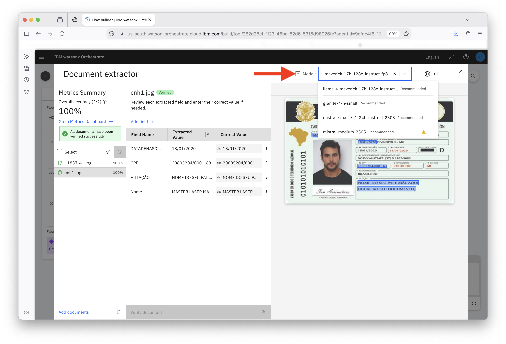

> Como você já tem documentos verificados, pode trocar o modelo e comparar a acurácia resultante. Esse é o método para escolher o modelo mais adequado ao *seu* tipo de documento, em vez de escolher pelo tamanho ou pela popularidade.

### Fechando o extrator

Clique no **X** no canto superior direito para voltar ao **Flow Builder**.

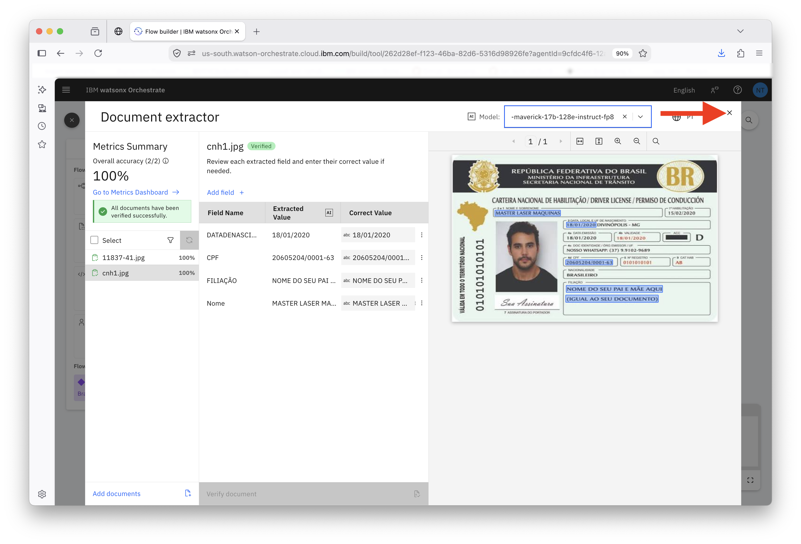

---

# Parte 5 — Finalizando o fluxo e refinando o agente

### Concluindo o workflow

O canvas agora mostra o fluxo completo:

```
0 inputs → User activity 1 [ Start → File upload 1 → Document extractor → End ] → 0 outputs
```

Clique em **Done** no canto superior direito.

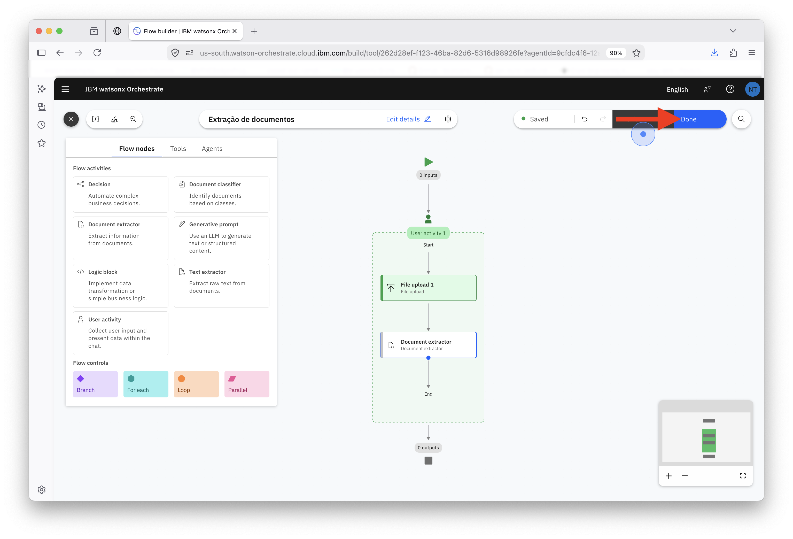

Ao retornar no editor do agente, o workflow já está registrado como tool. 

### Refinando as instruções do agente

Volte à aba **Behavior** e edite o campo **Instructions**. 

Substitua o texto da Parte 1 por:

```
Após qualquer mensagem, execute o workflow de processamento **Extração de documentos**
disponível para analisar o documento e extrair todas as informações relevantes.
Organize os dados extraídos de forma estruturada e retorne os resultados ao usuário.
Caso o documento esteja corrompido, ilegível ou não contenha as informações esperadas,
informe o usuário.
```


> A instrução original dizia “receba o documento enviado pelo usuário”, mas o usuário ainda não tem como enviar nada antes de o workflow rodar, porque é o próprio workflow que abre o campo de upload. A nova instrução (“**após qualquer mensagem**, execute o workflow”) inverte a ordem e cita o workflow **pelo nome exato**, garantindo o acionamento correto.
>

**Quando um agente não chama a ferramenta esperada, o problema quase sempre está nas instruções, não no modelo.**

---

# Parte 6 — Testando o agente ponta a ponta

No painel **Draft Preview** (rodando em *debug mode*), digite qualquer mensagem, por exemplo:

```
oi
```

O agente responde acionando o workflow: aparece o bloco **File upload 1 → Upload files**, listando os formatos suportados (CSV, DOC, DOCX, GO, HTML, JAVA, JPEG, JPG, JS, JSON, MD, MP3, MP4, PDF, PNG, PPT, PPTX, PY, SVG, TIFF, TS, TXT, WAV, XLS, XLSM, XLSX, XML, YAML, YML — máximo 30 MB).

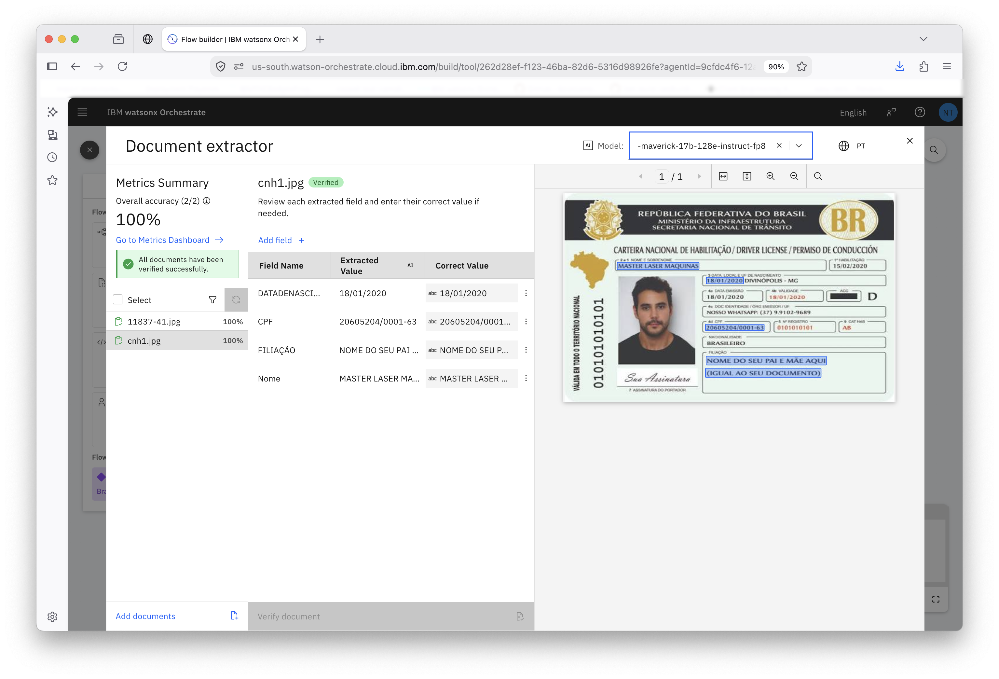


Clique em **Add files** (item 2), selecione `11837-41.jpg` e envie (item 3).


O agente processa o arquivo.

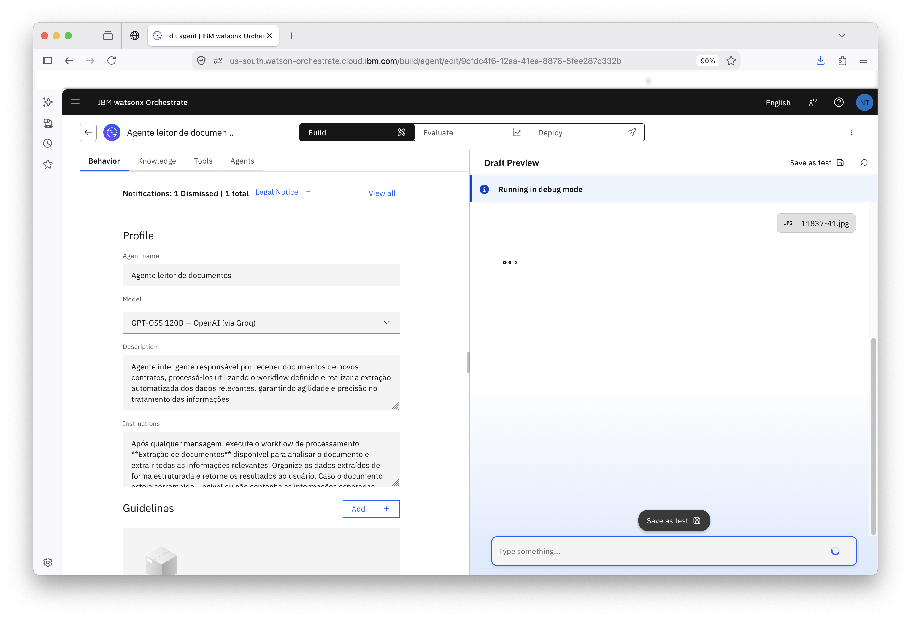


O agente responde:

*“Preciso que você revise a extração do documento”* com um card **Review document extraction** contendo o nome do arquivo e o link **View**. Clique em **View** (item 4).

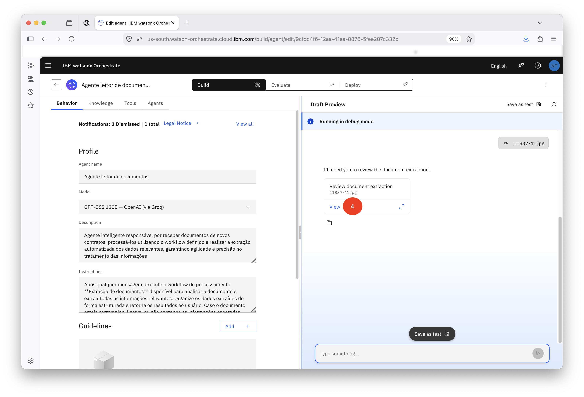

No painel **Review document extraction**, observe que os quatro campos aparecem preenchidos, cada um com o alerta: *“Low confidence extraction. Confirm value.”*:

| Campo | Valor |
|---|---|
| Cpf | `508.508.07/1967` |
| Datadenascimento | `04/07/1967` |
| Filiação | `SERGIO CAETANO E LENE MARIA CAETANO` |
| Nome | `FERNANDO CAETANO` |

Revise os valores e clique em **Submit** (item 6).

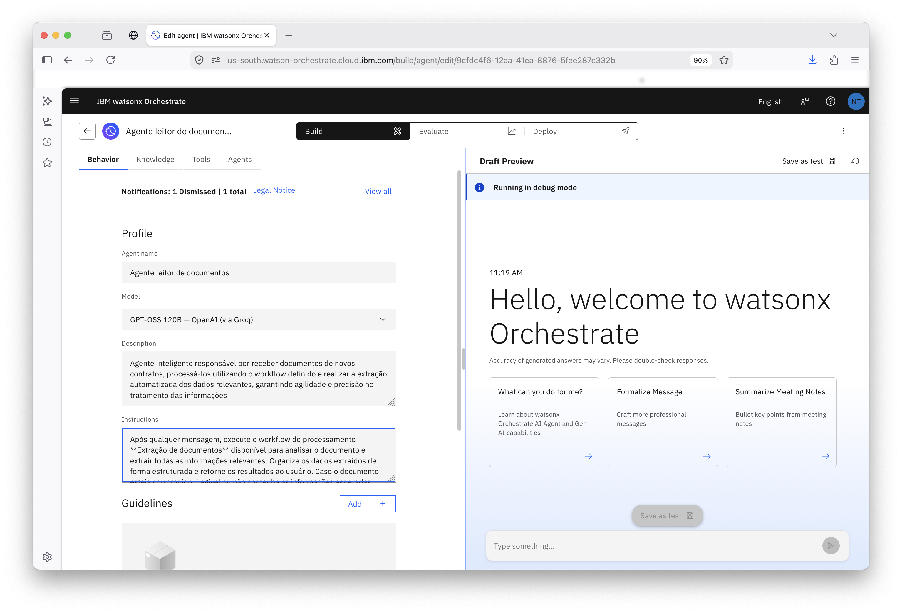

Na **Confirm extraction**, Clique em **Confirm and submit** (item 7).

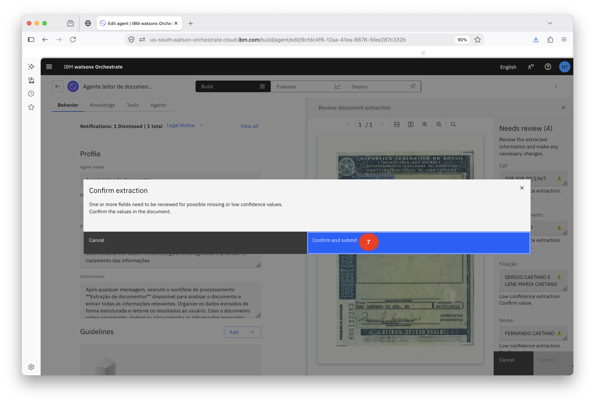

O chat exibe o selo verde **Submitted** e o agente segue processando.

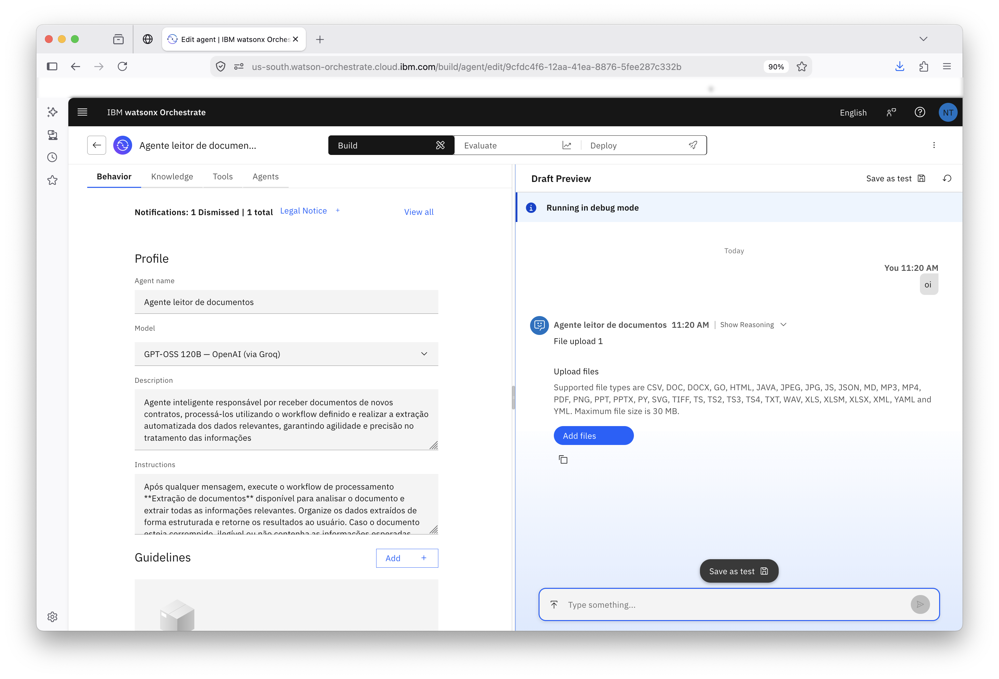

### Resultados

O agente devolve o JSON estruturado com os dados extraídos e a URL assinada do documento armazenado:

```json
{
  "value": "https://s3.us-south.cloud-object-storage.appdomain.cloud/wo-archer-prod-us-south-cos/uploaded_files/.../11837-41.jpg?X-Amz-Algorithm=...",
  "cpf": "508.508.07/1967",
  "datadenascimento": "04/07/1967",
  "filiação": "SERGIO CAETANO E LENE MARIA CAETANO",
  "nome": "FERNANDO CAETANO"
}
```

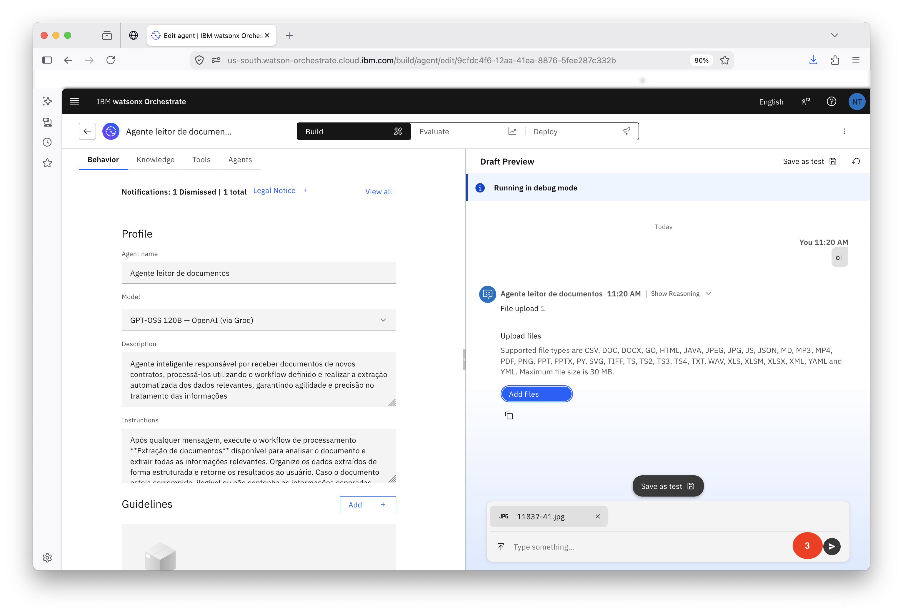

 **Laboratório concluído.** Você construiu um agente funcional de leitura e extração de documentos.

---

## Boas práticas

1. **O produto é watsonx Orchestrate, não watsonx Crystall Ball** Toda vez que a extração falhar, escreva uma descrição em linguagem natural explicando onde o dado está e como ele se parece.
2. **De 3 a 5 exemplos por campo problemático.** É o número recomendado pela própria interface e o que melhor equilibra precisão e custo.
3. **Verifique com variação real.** Dois documentos do mesmo layout não validam nada. Use versões antigas e novas, fotos tortas, digitalizações ruins.
4. **Nomeie o workflow de forma única e cite-o nas instruções.** Ambiguidade no nome gera falha de roteamento.
5. **Ative o Mask sensitive information** quando o documento contiver CPF, endereço ou dados bancários.
6. **Compare modelos com dados verificados.** A métrica de acurácia existe justamente para transformar a escolha do modelo em decisão baseada em evidência.

---

# Próximos passos

 Note que algumas coisas ficaram pendentes nesse laboratório como:

 - Uma boa resposta estruturada e user-friendly
 - E se o docuemento enviado não contém todos os campos?
E algumas outras que podemos melhorar ainda mais, e é por isso que esse laboratório tem continuação.

[Clique aqui](./Step_by_Step_Labworkflow-2.md) para seguir para a continuação desse laboratório