## Glossário de Termos Técnicos

> Termos já definidos no [Laboratório 1](./Step_by_Step_Labworkflow-1.md#glossário-de-termos-técnicos) não são repetidos aqui.

| Termo | Significado |
|---|---|
| **Branch** | Nó de controle de fluxo que divide a execução em caminhos condicionais (similar a um `if/else`); no Flow Builder possui um **Path 1** (condição `if`) e um **Path 2** (caminho padrão `else`). |
| **Condition / Condição** | Expressão lógica que determina qual caminho o fluxo vai percorrer em um nó Branch. Pode ser criada visualmente ou por editor de código. |
| **Default path** | Caminho de exceção (Path 2) de um Branch, executado quando nenhuma das condições definidas nos outros paths for satisfeita. |
| **Done** | Botão que confirma e fecha o Flow Builder ou um painel de configuração, retornando ao editor do agente. |
| **Edit condition** | Opção do painel do Branch que abre o editor visual ou de código para definir a condição de um path. |
| **File download** | Opção do menu **Present to user** que disponibiliza um arquivo para download no chat. |
| **HTML** | HyperText Markup Language — linguagem de marcação usada no campo Output message do nó Message para formatar a saída com quebras de linha (`<br>`) e outros elementos visuais. |
| **Human-in-the-loop** | Padrão de automação em que um ser humano é inserido no processo para revisar, corrigir ou aprovar uma etapa antes que o fluxo continue. |
| **List** | Opção do menu **Present to user** que apresenta uma lista de itens formatada no chat. |
| **Message** | Nó do menu **Present to user** que exibe uma mensagem de texto formatada ao usuário no chat — sua saída é determinística, ao contrário do agente. |
| **not in** | Operador lógico usado na condição do Branch para verificar se um valor **não está** presente ou está vazio. |
| **Open flow builder** | Botão na aba Tools do editor de agente que reabre o Flow Builder de um workflow já criado. |
| **Output message** | Campo de texto do nó Message onde se escreve o conteúdo a ser exibido ao usuário, com suporte a HTML e variáveis do fluxo. |
| **Path** | Cada ramificação de execução criada por um nó Branch (ex.: Path 1 para o cenário feliz, Path 2 para o de exceção). |
| **Path condition** | Expressão lógica configurada em cada path de um Branch que determina quando aquele caminho será executado. |
| **Present to user** | Submenu do User activity com as opções de exibição de dados ao usuário: File download, List e Message. |
| **Toggle** | Controle de interface de chave liga/desliga; neste laboratório é usado para ativar ou desativar o User Review. |
| **User Review** | Funcionalidade do Document extractor que pausa o fluxo e envia os campos extraídos para revisão humana quando a confiança da extração fica abaixo de um limiar configurável (padrão: 95%). |
| **Variable / Variável** | Valor nomeado gerado por um nó do fluxo (ex.: `cpf`, `nome`) que pode ser referenciado em outros nós, como o campo Output message do nó Message. |

---


# Construindo Workflows no watsonx Orchestrate — Parte 2

- [Construindo Workflows no watsonx Orchestrate — Parte 2](#construindo-workflows-no-watsonx-orchestrate--parte-2)
  - [Descrição do Caso de Uso](#descrição-do-caso-de-uso)
    - [O que você vai aprender nesse laboratório](#o-que-você-vai-aprender-nesse-laboratório)
    - [Pré-requisitos](#pré-requisitos)
- [Parte 7 — Formatando a resposta com o nó Message](#parte-7--formatando-a-resposta-com-o-nó-message)
    - [Voltando ao Flow Builder](#voltando-ao-flow-builder)
    - [Conhecendo o User Review](#conhecendo-o-user-review)
    - [Adicionando o nó Message](#adicionando-o-nó-message)
    - [Escrevendo o texto da mensagem](#escrevendo-o-texto-da-mensagem)
    - [Inserindo as variáveis do Document extractor](#inserindo-as-variáveis-do-document-extractor)
    - [Ajustando as quebras de linha](#ajustando-as-quebras-de-linha)
    - [Concluindo o fluxo](#concluindo-o-fluxo)
- [Parte 8 — Testando a saída formatada](#parte-8--testando-a-saída-formatada)
    - [Enviando o documento](#enviando-o-documento)
    - [Conferindo o resultado](#conferindo-o-resultado)
- [Parte 9 — Revisão humana e caminhos condicionais](#parte-9--revisão-humana-e-caminhos-condicionais)
    - [Reabrindo o Flow Builder](#reabrindo-o-flow-builder)
    - [Religando o User Review](#religando-o-user-review)
    - [Adicionando o controle Branch](#adicionando-o-controle-branch)
    - [Configurando a condição do Path 1](#configurando-a-condição-do-path-1)
    - [Criando a mensagem de erro no Path 2](#criando-a-mensagem-de-erro-no-path-2)
- [Parte 10 — Testando o caminho de exceção](#parte-10--testando-o-caminho-de-exceção)
    - [Abrindo a revisão](#abrindo-a-revisão)
    - [Resultado](#resultado)
  - [Boas práticas](#boas-práticas)
- [Próximos passos](#próximos-passos)

## Descrição do Caso de Uso

Este laboratório é a **continuação** do laboratório [Construindo Workflows no watsonx Orchestrate](./Step_by_Step_Labworkflow-1.md). Onde foi construído um agente capaz de receber uma CNH pelo chat, extrair Nome, Filiação, CPF e Data de Nascimento e devolver o resultado.

### O que você vai aprender nesse laboratório

- Apresentar os dados extraídos em linguagem natural com o nó **Message**
- Injetar **variáveis do fluxo** dentro de uma mensagem e formatá-la com HTML
- Entender o **User Review** do Document extractor (revisão humana / *human-in-the-loop*)
- Usar o controle de fluxo **Branch** para criar caminhos condicionais
- Configurar uma **condição de path** apoiada na saída do Document extractor
- Tratar o caminho de exceção com uma mensagem de erro ao usuário
- Testar o cenário de falha simulando um documento com campo ilegível

### Pré-requisitos

 ✓ Ter concluído a [Parte 1 deste laboratório](./Step_by_Step_Labworkflow-1.md)
 ✓ Ter o agente **Agente leitor de documentos** com a ferramenta **Extração de documentos** publicada 

# Parte 7 — Formatando a resposta com o nó Message

### Voltando ao Flow Builder

No editor do agente, o **Draft Preview** ainda mostra o resultado do último teste da Parte 1.

Clique na aba **Tools**.

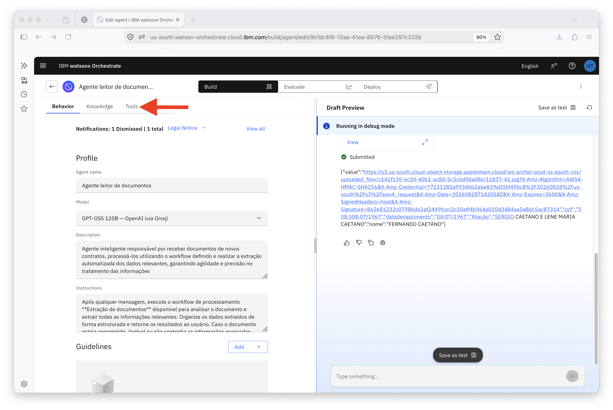

A ferramenta **Extração de documentos** aparece listada, com o tipo **Agentic Workflow**. 

Clique em **Open flow builder**.

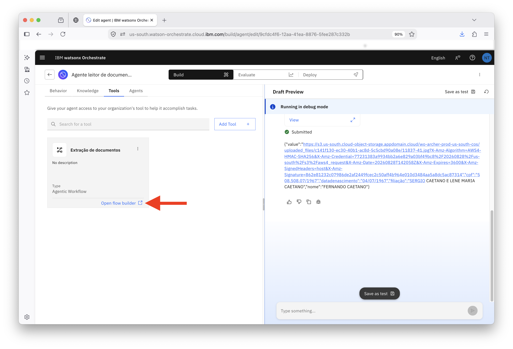

### Conhecendo o User Review

O canvas volta com o fluxo da Parte 1:

Clique no nó **Document extractor**.

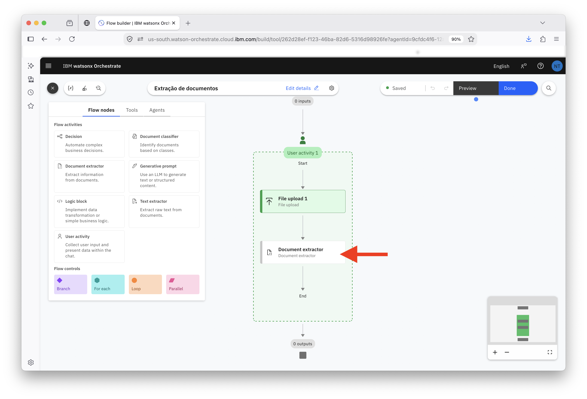

O painel de propriedades abre à direita mostrando **Fields (4)** — `DATADENASCIMENTO`, `CPF`, `FILIAÇÃO` e `Nome` e, logo abaixo, o toggle **User Review**, ativo por padrão:

> *If the extraction confidence is below **95%** for **all fields**, then send to **flow initiator***

É esse recurso que gerou a tela de revisão no teste da Parte 1. Ele é a peça de *human-in-the-loop* do Document extractor,  quando a confiança da extração fica abaixo do limiar, o fluxo **pausa** e devolve os campos para uma pessoa conferir antes de seguir.

Os valores em negrito são editáveis pelo ícone de lápis. Você pode alterar o percentual de confiança e escolher se a revisão vai para o iniciador do fluxo ou para outro destinatário.

**Desative o toggle** (clique nele).

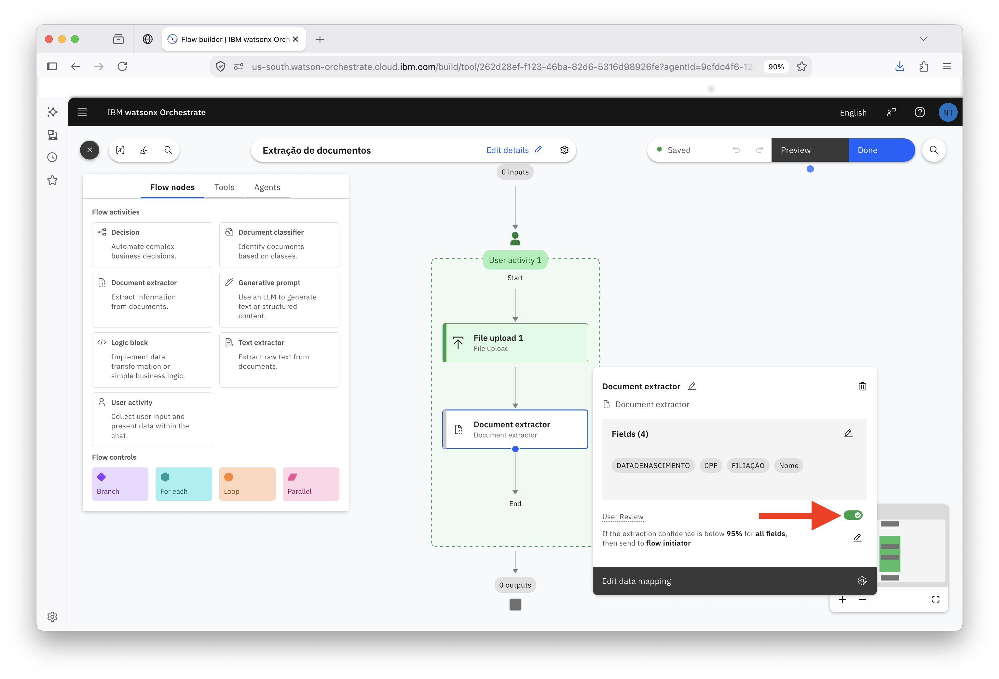

O texto da condição desaparece, o fluxo agora roda ponta a ponta sem pedir confirmação.

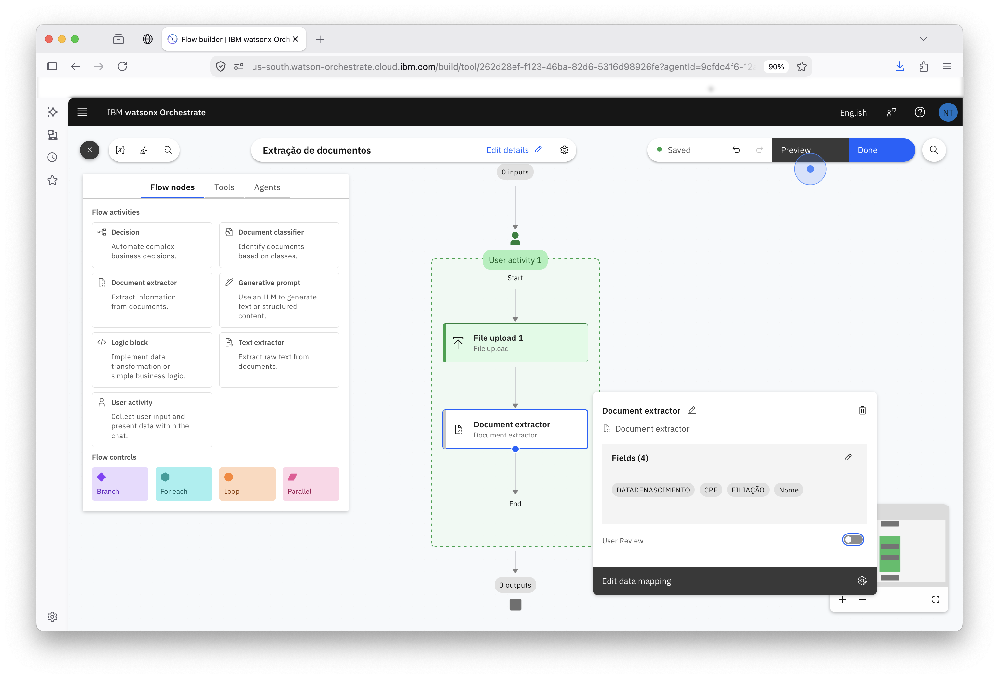

> **Por que desligar agora?** Para enxergarmos o nó Message funcionando sem interrupção.

### Adicionando o nó Message

Feche o painel do Document extractor clicando em uma área vazia do canvas.

Passe o mouse sobre a conexão entre o **Document extractor** e o **End**: um botão **+** azul aparece sobre a seta.

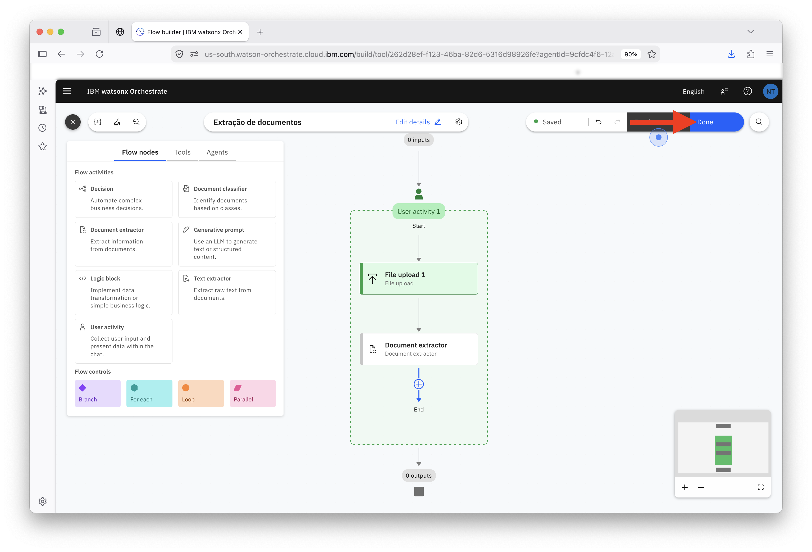

Clique nesse **+** (item 1). O menu **User activities** abre. Vá em **Present to user** (item 2) e, no submenu, escolha **Message** (item 3).

O submenu **Present to user** oferece três formas de devolver algo ao usuário:

| Opção | Uso |
|---|---|
| **File download** | Disponibiliza um arquivo para download no chat |
| **List** | Apresenta uma lista de itens |
| **Message** | Exibe uma mensagem de texto — **é a que usaremos** |

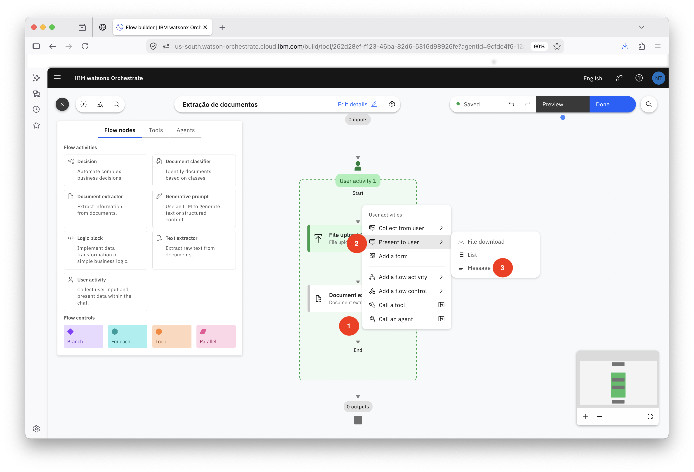

O nó **Message 1 — Display message** é criado entre o Document extractor e o End, e o painel de propriedades abre com o campo **Output message** vazio (item 4)

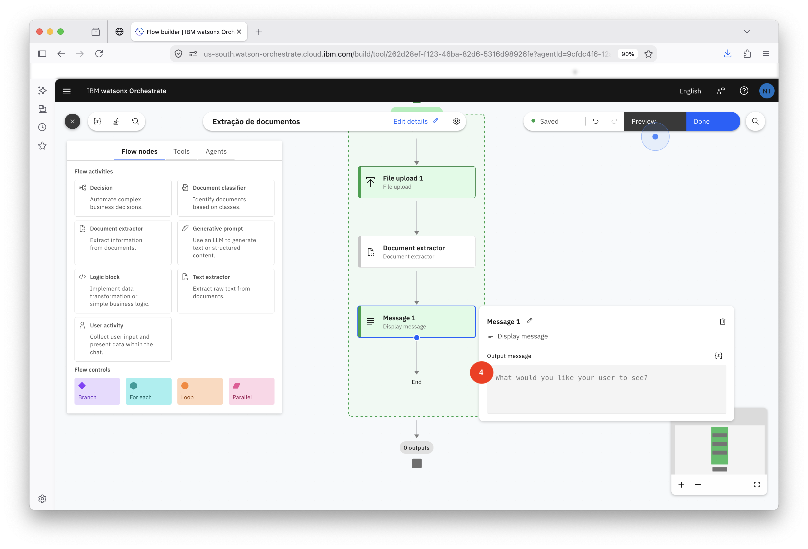

### Escrevendo o texto da mensagem

Clique dentro do campo **Output message** (item 5) e digite o esqueleto da resposta **sem os valores ainda**:

```
Os dados extraídos foram: <br>
Nome:
Nome dos pais:
CPF:
Data de Nascimento:
```

Repare no ícone **`{x}`** no canto superior direito do campo (item 6), é por ali uma das formas para inserimos variáveis do fluxo.


### Inserindo as variáveis do Document extractor

Posicione o cursor logo após `Nome:` e clique em **`{x}`**.

No seletor **Search for variables**, com a árvore de origens do fluxo à esquerda:

- **Flow variables**
- **Input**
- **User activity 1**
  - **File upload 1**
  - **Document extractor**

Selecione **Document extractor** (item 6). À direita aparecem as quatro variáveis de saída do nó:

`cpf` · `datadenascimento` · `filiação` · `nome`

Clique em **nome** (item 7).

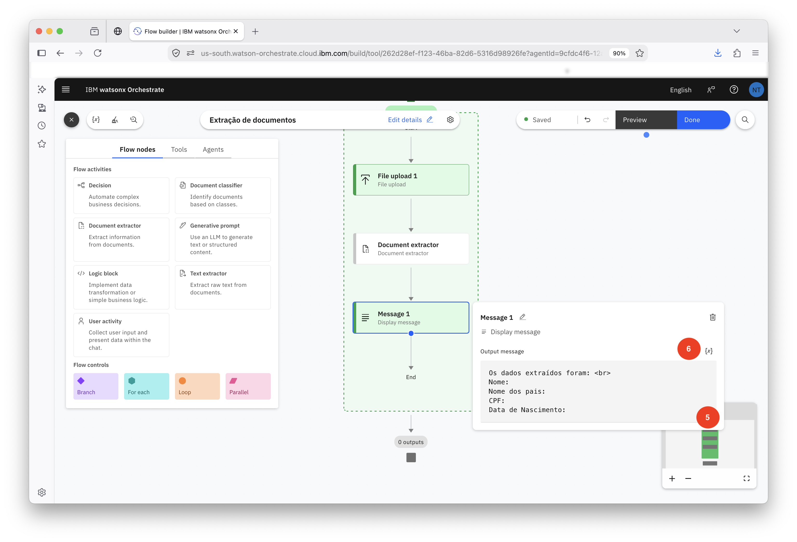

A variável é inserida em azul dentro do texto:


Repita a operação para as outras três linhas:

| Linha | Variável |
|---|---|
| `Nome:` | `nome` |
| `Nome dos pais:` | `filiação` |
| `CPF:` | `cpf` |
| `Data de Nascimento:` | `datadenascimento` |


> Os nomes das variáveis vêm do schema que você criou na Parte 1, já normalizados em minúsculas. Se você tivesse nomeado os campos de outra forma, eles apareceriam aqui com esses outros nomes, mais um motivo para nomear campos de forma consistente desde o início.

### Ajustando as quebras de linha

O campo aceita HTML simples. Sem isso, tudo é renderizado em um parágrafo só no chat.

Acrescente `<br>` ao final de cada linha para o usuário ter uma visão mais bonita.

```
Os dados extraídos foram: <br>
Nome: [nome] <br>
Nome dos pais: [filiação] <br>
CPF: [cpf] <br>
Data de Nascimento: [datadenascimento] <br>
```

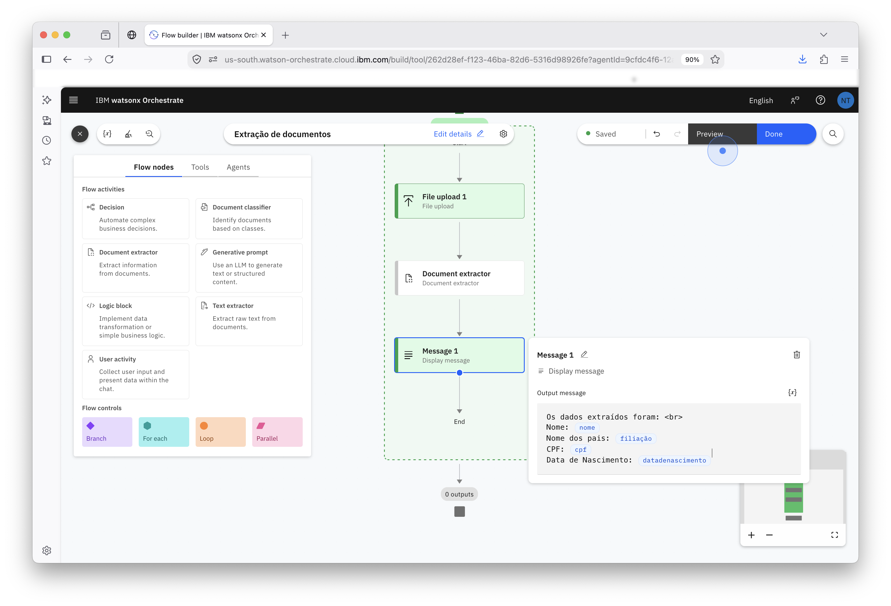

### Concluindo o fluxo

Feche o painel.

Clique em **Done** (item 8).

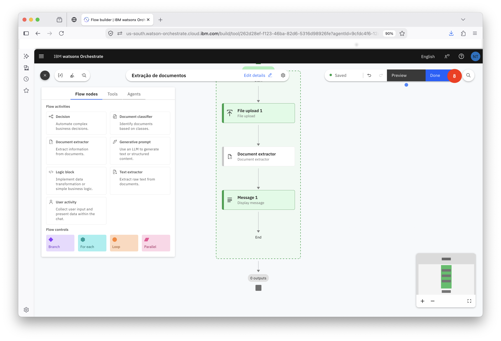

---

# Parte 8 — Testando a saída formatada

De volta ao editor do agente, vamos reiniciar o chat.

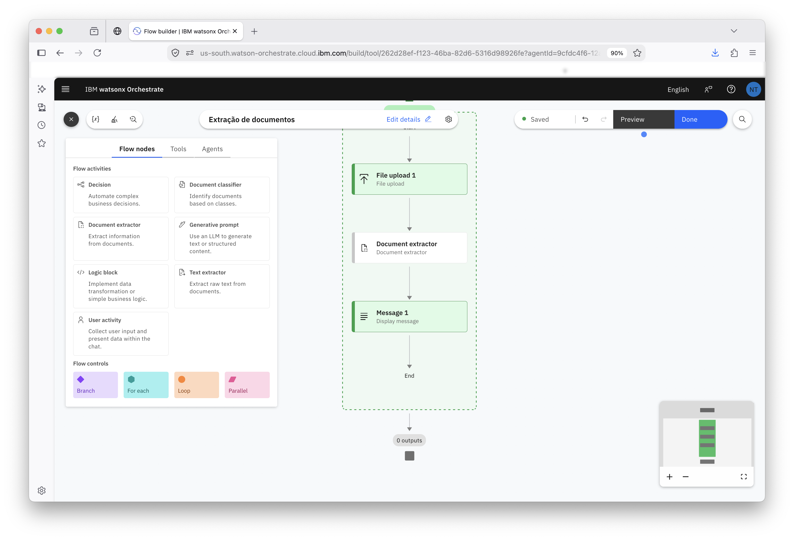

Digite qualquer mensagem:

```
oi
```

O agente aciona o workflow e apresenta o bloco **File upload 1 Upload files**. 

Clique em **Add files**.


### Enviando o documento

Selecione `11837-41.jpg`. O arquivo aparece anexado no campo de mensagem e o botão de envio fica ativo. Envie.

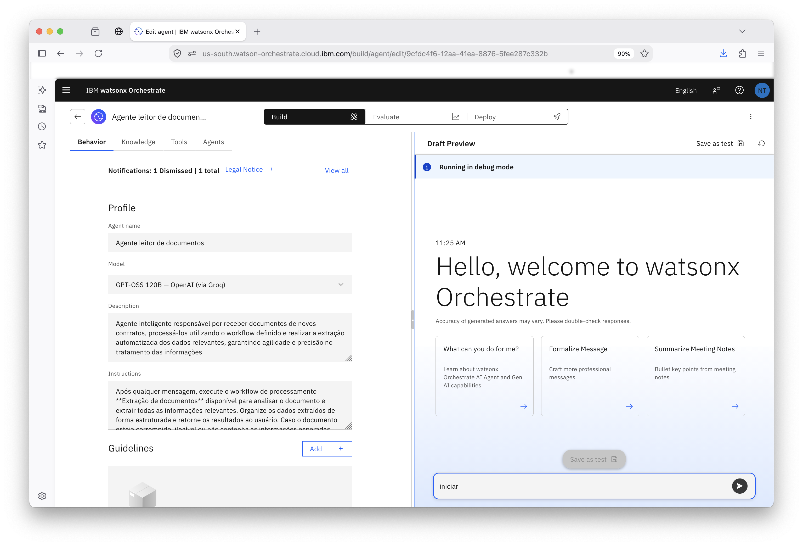

### Conferindo o resultado

Desta vez **não há tela de revisão** (desligamos o User Review) e o agente responde direto com o texto formatado pelo nó Message:

```
Os dados extraídos foram:
Nome: FERNANDO CAETANO
Nome dos pais: SERGIO CAETANO E LENE MARIA CAETANO
CPF: 508.508.07/1967
Data de Nascimento: 04/07/1967
```

O JSON cru ainda aparece logo abaixo, ele é a saída técnica do workflow, que o agente também repassa.


> **A diferença entre workflow e agente.** O nó **Message** é do *workflow*: ele escreve exatamente o que você mandou, sempre igual, sem depender do LLM. O texto que vem depois é do *agente*, que interpreta a saída da ferramenta. Quando o formato da resposta precisa ser previsível, comprovantes, protocolos, confirmações, coloque-o no workflow, não nas instruções do agente.

---

# Parte 9 — Revisão humana e caminhos condicionais

Até aqui o fluxo é otimista, ele assume que todo documento é legível e que todos os campos vêm preenchidos. Vamos tratar o caso contrário.

O que vamos fazer agora:

1. Religar o **User Review**, para que uma pessoa confira a extração
2. Adicionar um **Branch** logo após o Document extractor
3. Criar uma condição sobre o campo **CPF**
4. Mandar o caminho de exceção para uma mensagem de erro

### Reabrindo o Flow Builder

Aba **Tools → Open flow builder**.

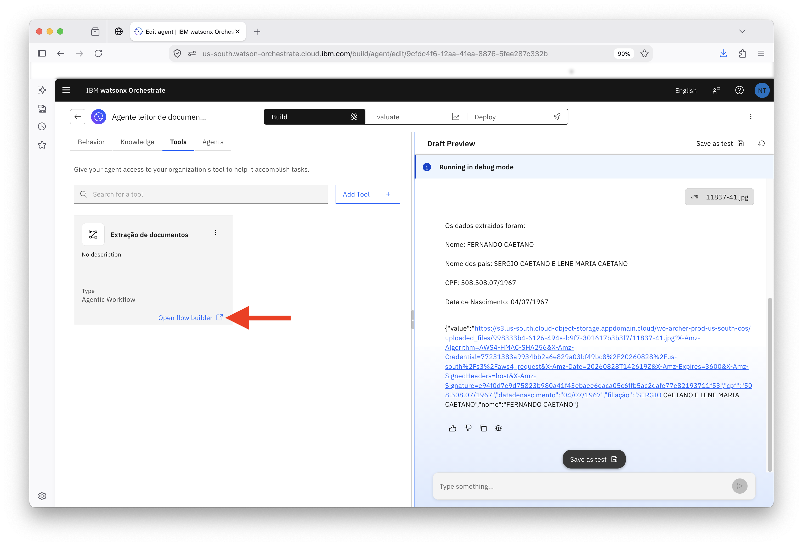

### Religando o User Review

Clique no nó **Document extractor** (item 1).

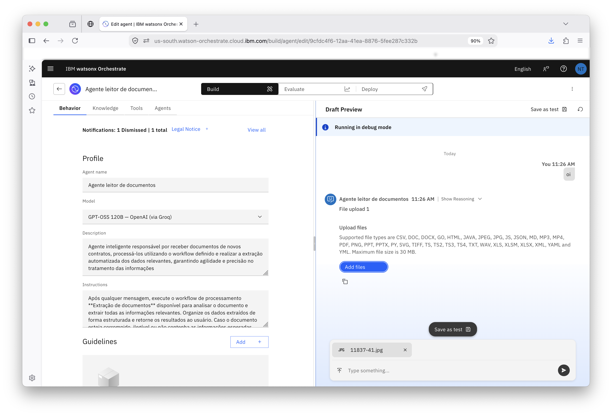

No painel, o toggle **User Review** está desligado (item 2).

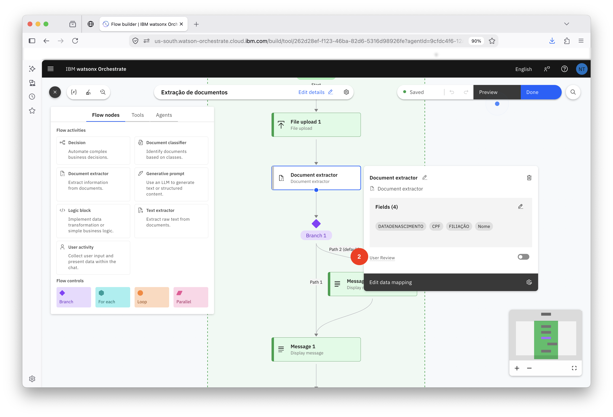

**Ative-o** (item 3). A condição volta a aparecer:

> *If the extraction confidence is below **95%** for **all fields**, then send to **flow initiator***


> A revisão humana **não conserta** o dado sozinha. Ela só abre a porta para que alguém confirme ou corrija. O que acontece depois, aceitar, rejeitar, pedir novo envio é decisão do seu fluxo. É exatamente isso que vamos construir com o Branch.

### Adicionando o controle Branch

Feche o painel. Passe o mouse sobre a conexão entre o **Document extractor** e o **Message 1**: o botão **+** aparece (item 4).

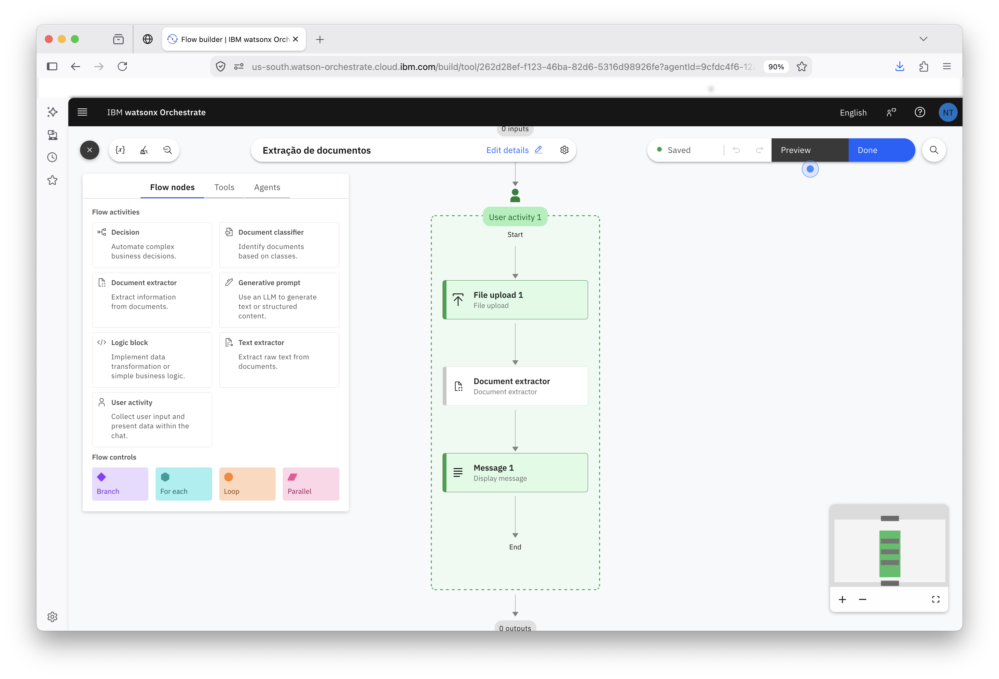

Em vez de usar o menu, vamos arrastar o nó. 

Abra o painel de nós, vá em **Flow controls** e arraste o card **Branch** até essa posição (item 5).

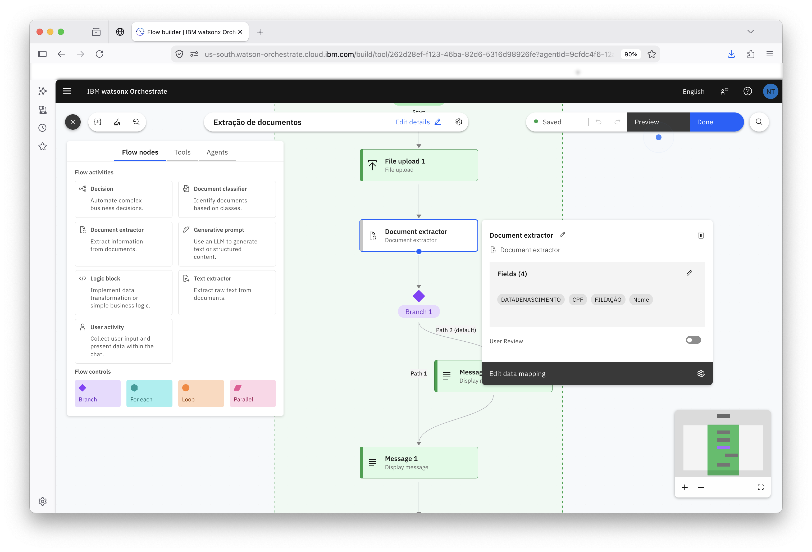

Clique e arrastre **Branch** para o canvas abaixo de **Document extractor**

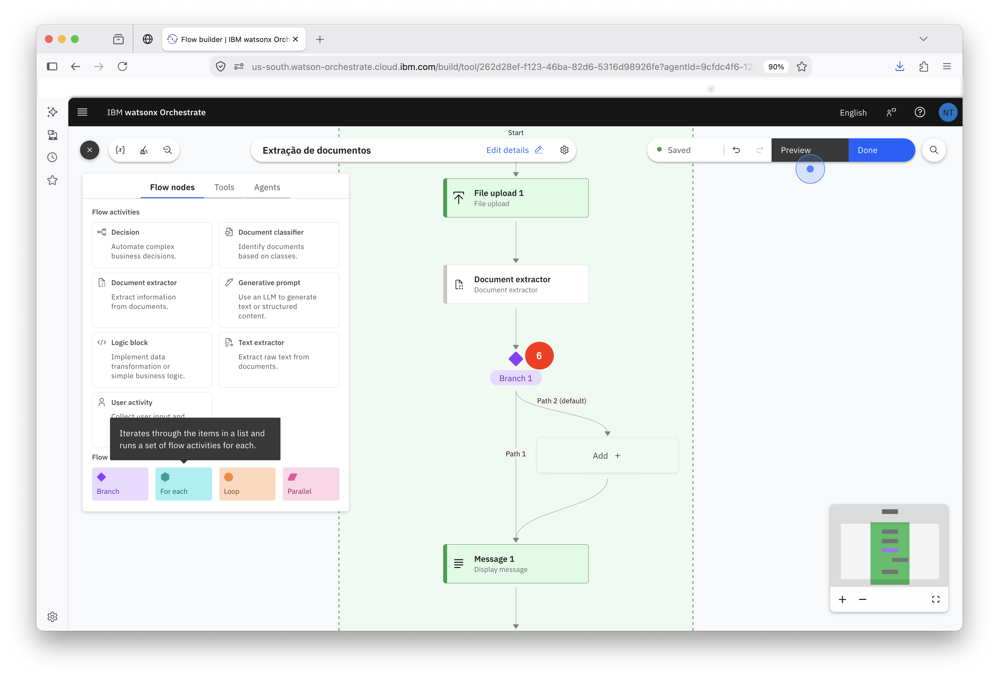

> Os dois caminhos **convergem de volta** para o Message 1. Guarde essa informação, ela explica o resultado do teste no final do laboratório.

### Configurando a condição do Path 1

Clique no nó **Branch 1**. O painel mostra:

**Path conditions**

| | Path | Estado |
|---|---|---|
| `if` | **Path 1** | *No condition set* → **Edit condition** |
| `else` | **Path 2** | *Default path* |

Clique em **Edit condition** (item 7).

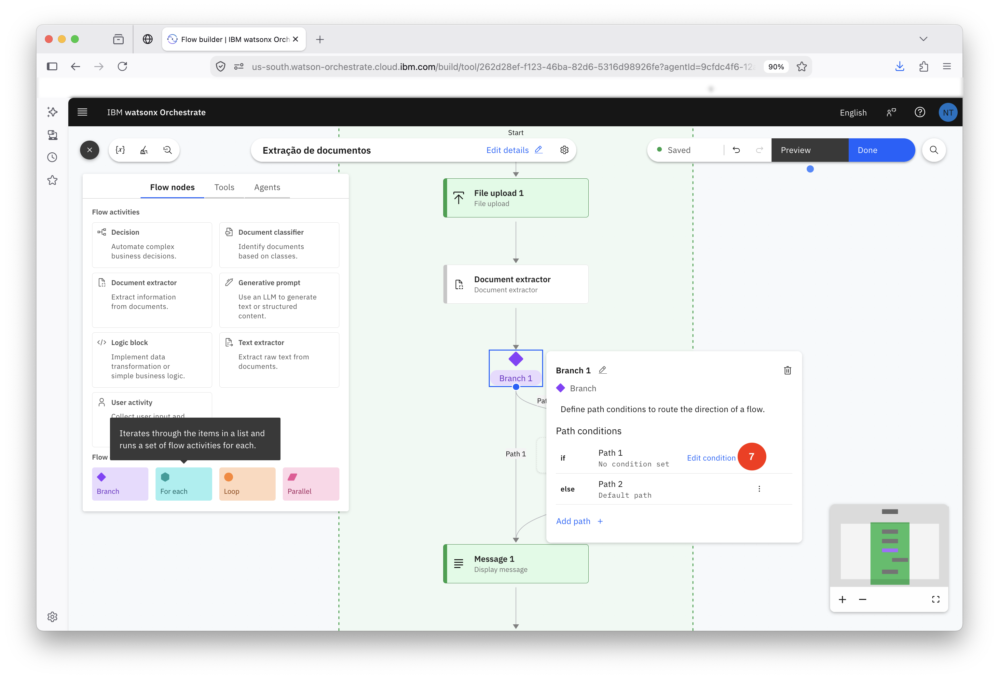

No edutor do **Path 1**, note que há dois modos de edição no topo, o construtor visual (ícone de painel) e o editor de código (`</>`). Ficaremos no visual.

Clique no **+** da linha `if` (item 8).


O seletor de variáveis abre.

Navegue até **User activity 1 → Document extractor** e escolha **cpf** (item 9).

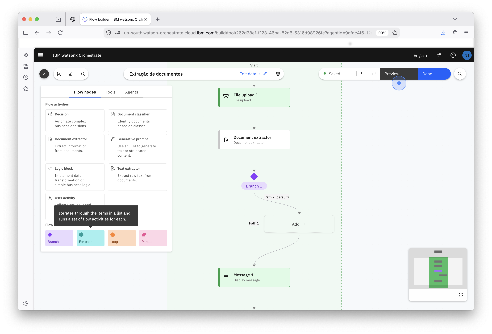

Com a variável posicionada (item 10), escolha o operador **not in** e clique no **+** do lado direito para definir o valor de comparação (item 11).


Agora vamos alterar o campo **Enter a value** (item 12).

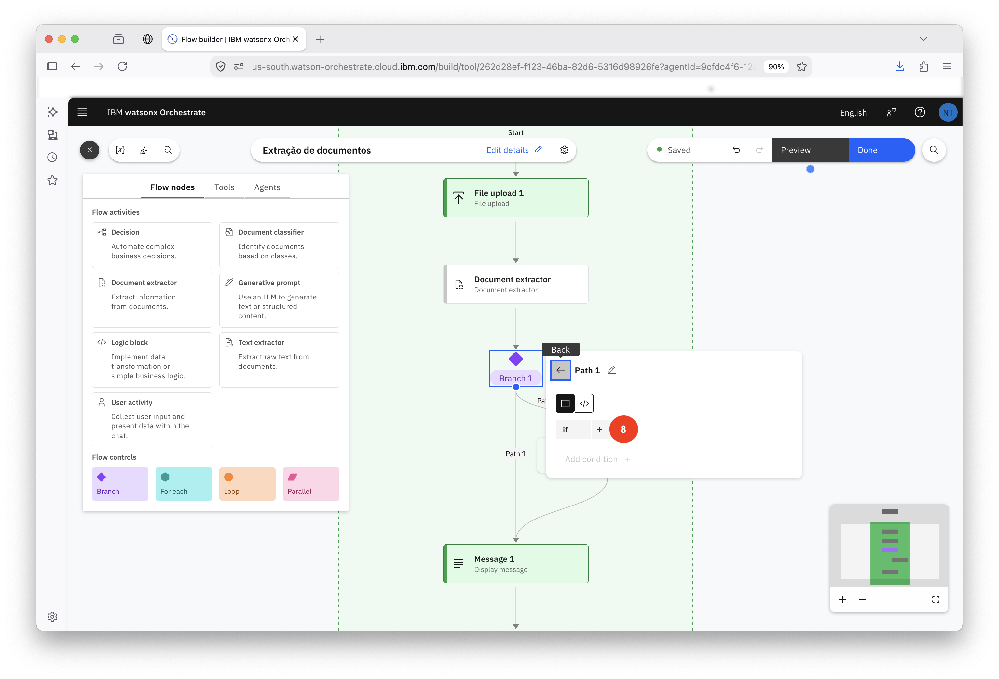

Copie e cole a seguinte expressão

```
not parent.document_extractor.output.cpf
```

A linha da condição fica assim:

```
if   cpf   not in   not parent.document_extractor.output.cpf
```

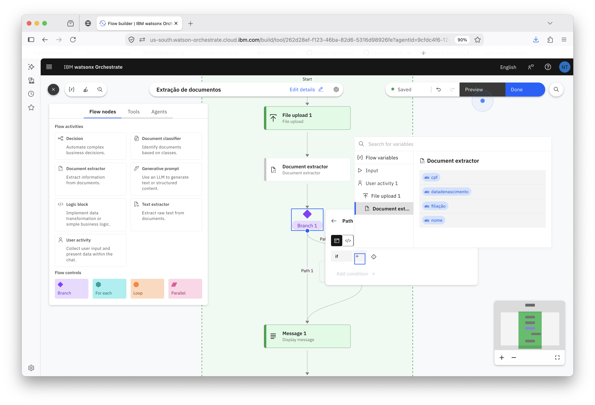

> **O que essa condição faz.** Ela avalia o campo `cpf` devolvido pelo Document extractor. Quando o CPF chega preenchido, o fluxo segue pelo **Path 1** e exibe os dados normalmente; quando o campo vem vazio, porque o documento estava ilegível ou porque o revisor apagou o valor, a condição não é satisfeita e o fluxo cai no **Path 2 (default)**, onde colocaremos a mensagem de erro.
>

### Criando a mensagem de erro no Path 2

Feche o painel. 

No **Path 2 (default)**, clique em **Add +** (item 13).

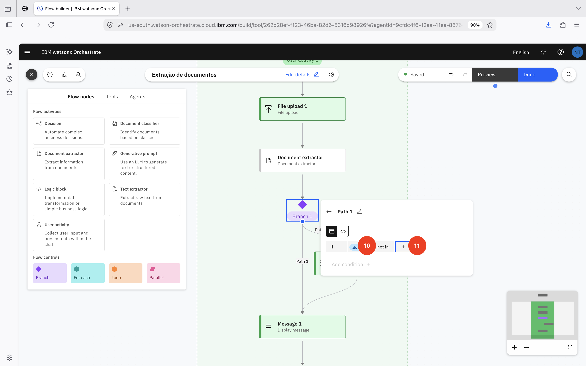

No menu, vá em **Present to user** (item 14) e então **Message** (item 15).

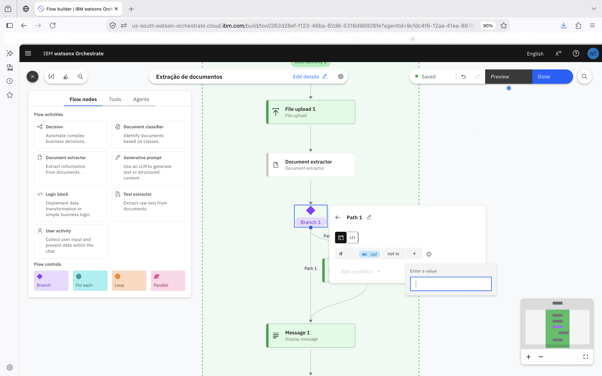

O nó **Message 2 — Display message** é criado no Path 2, com o campo **Output message** vazio (item 16).

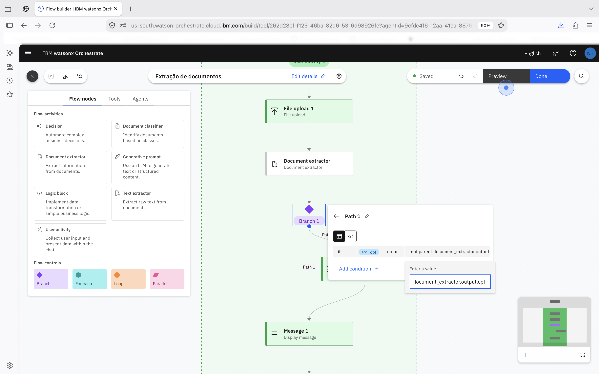

Copie e cole o seguinte texto no campo:

```
Documento com informações inelegíveis, faça o envio novamente.
```

Clique em **Done** (item 17).


> O texto da mensagem é livre, adapte ao vocabulário da sua área de negócio. O que importa aqui é o padrão: **todo caminho de exceção precisa dizer ao usuário o que aconteceu e o que ele deve fazer em seguida.** Uma mensagem de erro que não orienta a próxima ação é quase tão ruim quanto erro nenhum.

---

# Parte 10 — Testando o caminho de exceção

Agora vamos provocar a falha de propósito.

No **Draft Preview**, mande `oi`, clique em **Add files** e envie o documento (aqui usamos `11837-41 copy.jpg`).

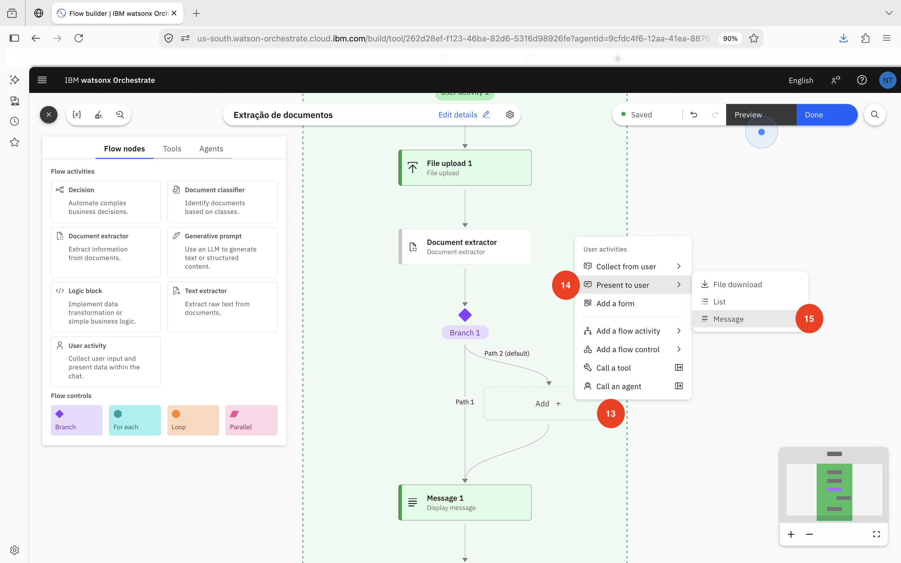

O agente processa o arquivo.


### Abrindo a revisão

Com o **User Review** religado, o agente responde:

*“Vou precisar que você revise a extração do documento”* com o card **Review document extraction**. 

Clique em **View**.

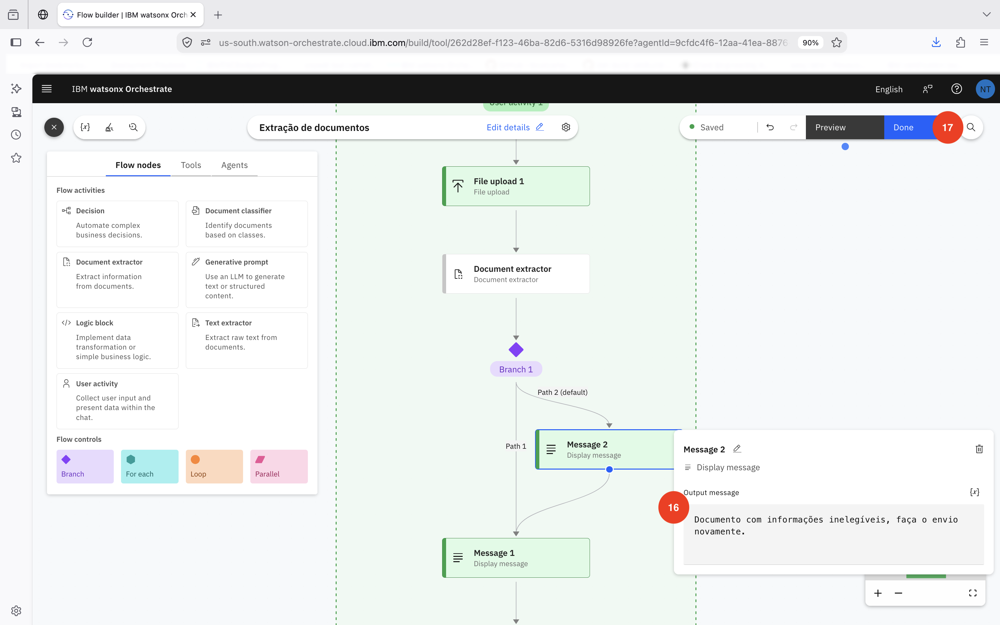


Observe os campos extraídos ao lado da imagem do documento.

**Apague o conteúdo do campo `Cpf`** (item 1) — o rótulo abaixo muda para *“Updated by user.”*, indicando que o valor foi alterado manualmente.

Os demais campos permanecem preenchidos, cada um com o alerta *“Low confidence extraction. Confirm value.”*:

| Campo | Valor |
|---|---|
| Cpf | *(vazio)* |
| Datadenascimento | `04/07/1967` |
| Filiação | `SERGIO CAETANO, LENE MARIA CAETANO` |
| Nome | `FERNANDO CAETANO` |

Clique em **Submit** (item 2).

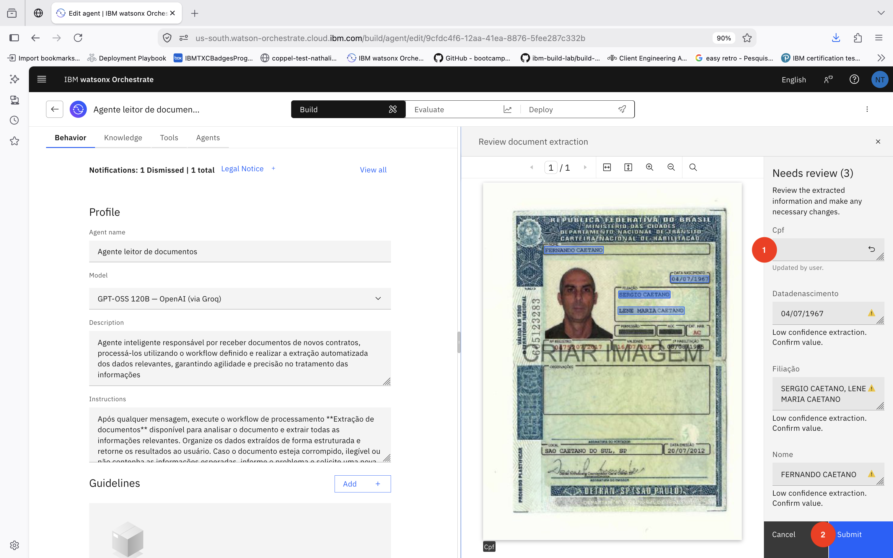

> Estamos simulando, com um clique, o que na vida real seria uma foto tremida, um documento plastificado com reflexo ou uma digitalização cortada. O efeito no fluxo é exatamente o mesmo: um campo obrigatório que não chegou.

Na janela **Confirm extraction**:

> *“One or more fields need to be reviewed for possible missing or low confidence values. Confirm the values in the document.”*

Clique em **Confirm and submit**.

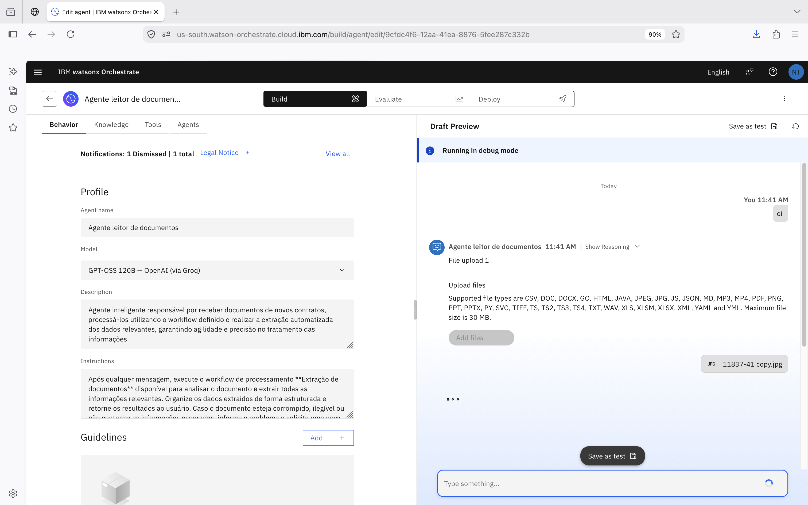

### Resultado

O chat exibe o selo verde **Submitted** e, na sequência, a mensagem do **Path 2**:

```
Documento com informações inelegíveis, faça o envio novamente.
```

Logo depois vem o **Message 1**, os dois caminhos convergem e agora com o CPF em branco:

```
Os dados extraídos foram:
Nome: FERNANDO CAETANO
Nome dos pais: SERGIO CAETANO, LENE MARIA CAETANO
CPF:
Data de Nascimento: 04/07/1967
```

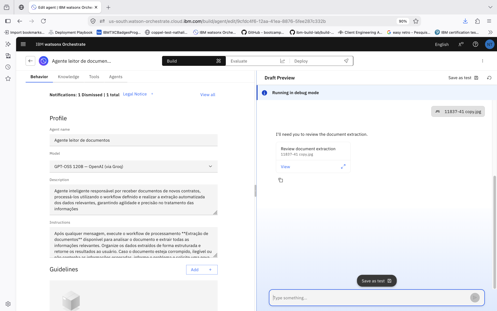

**Laboratório concluído.** O branch funcionou, a ausência do CPF desviou o fluxo e disparou a mensagem de erro.

> Note que a mensagem com os dados incompletos ainda é exibida depois do erro. 
> E vamos resolver isso no próximo laboratório...

---

## Boas práticas

1. **Formate a resposta no workflow, não no agente.** O nó Message garante saída idêntica em toda execução. Instruções de agente são probabilísticas.
2. **O uso de HTML ou Markdown** no Output message para manter a leitura organizada no chat.
3. **Ative o User Review nos campos que doem.** Confiança abaixo do limiar em CPF, valor de contrato ou data de vencimento merece olho humano, em campos descritivos, muitas vezes não.
4. **Ajuste o limiar de confiança ao seu risco.** 95% é o padrão, não uma verdade universal. 
5. **Todo fluxo precisa de um caminho de exceção.** Se você só desenhou o cenário feliz, seu fluxo está em menos da metade.
6. “Documento ilegível” é apenas um diagnóstico e nada mais, “faça o envio novamente” é instrução. Um usuário em um mundo real precisa das duas.
7. **Teste o caminho de exceção com a mesma seriedade do caminho principal.** Apagar um campo na revisão é a forma mais barata de validar um branch.

# Próximos passos

 Note que algumas coisas ficaram pendentes nesse laboratório e vamos melhorar ainda mais no próximo e ultimo laboratório de workflows dessa sessão.

[Clique aqui](./Step_by_Step_Labworkflow-3.md) para seguir para a continuação desse laboratório