# Construindo Workflows no watsonx Orchestrate — Parte 3

## Descrição do Caso de Uso

Esta é a **terceira e última parte** do laboratório. Se você chegou aqui direto, comece pela [Parte 1](./Step_by_Step_Labworkflow-1.md) e siga pela [Parte 2](./Step_by_Step_Labworkflow-2.md).

No fim da Parte 2 o fluxo já detectava a falha e avisava o usuário, mas com três pendências que ficaram evidentes no teste:

1. **A mensagem de erro e os dados incompletos apareciam juntos**, porque os dois caminhos do Branch convergiam no mesmo nó.
2. **A detecção de falha dependia de uma pessoa apagar o CPF** na tela de revisão. Sem alguém fazendo isso, o fluxo nunca cairia no caminho de exceção.
3. **Depois do erro, o usuário ficava sem saída.** A mensagem pedia um novo envio, mas não havia campo de upload — era preciso reiniciar a conversa.

Nesse lab resolvemos os três e fechamos o ciclo.

### O que você vai aprender

- Desfazer a convergência de caminhos para que cada path termine onde deve
- Ensinar o **Document extractor** a devolver um campo **vazio** quando não encontrar o dado, em vez de buscar por um valor no documento
- Atualizar as métricas e verificar um terceiro documento no schema
- Desligar o **User Review** e deixar o fluxo rodar de ponta a ponta sem intervenção humana
- Criar um **retorno (loop) do caminho de exceção para o File upload**, permitindo o reenvio no mesmo diálogo
- Validar o comportamento completo no **Draft Preview**

### Pré-requisitos

- Ter concluído as Partes 1 e 2
- Agente **Agente leitor de documentos** com a ferramenta **Extração de documentos**
- Os arquivos `11837-41.jpg`, `cnh1.jpg` e `11837-41 copy.jpg`

---

# Parte 11 — Separando os caminhos do Branch

### Reabrindo o Flow Builder

No editor do agente, clique na aba **Tools**.

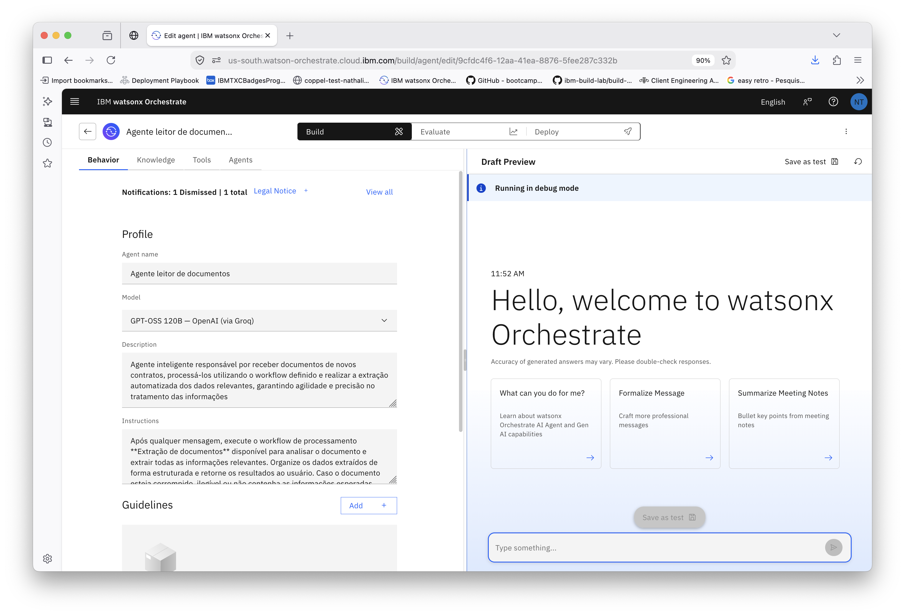

Na ferramenta **Extração de documentos**, clique em **Open flow builder**.

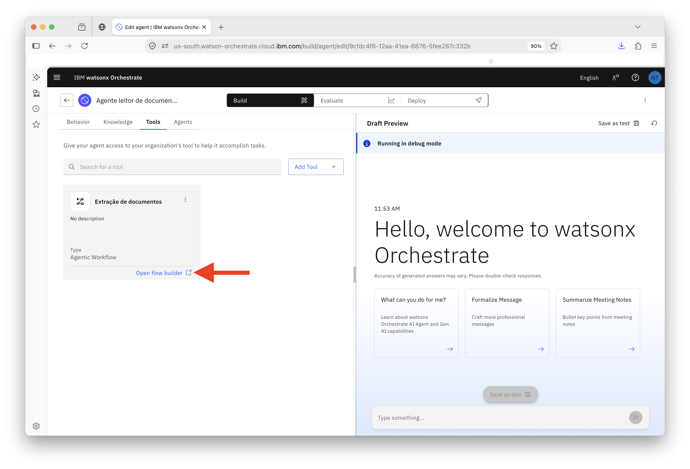

Olhe com atenção a região destacada do canvas. O **Path 2 (default)** vai até o **Message 2** e, de lá, uma curva desce e **entra no Message 1**.

É por isso que o teste da Parte 2 exibiu as duas mensagens em sequência: o caminho de exceção não terminava, ele se reencontrava com o caminho principal.

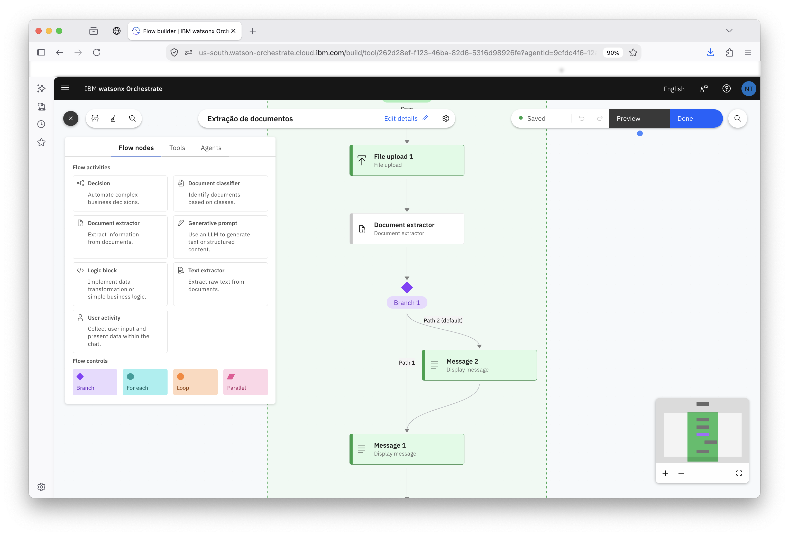

> Convergência de caminhos não é um erro, em muitos fluxos ela é exatamente o que se quer, porque evita duplicar nós comuns aos dois lados. O erro é convergir **sem querer**. Sempre que desenhar um Branch, é necessário ter um ponto de atenção: Os caminhos devem se reencontrar ou cada um tem seu próprio fim?

### Desfazendo a convergência

Passe o mouse sobre a conexão que sai do **Message 2** e navegue abaixo até o **Message 1**, os controles da ligação aparecem sobre ela. **Remova essa conexão.**


O canvas se reorganiza. 
Agora cada caminho tem seu próprio destino:

```
Branch 1
 ├── Path 1 ─────────────► Message 1 ──► End
 └── Path 2 (default) ───► Message 2
```

Clique em **Done**.

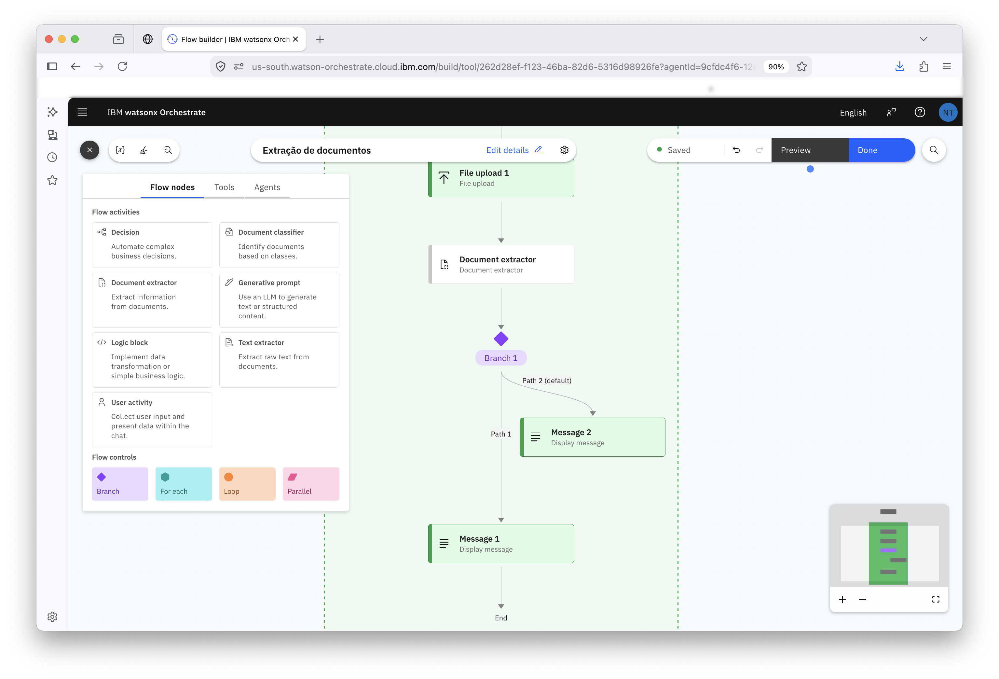

---

# Parte 12 — Testando a separação

O **Draft Preview** reinicia. Digite:

```
oi
```

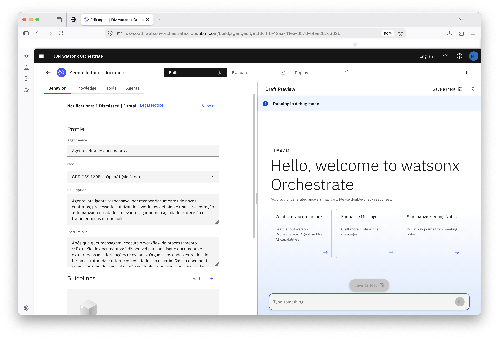

Clique em **Add files**.

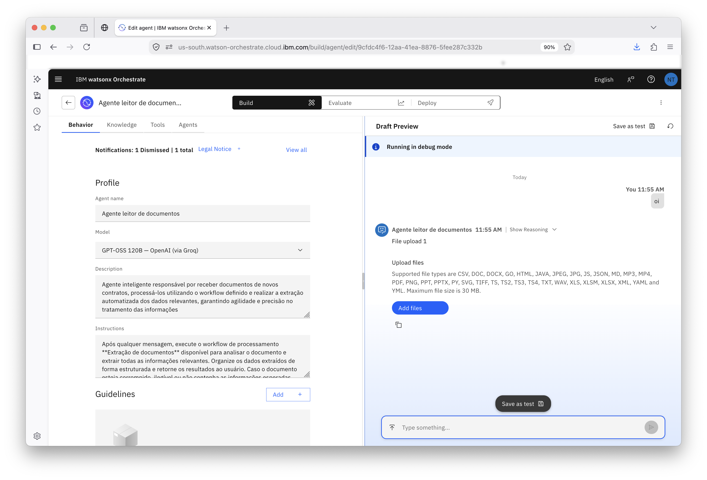

### Enviando o documento

Selecione `11837-41 copy.jpg` e envie.


O agente começa a processar o arquivo com o workflow acionado.

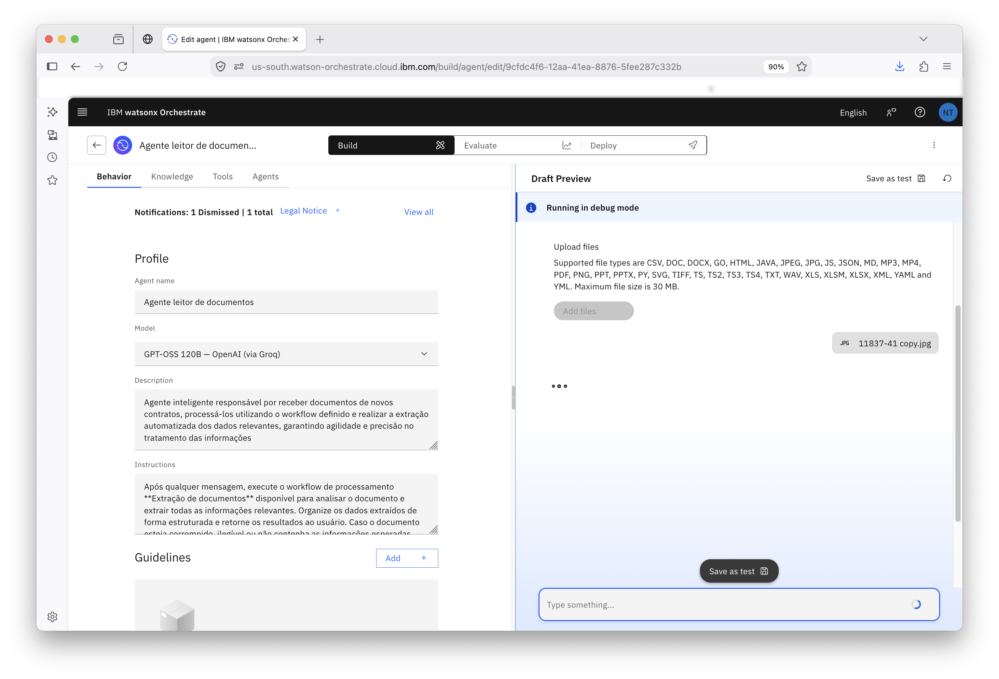

### Abrindo a revisão

O **User Review** ainda está ligado, então o agente devolve o card **Review document extraction**. 

Clique em **View**.


O painel abre com **Needs review (4)**. 

Repare no campo **Cpf**: o modelo devolveu `0375207` (item 1), um pedaço do número de registro que ele encontrou no documento. 

| Campo | Valor extraído |
|---|---|
| Cpf | `0375207` ← errado |
| Datadenascimento | `04/07/1967` |
| Filiação | `SERGIO CAETANO, LENE MARIA CAETANO` |
| Nome | `FERNANDO CAETANO` |

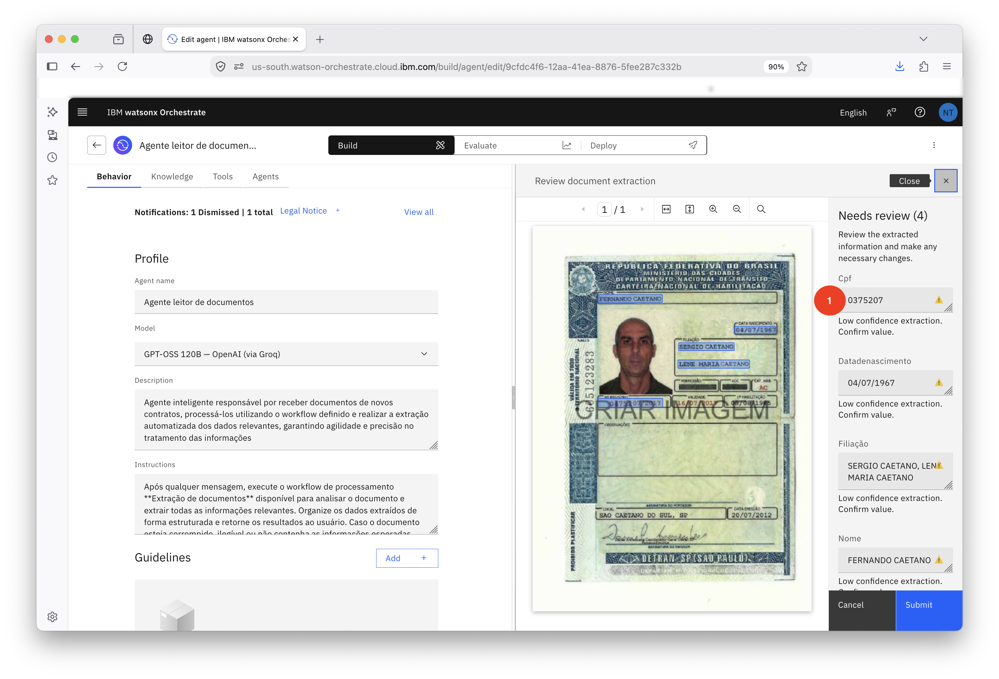

> Lembre-se deste valor extraído, Ele é o motivo da Parte 13 desse lab. Enquanto o modelo devolver *alguma coisa*, a condição do Branch enxerga um CPF preenchido e o fluxo segue como se estivesse tudo certo. Um campo incorreto é pior que um campo vazio.

### Passo 12.4 — Simular o campo ilegível

Apague o conteúdo do campo **Cpf** ,o rótulo muda para *“Updated by user.”* e o contador cai para **Needs review (3)**.

Clique em **Submit** (item 2).

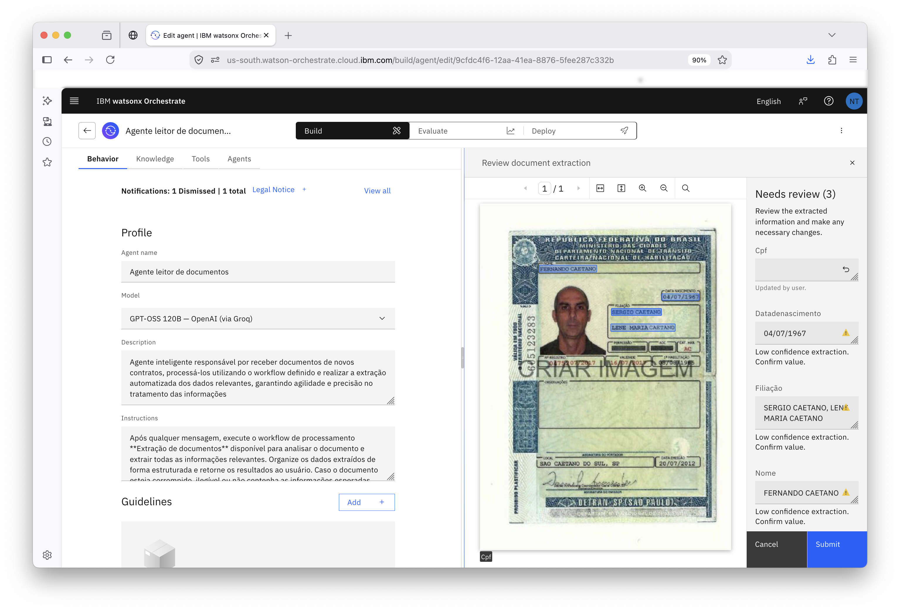

Na janela **Confirm extraction**, clique em **Confirm and submit** (item 3).

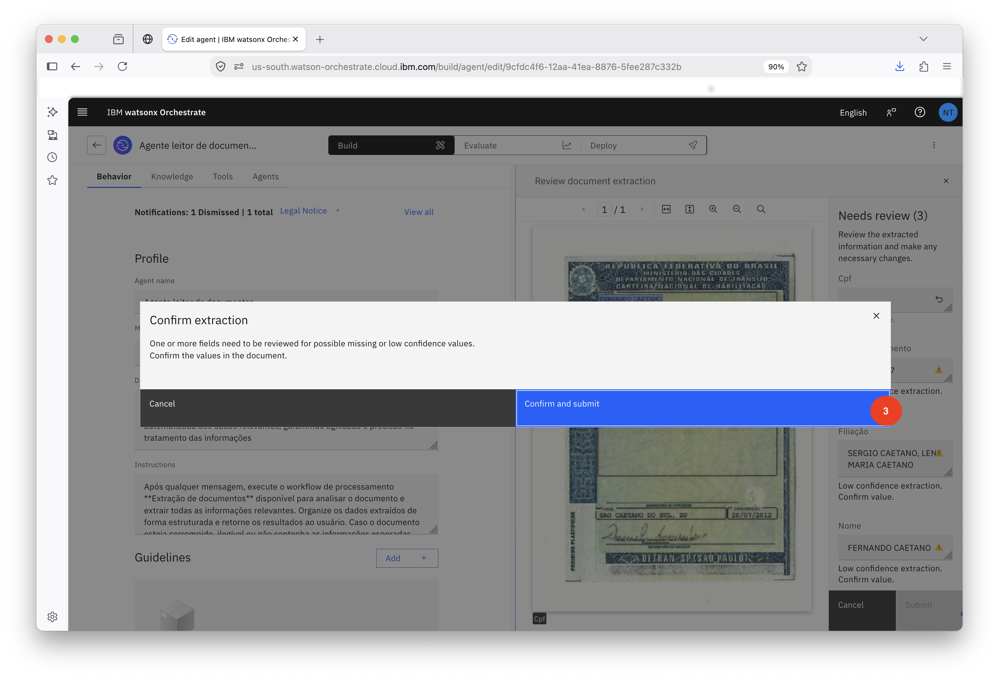

###  Resultado

Desta vez o chat exibe **apenas** a mensagem do caminho de exceção:

```
Documento com informações inelegíveis, faça o envio novamente.
```

Sem os dados incompletos logo abaixo. 

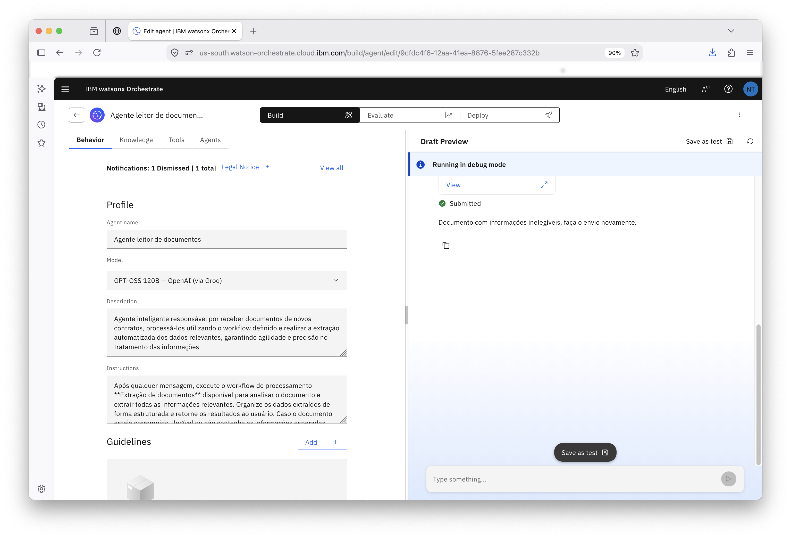

---

# Parte 13 — Ensinando o modelo a reconhecer a ausência do dado

Corrigimos a saída, mas o fluxo ainda depende de uma pessoa apagar o CPF para descobrir que o documento está ilegível. Isso não é escalavél.

A solução não está no Branch nem no agente: está no **schema do Document extractor**. Vamos instruir o modelo a devolver o campo **vazio** quando não encontrar o CPF,  exatamente como fizemos na Parte 1 para ensiná-lo *onde* olhar.

### Abrindo o Document extractor

De volta ao Flow Builder (aba **Tools; Open flow builder**), clique no nó **Document extractor**.

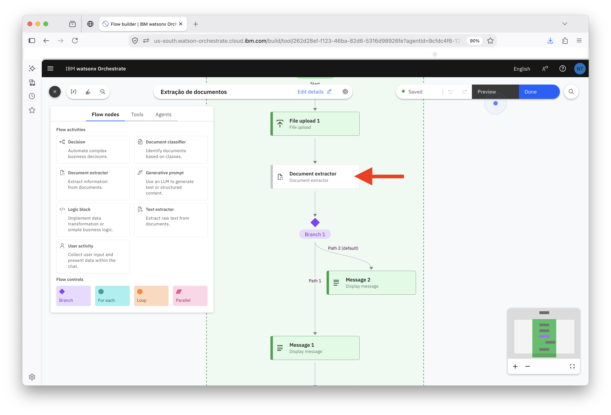

### Passo 13.2 — Desligar o User Review

No painel, **desative** o toggle **User Review**.

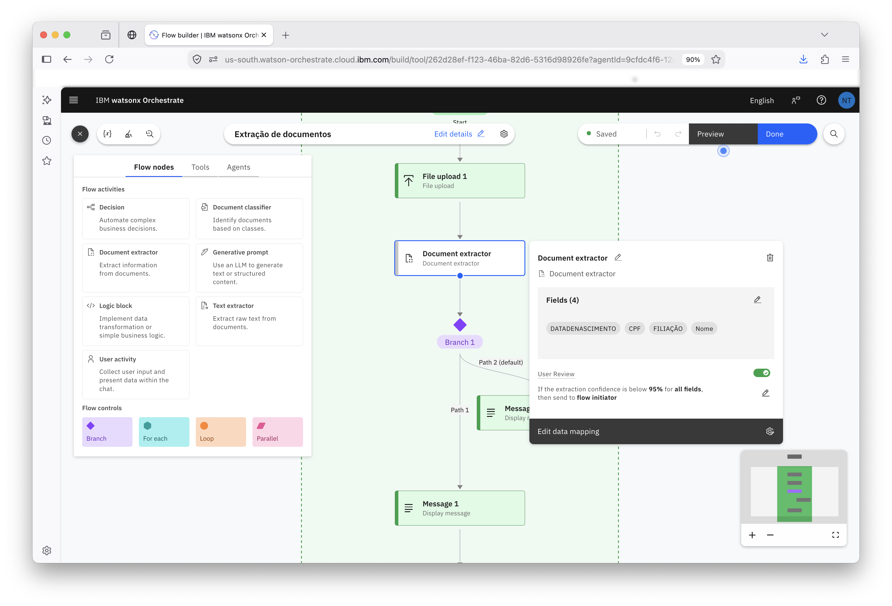

> Não estamos abrindo mão da revisão humana por preguiça. Estamos movendo a responsabilidade.
>  Em vez de pedir para uma pessoa detectar a falha, vamos ensinar o modelo a declará-la. 
> A revisão humana continua sendo a escolha certa em processos de alto risco, mas ela não deveria ser o *único* mecanismo de detecção.

### Abrindo o editor do extrator

Com o toggle desligado, clique em **Edit data mapping** (a engrenagem na barra, no rodapé do painel).

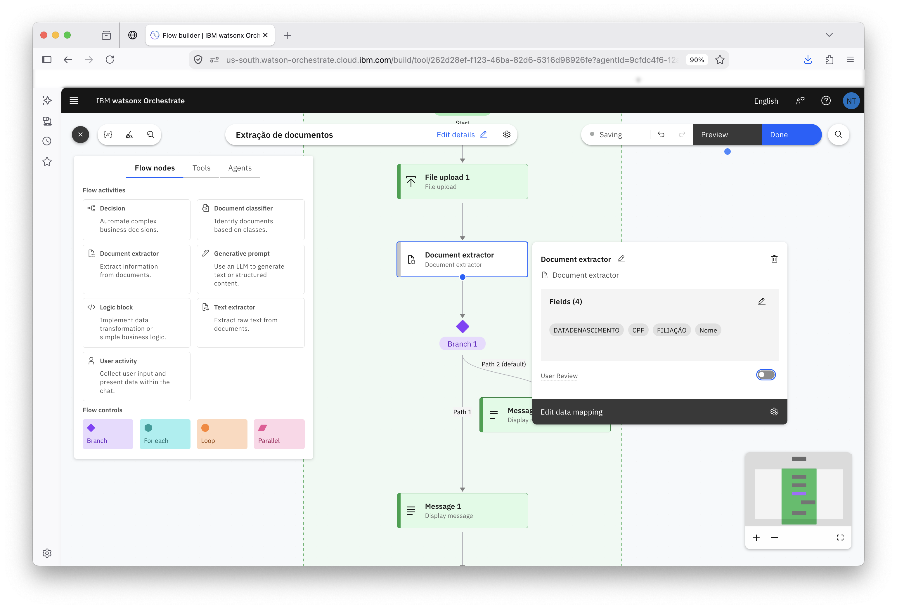

O editor do **Document extractor** abre em tela cheia, com o **Metrics Summary** mostrando **100% (2/2)** e a mensagem *“All documents have been verified successfully.”* o estado em que paramos na Parte 1.

### Editando o campo CPF

Na linha do **CPF**, abra o menu de contexto (⋮) (item 1).

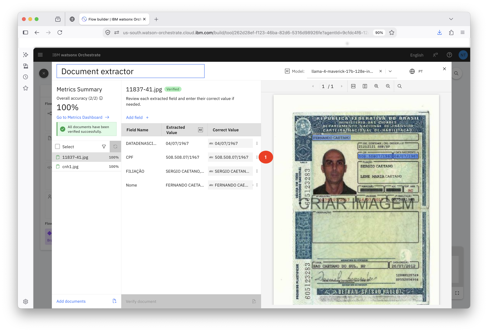

Escolha **Edit** (item 2).

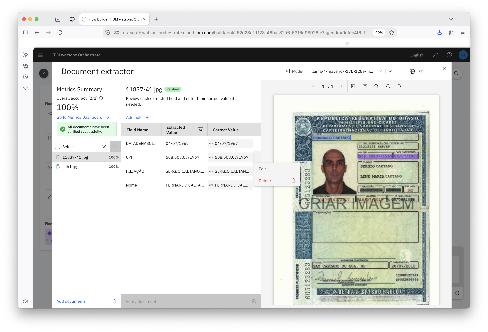

### Acrescentando a regra de campo vazio

No campo **Description** (item 3), acrescente uma segunda frase ao texto que já existia:

```
O CPF é uma sequência númerica, ele está presente abaixo do campo CPF, ao lado
da linha de data de nascimento. Se o campo não for localizado e uma sequência de
mais de 8 digitos, retorne o CPF vazio.
```

Os **Examples** permanecem como estavam (`"CPF"` → `508.50807/1967`).

Clique em **Submit** (item 4).

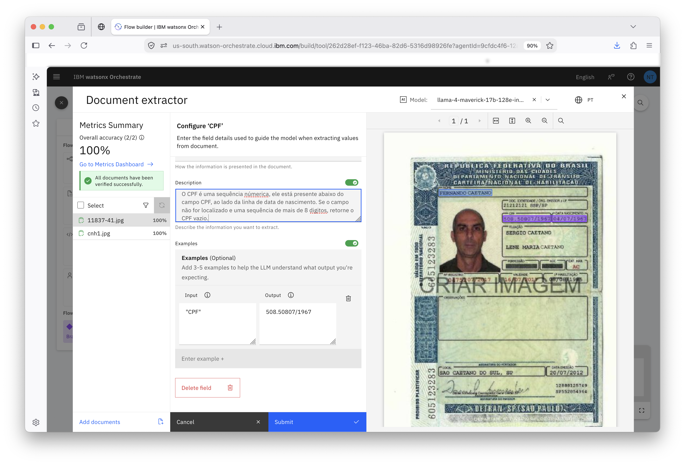

> **Este é o passo mais importante da Parte 3.** Modelos de linguagem tendem a preencher: diante de um campo que não encontram, devolvem o que mais se parece com a resposta esperada — foi assim que surgiu o `0375207`. A instrução “retorne o CPF vazio” dá ao modelo uma **saída legítima** para dizer *não encontrei*.
>
> Em qualquer schema de extração, defina explicitamente o que fazer quando o dado não existir. Sem isso, você não tem como distinguir “o documento não tem esse campo” de “o modelo chutou”.

### Atualizando as métricas

Após o Submit, o painel avisa: *“Todos documentos estão verificados, mas as metricas precisam ser atualizadas.* 

Clique no ícone de **atualizar** (⟳), ao lado do filtro da lista de documentos, para recalcular a acurácia com o novo schema.

Agora, clique em **Add documents** (item 5).

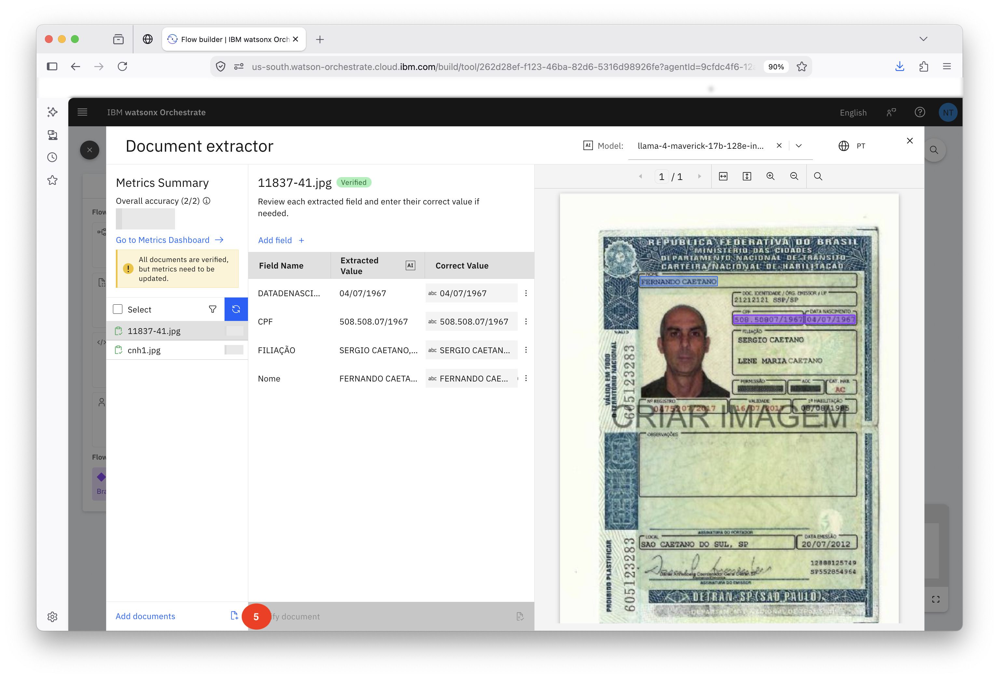

### Passo 13.7 — Adicionar o terceiro documento

Suba o `11837-41 copy.jpg` (item 6). Ele entra na lista e o painel passa a exibir **1 document requires verification**, com a acurácia em **(2/3)**.

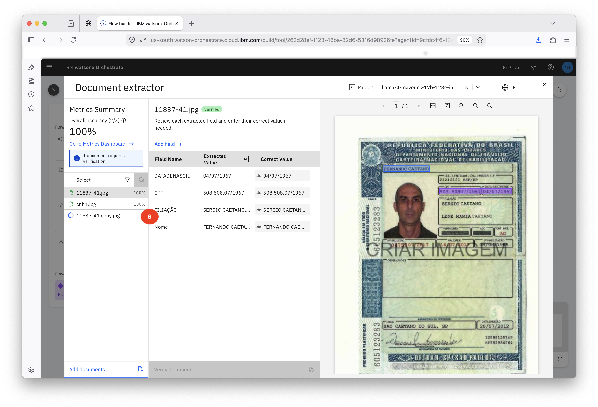

Selecione o novo documento. Repare no resultado, é a prova de que a instrução funcionou:

| Campo | Valor extraído |
|---|---|
| DATADENASCIMENTO | `04/07/1967` |
| **CPF** | **`No value`** |
| FILIAÇÃO | `SERGIO CAETANO, ...` |
| Nome | `FERNANDO CAETA...` |

Os três campos que existem no documento vieram corretos; o CPF, que o modelo não conseguiu ler com segurança, veio **vazio** em vez de inventado.

Clique em **Verify document** (item 7).

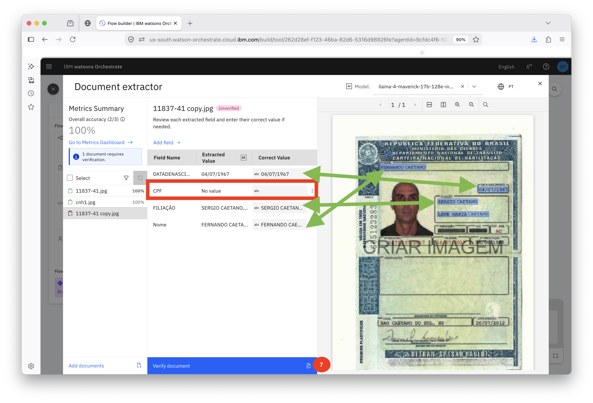

A acurácia sobe para **(3/3)**.

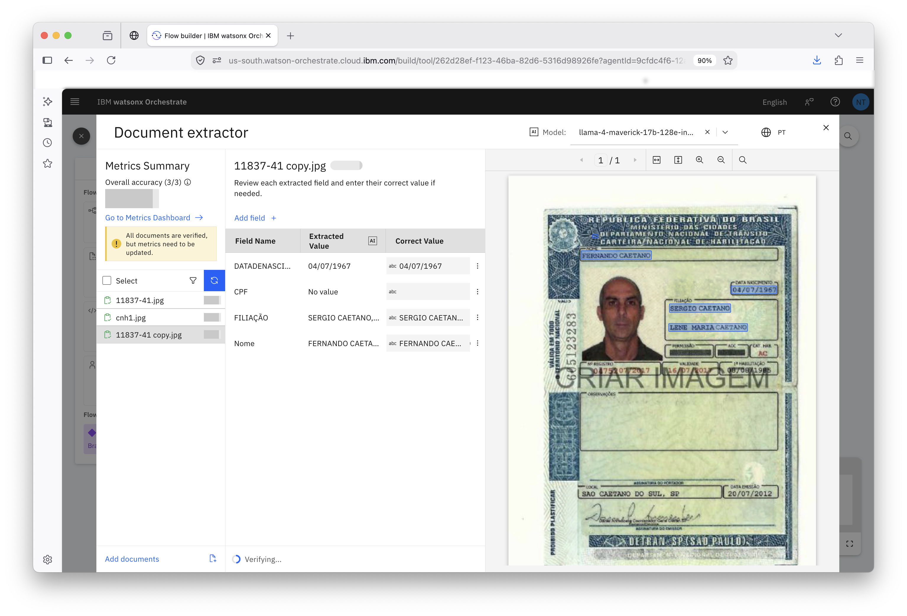

> Note o que acabamos de verificar: **um documento cujo valor correto é “vazio”**. Isso passa a fazer parte do ground truth. Se amanhã você trocar o modelo e ele voltar a inventar um CPF nesse arquivo, a métrica cai — e você fica sabendo.

### Finalizando

Feche o editor do extrator. 

De volta ao canvas, confirme que o **User Review** continua desligado e clique em **Done**.

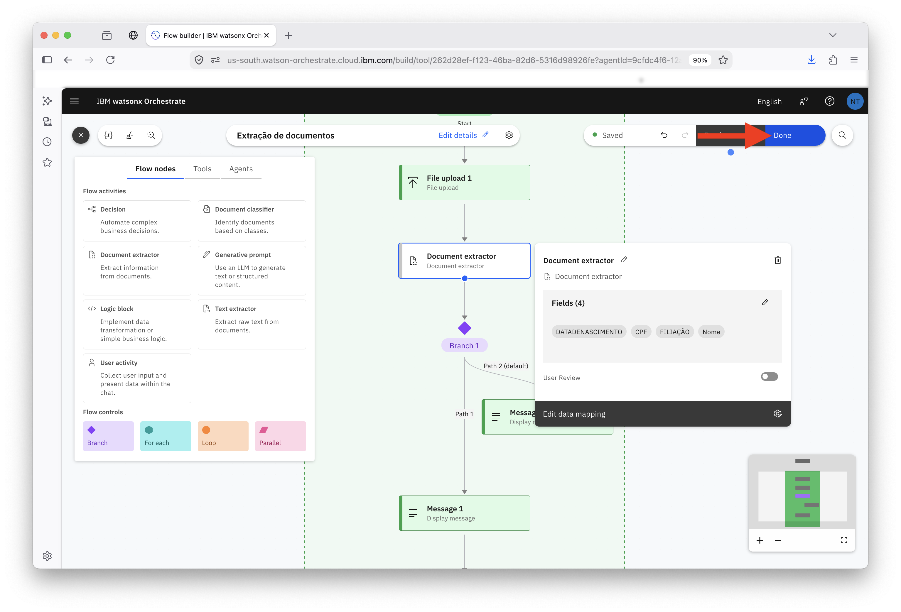

---

# Parte 14 — Testando o fluxo automático

### Enviando o documento

No **Draft Preview**, mande `oi` e clique em **Add files**.


Selecione `11837-41 copy.jpg` e envie.

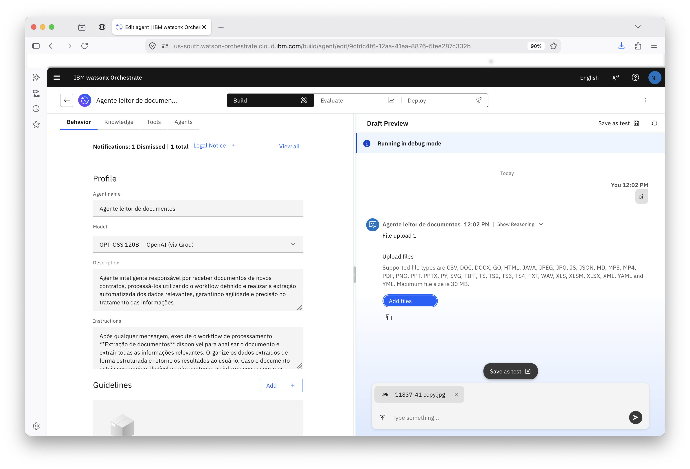

### Resultado

**Sem tela de revisão. Sem intervenção humana.** O agente responde direto com a mensagem do caminho de exceção:

```
Documento com informações inelegíveis, faça o envio novamente.
```

E no JSON logo abaixo, a confirmação técnica:

```json
{
  "cpf": "",
  "datadenascimento": "04/07/1967",
  "filiação": "SERGIO CAETANO, LENE MARIA CAETANO",
  "nome": "FERNANDO CAETANO"
}
```

O `cpf` veio vazio, a condição do Branch avaliou o Path 2 e a mensagem de erro disparou sozinha.

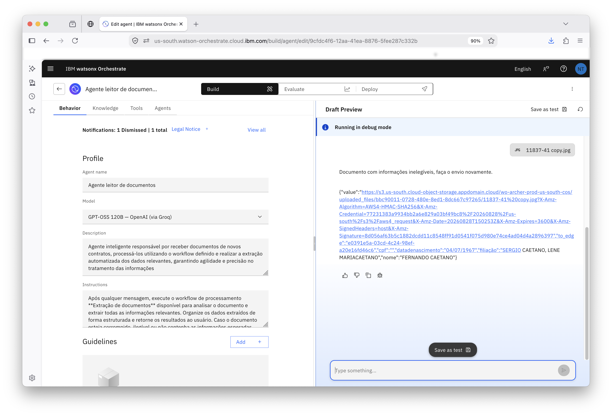

---

# Parte 15 — Fechando o ciclo com um retorno ao upload

 A mensagem diz *“faça o envio novamente”*, mas o usuário não tem onde enviar: o fluxo terminou.

Vamos criar um **retorno**, depois da mensagem de erro, o fluxo volta ao **File upload 1** e reabre o campo de anexo no mesmo diálogo.

### Reabrindo o Flow Builder

Aba **Tools** em seguida, **Open flow builder** (item 2).

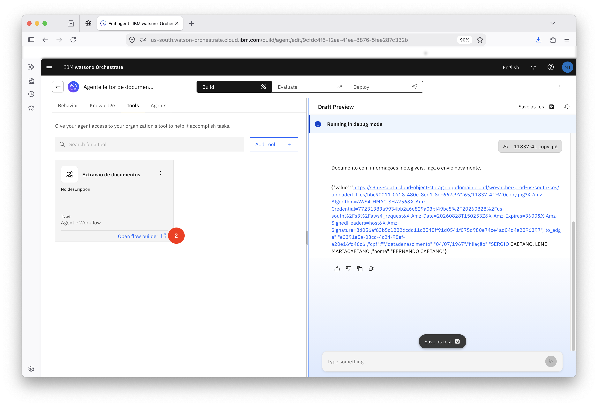

### Ligando o Message 2 ao File upload 1

Selecione o nó **Message 2**. A partir do conector que aparece na borda do nó (item 3), arraste uma nova ligação até o **File upload 1**, no topo do fluxo.

O canvas passa a mostrar a curva de retorno subindo pela lateral:

```
File upload 1 ──► Document extractor ──► Branch 1
      ▲                                    ├── Path 1 ──► Message 1 ──► End
      └──────────────── Message 2 ◄────────┘ Path 2 (default)
```

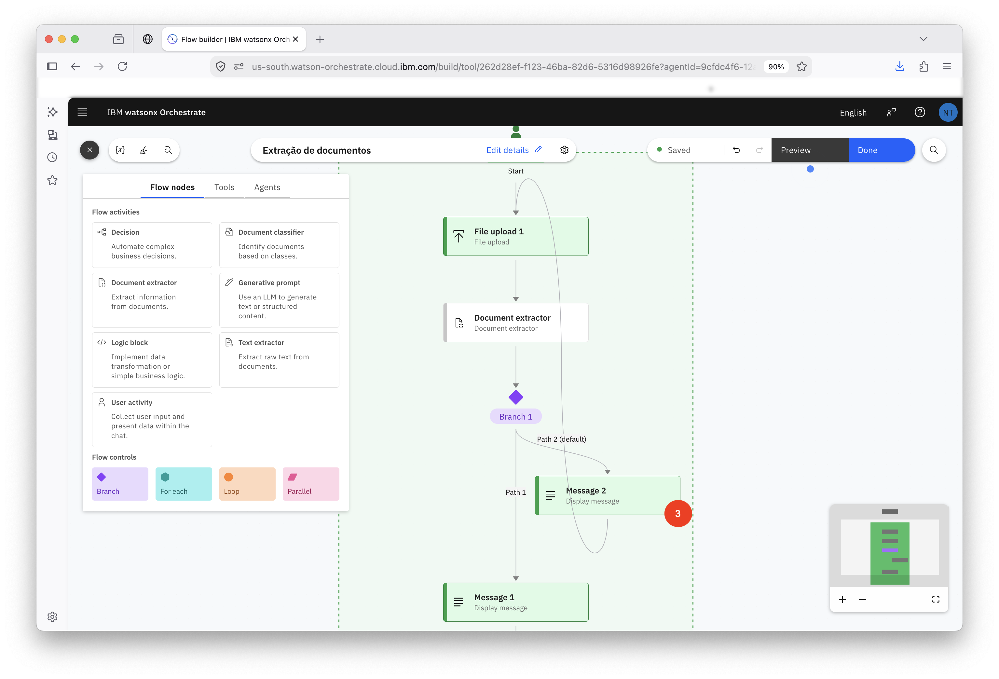

Clique em **Done**.

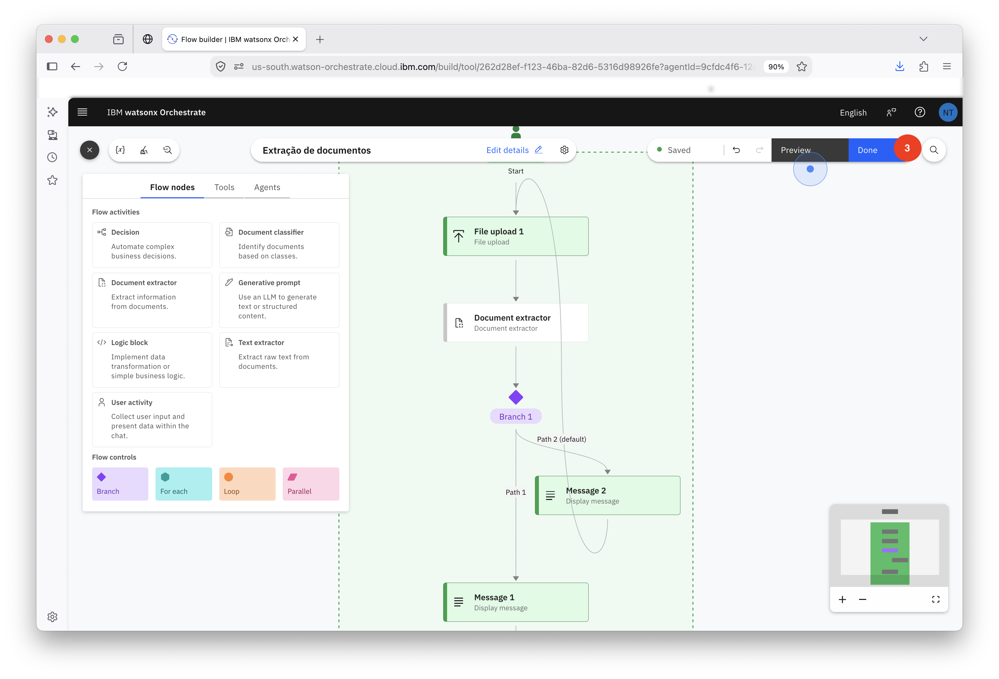

---

# Parte 16 — Teste final

### Enviando o documento problemático

No **Draft Preview**, mande `oi` e clique em **Add files**.


Envie o `11837-41 copy.jpg`.


O agente responde com a mensagem de erro **e, na sequência, reabre o bloco de upload**:

```
Documento com informações inelegíveis, faça o envio novamente.

File upload 1
Upload files
Supported file types are CSV, DOC, DOCX, ... Maximum file size is 30 MB.
[ Add files ]
```

O usuário pode anexar um documento melhor sem sair da conversa. 

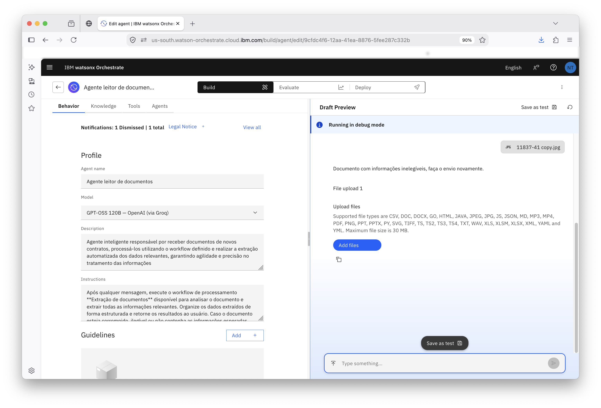

 **Use case concluído.**

---

## O que você construiu

Ao longo das três partes, o mesmo agente passou por quatro estágios:

| Parte | Estado do agente |
|---|---|
| **1** | Lê a CNH e devolve um JSON cru |
| **2** | Devolve os dados formatados e avisa quando a extração falha |
| **3** | Detecta a falha sozinho e conduz o usuário a um novo envio |

## Boas práticas

1. **Decida conscientemente se os caminhos convergem.** 
2. **Todo campo de schema precisa de uma regra para o caso “não encontrei”.** 
3. **Verifique também os casos negativos.** 
4. **Detecção automática e revisão humana não são substitutas uma da outra.** 
5. **Erro sem saída é erro pela metade.** 
6. **Teste sempre com o documento que quebrou.** O `11837-41 copy.jpg` acompanhou as três partes justamente porque era o caso difícil.

---
